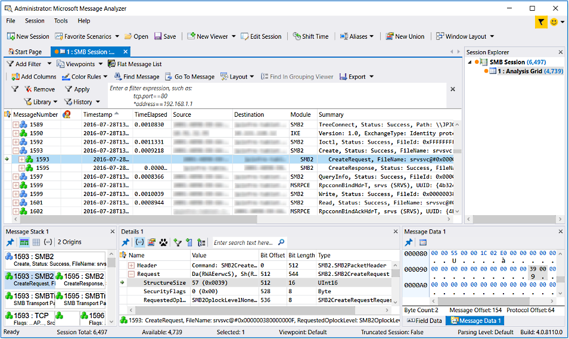

# Analysis Grid Viewer

The details of raw message data are presented in the Message Analyzer **Analysis Grid** viewer. This is the viewer that displays by default for all Data Retrieval Sessions and Live Trace Sessions, unless you either change the default **Default Viewer** on the **Profiles** tab of the global **Options** dialog that is accessible from the global Message Analyzer **Tools** menu, or if you simply select a different viewer from the **Start With** drop-down list in the **New Session** dialog prior to starting a session. The **Analysis Grid** viewer consists of a default tree grid display that groups related messages together in expandable, stacked configurations of parent and child message nodes that show Operations and other top-level messages above the underlying capture modules (message stack, also called the "origins" in this Operating Guide) and message fragments that supported such transactions across the time boundaries of a trace. In addition, the message **Details**, **Message Data**, **Message Stack**, and **Field Data** **Tool Windows** display by default when you specify the **Analysis Grid** as a data viewer. Note that message selection in the **Analysis Grid** drives interaction with these **Tool Windows**. The default configuration of the Analysis Grid  viewer is shown in the figure that follows.

 

 **Figure 41:  Analysis Grid viewer default configuration**

 For any message that displays in an **Analysis Grid** message row, you can obtain a quick summary of significant message values at a glance from the data exposed in the default view layout, as described just ahead. You can also use the **Analysis Grid** viewer or the **Tool Windows** that display with it by default, to analyze the network architecture, details, and hexadecimal data for any captured message, which includes the fields and associated values of any protocol or module for which the PEF Runtime parsed data fields.

 Note that Message Analyzer now performs resolution of IP addresses to host names, in trace files that contain this information. The results will display in either the **Source** or **Destination** columns of the default **Analysis Grid** view **Layout**.

## Default View Layout
 By default, the **Analysis Grid** viewer contains the following **Layout**  of data columns:

-   **MessageNumber** — displays numbers that are assigned to messages that are grouped into top-level messages and operations, which consist of expandable parent message nodes containing child messages that participated in the top-level transaction.

-   **Diagnosis** — contains diagnostic icons that you can click to view error details.

-   **Timestamp** — displays the time that a message was retrieved.

-   **TimeElapsed** — displays a value that is equal to the difference between the **Timestamps** of the last child message and the first child message in the origins tree. This can also represent the amount of time it took for an entire operation to complete.

-   **Source** — displays the source address of the highest level message.

-   **Destination** — displays the destination address of the highest level message in a transaction.

-   **Module** — identifies the protocol or provider message source.

-   **Summary** — contains a summary of prominent message information.

> [!TIP]
>  You can use the Message Analyzer **Field Chooser** **Tool Window** to add a wide array of fields to the default **Analysis Grid** column layout to display additional information about captured or loaded data. If the **Field Chooser** window is not already open, you can display it by right-clicking any column heading in the **Analysis Grid** viewer and then selecting the **Add Columns** command. You can also display it by clicking the **Field Chooser** item in the **Windows** submenu on the Message Analyzer global **Tools** menu.
>
>  If you are a Microsoft Network Monitor user and familiarizing yourself with Microsoft Message Analyzer, you might consider adding the **DeltaFromFirst** field to the **Analysis Grid** viewer as a new column to simulate the **Time Offset** field in Network Monitor. Both of these fields in their respective tools provide the sequential running time of each message in  a set of trace results. To display the **DeltaFromFirst** field as a column, open the **Field Chooser** and expand the **Global Properties** node. Next, right-click the **DeltaFromFirst** property in the list and select the **Add As Column** command to display it as a new column in the **Analysis Grid** viewer. Note that an instance of the **Analysis Grid** viewer must be in focus when you perform this task.

## Tree Grid Features for Data Manipulation

 The **Analysis Grid** viewer also provides numerous functions that you can access from the tree grid so that you can manipulate the data display to streamline data assessment. Moreover, these functions enable you to do the following:

-   Review a message **Summary** that highlights significant fields and values for any selected message.

-   Sort column data to organize and isolate data according to the values of a particular **Analysis Grid** viewer data column.

-   Apply a **Group** command to one or more columns to organize data into one or more groups that can provide a quick overview of individual column values or nested groups of values. For example, you might group the default **Source** and **Destination** columns to create an organized display of the message conversations that occurred in a trace.

-   Apply a **Column Filter** to any data column to perform a quick search that isolates a particular column value.

-   Add other data columns from the **Field Chooser** window to expose the values of specific fields for any module or protocol of interest.

-   Display the message **Stack** and message **Field** data inline, for closer scrutiny of the underlying network layers, fields, and values of selected messages.

-   Review error details by clicking any icon in the **DiagnosisTypes** column for a particular message.

-   Select items from the right-click context menu of the **Analysis Grid** viewer to perform the following operations:

    -   **Show message details** — display message details inline for any selected message by selecting the **Show Details** menu item, to enable detailed analysis of field values.

    -   **Create an alias** — create an **Alias** for a column field value, such as a cryptic IPv6 address, by selecting the **Create ‘columnEntity’ Alias** menu item that displays when you right-click a field value.

    -   **Configure and apply a filter** — apply a view **Filter** by choosing the **Add ‘columnEntity’ to Filter** menu item, to quickly isolate data of interest based on automatically configured filtering criteria associated with the selected column entity.

    -   **Filter data in a separate Analysis Grid viewer tab** — select the **Filter ‘columnEntity’ in New Tab** command to display filtered data in a new instance of the **Analysis Grid** viewer.

    -   **Create a Pattern Expression** — select the **Create Pattern** command to open the **Pattern Editor** dialog, from where you can create a pattern expression by configuring a behavior scenario that detects a specified message pattern, as described in [Understanding Message Pattern Matching](understanding-message-pattern-matching.md). When you open the **Pattern Editor** from the **Analysis Grid** viewer context menu, the **Quick** tab of the editor is prepopulated with initial information based on the message/s you selected in the **Analysis Grid** viewer prior to opening the editor.

    -   **Include hex values** — select the **Include Hex for Numeric Values** command to include a hexadecimal value in parentheses for numeric values that appear in the **Analysis Grid** viewer.

    -   **Specify binary value formats** — select the **Display Binary Values As** command to override the corresponding default setting in the **Options** dialog. Selectable values consist of the following, as described in [Setting Message Analyzer Global Options](setting-message-analyzer-global-options.md):

        -   **ASCII**

        -   **Hex**

        -   **Decimal**

    -   **Locate messages in the Grouping viewer** — select the **Find in Grouping Viewer** command to locate a corresponding message that appears in the [Grouping Viewer](grouping-viewer.md), provided that it is open. This enables you to quickly assess such a message in the context of the Group hierarchy that is created by the currently applied **Grouping** viewer **Layout**. For example, the message you select might appear in a **Network** or **Transport** group in the **Grouping** viewer, enabling you to obtain a deep analysis perspective of the IP conversation or ports that carried the conversation in which the selected message appears.

    -   **Display OPN definitions** — select the **Go To ‘entityName’ Definition** command to display the OPN definition for a module or field that is associated with a selected message.

    -   **Add or search for comments** — select the **Add** item in the **Comment** context menu to specify a comment for one or more selected messages, or search for existing comments by selecting the **Find Next** or **Find Previous** items from the **Comment** context menu.

    -   **Parse messages on an alternate port** — select the **Parse As** command to open the global **Options** dialog to the **Parsing** tab, from where you can specify a different port for a specified protocol and initiate a reparse of the current set of trace results.

    -   **Shift Timestamp values** — select the **Shift Time** command to display the **Shift Time** dialog, from where you can specify a shift for the **Timestamp** values of the messages in the current set of trace results.

    -   **Save specific messages** — select the **Save Selected Messages…** command to save a set of messages that are selected in the **Analysis Grid**. When you select this command, the **Save As** dialog displays to enable you to save the selected messages in a native .matp file in a directory of your choice.

    -   **Copy data to the clipboard** — select the **Copy Selected Rows** or **Copy ‘columnEntity’** command to collect textual message data for record keeping or other purposes.

## Analysis Grid Toolbar Features for Data Manipulation
 The **Analysis Grid** also has a toolbar that provides several features that you can use to manipulate the data you are displaying, as follows:

-   **Add Columns** — add more columns of data from **Field Chooser** that are associated with message types of interest, to expose other field data that does not appear in the **Analysis Grid** viewer default column layout.

-   **Color Rules** — specify built-in or user-configurable **Color Rules**, which provide at-a-glance visual message decorations that serve as alerts to invite closer scrutiny of target messages, while minimizing additional diagnostic efforts.

-   **Find Messages** — use preset or user-configurable **Find Messages** filtering that enables you to search for specific messages based on filtering criteria.

-   **Go To Message** — locate a message based on its message number in one or more data sources.

-   **Layout** — specify and manage preset or user-created view **Layouts** that provide data column configurations that are useful for solving common problems or performing repetitive tasks.

-   **Find in Grouping Viewer** — locate the Group node within the **Grouping** viewer where a particular message exists that is currently selected in the **Analysis Grid** viewer.

-   **Export** — enables you to export either **All** or **Selected** messages in comma separated value (CSV) format. The **Export** command is located on the **Analysis Grid** viewer toolbar.

## Analysis Grid Viewer Column Commands
 Several commands appear in a context menu that displays when you click any column header in the **Analysis Grid** viewer. These commands enable you to do the following:

-   **Group** — enables you to transform the messages displayed in the **Analysis Grid** viewer into a group configuration that filters the data according to criteria that is set by the particular column you right-clicked. For example, if you right-click the **Destination** column and select the **Group** command, the data will be organized into top-level group nodes that are defined by a unique destination IP address where each group contains only those messages that have such a unique address. You might also do the same for the **Source** column to create Source groups nested under the **Destination** groups, in which case you can create a concise organization of the data that shows you the messages related to the IP conversations that took place between specific destination and source computers.

     Note that the **Group** context menu command is not available for the **Summary** column header in the **Analysis Grid** viewer.

---

 **More Information**  
 **To learn more** about the **Analysis Grid** viewer **Group** column command, see [Using the Analysis Grid Group Feature](using-the-analysis-grid-group-feature.md).

---

-   **Group by Multiple Values** — creates groups based on varying values in a particular field that might be different at various stack levels, for example, IP addresses and Ethernet addresses hidden in the stack. Note that the **Group by Multiple Values** context menu command is not available for the **Summary** column header in the **Analysis Grid** viewer.

---

 **More Information**  
 **To learn more** about the **Analysis Grid** viewer **Group by Multiple Values** column command, see [Using the Analysis Grid Group Feature](using-the-analysis-grid-group-feature.md).

---

-   **Remove** — enables you to remove any column from the current column **Layout** that is displayed in the **Analysis Grid** viewer. Note that you can restore the default **Layout** for the **Analysis Grid** viewer at any time by selecting the **Restore Application Default Layout** command that displays when you click the **Manage Layouts** menu in the **Layouts** drop-down list on the **Analysis Grid** viewer toolbar.

-   **Save as Default User View Layout** — enables you to save any column **Layout** configuration as the user default **Layout**.

-   **Load Default User View Layout** — enables you to load the column **Layout** configuration that you saved as the user default **Layout**.

-   **Freeze Columns to Left** — enables you to freeze columns to the left of a particular column that you select, such that the horizontal scroll bar starts at the selected column. This feature is particularly useful when you have a column **Layout** that contains many fields, to make it easier to scroll to data. To undo the column freeze, simply apply the **Freeze Columns to Left** command to the **MessageNumber** column.

-   **Save Current View Layout As…** — enables you to save the current column **Layout** configuration with a unique **Name**, **Description**, and **Category** specification from the **Edit Item** dialog.

-   **Add Columns** — enables you to display the **Field Chooser** window, or to set the focus on it if already displayed.

## Other Data Manipulation Feature Locations

 Message Analyzer also provides several other locations that contain data manipulation features that can impact the display of data in the **Analysis Grid** viewer, although some of these are also duplicated elsewhere. The other locations for data manipulation features include the Message Analyzer global menus and the global toolbar, which are both located at the top of the Message Analyzer main working interface. Data manipulation commands that are included under global menus consist of the following:

-   **Session** global menu — note that several of these commands are duplicated on the global Message Analyzer toolbar:

    -   **New Viewer** — enables you to successively select one or more data viewers from this drop-down list to display message data in different presentation formats, for example, the **Grouping**, **Gantt**, **Pattern Match**, and **Chart** viewers.

    -   **Edit Session** — enables you to display the **Edit Session** dialog, from where you can modify your Live Trace Session or Data Retrieval Session configuration, which includes different providers, data sources, filters, and so on.

         This command is also duplicated on the Message Analyzer global toolbar.

    -   **Reparse** — enables you to reparse the current set of trace results displaying in the **Analysis Grid** viewer.

    -   **Shift Time** — displays the **Shift Time** dialog or removes all time shifts that you previously applied.

         This command is also duplicated on the Message Analyzer global toolbar.

    -   **Data Source Filter** — enables you to apply a filter to the current set of trace results, based on selection of one or more data sources.

    -   **Active viewer** — displays the items for data manipulation or other functions that are associated with the currently active data viewer. The name of the command that appears in this menu item location changes in response to viewer selection. For example, if the in-focus data viewer is the **Analysis Grid**, the commands on the **Analysis Grid** toolbar  appear in a drop-down list in this location. Note that commands from the global Filtering toolbar also appear in this drop-down list no matter which viewer is in focus.

-   **Tools** global menu — note that the **Aliases** and **Unions** commands are duplicated on the global Message Analyzer toolbar as drop-down lists.

    -   **Windows** — contains all of the selectable **Tool Windows** that Message Analyzer provides for the display of additional data and details that are associated with a set of trace results. These  include  the **Session Explorer**, **Details**, **Message Data**, **Message Stack**, **Diagnostic**, and **Decryption** windows.

    -   **Add-Ins** — contains add-in items such as the **Session Compare Utility**, which performs type checks and field comparisons. Note that the **Compare** utility is currently a preview feature.

    -   **Aliases** — enables you to select or unselect a predefined **Alias**, or to manage existing **Aliases** from the **Manage Alias** dialog.

    -   **Unions** — enables you to review a list of built-in **Unions** that are included with Message Analyzer. Also enables you to create a new **Union** of your own design by selecting the **New Union** item in the **Unions** submenu to display the **Edit Unions** dialog, from where you can create one. You also have access to the **Manage Union** dialog from this same location.

    -   **Asset Manager** — provides management features for common assets that Message Analyzer uses, for example, **Layouts** for the **Chart**, **Grouping**, and **Analysis Grid** viewers. As part of the Message Analyzer sharing infrastructure, **Asset Manager** enables you to download, automatically update, and manage various types of assets, which includes sharing them with others.

    -   **Options** — enables you to specify several global options that include default values and selections that can affect Message Analyzer performance, display configurations, and feature activation, as well as the application of **Profiles**, WPP settings, and parsing functionality.

---

**More Information**  
**To learn more** about the data manipulation features that you can use when working with the **Analysis Grid** viewer, see the following topics:  
[Using the Analysis Grid Group Feature](using-the-analysis-grid-group-feature.md)  
[Applying and Managing Analysis Grid Viewer Layouts](applying-and-managing-analysis-grid-viewer-layouts.md)  
[Using the Find Message Feature](using-the-find-message-feature.md)  
[Using the Go To Message Feature](using-the-go-to-message-feature.md)  
[Filtering Column Data](filtering-column-data.md)  
[Using and Managing Color Rules](using-and-managing-color-rules.md)  
[Applying and Managing Filters](applying-and-managing-filters.md)  
[Applying a Time Filter to Session Results](applying-a-time-filter-to-session-results.md)  
[Using the Field Chooser](using-the-field-chooser.md)  
[Setting Time Shifts](setting-time-shifts.md)  
[Annotation Windows](annotation-windows.md)

---

## See Also
[Pattern Match Viewer](pattern-match-viewer.md)
Viewing OPN Source Code](viewing-opn-source-code.md)