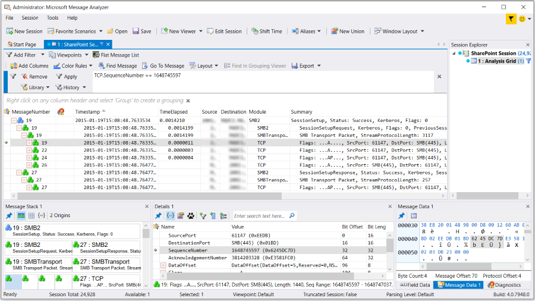
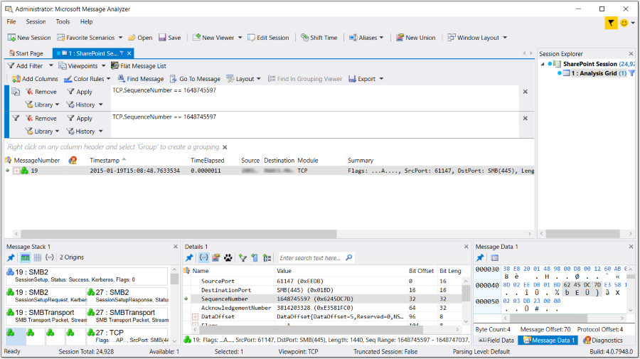

# Applying and Managing Viewpoints
In Message Analyzer, the default **Analysis Grid** viewer focuses on top-level messages to provide a compact display of data summaries, so that you can very quickly understand issues at a high level. As a result, other important details can be hidden in this view, such as the underlying origins messages that support Operations or other top-level messages. However, because awareness of the activities of specific protocols at the lower layers can be crucial to data analysis, it is often necessary to achieve a focused analytical perspective at these levels. Moreover, it can also be advantageous to be able to view only the traffic of a particular higher-layer protocol, for example, HTTP. In Message Analyzer, this is made possible through the application of **Viewpoints**.  
  
## Understanding Viewpoints  
 To make your troubleshooting efforts easier, Message Analyzer enables you to examine network traffic from the perspective of a protocol, where you can display the specific protocol messages at top-level in the **Analysis Grid** viewer with no layers above them. For this reason, **Viewpoints** could be considered *layer filters* because they temporarily remove the display of all messages above the applied protocol **Viewpoint**, such that only those protocol messages appear at top-level in the **Analysis Grid** viewer.  
  
 For example, when viewing trace results in the **Analysis Grid** viewer, you may have higher-layer traffic that obscures the underlying messages that you want to troubleshoot. By default, the **Analysis Grid** viewer displays top-level messages and Operations in single rows with expandable nodes, where the message origins or underlying message stack is concealed under multiple lower-level expansion nodes. As a result, you can only examine the details of messages in the underlying layers by expanding the message nodes one by one to expose the protocol or module layer that you want to troubleshoot. Repeating this process across an entire trace when searching for specific data can become extremely labor intensive, particularly in a large trace with many messages.  
  
 To alleviate this difficulty, Message Analyzer provides a set of pre-configured **Viewpoints** that enable you to expose the data for specific message types in top-level rows of the **Analysis Grid** viewer, with all the upper-layer messages above the **Viewpoint** level removed. However, even though the upper-layer messages are removed by a **Viewpoint**, you still have the option to view the message stack in its entirety for any viewpoint message — while the **Viewpoint** is applied — by opening the **Message Stack** **Tool Window**. Thereafter, when you select any viewpoint message in the **Analysis Grid** viewer, the selected viewpoint message and the layers above and below it display in the **Message Stack** window to give you some layering context, along with a quick view of **Summary** statistics for messages at each layer.  
  
 **Application and Removal of Viewpoints**   
When messages are parsed by Message Analyzer, they are indexed. When you apply a **Viewpoint** to a set of parsed messages, Message Analyzer simply reorganizes the data display by retrieving messages whose indexes correlate with the applied **Viewpoint** filtering criteria. The result is that you can display the viewpoint messages at the top-most level in the **Analysis Grid** viewer, which can include all operations that exist at the current **Viewpoint**, if they exist at that level. For example, if you apply the **SMB/SMB2 Viewpoint**, then operations for the SMB and SMB2 protocol will display. The current exception to this is if an upper-layer protocol that is above a set **Viewpoint** also defines operations. In this case, operations for the latter protocol will display at top-level.  
  
 The **Viewpoint** that displays by default in the **Analysis Grid** viewer is a summary view of top-level messages that have no other message layers above them. After applying a **Viewpoint** to a set of messages and changing the data to the perspective of a particular protocol, you can return to the default **Viewpoint** by clicking the **No Viewpoint** item in the **Viewpoint** drop-down list on the Filtering Toolbar. You can also remove the current **Viewpoint** by selecting another one from the **Viewpoint** drop-down list.  
  
## Accessing the Built-In Viewpoints  
 To assist your troubleshooting efforts, Message Analyzer provides a robust set of built-in **Viewpoints** that you can access and apply from the Filtering Toolbar that appears whenever Message Analyzer displays a set of trace results, as described in [Using the Filtering Toolbar](using-the-filtering-toolbar.md). These **Viewpoints** are contained in the **Message Analyzer Viewpoints** asset collection Library that is accessible from the **Viewpoints** drop-down list on the Filtering Toolbar. They enable you to filter and reorganize your data view to display messages from the perspective of different protocols, modules, or message layers, in accordance with the functionality of the applied **Viewpoint** . The application of a **Viewpoint** enables you to achieve a unique analytical perspective on data that might normally be hidden from view or difficult to expose.  
  
## Using the Viewpoint Features  
 The remaining topics in this section describe the built-in **Viewpoints** that ship with Message Analyzer, applying a **Viewpoint**, how to work with **Viewpoint Filters**, and using the features for managing **Viewpoints**:  
  
---  
  
 [Applying a Built-In Viewpoint](applying-and-managing-viewpoints.md#BKMK_ApplyingPredefinedViewpoints) — as applied to messages displaying in a data viewer.  
[Applying Viewpoint Filters](applying-and-managing-viewpoints.md#BKMK_ApplyingViewpointFilter) — to enhance the analysis context.  
[Managing Viewpoints as Shared Items](applying-and-managing-viewpoints.md#BKMK_ManageViewpoints) —  to enable the mutual sharing of **Viewpoints** with others.  
[Receiving Viewpoint Asset Collection Updates from Microsoft](applying-and-managing-viewpoints.md#BKMK_ReceivingViewpointCollectionUpdates) — to synchronize your **Viewpoints** asset collection for automatic updates from Microsoft.  
---  
  
   
### Applying a Built-In Viewpoint  
 By default, Message Analyzer provides numerous built-in **Viewpoints** that are described below. You can apply these to any set of messages that are displayed in any data viewer by selecting a chosen **Viewpoint** from the **Viewpoints** drop-down list on the Filtering Toolbar while a particular data viewer has focus.  
  
> [!TIP]
>  After you apply a **Viewpoint** to such a data viewer, you can hover over the data viewer session tab or the viewer node in **Session Explorer** at any time thereafter to view a popup that indicates which **Viewpoint** is currently applied to the data set, along with any **Viewpoint Filter**, **Filter**, or **Message Range** filter (a **Bookmarks** or **Gantt** viewer context menu item) that is currently applied to the viewer.  
  
 The built-in **Viewpoints** that are contained in the **Message Analyzer Viewpoints** asset collection consist of the following:  
  
-   **No Viewpoint** — enables you to return to the original set of trace results where no **Viewpoint** is applied.  
  
-   **Data Link** layer — enables you to display messages at top-level from protocols related to the Data Link layer, such as the Ethernet, PPP, ARP, and WiFi protocols, and their origins.  
  
-   **Disable Operations** — enables you to disable Operations by initiating a reparse of your trace results that disables the Message Analyzer Runtime's default encapsulation of request and response message pairs in Operation nodes. This feature currently supports de-encapsulation of Operations for the HTTP protocol only.  
  
     This command  can be useful for filtering under an applied **Viewpoint**, when you can only use a **Viewpoint Filter** to isolate particular types of messages, for example,  an HTTP Request or Response message. Otherwise, without Operations disabled, you would be unable to isolate such messages from the default Operation node encapsulation.  
  
   ---  
  
     **More Information**   
     **To learn more** about Operations, see [Working With Operations](working-with-operations.md).  
    ____________________  
  
-   **Transport Layers UDP/TCP** — enables you to display messages at top-level from the TCP and UDP protocols only, including their origin stacks.  
  
-   **TCP** — this **Viewpoint** reorganizes your data to enable easier diagnosis of the TCP layer. It places TCP messages on top, which can facilitate diagnosis of TCP performance issues that include the analysis of TCP SequenceNumber and AcknowledgementNumber values, TCP flags such as SYNs, SACKS, and ACKs, retransmits, broken three-way handshakes, window size, TCP options, and so on. Note that if you apply this **Viewpoint**, Operations will no longer be visible, as they typically exist at a layer above this **Viewpoint**.  
  
    > [!TIP]
    >  To enhance your analytical perspective with the **TCP** **Viewpoint**, you can use the **TCP Deep Packet Analysis with Relative Sequence Number with Grouping** view **Layout** for the **Analysis Grid** viewer to display the relevant field data in a predefined Grouped configuration with **Network**, **Transport**, and **SourcePort** groups.  
  
-   **UDP** — provides perspective from the **Viewpoint** of the UDP transport protocol.  
  
-   **Network** layer — enables you to display messages at top-level from the IPv4, IPv6, DHCPv4, DHCPv6, and DNS protocols only, including their origins messages.  
  
-   **Ethernet** layer — enables you to display Ethernet messages at top-level with no further parsing.  
  
-   **ETW** — enables you to remove all messages above the ETW layer to expose and simplify event diagnostics. This **Viewpoint** can also make event analysis easier when you are developing message providers or other components that write ETW events.  
  
-   **HTTP** — an application-layer **Viewpoint** that places HTTP messages at top-level in the **Analysis Grid** viewer. Provides a convenient way to analyze the request/response pairs of HTTP Operations without having to search for the response messages. Also facilitates improved filtering for request and response messages, as described in [Disabling Operations](working-with-operations.md#BKMK_TogglingOperations).  
  
    > [!NOTE]
    >  It is possible that HTTP messages can be hidden within SOAP message stacks. If you apply the **HTTP** **Viewpoint** when this is the case, SOAP messages should disappear and HTTP messages will display at top-level. However, the HTTP messages may not display as Operations in this case.  
  
-   **SMB/SMB2** — an application-layer **Viewpoint** that places SMB and SMB2 messages at top-level in the **Analysis Grid** viewer by removing RPC and any other message layers on top, for example, GSSAPI and Kerberos messages.  
  
-   **SMB/SMB2 No Operations** — an application-layer **Viewpoint** that is identical to the **SMB/SMB2** **Viewpoint**,  except that Message Analyzer does not  display any SMB/SMB2 Operation nodes in this context. Enables you to view SMB/SMB2 request and response messages in their original chronological order. Also facilitates improved filtering for request and response messages, as described in [Disabling Operations](working-with-operations.md#BKMK_TogglingOperations).  
  
-   **WinInet (HTTP/s)** event layer — enables you to display and diagnose HTTP and unencrypted HTTPS events.  
  
-   **SOAP** — enables you to display messages at top-level from the SOAP protocol only, plus the origins messages.  
  
   
### Applying Viewpoint Filters  
 Message Analyzer provides a Filter Expression **Library** on the **Viewpoint Filter** panel that appears when you click the **Add Viewpoint Filter** item in the **Add Filter** drop-down list on the Filtering Toolbar. This **Library** is the same centralized **Library** that is located on the Filter panel that appears when you click the **Add Filter** drop-down on the Filtering Toolbar. Because it is the same **Library**,  the same Filter Expressions from the **Message Analyzer Filters** asset collection are available for selection as **Viewpoint Filters**. You also have the option to create and apply custom Filter Expressions of your own design, as described in [Applying and Managing Filters](applying-and-managing-filters.md).  
  
> [!NOTE]
>  The  controls on the **Viewpoint Filter** panel are described in [Using the Filtering Toolbar](using-the-filtering-toolbar.md).  
  
 **Drilling Down to Expose Target Messages**   
From the **Viewpoint Filter** panel, you can **Apply** such filters to a set of messages that is already filtered by the criteria of an applied **Viewpoint**. The advantage of using a **Viewpoint Filter** is that it enables you to drill down further to expose messages of interest based on the additionally applied filtering. Obviously, the filtering you apply should be relevant to the **Viewpoint** context in which you are working. In a typical usage scenario, you might have already applied a view **Filter** to a set of trace results when you realize that you should set the **Viewpoint** to a particular layer so you can focus on a condensed and more relevant message set for your current analysis.  After you select a chosen  **Viewpoint**, all messages above the **Viewpoint** level disappear. Once the **Viewpoint** is set, you can drill down even further to isolate a message or messages that meet the criteria of a **Viewpoint Filter** that you specify. Whether you select a built-in or custom-designed **Viewpoint Filter**, you must click the **Apply** button on the **Viewpoint Filter** panel to initiate the filtering action. To undo such filtering action, click the **Remove** button on the same panel.  
  
 **Filtering Behaviors**   
The behavior of view **Filters** and **Viewpoint Filters** is similar within the different contexts in which they are applied. More specifically, view **Filter** behavior with respect to an entire set of trace results is similar to the way a **Viewpoint Filter** behaves when applied to a **Viewpoint** results set. The difference in the **Viewpoint** filtering scenario is that you are able to generate a more precise focus on specific messages of interest *within the context of the applied **Viewpoint***. In general, **Viewpoints** enable you to create focus by removing all messages above the **Viewpoint** protocol/s. However, by also applying a **Viewpoint Filter**, you can be even more selective of the messages you are exposing in the **Analysis Grid** or other viewer for analytical purposes. The scenario described below may help explain the difference between using view **Filters** and **Viewpoint Filters**.  
  
 **Viewpoint Filtering Example**   
If any top-level message or one of its origins messages in a set of trace results matches the criteria of a view  **Filter**, Message Analyzer returns that top-level message and its origins (stack) when the **Filter** is applied. If you then apply a **Viewpoint** while the same view **Filter** is applied, the **Viewpoint** will cause any of the filtered messages that match the **Viewpoint** criteria to appear at top-level in accordance with the applied **Viewpoint's** functionality. The following example illustrates the results that occur when you apply a view **Filter**, a **Viewpoint**, and a **Viewpoint Filter** to a set of trace results.  
  
 **Example**:            If you apply the view **Filter**`TCP.SequenceNumber == 1648745597` to an original set of trace results, and a top-level message or one of its origin messages has a field value that matches that TCP sequence number, then that top-level operation (SMB2 message #19 and its origins in the figure immediately below) is isolated in the **Analysis Grid** viewer with all other messages removed from display. Note that the message stack has been expanded in this figure to show  SMB2 request and response messages #19 and #27 that comprise the Operation.  
  
   
  
 **Figure 52:  Message Analyzer TCP Filter Applied Only**  
  
 The above result is expected behavior, as all view **Filters** work in this manner. If you now apply a **TCP** **Viewpoint** to this display configuration, all TCP fragments that are contained in the stack of the former top-level SMB2 message #19 are now pushed to top-level,  so that only TCP messages display with nothing above that layer, which also includes the TCP fragment (#19) that met the filtering criteria of the applied view **Filter**, as shown in the figure below.  
  
   
  
 **Figure 53:  Message Analyzer TCP Filter and TCP Viewpoint Applied**  
  
 The following figure shows the results after applying a **Viewpoint Filter** that is the same as the originally applied view **Filter**`TCP.SequenceNumber == 1648745597`. When you apply this same filter as a **Viewpoint Filter**, it results in displaying only the TCP fragment (#19) that meets that filtering criteria along with its underlying stack messages, as shown in the figure below. Optionally, you can remove the original view **Filter** before applying the indicated **Viewpoint Filter** to achieve the same result.  
  
   
  
 **Figure 54:  Message Analyzer TCP Filter, TCP Viewpoint, and Viewpoint Filter  Applied**  
  
 This behavior is similar to the way a view **Filter** works against an original set of trace results with no **Viewpoint** applied. In summary, the working differences between a view **Filter** and a **Viewpoint Filter** is the context in which the filtering is applied.  
  
   
## Managing Viewpoints as Shared Items  
 The **Viewpoint** items in the **Viewpoint** drop-down list on the Filtering Toolbar are shareable assets. Message Analyzer provides a simple way to expose these **Viewpoint** items to others for sharing purposes, or to retrieve **Viewpoint** items that others have shared.  
  
> [!NOTE]
>  The ability to create new **Viewpoints** or edit existing ones may be available in a future Message Analyzer release.  
  
 **Exporting a Viewpoint Asset Collection for Sharing**   
You can create and share a **Viewpoint** asset collection with others that consists of a full replica of the **Message Analyzer Viewpoints** asset collection or you can create and share a subset of the overall collection. To specify the items you want to include in the collection that you will post to a designated file share or other location, simply click the **Manage Viewpoints** item in the **Viewpoints** drop-down list on the Filtering Toolbar to open the **Manage Viewpoint** dialog. After the dialog opens, you can select items you want to include in the shareable collection by placing a check mark in the check box of each item you want to include in the collection. When complete, click the **Export** button on the toolbar of the **Manage Viewpoint** dialog  to display the **Save Library** dialog, from where you can specify **Title**, **Description**, **Author**, and **Organization** information. When you click **OK** to exit this dialog, the **Select Library Location** dialog displays to enable you to navigate to a save location for the asset collection.  
  
 **Importing a Shared Viewpoint Asset Collection**   
If you want to retrieve items from a collection that someone else has shared in the previously specified manner, click the **Import** button on the toolbar of the **Manage Viewpoints** dialog to open the **Select Library to Open** dialog. After you navigate to the location where the asset collection has been shared, click the **Open** button in the dialog. At this point, the **Select Items to Import** dialog displays, from where you can select the items in the collection that you want to import. You can also specify a category in which the collection items will appear. When complete, click the **OK** button, at which time the selected items are imported into your **Viewpoints** asset collection.  
  
 **Sharing a Viewpoint Collection on a User Feed**   
In addition, you can share a **Viewpoints** asset collection through a user feed that you configure in the Message Analyzer Sharing Infrastructure, which you can accomplish from the **Settings** tab of the **Asset Manager** dialog. This dialog is accessible from the global Message Analyzer **Tools** menu. Thereafter, you can use the **Export** feature of the **Manage Viewpoint** dialog to post your **Viewpoints** asset collection to the feed so that others can access them. Whenever you update the contents of this **Viewpoints** asset collection, you can make the changes available to team members or other users through the configured feed, where they can view, synchronize with, and download your asset collection items. However, to enable users to download asset collection updates, there is some manual configuration required at this time, as described in [Manual Item Update Synchronization](manual-item-update-synchronization.md).  
  
   
## Receiving Viewpoint Asset Collection Updates from Microsoft  
 Microsoft provides a default **Message Analyzer** feed on the **Downloads** tab of the **Asset Manager** dialog that enables you to download the **Message Analyzer Viewpoints** asset collection from a Microsoft web service and to synchronize with asset collection updates that are periodically pushed out by the service.  
  
 The **Message Analyzer Viewpoints** asset collection is installed by default with Message Analyzer, so it is unnecessary to download the collection whenever you start Message Analyzer. But if it is the first time you have started Message Analyzer, you are presented with a **Welcome** dialog that provides you with the choice to opt in or out of automatic updates. If you choose to opt in to auto-syncing updates, then all Message Analyzer asset collections are automatically set to the auto-sync state, including the Message Analyzer **Viewpoints** asset collection, and no further action is required.  
  
 However, if you opted out, you still have the option to automatically receive periodic collection updates later by setting the **Offline** mode to **Online** on the **Downloads** tab of the **Asset Manager** dialog and then clicking the **Sync All Displayed Items** button to auto-sync all asset collections; or you can set individual collections to the auto-sync state on the **Downloads** tab as you require them. To do this, click the download icon to the right of the collection on the **Downloads** tab and select the **Automatically sync item collection updates when available** option in the **Item Download Options** dialog.  
  
---  
  
 **More Information**   
 **To learn more** about the functions of the Filter Expressions in the **Message Analyzer Filters** asset collection, see [Filtering Live Trace Session Results](filtering-live-trace-session-results.md).   
**To learn more** about the Sharing Infrastructure and managing user Library items, downloading asset collections, and auto-syncing asset collection updates, see the [Sharing Infrastructure](sharing-infrastructure.md) and [Managing Asset Collection Downloads and Updates](managing-asset-collection-downloads-and-updates.md) topics.   
---  
  
## See Also  
 [Using the Filtering Toolbar](using-the-filtering-toolbar.md)