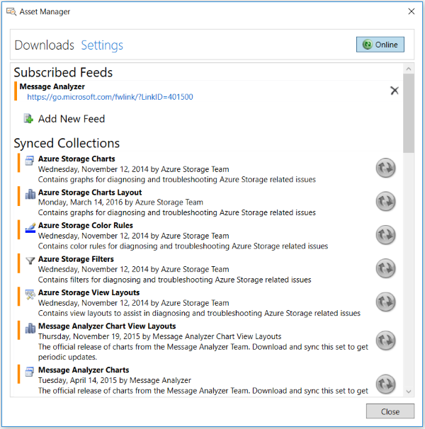

# Asset Manager

Message Analyzer provides an **Asset Manager** dialog that enables you to manage your asset collections, which includes the following tasks:  
  
-   Downloading asset collections to your user Libraries.  
  
-   Auto-syncing asset collections so that you receive updates to specific Libraries automatically and silently in the background.  
  
-   Configuring feed locations to which you can post assets that you created for sharing with others, or retrieve assets from feeds that others have created.  
  
 The **Asset Manager** is accessible from the global Message Analyzer **Tools** menu. This dialog contains two tabs that enable you to perform the asset management tasks that are described below.  
  
 **Downloads** tab — displays a page that enables you to view, auto-sync updates, and download **OPN Parser Packages** or user **Library** asset collections, such as **Message Analyzer Chart View Layouts**, **Message Analyzer Charts**, **Message Analyzer Color Rules**, **Message Analyzer Correlations**, **Message Analyzer Grouping Viewer Layouts**, and so on, from the default **Message Analyzer** subscriber feed. The **Downloads** tab of the **Asset Manager** dialog is shown in the figure that follows.  
  
   
  
 **Figure 69: Asset Manager dialog Downloads tab**  
  
 The features on this tab that enable you to exercise the above functions consist of the following:  
  
-   **Search box** — enables you to locate feed list items by entering search text that filters the list items.  
  
-   **All Asset Types** drop-down — enables you to select the types of assets to display in your **Message Analyzer** feed list.  
  
-   **Sync All Displayed Items** button — causes automatic update synchronization of all the default **Message Analyzer** feed list items. Thereafter, your Message Analyzer installation is synchronized with item collection and **OPN Parser** package updates from a Microsoft web service, so that you always have the latest versions. However, for this synchronization to take place, your Message Analyzer installation must be set to **Online** status, as described in the next bullet item.  
  
> [!NOTE]
>  You have the option to synchronize **Message Analyzer** feed list items individually or you can elect to download the current configuration of a particular item and stop receiving updates. You can access these features by clicking the status icons to the right of the feed list items that are displayed on the **Downloads** page.  
  
-   **Online/Offline** button — when this button is set to **Online**, you automatically receive updates to **Message Analyzer** subscriber feed **Synced Collections** that are set to auto-sync status. When this button is set to **Offline**, you do not receive updates.  
  
 **Settings** tab — enables you to view a list of feeds to which you are subscribed, create new feeds for sharing item collections directly with other users, and view which asset collections and **OPN Parser** packages are set to the auto-sync state. You can also manage downloads and auto-syncing from this location. The **Settings** tab of the **Asset Manager** dialog is shown in the figure that follows.  
  
   
  
 **Figure 70: Asset Manager dialog Settings tab**  
  
 The features on this tab consist of the following:  
  
-   **Add New Feed** — enables you to create a new feed that points to a chosen location such as a file share or web site. You would typically create a new feed for storing custom asset collections that you created so that other users may access and share them.  
  
-   **Remove Feed** — enables you  to remove any feed by clicking the **X** to the right of the feed name.  
  
> [!NOTE]
>  You are advised to *not* remove the default **Message Analyzer** subscriber feed.  
  
-   **Online/Offline** button — when this button is set to **Online**, you automatically receive updates to **Message Analyzer** subscriber feed **Synced Collections** that are set to auto-sync status. When this button is set to **Offline**, you do not receive updates.  
  
## See Also  

[Managing Asset Collection Downloads and Updates](managing-asset-collection-downloads-and-updates.md)