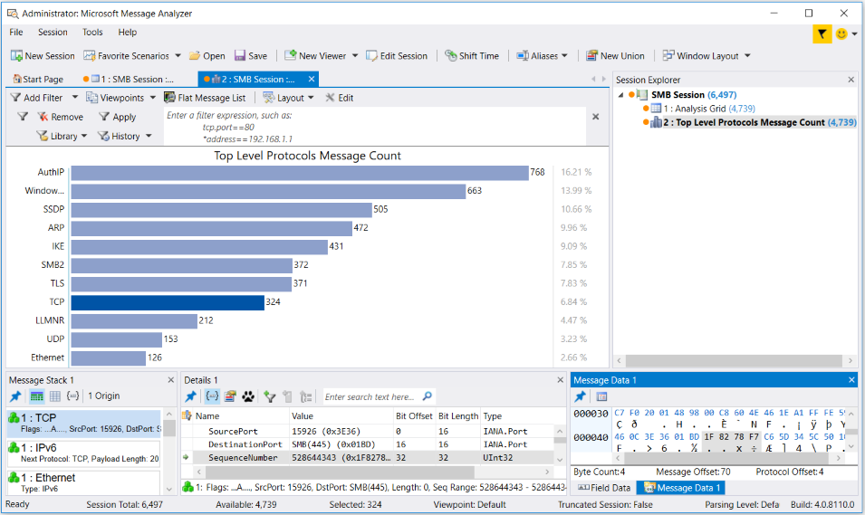

# Chart Viewer Layouts

By default, Message Analyzer provides several built-in data viewers such as the **Analysis Grid**, **Grouping**,  **Pattern Match**, and **Gantt** viewers, as described in earlier sections. However, Microsoft also provides numerous view **Layouts** for the **Chart** viewer  that each have a predefined configuration designed to display specific types of data in various presentation formats for the enhancement of data analysis perspectives. The built-in **Layouts** for the **Chart** viewer consist of various graphic visualizer components that provide top-level data summaries and statistics based on message types, fields, properties, and preconfigured formulas. The visualizer component types include **Table** grid, **Bar** element, **Pie** chart, **Timeline** graph, and other graphs that plot message data in the x-y coordinate domain; the **Timeline** graphs also include time window slider controls for zooming on data. A **Chart** viewer **Layout** called the **Top Level Protocols Message Count** contains a **Bar** element visualizer component, as shown in the figure that follows. The data exposed in this **Layout** shows the relative distribution of message volume for all protocols or modules for which messages were captured in a set of trace results.  
  
   
  
 **Figure 46: Top Level Protocols Message Count Chart Layout**  
  
 The **Layouts** feature for **Charts** enables you to select from a wide assortment of built-in view **Layouts** that are custom designed by Microsoft to provide focused analysis environments for quick exposure of  information that is critical to troubleshooting. Many of the **Layouts** provide high-level overviews of data in unique formats that can immediately point to specific issues and potentially indicate the direction in which further analysis  might proceed. The categories in which built-in **Chart** viewer **Layouts** exist are described in the [Chart Layout Categories](chart-viewer-layouts.md#BKMK_ChartCategories) section ahead, where you can link to topics that describe the **Chart** viewer **Layouts** in each category.  
  
 A single type of graphic visualizer  now exists in each built-in **Layout**, such as  a grid, bar element, pie-chart, or timeline component. The data points that you will find in many of these components are dynamically integrated with other viewers such as the **Analysis Grid**, so that you can interactively drive the display of messages in the latter by double-clicking data points in the former. You can  also click a group node in the **Grouping** viewer to simultaneously drive the display of messages in the **Analysis Grid** viewer, a **Chart**, and in a **Tool Window** such as the **Message Stack**. In any individual view of data, you  can achieve a unique analysis context; however, you will find that a combination of **Chart Layouts**, viewers, and **Tool Windows** that expose the same session data or details in different ways will contribute significantly to problem identification and resolution.  
  
 **Chart Viewer Layouts in Message Analyzer Profiles**   
In the case of **Profiles**, the **Chart** viewer **Layouts** are preselected to coordinate with the **Layouts** of other viewers, such as the **Analysis Grid** and **Grouping** viewers. These preset viewer and layout configurations are carefully chosen by Microsoft for each **Profile**,  so that you can achieve a unified analytical environment after you load data into Message Analyzer while a particular **Profile** is enabled. Applied **Profiles** create these environments with   the use of view **Layouts** that are data complementary  and interactive data viewers that  enable you to correlate data across different presentation contexts. With  the preset data viewer and layout configurations of a **Profile**, you can obtain  a multi-faceted   analysis perspective based on data displays that are    rich with information, that is, after you load data into Message Analyzer from the file type with which the **Profile** is associated.  
  
---  
  
 **More Information**   
 **To learn more** about **Profiles** and how you can use some of the viewer **Layouts** that they employ  for analysis and troubleshooting purposes, see  [Working With Message Analyzer Profiles](working-with-message-analyzer-profiles.md).  

---  
  
## Creating Custom Chart Viewer Layouts  

 Message Analyzer also enables you to create custom **Layout** configurations by editing any built-in **Chart** viewer **Layout** and saving it under a different name. When creating a new **Layout**, you can choose which visualizer component you want to use by selecting a **Bar**, **Pie**, **Timeline**, or **Grid** style visualizer component. You can also choose the fields and formulas that provide the **Layout** configuration and functions that you want. However, to configure settings, you must have an in-focus **Chart** viewer **Layout** already displayed in order to get access to the **Edit** command that appears in the **Chart** drop-down on the global Message Analyzer **Session** menu.  After you  click the **Edit** command, the **Edit Chart Layout** dialog displays from where you can create and **Apply** your custom configuration. Thereafter, you can save the **Layout** with the use of the **Save Current Layout As** command.  
  
---  
  
 **More Information**   
 **To learn more** about configuring and saving a custom **Chart** viewer **Layout**, see [Configuring Chart Viewer Layouts](configuring-chart-viewer-layouts.md).  

---  
  
   
## Locating the Built-In Chart Viewer Layouts  
 The built-in **Chart** viewer **Layouts** that are provided with every Message Analyzer installation, whether you newly install or upgrade Message Analyzer, are accessible from the following locations:  
  
-   **Start With** drop-down list — in the **New Session** dialog, you can select a default **Chart** item  from the **Start With** drop-down list that displays a top-level protocols message count **Layout**, which uses a bar element configuration.  
  
-   **Layout** drop-down list — from the **Chart** drop-down list in the Message Analyzer global **Session** menu, you  can access the **Layout** drop-down list from where you can select a chosen **Layout**. However, you must have a **Chart** viewer **Layout** already displayed and in-focus to access the **Layout** drop-down list. Note that this list contains different categories in which the **Layouts** are specified, as described in the [Chart Layout Categories](chart-viewer-layouts.md#BKMK_ChartCategories) section.  
  
-   **New Viewer** drop-down list — from the **New Viewer** drop-down list on the global Message Analyzer toolbar, you can access the **Chart** drop-down list that contains all the **Layouts** that are available to choose.  
  
-   **Session Explorer** context menu — by right-clicking anywhere in the **Session Explorer** **Tool Window**, you can select the **New Viewer** item in the context menu that appears to access the **Chart** drop-down list.  
  
## Obtaining New or Updated Chart Viewer Layouts  

 Microsoft may occasionally provide updates to the  **Message Analyzer Chart View Layouts** asset collection that you can access from the **Asset Manager** dialog in the global Message Analyzer **Tools** menu; note that this dialog exposes the Message Analyzer Sharing Infrastructure. Updates to this asset collection can include new or revised **Chart** viewer **Layout** configurations that are developed at Microsoft. If you auto-sync to this collection in the **Asset Manager** dialog, you will periodically receive automatic updates and downloads of the **Message Analyzer Chart View Layouts** asset collection into  your local **Chart Layouts** Library.  
  
   
## Chart Layout Categories  
 The built-in **Chart** viewer **Layouts** are described in the following sections. These section titles also reflect the actual category names in which the layouts exist in the **Layouts** drop-down  that is accessible from the global  Message Analyzer **Session** menu.  
  
 [HTTP Category](http-category.md)   
 [General Category](general-category.md)   
 [Network Category](network-category.md)   
 [Netlogon Category](netlogon-category.md)   
 [Networking Category](networking-category.md)   
 [Common Category](common-category.md)   
 [File Sharing Category](file-sharing-category.md)  
  
---  
  
 **More Information**   
 **To learn more** about editing, creating, and managing **Chart** viewer **Layouts**, see [Extending Message Analyzer Data Viewing Capabilities](extending-message-analyzer-data-viewing-capabilities.md).   
**To learn more** about how to receive downloads and updates for asset collections, see [Managing Asset Collection Downloads and Updates](managing-asset-collection-downloads-and-updates.md).  

---  
  
## See Also  

[Working With Message Analyzer Profiles](working-with-message-analyzer-profiles.md)