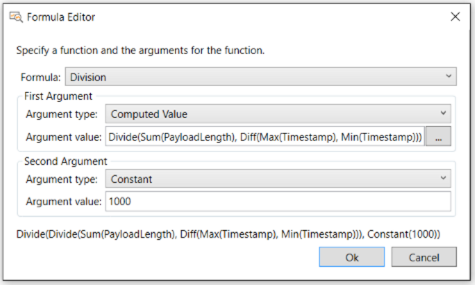

# Configuration Walkthrough of a Built-In Chart Viewer Layout

This section provides a walkthrough of the configuration process for the built-in **Chart** viewer **Layout** known as the [TCP/UDP Conversations by Message Count](tcp-udp-conversations-by-message-count.md)**Layout**. You might click the specified link and review the indicated topic in order to understand the functionality of this **Layout** before proceeding with the walkthrough.  
  
## Built-In Chart Viewer Layout Configuration Walkthrough  

 The **TCP/UDP Conversations by Message Count** **Layout** is accessible from the **Chart** drop-down list in the **New Viewer** menu on the global Message Analyzer toolbar. This **Layout** enables you to view the network conversations and the transports that carried them, along with the following data that can point you to specific areas that may require further investigation:  
  
-   Conversations with the highest message volume  
  
-   Conversations with the highest payload volume  
  
-   Conversations with the highest data transmission rates  
  
-   Conversations with the highest durations  
  
The data that you evaluate to facilitate this analysis appears in the columns of the **TCP/UDP Conversations by Message Count** **Layout** in tabular format, with the use of the **Table** grid visualizer component. The data  consists of the following:  
  
-   **Network conversation** data — displays in the **Network** column  of the Table and exposes the IPv4, IPv6, and/or Ethernet addresses of the computers engaged in each conversation across a set of trace results.  
  
-   **TCP/UDP transport** data — displays in the **Transport** column of the Table and exposes the ports on each computer that carried the conversations.  
  
-   **Message count** data — displays in the **Count** column of the Table and exposes the cumulative message count that is calculated for each conversation.  
  
-   **Payload statistics** data — displays in the **Bytes** column and exposes the  calculated sum of the total number of bytes transmitted in each conversation.  
  
-   **Data transmission rate** data — displays in the **KBS** and **BPS** columns of the Table and provides a computed data transmission rate in kilobytes-per-second and bytes-per-second, respectively, for each conversation.  
  
-   **Duration statistics** data — displays in the **Duration** column and provides a computed time interval for the duration of each conversation.  
  
### Configuration Walkthrough  

 The subsections below explain how the fields and computed values that populate the Table columns of the **TCP/UDP Conversations by Message Count** **Layout** are configured with the use of the **Edit Chart Layout** and **Formula Editor** dialogs. To get the most out of this walkthrough, you should display this **Layout** and open the **Edit Chart Layout** and **Formula Editor** dialogs in the procedures and explanations that follow, so that you can follow the process step-by-step through the dialog configurations that are given here.  
  
##### To start Message Analyzer, load data, and display the TCP/UDP Conversations by Message Count Layout  
  
1.  Start Message Analyzer and open a saved \*.matp file that contains data that you recently captured, preferably with a **Trace Scenario** that uses the **Microsoft-PEF-WFP-MessageProvider** to minimize lower layer noise, given that the main analysis will be at the Transport Layer with this **Layout**.  
  
     You can load the data from a \*.matp file into Message Analyzer through a [Data Retrieval Session](configuring-a-data-retrieval-session.md) or with the **Open** command on the global Message Analyzer toolbar.  
  
2.  After the data is loaded, click the **New Viewer** drop-down list on the global Message Analyzer toolbar, highlight **Chart**, and then click **TCP/UDP Conversations by Message Count**.  
  
     The **TCP/UDP Conversations by Message Count** **Layout** should display with data populated in the **Table** grid visualizer component.  
  
3.  While the **TCP/UDP Conversations by Message Count** **Layout** has focus, click the global Message Analyzer **Session** menu, highlight **Chart**, and then click **Edit** in the drop-down list to display the **Edit Chart Layout** dialog.  
  
**Chart Properties Configuration**   
In the **Chart Properties** pane of the **Edit Chart Layout** dialog, you will see that the **Chart type** is set to **Table**, the **Sort Order** is set to **Descending**, and **Sort By** is set to **Values**. This means that quantities in the first sortable **Value** column, in this case the **Count** column of this **Layout**, will be sorted in descending order by default, so that you can assess the network conversations from the highest message counts and payloads to the lowest, as you scroll down through the data.  
  
The data that displays in the columns of the Table visualizer component for this **Layout** are described in the subsections that follow.  
  
**Network Conversations**   
For this **Layout** to display data in the **Network** column of the Table, a **Field** entry in the **Series Field** pane must be configured with the **Network** field from the IPv4 or IPv6 protocol that you can locate in the **Field Chooser**. Note that the **Network** field, like all other fields in **Field Chooser**, contains an *inherent value* that Message Analyzer can display in various data viewers where it is used, including in **Chart** viewer **Layouts**. This contrasts with a *calculated value* that is the result of a selected operation, such as **Cumulative addition**, upon one or more data fields that produces a statistic that is useful for analysis. Adding fields with inherent values is the only type of configuration that is allowed in the **Series Field** pane, given that the **Formula Editor** is unavailable in this context.  
  
##### To locate the Network field  
  
1.  In the **Series Fields** pane of the **Edit Chart Layout** dialog, click the ellipsis button next to the first **Field** text box to open the **Field Chooser** window.  
  
2.  In the **Field Chooser** window, scroll down to the **IPv4** or **IPv6** node and then click the expansion control to display the **Datagram** message type.  
  
     If the **Field Chooser** is not already displayed, you can find it in the **Windows** drop-down list that is accessible from the global Message Analyzer **Tools** menu.  
  
3.  Click the expansion control of the **Datagram** node to expose the **IPv4** message field hierarchy.  
  
4.  Scroll down to the **Network** field in the hierarchy.  
  
     If this was an actual configuration task rather than a walkthrough, you would need to double-click the **Network** field that you located in **Field Chooser** to display  the "Network" value in the first **Field** text box of the **Series Fields** pane in the **Edit Chart Layout** dialog.  
  
**TCP/UDP Transports**   
For this **Layout** to display data in the **Transport** column of the Table, a second **Field** entry in the **Series Fields** pane must be configured with the **Transport** field from the TCP or UDP protocol, which you can locate in the **Field Chooser** window.  
  
##### To locate the Transport field  
  
1.  In the **Series Fields** pane of the **Edit Chart Layout** dialog, click the ellipsis button next to the second **Field** text box to open the **Field Chooser** window.  
  
2.  In the **Field Chooser**, scroll down to the **TCP** protocol and then click the expansion control to display the **Segment** message type.  
  
3.  Click the expansion control of the **Segment** node to expose the **TCP** message field hierarchy.  
  
4.  Scroll down to the **Transport** field in the **TCP** hierarchy.  
  
     If this was an actual configuration task rather than a walkthrough, you would need to double-click the **Transport** field that you located in **Field Chooser** to display  the "Transport" value in the second **Field** text box of the **Series Fields** pane in the **Edit Chart Layout** dialog.  
  
**Message Count**   
For this **Layout** to display data in the **Count** column, the first **Value** field in the **Values** pane must be configured with a **Count of Occurrences** operation in the **Formula Editor**. The formula for this **Value** field sets the **Argument type** to the **Message Field** option and  sets the **Argument value** to **MessageNumber**, the latter of which you locate in **Field Chooser**. The desired outcome for this configuration is to provide the total message count that is associated with each TCP or UDP conversation.  
  
Note that **MessageNumber** is a **Global Annotation** in **Field Chooser** that you can use to count messages, given that Message Analyzer assigns a **MessageNumber** to each message it parses. Therefore, in this **Layout**, the count of **MessageNumbers** is equivalent to the number of messages for a particular conversation.  
  
##### To compute message Count values  
  
1.  In the **Values** pane of the **Edit Chart Layout** dialog, click the ellipsis button next to the first **Value** text box to open the **Formula Editor** dialog.  
  
     Note the following settings in the **Formula Editor** dialog:  
  
    -   **Formula** — set to **Count of Occurrences**, which enables the **Layout** to count the occurrences of a particular entity or value; in this case it will be the message **Count**.  
  
    -   **Argument type** — an **Argument** pane option that is set to **Message Field**, which enables the **Layout** to count the occurrences of a particular field that is selected in **Field Chooser**, as specified below.  
  
    -   **Argument value** — an **Argument** pane option that is set to **MessageNumber**; this entity is located under the **Global Annotation** node in **Field Chooser**, which displays when you click the ellipsis next to the **Argument value** text box. As stated earlier, by using the **MessageNumber** annotation and the **Count of Occurrences** operation in a formula, you can count the number of messages and display the result in any visualizer component.  
  
2.  Observe that the **Formula Editor** dialog contains a label below the configuration controls that specifies the resulting operation that will be performed on a specified entity, for example, **Count(MessageNumber)** in the case of the above configuration. This formula also appears in the first **Value** text box in the **Values** pane after you click **OK** to exit the **Formula Editor** dialog.  
  
**Payload Statistics**   
For this **Layout** to display data in the **Bytes** column, the second **Value** field in the **Values** pane must be configured with a **Cumulative addition** operation in the **Formula Editor**. The formula for this **Value** field sets the **Argument type** to the **Message Field** option and  sets the **Argument value** to **PayloadLength**, which you locate in **Field Chooser**. The desired outcome for this configuration is to provide the cumulative sum of payload lengths in bytes for each TCP or UDP conversation, from all messages that define a **Payload** field.  
  
Note that although there are protocols that do not have a **Payload** field, in which case **PayloadLength** could not be evaluated, the TCP and UDP protocols do have such a field.  
  
##### To compute the sum of message payloads in Bytes  
  
1.  In the **Values** pane of the **Edit Chart Layout** dialog, click the ellipsis button next to the second **Value** text box to open the **Formula Editor** dialog.  
  
     Note the following settings in the **Formula Editor** dialog:  
  
    -   **Formula** — set to **Cumulative addition**, which enables this **Layout** to  create the sum of all instances of a particular value; which in this case is the cumulative message **PayloadLength** in bytes for each conversation.  
  
    -   **Argument type** — an **Argument** pane option that is set to **Message Field**, which enables this **Layout** to create  the sum of all instances of a particular field value that is specified in the **Argument value** text box. You can select the  field for which you want to sum all values in **Field Chooser**, as specified below.  
  
    -   **Argument value** — an **Argument** pane option that is set to **PayloadLength**; this entity is located in the hierarchy of many message types in **Field Chooser** that define a **Payload** field, for example, HTTP, TCP, or IPv4. **Field Chooser** displays when you click the ellipsis next to the **Argument value** text box.  
  
2.  Observe that a **Formula Editor** dialog label below the configuration controls specifies the resulting operation that will be performed on the specified field, for example, **Sum(PayloadLength)** in the case of the above configuration. This formula also appears in the second **Value** text box in the **Values** pane after you click **OK** to exit the **Formula Editor** dialog.  
  
**Conversation Data Transmission Rate**   
For this **Layout** to display data in the **KBs** column, the third **Value** field in the **Values** pane must be configured by several layers of operations with multiple instances of  the **Formula Editor**. The desired outcome for this configuration is to generate the rate in kilobytes, at which data was transmitted in a conversation. A word description of the  final formula that implements the calculations consists of the following parts:  
  
-   A **Subtraction** operation that computes the difference between the conversation **StartTime** and **EndTime** time stamps.  
  
-   A **Division** operation that divides the sum of **PayloadLengths** by the value that results from the above **Subtraction** operation.  
  
-   A final **Division** operation that factors the result of the previous **Division** operation by 1000, to obtain a kilobytes-per-second (KBS) value for display in the **KBs** column of this **Layout** for each conversation.  
  
To obtain the results of these operations, multiple formulas are required, as described in the procedure that follows.  
  
##### To compute conversation data transmission rates in kilobytes (KBs)  
  
1.  In the **Values** pane of the **Edit Chart Layout** dialog, click the ellipsis button next to the third **Value** text box to open the **Formula Editor** dialog, as shown in the figure that follows.  
  
       
  
     **Figure 73: Formula Editor dialog**  
  
     Note the following settings in this dialog:  
  
    -   The **Formula** drop-down list is set to the **Division** operation.  
  
         Note that when either a **Division** or **Subtraction** operation is selected in the **Formula Editor** dialog, two sets of **Argument** controls display, one for the **First Argument** and one for a **Second Argument**.  
  
    -   The  **Argument type** drop-down list in the **Second Argument** pane is set to the **Constant** item and the **Argument value** text box is manually configured with a constant value of 1000, which is needed to convert the **PayloadLength** sum in bytes-per-second over the conversation duration into a  *kilobytes-per-second* value.  
  
    -   The  **Argument type** drop-down list in the **First Argument** pane is set to the **Computed Value** item and the **Argument value** text box displays a formula that is created through multiple **Formula Editor** dialog configurations that are described in the next few steps.  
  
2.  In the first **Formula Editor** dialog displayed thus far, click the ellipsis button next to the **Argument** value text box in the **First Argument** pane  to display another **Formula Editor** dialog instance that is set to perform a **Division** operation using the following two **Computed Values**:  
  
    -   **Sum(PayloadLength)** — the configuration for creating the sum of **PayloadLength** values in bytes for each  conversation is described earlier in the **Payload Statistics** subsection. However, you can look at the **Formula Editor** for this configuration again by clicking the ellipsis button next to the **Argument value** text box in the **First Argument** pane of the current **Formula Editor** dialog instance.  
  
         The **Formula Editor** dialog that displays is configured with a  **Division** operation on two **Computed Values**, where the **Sum(PayloadLength)** value will be divided by the **Diff(Max(Timestamp), Min(Timestamp))** value, which is described in the next bullet point.  
  
    -   **Diff(Max(Timestamp), Min(Timestamp))** — the configuration for subtracting the difference between the **StartTime** and **EndTime** time stamps, which is needed to compute the **PayloadLength** per-second data transmission rate for each conversation, is exposed in the **Formula Editor** dialog instance that displays when you click the ellipsis button next to the **Argument value** text box in the **Second Argument** pane of the current **Formula Editor** dialog instance.  
  
3.  Observe in the current **Formula Editor** dialog instance (from the last bullet point) that a **Subtraction** operation is set to subtract two **Computed Values** that are configured as **Max(Timestamp)** and **Min(Timestamp)**. You can view the configuration for these formulas that use either  a **Maximum** or **Minimum** operation, respectively, by clicking the ellipsis button next to the formula in each text box.  
  
**Conversation duration**   
For this **Layout** to display data in the **Duration** column, the fourth **Value** field in the **Values** pane must be configured by several layers of operations with multiple instances of  the **Formula Editor**. The desired outcome for this configuration is to provide a statistic that exposes how long the message exchanges in each conversation took to complete. A word description of the  final formula that implements the calculations consists of the following parts:  
  
-   A **Subtraction** operation that computes the difference between the maximum time stamp value and the minimum time stamp value in a specific conversation.  
  
-   A **Maximum** operation that computes a result that is equal to the maximum time stamp value in the  conversation.  
  
-   A **Minimum** operation that computes a result that is equal to the minimum time stamp in the  conversation.  
  
To obtain the results of these operations, multiple formulas are required, as described in the procedure that follows.  
  
##### To compute conversation Durations  
  
1.  In the **Values** pane of the **Edit Chart Layout** dialog, click the ellipsis button next to the fourth **Value** text box to open the **Formula Editor** dialog.  
  
     Note the following settings in the **Formula Editor** dialog:  
  
    -   The **Formula** drop-down list is set to the **Subtraction** operation.  
  
    -   The  **Argument type** drop-down list in the **First Argument** pane is set to **Computed Value** and the **Argument value** text box is set to the formula **Max(Timestamp)**.  
  
    -   The  **Argument type** drop-down list in the **Second Argument** pane is also set to **Computed Value** and the **Argument value** text box is set to the formula **Min(Timestamp)**.  
  
2.  To review how the formula **Max(Timestamp)** or **Min(Timestamp)** is configured, click the ellipsis button next to the **Argument value** text box in the **First Argument** or **Second Argument** pane, respectively.  
  
3.  If you click the ellipsis button in the **First Argument** pane of the step 2, observe in the current **Formula Editor** dialog instance that a **Maximum** operation is set to calculate the value of the latest time stamp in a conversation.  
  
     If you now click the ellipsis button next to  the **Argument value** of the current **Formula Editor** dialog instance, you will display the **Field Chooser**, which provides for the selection of the **TimeStamp** annotation for the **Maximum** value.  
  
4.  If you click the ellipsis button in the **Second Argument** pane of step 2, observe in the current **Formula Editor** dialog instance that a **Minimum** operation is set to calculate the value of the earliest time stamp in a conversation.  
  
     If you now click the ellipsis button next to  the **Argument value** of the current **Formula Editor** dialog instance, you will display the **Field Chooser**, which provides for the selection of the **TimeStamp** annotation for the **Maximum** value.  
  
> [!NOTE]
>  There are other **Formulas** that you can review for data that displays in the **StartTime**, **EndTime**, **BPS**, and **K** columns of this **Layout**. However, an explanation of the **Formulas** for this data has already  been provided in other parts of this walkthrough.  
  
## See Also  

[Using the Edit Chart Layout Dialog](using-the-edit-chart-layout-dialog.md)