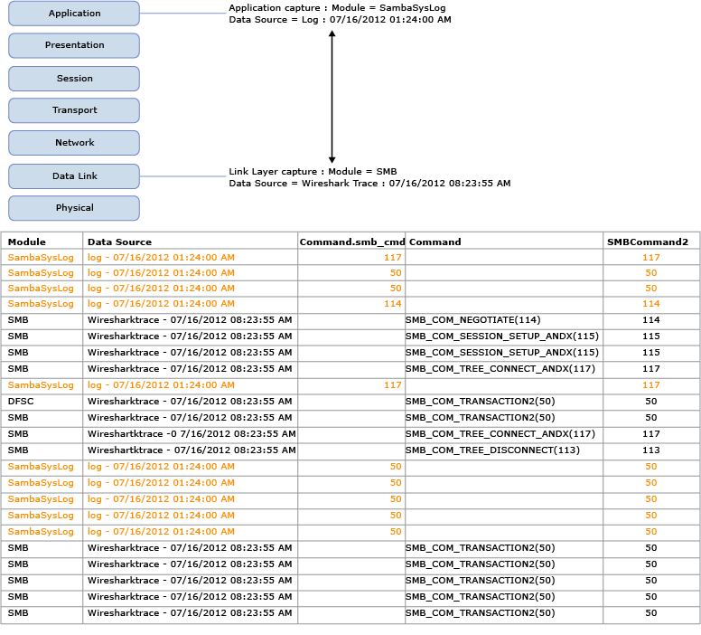

# Configuring and Managing Message Analyzer Unions
The Message Analyzer **Unions** feature provides a service that can help you overcome the difficulties of analyzing data that derives from different sources with varying naming conventions, in a common environment. If you have an interlaced session containing trace data from multiple sources — for example, .cap, .matp, and text log files — you might also have fields or properties within the session data that are essentially identical, but Message Analyzer does not recognize them as such because they have different names. However, for ease of analysis, you can manually configure Message Analyzer to correlate such fields with a single new entity that you specify as a **Union**. A common example of how Message Analyzer *automatically* performs such a correlation is the manner in which date-time stamps of messages from different supported data sources are treated. Message Analyzer interprets the date-time stamps of such data sources and converts them to a predefined format that displays in a single **TimeStamp** column in the **Analysis Grid** viewer. This enables you to perform operations such as sorting and grouping by time, which are powerful data analysis techniques. However, there can also be many other fields, properties, and annotations from disparate data sources that you can configure Message Analyzer to recognize as identical.  
  
## Understanding Data Field Correlation  
 To facilitate this field correlation capability, Message Analyzer provides the **Unions** feature that enables you to combine one or more message fields, properties, or annotations from different data sources into a single entity that is defined by a **Union** name that you specify. You can then display the named **Union**, which correlates and represents its constituent message field components, as a new data column in the **Analysis Grid** viewer. By configuring a **Union** that maps similar data fields with different names to a single user-defined **Union** name, you can easily correlate equivalent trace data in a message set that combines multiple traces.  
  
> [!NOTE]
>  Message Analyzer also enables **Unions** to support multiple values as “sets” of values for a particular field in the correlation, as described in [Creating Unions](creating-unions.md). In addition, you can use a  **Union** that configures  a set of values in a **Chart** viewer **Layout**, for example, a set of IP addresses, as in the default **AddressPair** **Union** that you will find in the **Field Chooser**.  
  
## Simplifying Data Analysis with Unions  
 In the figure that follows, you will see messages that were captured at two different interfaces by two different data sources, a SambaSysLog and a live Wireshark trace. The scenario represented by this illustration involves troubleshooting SMB file access issues. To facilitate analysis, data from both sources is loaded together into Message Analyzer through a Data Retrieval Session and interlaced as if they were one trace, so that the log messages and associated SMB live capture messages can be assessed together.  
  
   
  
 **Figure 63: SMB fields Union example**  
  
 In the figure, note that the data from the indicated sources contains command values that are virtually equivalent; however, those values are contained under a different column name for each data source (`Command.smb_cmd` and `Command`). Message Analyzer will not recognize such equivalence until you configure a **Union** that correlates the disparate field names that have the same meaning. As illustrated in the figure, this would mean taking the **Union** of the `Command.smb_cmd` and `Command` fields and creating a new entity named `SMBCommand2`. Thereafter, the unified field correlation displays as a single set of values in the `SMBCommand2` column, which you must add to the **Analysis Grid** viewer by using the **Field Chooser** **Tool Window**. You can even remove the existing data columns for the `Command.smb_cmd` and `Command` fields and the **Union** will continue to display the indicated value set in the `SMBCommand2` column.  
  
## Using the Built-In Union Assets  
 Message Analyzer has several built-in **Unions** of which you can take advantage. You can find these built-in **Unions** in the **Field Chooser** window under the **Unions** node. You can add one or more of these **Unions** as new columns in the **Analysis Grid**; however, this will be useful only if it is appropriate for the data you are analyzing. For example, if you are working with an SMB trace and a SambaSysLog that intrinsically have different field naming  conventions, you might add   the **SMBCommand** union as a new column to merge the **SMB.Command** field of the trace and the **SambaSysLog.smb_command.command.smb_com** field of the log. You can add this new column to the **Analysis Grid** viewer by right-clicking the **Union** in **Field Chooser** and selecting the **Add as Column** command in the context menu that appears.  
  
 You can also review the configuration of the built-in **Unions** in the **Manage Unions** dialog, by right-clicking a **Union** and selecting the **Create a Copy** command in the context menu that appears. This action displays the **Edit Union** dialog in which you can view the built-in **Union** field configurations and other settings. The **Manage Unions** dialog is accessible by clicking **Unions** on the global Message Analyzer **Tools** menu and then selecting the **Manage Unions** item in the drop-down list.  
  
 The built-in **Unions** are contained in the categories specified below and are described as follows:  
  
-   **File Sharing** category  
  
    -   **SMBTID** — correlates the following field names for SMB tree IDs from an SMB trace file and a SambaSys log file into the specified **Union** name:  
  
        -   **SMB.SmbHeader.Tid**  
  
        -   **SMB2.SMB2Request.Header.TreeId**  
  
        -   **SambaSysLog.Smb_command.command.smb_tid**  
  
    -   **SMBMID**— correlates the following field names for SMB message IDs from an SMB trace file and a SambaSys log file into the specified **Union** name:  
  
        -   **SambaSysLog.Smb_command.command.smb_mid**  
  
        -   **SMB2.ReadRequest.Header.MessageId**  
  
        -   **SMB.SmbHeader.Mid**  
  
    -   **SMBCommand** — correlates the following field names from an SMB trace file and a SambaSys log file into the **Union** named **SMBCommand**:  
  
        -   **SMB.Command**  
  
        -   **SambaSysLog.Smb_command.command.smb_com**  
  
-   **SharePoint** category  
  
    -   **SharePointCorrelation** — correlates the following field names in a SharePoint Unified Logging Service (ULS) text log file (\*.log) and a trace file that captured SharePoint network traffic, respectively, into the specified **Union** name:  
  
        -   **ULS.EventHeader.Correlation**  
  
        -   **HTTP.Request.Headers.SPRequestGuid**  
  
-   **Common** category  
  
    -   **PID** — correlates the following field names in an event log (\*.etl) and a set of trace results, for example, from a \*.matp file into the specified **Union** name:  
  
        -   **ProcessId**  
  
        -   **Etw.EtwProviderMsg.EventRecord.Header.ProcessId**  
  
    -   **AddressPair** — correlates field names into a set of address pairs that display in a single data column in the **Analysis Grid** viewer, which includes source and destination address pairs for each the following:  
  
         **Note** This **Union** enables sets by specifying the **Set of multiple values** option.  
  
        -   **Ethernet.Frame.Source**, **Ethernet.Frame.Destination**  
  
        -   **IPv4.Datagram.Source**, **IPv4.Datagram.Destination**  
  
        -   **IPv6.Datagram.Source**, **IPv6.Datagram.Destination**  
  
## Using Unions in Message Analyzer Operations  
 Message Analyzer also enables the ubiquitous use of **Unions** with various operations, viewers, and tools that you might typically employ during data analysis processes, as follows:  
  
-   Grouping  
  
-   Sorting  
  
-   Filtering  
  
-   Pattern matching  
  
-   Analyzing data in different viewers, including **Charts**  
  
-   Using **Tool Windows**, such as the **Field Chooser**  
  
 For further details about using **Unions** in the manner described in the preceding list, see [Performing Message Analyzer Operations with Unions](performing-message-analyzer-operations-with-unions.md).  
  
---  
  
 **What You Will Learn**   
In the following topics of this section, you will learn how to create, modify, manage, and share **Unions**, in addition to performing Message Analyzer operations with them:  
[Creating Unions](creating-unions.md)  
[Modifying Unions](modifying-unions.md)  
[Refreshing Data Views Containing Unions](refreshing-data-views-containing-unions.md)  
[Performing Message Analyzer Operations with Unions](performing-message-analyzer-operations-with-unions.md)  
[Managing Unions as Shared Items](managing-unions-as-shared-items.md)  
---