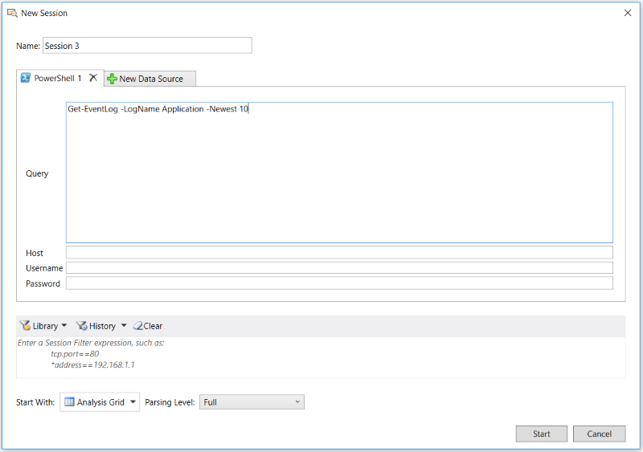

# Deriving Input Data with PowerShell Scripts
This section describes two different methods that you can use to acquire data for input to  Message Analyzer through PowerShell. The first shows you how to import data with a saved PowerShell script file that you target as a supported input file type (\*.ps1) through a Data Retrieval Session. The script contained in such a file may invoke specific processes or functions that return data which you can view in Message Analyzer. The second method is similar, but instead enables you to use a PowerShell interface that is built into Message Analyzer to create a PowerShell query that returns its data  to a viewer such as the **Analysis Grid**.  
  
## Importing Data Through a PowerShell Script File  
 As specified in [Locating Supported Input Data File Types](locating-supported-input-data-file-types.md), Message Analyzer enables you to target PowerShell (.ps1) scripts as an input file type for a Data Retrieval Session. After you target one or more .ps1 files by adding them to the input files list on the **Files** tab of the **New Session** dialog, you can execute the scripts by clicking the **Start** button in the **New Session** dialog. The scripts might invoke other systems or functions to generate data, which will then be loaded through a Data Retrieval Session into Message Analyzer. Such PowerShell scripts can run on the local host or on remote target computers, as follows:  
  
-   **Local hosts** — you might have a PowerShell script that runs a cmdlet that returns data from the local Event Viewer, for example, `Get-EventLog -LogName Application -Newest 10`. This script gets the latest 10 messages in the Application log. If you use the **Add Files** feature of the **New Session** dialog to import a .ps1 file into Message Analyzer that contains this cmdlet, the data that it generates will be loaded into a Message Analyzer viewer that you specify (from the **Start With** drop-down list in the **New Session** dialog) after you start your Data Retrieval Session. Note that you also have the option to use the **Open** feature in the Message Analyzer **File** menu to quickly import a .ps1 file, execute its code, and load the data it generates into the default **Analysis Grid** viewer.  
  
-   **Remote hosts** — you can run a .ps1 script on a target remote host and return data to Message Analyzer in a manner that is similar to the local host scenario; however, some configuration is required, as described in the first two of the following steps:  
  
    -   Create a configuration file `psconfig.config` in the same directory where the remote .ps1 script exists.  
  
         This file will contain the name of a single remote host from which to return data, using the format:  `host=<hostname>`. Optionally, you can specify credentials in the following format:  `user=<domain\username>` and `password=<Password>`. Specify each entry on separate lines in the .config file *without the angle brackets*. The default authentication method is Windows Integrated authentication.  
  
    -   Enable PowerShell remoting on the specified remote host by running the [Enable-PSRemoting](http://technet.microsoft.com/en-us/library/hh849694.aspx) cmdlet.  
  
    -   Open the .ps1 file by using either of the methods specified in the “Local hosts” bullet point above.  
  
## Importing Data Through a PowerShell Query  
 To generate a PowerShell query that captures data from a particular local or remote host, you can construct the query with any cmdlets that you wish and display the output in Message Analyzer. This provides a convenient way of using PowerShell in the Message Analyzer environment where you can take advantage of Message Analyzer analysis capabilities to review results. For example, you can use the **Analysis Grid** viewer to display the query output data in the **Summary** column of the grid. By selecting a message row in the grid, you   can examine fields and values in the **Details** **Tool Window** that correspond to **Summary** column data. The figure that follows shows the data retrieval interface configuration with which you will work to load the data into Message Analyzer from the output of a PowerShell query.  
  
   
  
 **Figure 35: PowerShell Query data retrieval interface**  
  
 To acquire data with a PowerShell query, perform the following steps:  
  
> [!IMPORTANT]
>  Before you perform the following steps, ensure that the **PowerShell Import** preview feature is selected on the **Features** tab of the **Options** dialog, which is accessible from the global Message Analyzer **Tools** menu. If not, select it and then restart Message Analyzer to enable the **PowerShell** option to appear in the **New Session** dialog under **Add Data Source**.  
  
#### To acquire input data from a Power Shell query  
  
1.  On the Message Analyzer  **Start Page**, click the **New Session** button to display the **New Session** dialog with the **Data Source** selection buttons.  
  
2.  Under **Add Data Source** in the dialog, click the **PowerShell** button to display the **PowerShell** query tab, from where you can specify the following:  
  
    -   **Query** — in this field, specify the PowerShell query code that targets the data you want to acquire. The figure above shows the hypothetical query `Get-EventLog -LogName Application -Newest 10`, which returns the latest 10 messages in the Application log of the local computer.  
  
    -   **Host** — to obtain target data from a remote host, you must specify the host name in this field in the following format: "*serverName*", without the quotes.  If your query is for the local computer only, you can leave this field blank, as the  PowerShell query that you specify will acquire data on the local host by default.  
  
    -   **Username** — in this field, specify the user name that has appropriate permissions on the remote host where you are acquiring data, while using the following format:  "*DomainName\Username*", without the quotes. If your query is for the local computer only, you can leave this field blank.  
  
    -   **Password** — in this field, specify the appropriate password for the **Username** that you provided.  If your query is for the local computer only, you can leave this field blank.  
  
3.  If not already selected, choose the **Analysis Grid** viewer from the **Start With** drop-down list in the **New Session** dialog as the viewer in which to assess your query results.  
  
 When you finish with the PowerShell query and host configuration, click the **Start** button in the **New Session** dialog to begin acquiring your data.