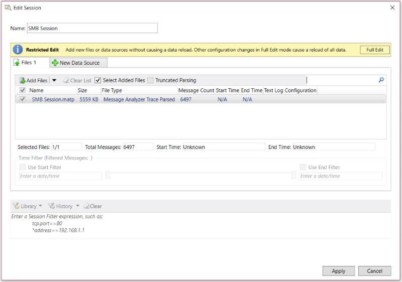

# Editing Existing Sessions
After loading data into Message Analyzer or capturing it live, you have the option to reconfigure your original Data Retrieval Session or Live Trace Session, respectively, so that you can alter the session results to create a different analysis perspective. Session reconfiguration enables you to work with your data until you find the messaging context and data presentation format that helps you resolve the issue on which you are working.  
  
## Using the Edit Session Dialog  
 You can modify any existing session from the **Edit Session** dialog, which is accessible by clicking the global Message Analyzer **Session** menu and then clicking the **Edit Session** command, any time after initial session data is displayed in a viewer such as the **Analysis Grid**. You can also click the **Edit Session** button on the global Message Analyzer toolbar to launch the **Edit Session** dialog.  
  
 The session configuration that displays in the **Edit Session** dialog depends on the session viewer tab that has focus (below the global Message Analyzer toolbar). If you have one or more data viewers open for a particular session, selecting any viewer tab in that session and then clicking the **Edit Session** button will launch the **Edit Session** dialog and display the initial configuration that you specified for *that* session.  
  
 The figure that follows shows the **Edit Session** dialog as it first appears in **Restricted Edit** mode.  
  
   
  
 **Figure 40: Edit Session dialog in Restricted Edit mode**  
  
## Editing Modes for Data Retrieval Sessions  
 If you open the **Edit Session** dialog for a session in which data was loaded into Message Analyzer from a saved trace or log file, the **Edit Session** dialog opens in the **Restricted Edit** mode, which limits the session changes that you can make to simply adding new files that contain data to be added to the existing displayed message collection. In this mode, Message Analyzer can load the data from new files without having to reload the data from existing files in the files list. To obtain access to all the configuration features for such a session, as described in the [Configuring Session Changes](editing-existing-sessions.md#BKMK_ConfigSessionChanges), click the **Full Edit** button. However, any configuration changes that you make in this mode will require that Message Analyzer reload all the data, including data from existing files and any new files that you specify. In this case, you might notice that Message Analyzer has a slower loading performance, depending on the size of the new input files.  
  
> [!TIP]
>  Even if you used the **Open** or **Recent Files** feature to load and display trace or log file data in a Message Analyzer viewer, you still have the option to return to session configuration to make changes.  For example, after opening a large trace file through either of these features, you might realize that you need to narrow down the scope of messages to retrieve and then reload the data. You could then define the messages you want to retrieve by applying a **Session Filter** or a **Time Filter** to the data contained in the target input files.  
  
## Editing a Live Trace Session  
 If you recently ran a Live Trace Session but have not yet saved the data, you can return to the initial session configuration by clicking the **Edit Session** button on the global Message Analyzer toolbar, or by clicking the **Edit Session** item in the global Message Analyzer **Session** menu. You might do this if you want to apply various tools and techniques that will refocus the displayed results and create a unique perspective on the existing message collection for analysis purposes, prior to saving the data.  
  
 There are no editing restrictions in this scenario, so you have access to all the configuration features described in [Configuring Session Changes](editing-existing-sessions.md#BKMK_ConfigSessionChanges). After you make changes to the Live Trace Session configuration, simply click the **Apply** button You will then need to restart your session   by clicking the **Restart** arrow/button on the global Message Analyzer toolbar to apply the changes you specified. For example, you might have specified other hosts on which to capture message data, chosen a different **Trace Scenario**, added or removed a system ETW provider, added a new filter or modified an existing one, and so on.  
  
> [!NOTE]
>  If you would rather create and configure an entirely new session, you can do so by clicking either the **Files**, **Live Trace**, **Azure Table**, or other button under **Add Data Source** in the **New Session** dialog, to display the configuration features for a new Data Retrieval Session or Live Trace Session, as appropriate, from where you can name, configure, and start a new session.  
  
## Editing a Data Retrieval Session  
 If you have loaded data from one or more saved files or logs into Message Analyzer, you can make changes from the **Edit Session** dialog and Message Analyzer will apply your changes directly to the existing results display without a reload of existing data, provided that the changes you made were in **Restricted Edit** mode and consisted of adding new files only. When this is the case, the data from the new files will be appended to the existing data in a viewer such as the **Analysis Grid**. Otherwise, any other changes you make such as filtering must be enabled in **Full Edit** mode, in which case, a full reload of all data will occur. At this time, all the changes that you specified will be applied to the reloaded  data in this scenario.  
  
   
## Configuring Session Changes  
 The changes that you can make to an existing session are limited to the type of session you are reconfiguring, as follows:  
  
-   **Data Retrieval Session** — you can modify this type of session in the following ways:  
  
    -   Add more saved input files to the original files list, to target additional data to analyze.  
  
    -   Add more **Files** tabs by using the **New Data Source** tab to target different tabbed sets of input files from which to load data, as described in [Configuring Session Scenarios with Selected Data Sources](configuring-session-scenarios-with-selected-data-sources.md).  
  
    -   Specify an input **Time Filter** or reconfigure one that you specified in the initial session configuration.  
  
    -   Specify a different **Time Filter** for input files on another **Files** tab, if you added one, as described in [Configuring Session Scenarios with Selected Data Sources](configuring-session-scenarios-with-selected-data-sources.md).  
  
    -   Remove the **Session Filter** that you specified in the initial session configuration, reconfigure it, or select a new built-in **Session Filter**. The goal is to apply filtering criteria that is specifically tailored for the data that is being loaded in the updated session.  
  
    -   Select a **Parsing Level** that is different from the initial session configuration, or set one for the first time.  
  
    -   Select or unselect the **Truncated Parsing** mode, depending on its current setting, if you want to improve performance when loading data from a file that contains truncated (headers only) messages, for example a .cap file.  
  
-   **Live Trace Session** — you can modify this type of session in the following ways, that is, if you have not yet saved the session data:  
  
    -   Specify different hosts on which to capture data in remote tracing scenarios.  
  
    -   Specify a different **Trace Scenario** from the **Select Scenario** drop-down list on the **ETW Providers** toolbar of the **Live Trace** tab.  
  
    -   Specify a different **Trace Scenario** on a newly added  **Live Trace** tab, as a **New Data Source**, as described in [Configuring Session Scenarios with Selected Data Sources](configuring-session-scenarios-with-selected-data-sources.md).  
  
    -   Add one or more system ETW providers to the **ETW Providers** list by specifying them in the **Add System Providers** dialog, which is accessible by clicking the **Add Providers** drop-down list on the **ETW Providers** toolbar.  
  
    -   Select (or write) a new **Session Filter**, or modify one that you specified in the original session configuration. Ensure that you are applying filtering criteria that is specifically tailored for the data to be captured in the updated session.  
  
    -   Specify or modify additional filters, such as event **Keyword** bitmask and **Level** filters, **Fast Filters**, **WFP Layer Set** filters, **Fast Filter Groups**, NDIS stack or Hyper-V-Switch extension layer packet filters, an adapter filter, and other advanced filters, depending on the message providers in use. For example, you could specify **Advanced Settings** to create provider configurations that enable you to:  
  
         — Capture data directionally on a specified network adapter, for example, in a **Local Network Interfaces** **Trace Scenario**.  
  
         — Configure a single **Fast Filter** or several logically chained **Fast Filters** for a provider, for example, in **Local Network Interfaces** scenarios on computers running the Windows 7, Windows 8, or Windows Server 2012 operating system.  
  
         — Capture remote traffic on host adapters or on one or more virtual machines (VMs) that are serviced by a Hyper-V-Switch on a remote Windows 8.1, Windows Server 2012 R2, or Windows 10 host, along with specifying NDIS layer and Hyper-V-Switch extension layer packet traversal paths and other special filtering configurations, for example, in **Remote Network Interfaces** scenarios.  
  
    -   Set a **Parsing Level** or select a different one.  
  
    -   Modify and optimize the **ETW Session Configuration**, for example, if you think you are dropping packets because of inadequate ETW buffer configuration settings.  
  
---  
  
 **More Information**   
 **To learn more** about selecting a **Trace Scenario**, see [Selecting a Trace Scenario](selecting-a-trace-scenario.md).   
**To learn more** about adding and modifying providers, see [Adding a System ETW Provider](adding-a-system-etw-provider.md) and [Modifying Default Provider Settings](modifying-default-provider-settings.md).   
**To learn more** about how to use a **Session Filter**, see [Working with Session Filters in a Live Trace Session](working-with-session-filters-in-a-live-trace-session.md) and [Applying a Session Filter to a Data Retrieval Session](applying-a-session-filter-to-a-data-retrieval-session.md).   
**To learn more** about optimizing your ETW session configuration, see [Specifying Advanced ETW Session Configuration Settings](specifying-advanced-etw-session-configuration-settings.md).   
**To learn more** about **Parsing Levels**, see [Setting the Session Parsing Level](setting-the-session-parsing-level.md).  
**To learn more** about how to configure **Advanced Settings** for the **PEF-NDIS** and **Windows-NDIS** providers, see the topics [Using the Advanced Settings - Microsoft-PEF-NDIS-PacketCapture Dialog](using-the-advanced-settings-microsoft-pef-ndis-packetcapture-dialog.md) and [Using the Advanced Settings - Microsoft-Windows-NDIS-PacketCapture Dialog](using-the-advanced-settings-microsoft-windows-ndis-packetcapture-dialog.md).   
---