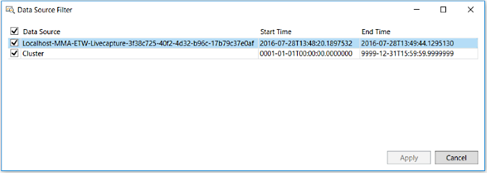
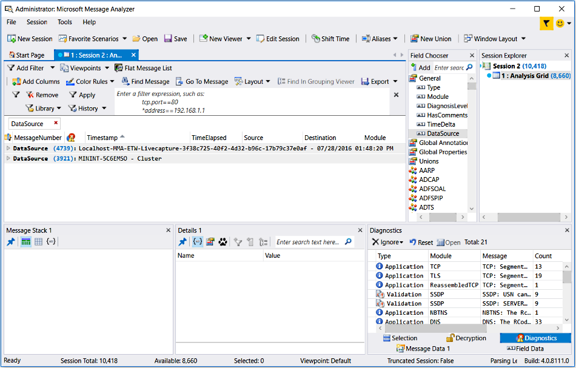

# Filtering Data Sources

This section describes how to filter a collection of messages based on the associated data sources from which the messages derive. This feature is particularly useful if you are loading saved data from multiple sources into Message Analyzer through a Data Retrieval Session. For example, you might have a collection of messages from related sources such as logs and traces that you are correlating and it may be advantageous to isolate the messages that are associated with each source of data. There are two ways you can achieve this, as follows:  
  
-   **Filtering** — filter on the data sources that contain the messages you want to view.  
  
     To do this, select one or more data sources in the **Data Source Filter** dialog that is accessible from the global Message Analyzer **Session** menu after you load a collection of messages into Message Analyzer. By selecting one or more data sources in the dialog and clicking the **Apply** button, all messages are filtered from the current data  viewer except those that are associated with the selected data source/s.  
  
> [!NOTE]
>  The **Data Source Filter** feature does not support filtering in **Layouts** for the **Chart** viewer that you can access from the **New Viewer** drop-down list.  
  
The **Data Source Filter** dialog is shown in the figure that follows, where a trace file and a cluster log  are the selected data sources.  
  
  

**Figure 60:   Data Source Filter dialog**  
  
-   **Grouping** — create an associated message Group for each data source in a message collection under separate expandable **Data Source** nodes in the **Analysis Grid** viewer.  
  
     To do this, add a **DataSource** column to the **Analysis Grid** viewer by right-clicking **DataSource** under the **General** node of the **Field Chooser** **Tool Window**, and then select the **Add as Column** command in the context menu that appears. Next, right-click the newly added **DataSource** column in the **Analysis Grid** viewer and select the **Group** command in the context menu that appears. The messages from each data source are then organized and encapsulated under a separate node that you can expand for analysis, as shown in the figure that follows.  
  
       
  
     **Figure 61: Data Source Groups in the Analysis Grid**  
  
> [!TIP]
>  The **Grouping** viewer does not currently have any **Layouts** that make use of the **DataSource** field by default. However, you can manually add this field to any **Grouping** viewer **Layout** as needed, as long as the **Grouping** viewer *has focus* when you are doing so. To add the **DataSource** field to a **Grouping** viewer **Layout**, use the **Field Chooser** as described immediately above.  
  
## Using the Data Source Filter Dialog  

 As previously described, you can access the **Data Source Filter** dialog by clicking the global **Session** menu, highlighting the **Data Source Filter** item, and then selecting the **Edit** command that appears in the drop-down list. When the **Data Source Filter** dialog displays, you will see a tabular listing of data source information in the following column headers:  
  
-   **Data Source** — the listings in this column are specified in a format similar to the following examples, for the indicated file types:  
  
    -   Message Analyzer Trace Parsed (.matp) files — uses the format: HostName-MMA-ETW-LiveCapture-GUID.  
  
    -   Capture (.cap) files — uses the format:  FileName  
  
    -   Event Trace Log (.etl) files — uses the format: FileName  
  
    -   Log (.log) files — uses the format: FileName  
  
> [!NOTE]
>  The **DataSource** column in the **Analysis Grid** viewer can also include additional information when messages from cap, .etl, and other  files are displayed. For example the host name can be included in the listing.  
  
-   **Start Time** — specifies the **Timestamp** of the first message in the trace file or log.  
  
-   **End Time** — specifies the **Timestamp** of the last message in the trace file or log.  
  
 **Applying and Removing Data Source Filtering**   
After you use the **Data Source Filter** dialog to select the data source/s containing the messages that you want to view, click the **Apply** button in the dialog  to initiate the filtering process. After you apply the filtering, the **Apply** command is disabled and the **Remove** command is enabled in the **Data Source Filter** drop-down list so  you can remove the applied filter as necessary. After you click the **Remove** command, the **Apply** command then re-enables in the **Data Source Filter** drop-down list so that you can re-apply the current data source filtering configuration. You can toggle back and forth between applying and removing the **Data Source Filter** as many times as you want without changing the current data source filter configuration. To change the configuration, simply select the **Edit** command in the drop-down and reconfigure your **Data Source Filter** as required before you re-apply it.  
  
---  
  
 **More Information**   
 **To learn more** about how to use the **Group** context menu command in the **Analysis Grid** viewer, see [Using the Analysis Grid Group Feature](using-the-analysis-grid-group-feature.md).  
**To learn more** about the **Grouping** viewer, see the [Grouping Viewer](grouping-viewer.md) topic.  

---