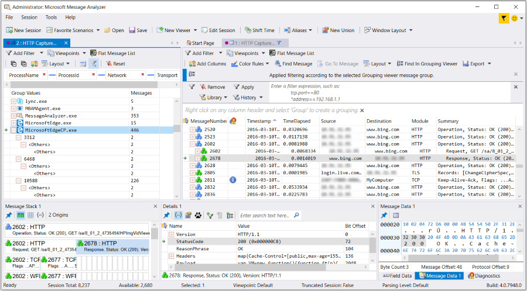

# Grouping Viewer
To augment your analysis capabilities, the **Grouping** viewer enables you to organize your traffic into summary hierarchies based on Grouping viewer **Layouts** that contain predefined message field Groups that exist in nested configurations. The **Grouping** viewer enables you to extract specific types of data from any large data set  and  organizes this information into a hierarchy of one of more nested Groups that provide instant access to data that you can  interactively correlate with **Analysis Grid** viewer message details.  
  
 The **Grouping** viewer is accessible from the **New Viewer** drop-down list, which in turn is accessible from the following locations:  
  
-   Global Message Analyzer **Session** menu.  
  
-   Global Message Analyzer toolbar.  
  
-   **Session Explorer** right-click context menu.  
  
 The **Layout** that displays in the **Grouping** viewer by default has a grouped  configuration that consists of  **Network** and **Transport** groups, although many other layouts are available such as the **File Sharing SMB/SMB2**, **TCP Deep Packet Analysis**, and **Process Name and Conversations** **Layouts**, the latter of which organizes data in a way that is similar to the Network Monitor **Conversation Tree**.  Note that many **Grouping** viewer **Layouts** are designed to work with specific **Analysis Grid** viewer **Layouts** to create an interactive analysis environment through  Message Analyzer **Profile** configurations that apply such **Layouts** to these viewers, as described in [Working With Message Analyzer Profiles](working-with-message-analyzer-profiles.md).  
  
---  
  
 **What You Will Learn**   
In this section, you will learn about the functions and features of the **Grouping** viewer, as described in the following topics:  
[Utilizing the Grouping Viewer Capabilities](grouping-viewer.md#BKMK_UtilizeGroupingCapabiities)  
[Changing the Analysis Perspective Through Group Reorganization](grouping-viewer.md#BKMK_GroupReorg)  
[Grouping Viewer Layouts](grouping-viewer.md#BKMK_GroupViewLayouts)  
[Understanding the Built-In Grouping View Layouts](grouping-viewer.md#BKMK_UsingPredefinedLayouts)  
[Manipulating Group Displays](grouping-viewer.md#BKMK_ManipulateGroups)  
[Grouping Viewer Modes of Operation](grouping-viewer.md#BKMK_ModesofOperation)  
[Locating Analysis Grid Messages in the Grouping Viewer](grouping-viewer.md#BKMK_LocatingAGMessages)  
[Grouping Viewer Display Features](grouping-viewer.md#BKMK_GroupingDisplayFeatures)  
[Adding New Groups](grouping-viewer.md#BKMK_AddNewGroups)  
[Editing a Built-In Layout](grouping-viewer.md#BKMK_EditGroupingLayouts)  
[Creating a Grouping Viewer Layout Template](grouping-viewer.md#BKMK_CreatingViewLayouts)  
[Managing Grouping View Layouts](grouping-viewer.md#BKMK_ManageGroupViewLayouts)  
---  
  
   
## Utilizing the Grouping Viewer Capabilities  
 An important capability that is available for the **Grouping** viewer is that you can create custom grouped layout configurations of your own based on message field groups that you choose and group nesting configurations that you create, to obtain the analysis perspectives that are most useful in your environment. In addition, by manually altering the way your message field Groups are nested, you can adjust (pivot) your grouped layout on-the-fly to acquire different message correlation configurations that result in unique analysis contexts. A major advantage of the **Grouping** viewer, is that you can organize data into unique hierarchies to expose targeted information that you can quickly extract from a large data set, which otherwise would be difficult to achieve. More specific advantages include the ability to do the following:  
  
-   **Locate the Group(s) that contain the largest traffic volumes**:  
  
     For example, in the **Process Name and Conversations** **Layout** of the **Grouping** viewer, you can compare the traffic volumes across all the top-level **ProcessName** Groups to determine the Groups with the most traffic.  
  
-   **Isolate all messages to a top-level Group type and drill down further for data in nested Groups, to obtain a concise analytical focus on specific messages of interest**:  
  
     In the **Process Name and Conversations** layout, this means you can isolate messages from one or more process names, view the distribution of process ID traffic for each process name, and drill down further to view the related **Network** layer conversations and the **Transport** layer ports that carried them.  
  
-   **Correlate messages in the Analysis Grid viewer with the Groups in which they appear in the Grouping viewer**:  
  
     For example, you can use the **Find in Grouping Viewer** command that is accessible as a right-click context menu item for any message in the grid, to locate the corresponding Group in which the selected message appears.  
  
-   **Correlate messages across different data sources**:  
  
     For example, you might compare messages from a combination of associated log files and live trace results.  
  
   
## Changing the Analysis Perspective Through Group Reorganization  
 The **Grouping** viewer enables you to reorganize how the Groups are nested in order to achieve a different analysis perspective. For example, consider the Group hierarchy of the **Process Name and Conversations** layout shown in the upper left sector of the user interface in the figure that follows. The particular groupings shown in this figure isolate traffic by **ProcessName**, **ProcessID**, **Network** layer, and **Transport** layer, as previously indicated. This Group configuration enables you to correlate the TCP/UDP ports that carried IPv4/IPv6 conversations across various process IDs for corresponding process names. To achieve a different perspective on the same data, you can quickly pivot the data by dragging and dropping any Group label into a different position in the **Grouping** viewer toolbar area to automatically reorganize the data according to a new Group nesting configuration. By doing this, you can view the data in a different way and potentially expose issues that were formerly less apparent.  
  
   
  
 **Figure 42:  Message Analyzer Grouping Viewer with Process Name, ProcessId, and Conversations Layout**  
  
---  
  
 **More Information**   
 **To learn more** about the **Process Name and Conversations** layout for the **Grouping** viewer, see [Understanding the Built-In Grouping View Layouts](grouping-viewer.md#BKMK_UsingPredefinedLayouts).    
**To learn more** about reorganizing Grouped information, see [Manipulating Group Displays](grouping-viewer.md#BKMK_ManipulateGroups).  
---  
  
   
## Grouping Viewer Layouts  
 The **Grouping** viewer toolbar contains a **Layout** drop-down list that enables you to select  different built-in **Layouts** that you can use for data analysis purposes. Note that the assets you access from this **Layout** drop-down list apply to the **Grouping** viewer only and are available only when the **Grouping** viewer is displayed.  
  
 You can modify any of the built-in **Layouts** and save your changes if you want, and you can set any **Layout** as the default for the Grouping viewer. You also have the option to create your own layout with the use of the **Field Chooser** **Tool Window** and save it as indicated as an item in the **Message Analyzer Grouping View Layouts** asset collection Library, which is exposed by the **Layout** drop-down. Briefly, you can create a new Grouping **View Layout** in either of the following ways:  
  
-   Modify a currently displayed **Layout** by adding or removing Groups and then select the **Save Current Layout As…** command from the **Layout** drop-down list on the **Grouping** viewer toolbar to display the **Edit Item** dialog, from where you can specify **Name**, **Description**, and **Category** information. When you click **OK** to exit the dialog, Message Analyzer saves your custom **Layout** in the **Category** name that you specified, under the top-level **My Items** category of the **Layout** Library.  
  
    > [!NOTE]
    >  You can add Groups by using any of the methods that are described in [Adding New Groups](grouping-viewer.md#BKMK_AddNewGroups). You can remove Groups by simply clicking the **x** mark in one or more Group labels, just below the **Grouping** viewer toolbar.  
  
-   Right-click an item in the **Layout** drop-down list and then select the **Create a Copy** command to display the **Edit Item** dialog, where you can modify **Name**, **Description**, and **Category** information. After you click **OK** to exit the **Edit Item** dialog, Message Analyzer saves your custom layout in the **Category** name that you specified, under the top-level **My Items** category of the **Layout** Library. Thereafter, you will have access to several context menu commands that display whenever you right-click a **Layout** in the **My Items** category, where all user-created **Layouts** for the **Grouping** viewer are saved by default. Thereafter, you can display and customize your **Layout** by adding or removing Groups and saving your changes as previously described.  
  
> [!NOTE]
>  To support the requirements of your environment, you can create and save as many different **Layouts** for the **Grouping** viewer as you wish. To learn more about creating Grouping **Layouts**, see [Creating a Grouping Viewer Layout Template](grouping-viewer.md#BKMK_CreatingViewLayouts).  
  
   
## Understanding the Built-In Grouping View Layouts  
 The **Message Analyzer Grouping View Layouts** asset collection Library is accessible from the view **Layout** drop-down list on the **Grouping** viewer toolbar. It contains several built-in **Layouts** that enable you to group and summarize messages based on field values that are specifically exposed by various **Layouts**, to create alternate analysis perspectives on different types of data. It also enables you to expose data that is deeply hidden in large volume traces through the filtering action of nested group configurations. The built-in **Layouts** are described in this section.  
  
> [!NOTE]
>  The **Layout** drop-down list on the **Grouping** toolbar pertains to the **Grouping** viewer only. It is not associated with the **Layout** feature that is accessible from the **Analysis Grid** viewer toolbar. On the other hand, many of the **Grouping** viewer **Layouts** that are described in this section are specifically intended to work with **Analysis Grid** viewer **Layouts** to create a unified interactive analysis environment, as mentioned earlier.  
>   
>  You can  facilitate  interaction between these viewers by clicking Group nodes to display corresponding messages in the **Analysis Grid** viewer for further scrutiny of message details. How these messages display depends on the Grouping viewer mode, as described in [Grouping Viewer Modes of Operation](grouping-viewer.md#BKMK_ModesofOperation). Another interaction consists of locating an **Analysis Grid** message within the Group hierarchy in the **Grouping** viewer, as described in  [Locating Analysis Grid Messages in the Grouping Viewer](grouping-viewer.md#BKMK_LocatingAGMessages).  
  
-   **Cluster** category  
  
    -   **Cluster Logs** — this grouping **Layout** provides a top-level **InfoLevel** Group that contains all the debug levels generated by the Cluster Service and any of its subcomponents. Debug levels consist of DBG, ERR, INFO, and WARN. **Subcomponent** is the first nested Group under **InfoLevel** and it is populated with acronyms that represent various subcomponents of the Cluster Service such as the Global Update Manager (GUM), Failover Manager (FM), and Database Manager (DM). Nested below the **Subcomponent** Group is the **ProcessId** Group, which exposes the hexadecimal identifier of the executing processes launched by a particular Cluster Service component. With these three  Groups, you can identify the components in which specific errors and warnings occurred during Clustering operations, along with the IDs of associated executing processes. You can then select any of these Groups to expose the log entries associated with each Group in the **Analysis Grid** viewer for further analysis.  
  
         This grouping **Layout** is intended to work with the **Cluster Log** **Layout** of the **Analysis Grid** viewer to create an interactive analysis environment. You will be able to correlate the data most effectively if you have this  **Analysis Grid** viewer **Layout** displayed. For example, if you drill down to the **ProcessId** Group and select process IDs, you can display the associated log entries in the **Analysis Grid** viewer for analysis of log entry details. With the  **Cluster Log** **Layout** in the **Analysis Grid**, you will also have access to other log fields of interest such as **RemainingText**, which can expose the cause of errors and warnings, or provide other debugging information.  
  
         Note that  if you have the  **Cluster Logs** **Profile** enabled on the **Profiles** tab of the **Options** dialog, the **Cluster Log** **Layout** automatically displays in the **Analysis Grid** viewer   after you load data into Message Analyzer from  a Cluster.log file, as described in the [Working With Message Analyzer Profiles](working-with-message-analyzer-profiles.md) topic. However, if you want to display the **Cluster Logs** **Layout** in the **Grouping** viewer, you will need to manually select the **Default** item in the **Grouping** drop-down list that is accessible from the **New Viewer** drop-down list. Otherwise, if the **Cluster Logs** **Profile** is not enabled, you will need to manually select the **Cluster Logs** **Layout** in the **Grouping** drop-down list, rather than the **Default** item, to use this **Layout**. The same is true of the **Chart** viewer **Layout** that is also part of the **Cluster Logs** **Profile**.  
  
         For more information about analyzing Cluster logs with Message Analyzer, where such analysis is enhanced by complementary **Layouts** for the **Analysis Grid** and **Chart** viewers, see the **Cluster Logs** **Profile** in the table of the previously indicated topic.  
  
-   **Common** category  
  
    -   **ETW Guids and IDs** — this grouping **Layout** provides a top-level **ProviderId** Group with a nested  **Descriptor.Id** Group that enables you to obtain a quick assessment of the event volumes associated with each ETW provider that participated in the trace, along with IDs of the events that each provider wrote to an ETW session. The **ProviderId** data specifies the GUID of the ETW trace provider that generated an Event and the  **Descriptor.Id** data  specifies Event identifiers, which are part of an Event Descriptor, as described in the [ETW Framework Conceptual Tutorial](etw-framework-conceptual-tutorial.md) topic. You can isolate the events per provider or individual event IDs by clicking a group of interest.  
  
         This grouping **Layout** is intended to work with the **ETW** **Layout** of the **Analysis Grid** viewer to create an interactive analysis environment. You will be able to correlate the data most effectively if you have this  **Analysis Grid** viewer **Layout** displayed.  For example, if you select any item in the **Descriptor.Id** Group under a **ProviderId** Group,  you will be able to see additional details in the **Analysis Grid** viewer for one or more associated log entries. You will also be able to review data in the **Summary** column of the **Analysis Grid** viewer for additional  information such as error and failure descriptions.  
  
         Note that  if you have the  **ETW Analysis** **Profile** enabled on the **Profiles** tab of the **Options** dialog, the **ETW** **Layout** automatically displays in the **Analysis Grid** viewer   after you load data into Message Analyzer from  a \*.etl file, as described in the [Working With Message Analyzer Profiles](working-with-message-analyzer-profiles.md) topic. However, if you want to display the **ETW Guids and IDs** **Layout** for the **Grouping** viewer, you will need to manually select the **Default** item in the **Grouping** drop-down list that is accessible from the **New Viewer** drop-down list. Otherwise, if the **ETW Analysis** **Profile** is not enabled, you will need to manually select the **ETW Guids and IDs** **Layout** in the **Grouping** drop-down list, rather than the **Default** item, to use this **Layout**. The same is true of the **Chart** viewer **Layout** that is also part of the **ETW Analysis** **Profile**.  
  
         For more information about analyzing event trace logs with Message Analyzer, where such analysis is enhanced by complementary **Layouts** for the **Analysis Grid** and **Chart** viewers, see the **ETW Analysis** **Profile** in the table of the previously indicated topic.  
  
    -   **Event Viewer** — this grouping **Layout** provides a top-level **ProviderName** Group with successively nested **Level**, **Channel**, and **EventID** Groups, that enable you to obtain a quick assessment of the event volumes associated with each  ETW provider that participated in the trace, any error levels that occurred for the events issued by such a provider, and the IDs of those events. By selecting any of these Groups that are described in the list that follows, you can isolate the corresponding event log entries in the **Analysis Grid** viewer, to further scrutinize the details. Note that you will find data for each of these fields in the **Details** **Tool Window** after you select any particular log entry in the **Analysis Grid** viewer following Group selection in the **Grouping** viewer:  
  
        -   **ProviderName** — this top-level field is the name of the ETW provider that raised events and wrote them to the ETW session from which your data is displaying.  
  
        -   **Level** — this field can include error Levels in the range of 1-5, for example, Critical (1), Error (2), Warning (3), Information (4), and Verbose (5).  
  
        -   **Channel** — this field displays the target audience for the event/s, which  is typically specified in an ETW provider manifest.  
  
        -   **EventID** — this field specifies the ID for events that were written by an ETW provider.  
  
         This grouping **Layout** is intended to work with the **Event Log** **Layout** of the **Analysis Grid** viewer to create an interactive analysis environment. You will be able to correlate the data most effectively if you have this  **Analysis Grid** viewer **Layout** displayed. For example, this **Analysis Grid** viewer **Layout** enables you to perform deep analysis of ETW events with the **ProcessId**, **ThreadId**, **Level**, **ActivityId**,  **Channel**, **Version**, **OpCodeDisplayName**, and **EventData** columns of the **Layout**, in addition to the fields described in the previous list. By selecting any particular Group, you can  immediately expose and correlate all this data, including **Details**, for specific messages associated with the selected Group.  
  
         Note that  if you have the  **Event Logs** **Profile** enabled on the **Profiles** tab of the **Options** dialog, the **Event Log** **Layout** automatically displays in the **Analysis Grid** viewer   after you load data into Message Analyzer from  a \*.evtx file, as described in the [Working With Message Analyzer Profiles](working-with-message-analyzer-profiles.md) topic. However, if you want to display the **Event Viewer** **Layout** for the **Grouping** viewer, you will need to manually select the **Default** item in the **Grouping** drop-down list that is accessible from the **New Viewer** drop-down list. Otherwise, if the **Event Logs** **Profile** is not enabled, you will need to manually select the **Event Viewer** **Layout** in the **Grouping** drop-down list, rather than the **Default** item, to use this **Layout**. The same is true of the **Chart** viewer **Layout** that is also part of the **Event Logs** **Profile**.  
  
         For more information about analyzing event  logs with Message Analyzer, where such analysis is enhanced by complementary **Layouts** for the **Analysis Grid** and **Chart** viewers, see the **Event Logs** **Profile** in the table of the previously indicated topic.  
  
    -   **Perfmon Log (.blg)** — this grouping **Layout** contains a top-level **Machine** Group with successively nested **Instance** and **Counter** Groups. The **Machine** Group identifies the computer/s on which the Performance Monitor data was collected; the **Instance** Group identifies the counter instances detected in the log; and the **Counter** Group identifies the Performance Monitor counters that collected the data.  
  
         Note that  if you have the  **Perfmon Logs** **Profile** enabled on the **Profiles** tab of the **Options** dialog, the **Perfmon Log** **Layout** automatically displays in the **Analysis Grid** viewer   and the appropriate **Perfmon Log** **Layout** automatically displays in the **Grouping** viewer after you load data into Message Analyzer from  a *.blg file, as described in the [Working With Message Analyzer Profiles](working-with-message-analyzer-profiles.md) topic. However, if the **Perfmon Logs** **Profile** is not enabled, you will need to manually select the **Perfmon Log** **Layout** in the **Grouping** drop-down list to use this **Layout**. The same is true of the **Chart** viewer **Layout** that is also part of the **Perfmon Logs** **Profile**.  
  
         See the **Perfmon Logs** **Profile** in the table of the previously indicated topic for other details.  
  
    -   **Protocol/Module Summary** — this grouping **Layout** provides a **Module** Group and a nested **Type** Group that enables you to explore data at a high-level. This layout summarizes your data so that you can analyze traffic volumes per protocol or module across a set of messages, while the **Type** Group organizes messages by the type of message that a protocol or module issued.  
  
         For example, when you display this **Layout**, you might have multiple **Type** nodes nested under a particular **Module** parent Group, where each **Type** node indicates a different kind of message along with the traffic volume associated with each one. This **Layout** configuration is particularly useful with a protocol such as SMB that has many different message types.  
  
         In addition, this grouping **Layout** is intended to work with the **Raw Text Log** **Layout** of the **Analysis Grid** viewer to create an interactive analysis environment.  
  
-   **HTTP** category  
  
    -   **Fiddler Grouping** — this grouping **Layout** provides a top-level **SessionFlags.x-ProcessInfo** Group with a nested **Uri.Host** Group underneath it. The **Layout** isolates data from a  Fiddler trace into groups, where you can view the message volume that is associated with each top-level process name and ID group (**SessionFlags.x-ProcessInfo**), the hosts that handled each request as indicated in the nested **Uri.Host** Group under a particular process name and ID Group, along with the number of messages (**Messages** column) associated with each host Group. By selecting either of these Groups, you can isolate the corresponding messages in the **Analysis Grid** viewer for assessment of message details.  
  
         This grouping **Layout** is intended to work with the **Fiddler SAZ** **Layout** of the **Analysis Grid** viewer to create an interactive analysis environment. You will be able to correlate the data most effectively if you have this  **Analysis Grid** viewer **Layout** displayed. For example, this **Layout** enables you to perform deep HTTP analysis of Fiddler traces with the data in the **StatusCode**, **Method**, **Uri.AbsPath**, **Uri, PayloadLength**, **Cache-Control**, **ContentType**, and **Payload** columns of the **Layout**. By selecting any particular Group, you can  immediately expose and correlate all this data, including **Details**, for specific messages associated with the selected Group.  
  
         Note that  if you have the  **Fiddler Traces** **Profile** enabled on the **Profiles** tab of the **Options** dialog, the **Fiddler SAZ** **Layout** automatically displays in the **Analysis Grid** viewer   after you load data into Message Analyzer from  a \*.saz file, as described in the [Working With Message Analyzer Profiles](working-with-message-analyzer-profiles.md) topic. However, if you want to display the **Fiddler Grouping** **Layout** for the **Grouping** viewer, you will need to manually select the **Default** item in the **Grouping** drop-down list that is accessible from the **New Viewer** drop-down list. Otherwise, if the **Fiddler Traces** **Profile** is not enabled, you will need to manually select the **Fiddler Grouping** **Layout** in the **Grouping** drop-down list, rather than the **Default** item, to use this **Layout**. The same is true of the **Chart** viewer **Layout** that is also part of the **Fiddler Traces** **Profile**.  
  
         For more information analyzing Fiddler traces with Message Analyzer, where such analysis is enhanced by  complementary **Layouts** for the **Analysis Grid** and **Chart** viewers, see the **Fiddler Traces** **Profile** in the table of the previously indicated topic.  
  
    -   **IIS** — this grouping **Layout** provides a top-level client IP address (**c_ip**) Group along with a nested server port (**s_port**) Group underneath it. The **Layout** enables you to isolate the client IP addresses that made requests to an IIS server, the IIS server ports that received the requests, and the query message volume sent to the server for each client IP address.  
  
         This grouping **Layout** is intended to work with the **IIS** **Layout** of the **Analysis Grid** viewer to create an interactive analysis environment. You will be able to correlate the data most effectively if you have this  **Analysis Grid** viewer **Layout** displayed. For example, this **Layout** enables you to analyze client requests for resources from an IIS site, along with other supporting data through the **s_sitename**, **cs_username**, **cs_method**, **cs_uri_stem**, **cs_uri_query**, and **csUser_agent** columns of the **Layout**. By selecting Groups in the **Grouping** viewer, you can  immediately expose and correlate all this data, including **Details**, for specific messages associated with a selected Group.  
  
         If you have the  **IIS Logs** **Profile** enabled on the **Profiles** tab of the **Options** dialog, the **IIS** **Layout** automatically displays in the **Analysis Grid** viewer   after you load data into Message Analyzer from  an IIS.log file, as described in the [Working With Message Analyzer Profiles](working-with-message-analyzer-profiles.md) topic. However, if you want to display the **IIS** **Layout** for the **Grouping** viewer, you will need to manually select the **Default** item in the **Grouping** drop-down list that is accessible from the **New Viewer** drop-down list. Otherwise, if the **IIS Logs** **Profile** is not enabled, you will need to manually select the **IIS** **Layout** in the **Grouping** drop-down list, rather than the **Default** item, to use this **Layout**. The same is true of the **Chart** viewer **Layout** that is also part of the **IIS Logs** **Profile**.  
  
         For more information analyzing IIS log data with Message Analyzer, where such analysis is enhanced by  complementary **Layouts** for the **Analysis Grid** and **Chart** viewers, see the **IIS Logs** **Profile** in the table of the previously indicated topic.  
  
-   **File Sharing** category  
  
    -   **File Sharing SMB/SMB2** — this grouping **Layout** provides a top-level **SessionIdName** Group, along with a nested **TreeIdName** Group, which in turn contains a nested **FileName** Group. This Group configuration enables you to isolate messages and traffic volumes associated with SMB file sharing operations for different **TreeIds** that uniquely identify shares accessed during SMB sessions, which are in turn identified by **SessionIds**. The **Layout** enables you to view the message volume per session, as distinguished by the **SessionIdName** Groups, among potentially multiple sessions over a single SMB connection. You can also  view specific share connections (TreeIds) via the nested **TreeIdName** Groups along with the nested **FileName** Groups under each parent **TreeIdName** Group. At each group level of the nested configuration, the **Grouping** viewer enables you to examine traffic volumes and to interactively drive display of messages associated with any selected group into the **Analysis Grid** viewer for further investigation and assessment of message details.  
  
         For example, by clicking a **FileName** Group node in the **Group Values** column of this **Layout**, you can display all the messages that comprised the SMB operations that transpired during share/file access, such as Request, QueryInfo, Create, Read, Write, Close, and so on. This configuration conveniently extracts and organizes all this information into a condensed hierarchical format that enables quick analysis of file sharing issues, which could otherwise be an overwhelming task when you are dealing with very large message sets.  
  
         This grouping **Layout** is intended to work with the **SMB Flat** **Layout** of the **Analysis Grid** viewer to create an interactive analysis environment. You will be able to correlate the data most effectively if you have this  **Analysis Grid** viewer **Layout** displayed. After it is displayed, you can click the **Flat Message List** button on the Filtering toolbar to remove the encapsulation of SMB or SMB2 request and response messages as Operation nodes and  return the response messages to their original chronological order in a set of trace results, similar to the Network Monitor view.  This **Analysis Grid** viewer **Layout** enables you to analyze SMB and SMB2 file operations with the data in the **Source**, **Destination**, **SessionIdName**, **TreeIdNameReference**, **FileNameReference**, **Header.MessageId**, and **Summary** columns of the **Layout**. By selecting Groups in the **Grouping** viewer, you can  immediately expose and correlate all this data, including **Details**, for the messages that are associated with a selected Group.  
  
         If you have one or more of the  **File Sharing SMB** **Profiles** enabled on the **Profiles** tab of the **Options** dialog, the **SMB Flat** **Layout** automatically displays in the **Analysis Grid** viewer   after you load data into Message Analyzer from  a corresponding \*.cap, \*.etl, \*.pcapng, or \*.pcap file containing SMB or SMB2 messages, for which a **Profile** is enabled, as described in the [Working With Message Analyzer Profiles](working-with-message-analyzer-profiles.md) topic. However, if you want to display the **File Sharing SMB/SMB2** **Layout** for the **Grouping** viewer, you will need to manually select the **Default** item in the **Grouping** drop-down list that is accessible from the **New Viewer** drop-down list. Otherwise, if a **File Sharing SMB** **Profile** is not enabled, you will need to manually select the **File Sharing SMB/SMB2** **Layout** in the **Grouping** drop-down list, rather than the **Default** item, to use this **Layout**. The same is true of the **Chart** viewer **Layout** that is also part of the **File Sharing SMB** **Profile**.  
  
         For more information about analyzing SMB and SMB2 messages with Message Analyzer, where such analysis is enhanced by  complementary **Layouts** for the **Analysis Grid** and **Chart** viewers, see the **File Sharing SMB** **Profile** in the table of the previously indicated topic.  
  
    -   **SysLog** — this grouping **Layout** provides a top-level Samba **level** Group, along with a nested **function** Group, which in turn contains a nested **source_file** Group. This Group configuration enables you to organize messages and traffic volumes based on the Samba debug **level**, the Samba **function/s** that wrote the Samba log entry,  and the Samba **source_file** that contains the **function**. This **Layout** enables you to prioritize your investigation based on the level values, which is a good starting point from where you can determine, in a hierarchical manner, the functions and source code that is associated with the most critical debug levels in a SambaSysLog.  
  
         This grouping **Layout** is intended to work with the **SysLog** **Layout** of the **Analysis Grid** viewer to create an interactive analysis environment. You will be able to correlate the data most effectively if you have this  **Analysis Grid** viewer **Layout** displayed.  With this **Layout**, you can analyze SambaSysLog data with the data in the **level**, **source_file**, **file_line**, **function**, **content**, and **Summary** columns of the **Layout**. By selecting Groups in the **Grouping** viewer, you can  immediately expose and correlate all this data, including **Details**, for the messages that are associated with a selected Group.  
  
         If you have the  **Samba Logs** **Profile** enabled on the **Profiles** tab of the **Options** dialog, the **SysLog** **Layout** automatically displays in the **Analysis Grid** viewer   after you load data into Message Analyzer from  a SambaSysLog.log file, as described in the [Working With Message Analyzer Profiles](working-with-message-analyzer-profiles.md) topic. However, if you want to display the **SysLog** **Layout** for the **Grouping** viewer, you will need to manually select the **Default** item in the **Grouping** drop-down list that is accessible from the **New Viewer** drop-down list. Otherwise, if the **Samba Logs** **Profile** is not enabled, you will need to manually select the **SysLog** **Layout** in the **Grouping** drop-down list, rather than the **Default** item, to use this **Layout**. The same is true of the **Chart** viewer **Layout** that is also part of the **Samba Logs** **Profile**.  
  
         For more information analyzing SambaSysLog data with Message Analyzer, where such analysis is enhanced by  complementary **Layouts** for the **Analysis Grid** and **Chart** viewers, see the **Samba Logs** **Profile** in the table of the previously indicated topic.  
  
-   **Netlogon** category  
  
    -   **Netlogon Group by Message Type** — this grouping **Layout** provides a single **msgtype** Group that enables you to isolate log entries in a Netlogon.log file based on different types of Netlogon messages. It also specifies the number of messages associated with each type. For example, message types from a Netlogon log can include CHANGELOG, CRITICAL, DNS, DOMAIN, LOGON, MAILSLOT, PERF, and so on. This simple Group configuration enables you to view which Netlogon message types exist in a Netlogon log, along with the message volume associated with each type, so that you can focus your analysis on specific messages that could potentially expose critical issues.  
  
         This grouping **Layout** is intended to work with the **Netlogon** **Layout** of the **Analysis Grid** viewer to create an interactive analysis environment. You will be able to correlate the data most effectively if you have this  **Analysis Grid** viewer **Layout** displayed.  For example, by selecting **Group Values** for a particular **msgtype** in the **Netlogon Group by Message Type** **Layout** of the **Grouping** viewer, you can interactively drive the display of only the messages of a selected Netlogon message type into the **Analysis Grid** viewer for further analysis. This means that you could select the CRITICAL message type in the **Group Values** column of the **Grouping** viewer and then only the messages of this type in your Netlogon log will display in the **Analysis Grid** viewer. With these messages isolated, you might then create a **Filter** in the Filtering toolbar text box to search for strings in the **Summary** column that indicate errors or failures, for example, a Filter such as the following: `*Summary contains "error"`.  
  
         If you have the  **Netlogon Logs** **Profile** enabled on the **Profiles** tab of the **Options** dialog, the **Netlogon** **Layout** automatically displays in the **Analysis Grid** viewer   after you load data into Message Analyzer from  a Netlogon.log file, as described in the [Working With Message Analyzer Profiles](working-with-message-analyzer-profiles.md) topic. However, if you want to display the **Netlogon Group by Message Type** **Layout** for the **Grouping** viewer, you will need to manually select the **Default** item in the **Grouping** drop-down list that is accessible from the **New Viewer** drop-down list. Otherwise, if the **Netlogon Logs** **Profile** is not enabled, you will need to manually select the **Netlogon Group by Message Type** **Layout** in the **Grouping** drop-down list, rather than the **Default** item, to use this **Layout**. The same is true of the **Chart** viewer **Layout** that is also part of the **Netlogon Logs** **Profile**.  
  
         For more information about analyzing Netlogon.log data with Message Analyzer, where such analysis is enhanced by  complementary **Layouts** for the **Analysis Grid** and **Chart** viewers, see the **Netlogon Logs** **Profile** in the table of the previously indicated topic.  
  
-   **Network** category  
  
    -   **Network Address and Ports** — this **Layout** organizes trace results data into the different IPv4/IPv6 conversations at top-level in the **Network** groups, which display data in the **Group Values** column of the layout. Nested under this group are one or more **Transport** message Group nodes (see the TCP **Transport** field under the **TCP.Segment** node in **Field Chooser**). The **Transport** message nodes represent the different TCP/UDP ports on the source and destination computers that carried the IPv4/IPv6 conversations shown in the **Network** groups, where the messages associated with each **Transport** node are all in the same parent IPv4/IPv6 conversation.  
  
    -   **Process Name and Conversations** — this **Layout** isolates traffic into four Groups with the latter three successively nested under a parent **ProcessName** Group. In order, the nested groups consist of **ProcessName**, **ProcessId**, **Network**, and **Transport**, which together create a grouping configuration that isolates the TCP or UDP ports that carried IPv4/IPv6 conversations for various process IDs, each of which is associated with a specific process name, across a set of messages.  
  
         Note that Message Analyzer can natively detect **ProcessName** and **ProcessId** information in a set of trace results and display it in this **Layout**. The input file types in which Message Analyzer can detect this information consist of \*.etl, \*.cap, and \*.matp files. The retrieval of this information enables  quick identification and correlation of process and conversation data. If you use this **Layout** with other file formats, Message Analyzer might be able to retrieve process names and process IDs for outgoing traffic, but might not  be unable to obtain these for incoming messages. When this is the case, the **ProcessName** group values will duplicate the **ProcessId** Group values. The following describes how the Groups function in this **Layout**:  
  
        -   **ProcessName** — one or more **ProcessName** Groups display as top-level parent nodes in this **View Layout** to expose a process name for each **ProcessId** that is associated with the conversations and ports that are specified in the nested **Network** and **Transport** child Groups.  
  
        -   **ProcessId** — one or more **ProcessId** message Group nodes are nested under the **ProcessName** Groups and display data in the **Group Values** column based on the ETW **ProcessId** field (see the **Etw.EtwProviderMsg.EventRecord.Header.ProcessId** field in **Field Chooser**). This Group aligns the focus of this **Layout** configuration on outgoing traffic only, as it organizes messages by the **ProcessId** field that is found at the ETW layer. For example, in an HTTP operation, Request (outgoing) messages are evaluated for **ProcessId** values at the ETW layer, rather than evaluating the Response messages (incoming), mainly because the Request messages of an HTTP operation are the first to be encountered under top-level operation nodes, as displayed in the **Analysis Grid** viewer. As a result, this sets the precedent for the remaining evaluations to focus on Request (outgoing) messages.  
  
        -   **Network** — one or more **Network** message Group nodes are nested under the **ProcessId** Groups and display data in the **Group Values** column based on the IPv4/IPv6 **Network** field (selecting the IPv4.Datagram.Network field in **Field Chooser** will suffice). The **Network** message nodes represent the different IPv4/IPv6 conversations that took place between source and destination computers, where the messages associated with each **Network** node all have the same **ProcessId** at the ETW layer.  
  
        -   **Transport** — one or more **Transport** message Group nodes are nested under the **Network** Groups and display data in the **Group Values** column based on the TCP **Transport** field (see the **TCP.Segment.Transport** field in **Field Chooser**). The **Transport** message nodes represent the different TCP/UDP ports on the source and destination computers that carried the IPv4/IPv6 conversations, where the messages associated with each **Transport** node are all in the same parent IPv4/IPv6 conversation, have an identical **ProcessId**, and have the same **ProcessName**.  
  
    -   **TCP Deep Packet Analysis** — this **Layout** organizes trace results data into the different IPv4/IPv6 conversations at top-level in the **Network** groups, which display data in the **Group Values** column of the layout. Nested under this group are one or more **Transport** message Group nodes (see the TCP **Transport** field (see the **TCP.Segment.Transport** field in **Field Chooser**). The **Transport** message nodes represent the different TCP/UDP ports on the source and destination computers that carried the IPv4/IPv6 conversations shown in the **Network** groups, where the messages associated with each **Transport** node are all in the same parent IPv4/IPv6 conversation. The **SourcePort** group exposes the port in a conversation on the source computer where a particular conversation was initiated.  
  
   
## Manipulating Group Displays  
 The two main ways that you can manipulate the grouped data display in the **Grouping** viewer to enhance your data analysis perspectives are as follows:  
  
-   **Expose different analytical contexts** — as described earlier, to achieve a different perspective on the data that displays in the **Grouping** viewer, you can pivot the grouped display by dragging and dropping any Group label into a different position in the hierarchic group arrangement that appears below the **Grouping** viewer toolbar, just as you can do with grouped messages in the **Analysis Grid** viewer, as described in [Using the Analysis Grid Group Feature](using-the-analysis-grid-group-feature.md). This action changes the Group nesting configuration. When you alter the orientation of nested Groups, Message Analyzer refilters and repopulates the data in the current **Grouping** **Layout** according to the modified Group nesting configuration that you create. With this feature, you can change the relationship in which Group data is displayed and thereby expose different analytical contexts and data correlations.  
  
    > [!NOTE]
    >  You can also remove a Group in the **Grouping** viewer, by clicking on the “**x**” mark in its Group label. Also note that you can save any modifications that you make as a custom **Layout** of your own design, as described in [Editing a Built-In Layout](grouping-viewer.md#BKMK_EditGroupingLayouts).  
  
-   **Summarize Group data** — to obtain a data summary for any Group, you can collapse a *particular* Group by right-clicking its label and selecting the **Collapse All Groups** context menu command. By collapsing a specific Group, you actually collapse the nested Group(s) under the data nodes of that specific Group. The resulting display provides a concisely summarized view of the data nodes associated with the particular Group for which you selected the **Collapse All Groups** context command. Thereafter, you can re-expand the Group with the **Expand All Groups** command to expose all data in the original nested Group configuration again. You can then move on to another Group in the **Grouping** viewer toolbar and do the same thing to achieve similar results. This enables you to quickly summarize the data associated with each Group label for clarity of analysis. You also have the option to collapse or expand all Groups simultaneously, as described earlier, by clicking the **Collapse All** or **Expand All** buttons, respectively, on the **Grouping** viewer toolbar.  
  
   
## Grouping Viewer Modes of Operation  
 The **Grouping** viewer has two modes of operation that provide different interactions with the **Analysis Grid** viewer. In the default **Filtering** mode, the selection of a node in the **Grouping** viewer filters and displays the messages in the **Analysis Grid** viewer that are associated with the selected node only and removes all others. In the **Selection** mode, the selection of a node in the **Grouping** viewer automatically selects/highlights the node messages in the **Analysis Grid** viewer. These interactions are best observed when the **Grouping** viewer and **Analysis Grid** viewer are docked side-by-side, as they are by default. The modes of operation for the **Grouping** viewer are explained in the following list.  
  
-   **Filtering Mode** — to enable this mode, click the **Filtering Mode** button (with the funnel-shaped icon) on the **Grouping** viewer toolbar.  
  
    > [!TIP]
    >  To show the **Filtering Mode** button and other buttons on the toolbar with full text labels and icons, right-click the toolbar and select the **Show Labels and Icons** command in the context menu that appears.  
  
     In the **Filtering Mode**, selecting a node in the **Group Values** column of the **Grouping** viewer causes the messages associated with that node to be filtered in the **Analysis Grid** viewer such that only those messages display in the **Analysis Grid**. To remove the applied filtering, click the **Reset** button on the **Grouping** viewer toolbar.  
  
    > [!NOTE]
    >  In the **Filtering Mode**, the **Selection** window does not track the messages that display in the **Analysis Grid** viewer.  
  
-   **Selection Mode** — to enable this mode, click the **Selection Mode** button (with the grid-shaped icon) on the **Grouping** viewer toolbar. In this mode, selecting a node in the **Group Values** column of the **Grouping** viewer causes the message/s associated with that node to be selected and highlighted in the **Analysis Grid** viewer. You can also select multiple message nodes by holding down the `Ctrl` key on your keyboard as you make selections. You can undo selections one at a time in the same manner, or you can undo all selections at once by clicking the **Reset** button on the **Grouping** viewer toolbar.  
  
    > [!TIP]
    >  If you have the **Selection** **Tool Window** open as you are making different selections in the **Grouping** viewer, the **Selection** window keeps track of all your message selections. This tracking feature enables you to use the **Go back** arrow-button on the **Selection** window toolbar to scroll through previous selections you made in the **Grouping** viewer. When you reach the last message or group of messages in the selection collection, you can then use the **Go forward** arrow-button to incrementally advance through those selections in the opposite direction.  
    >   
    >  This improvement to analysis capabilities allows you to backtrack to a previous message selection you may have forgotten or navigate to a previous selection if you lose focus to another viewer. The selection feature maintains context while providing quick and convenient access to messages of interest that you selected for analysis purposes.  
  
   ---  
  
     **More Information**   
     **To learn more** about how to use the **Selection** window, see the [Selection Tool Window](selection-tool-window.md) topic.   
  ---  
  
   
## Locating Analysis Grid Messages in the Grouping Viewer  
 If you want to determine where any message in the **Analysis Grid** viewer is located within the Group configuration of the current **Grouping** viewer **Layout**, you can simply right-click a message of interest in the **Analysis Grid** viewer and select the **Find in Grouping Viewer** command from the context menu  that appears. Message Analyzer then locates the Group in which the message exists and selects and highlights that Group. If the message happens to be located in a collapsed parent Group, Message Analyzer will expand that Group to show the selection. This feature is best observed when the **Analysis Grid** and **Grouping** viewers are docked side-by-side, as they are by default.  
  
 After you locate an **Analysis Grid** viewer message in a particular Group, you can analyze it in the context of other related messages in the Group. You can also use the keyboard combination `Ctrl+Click` on successive Group nodes to aggregate additional related messages in the **Analysis Grid** viewer. If you have the **Selection** mode set in the **Grouping** viewer when you do this, the aggregated messages are all selected and highlighted in the **Analysis Grid** viewer to provide an instant view of interrelated messages, all in Group context. If you have the **Filtering** mode set, then Message Analyzer filters the selected messages such that only the aggregated messages display in the **Analysis Grid** viewer, thus providing a concise view of related messages in Group context for enhanced analysis perspective. These capabilities can also address a typical scenario where you are trying to correlate messages from different data sources, for example, a log file and live trace results, so that you can locate and analyze interrelated messages from such sources.  
  
   
## Grouping Viewer Display Features  
 The **Grouping** viewer display has a toolbar with various buttons decorated with icons in the upper section of the viewer, a row of movable Group labels below the toolbar, and a data grid underneath the labels. The toolbar buttons provide the following commands for manipulating the message Groups that display in the data grid section of the viewer:  
  
-   **Collapse All** — enables you to collapse all Group nodes to show the top-level Group only, as identified by the Group label to the far left in the labels row.  
  
-   **Expand All** — enables you to expand all Group nodes to expose the message data in the top-level and all nested Groups.  
  
-   **Add Groupings** — displays the **Field Chooser** **Tool Window**, if it is not already displayed; otherwise, it sets the **Field Chooser** as the in-focus window. Enables you to locate message fields that you want to add as a Group to the current Grouping **Layout**. To add a new Group, right-click such a field in the **Field Chooser** and then select the **Add as Grouping** command in the context menu that appears.  
  
-   **Layout** — a drop-down list that enables you to select built-in **Layouts** from the **Message Analyzer Grouping View Layouts** asset collection Library, or any custom **Layouts** of your own, to create different grouped displays that augment your analysis capabilities.  
  
-   **Selection Mode** — causes node selection in the **Grouping** viewer to display/highlight messages in the **Analysis Grid** viewer that are associated with the selected node.  
  
-   **Filtering Mode** — causes node selection in the **Grouping** viewer to filter/isolate messages in the **Analysis Grid** viewer that are associated with the selected node.  
  
-   **Reset** — either removes the filtering or unselects all messages selected in the **Analysis Grid** viewer, depending on the current mode of the **Grouping** viewer.  
  
-   Toolbar context menu commands for the tools display format:  
  
    -   **Show Default Layout**  
  
    -   **Show Icons Only**  
  
    -   **Show Labels Only**  
  
    -   **Show Labels and Icons**  
  
 The data grid area of the **Grouping** viewer contains the following columns by default:  
  
-   **Group Values** — provides the data for each specified Group node in the nested grouping configuration.  
  
-   **Messages** — provides the number of messages associated with each Group node.  
  
 **Context Menu Commands** The **Grouping** viewer provides a context menu that displays the following commands when you right-click a row of data under a particular column:  
  
-   **Copy Selected Rows** — this command displays in the context menu irrespective of the column under which you right-click.  
  
-   **Copy ‘Group Values’** — this command displays in the context menu when you right-click a Group under the **Group Values** column. Enables you to copy the Group name to the Clipboard.  
  
-   **Copy ‘Messages’** — this command displays in the context menu when you right-click a Group under the **Messages** column. Enables you to copy the number of messages under a particular Group to the Clipboard.  
  
   
## Adding New Groups  
 You have the capability to add more groups to the view layout of the currently displayed **Grouping** viewer. To do this, click the orange-colored **Add Grouping** icon on the **Grouping** viewer toolbar to display the **Field Chooser** **Tool Window**. When you click this icon, the **Field Chooser** window either docks and displays in its default location if it was not already displayed, or receives the focus if it was already displayed. In either case, you must use the **Field Chooser** to locate a relevant message field to add to the current Grouping **Layout**. When you locate a message field that you want to add as a new Group, right-click it and select the **Add as Grouping** command from the context menu that appears. As a result, the new Group is nested at the *lowest* level in the **Grouping** viewer display, although you can alter the location of any group by dragging it to a different position in the hierarchic group arrangement. If you do this, Message Analyzer will refilter and reorganize the grouped data according to the new nesting configuration that you created. This can provide unique perspectives for data analysis.  
  
> [!TIP]
>  When adding new groups to the **Grouping** viewer, you may want to think carefully about which fields you are adding, how they are related to the message data you are working with, what data you would like to extract and expose from your message set, and how your choice of fields will augment the analysis perspective you are attempting to achieve. To this end, you can assess some of the built-in **Layouts** for both the **Grouping** and **Analysis Grid** viewers to get a sense of why certain fields were chosen for the impact they make on streamlining the analysis process.  
  
 Note that you can also add Groups to the current Grouping **Layout** by right-clicking a field in the **Details** **Tool Window** and then selecting the **Add '\<fieldName>' as Grouping** command from the context menu that appears. The placeholder *fieldName* in this command is the **Name** of the field that you right-click in **Details**. However, note that you must have the **Grouping** viewer in focus for the group to be added to it.  
  
   
## Editing a Built-In Layout  
 If you find that a particular **Grouping** viewer **Layout** works well for you but requires some tweaking for your environment, you can customize that **Layout** by adding other message field Groups to it, removing Groups, and/or reorganizing the Group nesting configuration. After modifying the **Layout**, you also have the option to save it under a different name so it will be available for selection going forward. Note that you can also save your custom **Layout** as the default by clicking the **Save Current as Default User Layout** command from the **Layout** drop-down list on the **Grouping** viewer toolbar. To customize a **Grouping** viewer **Layout**, you can use the **Field Chooser** to locate and add other message fields to the **Layout** to create additional groupings of data. To do so, you simply locate the field you want to add in the **Field Chooser**, right-click it, and then select the **Add as Grouping** command from the context menu that appears, as previously described. You can then select the **Save Current Layout As…** command in the **Layout** drop-down list to display the **Edit Item** dialog, from where you can specify a **Name**, **Description**, and **Category** for your new **Layout**. When complete, you can **Save** it to the **Message Analyzer Grouping View Layouts** asset collection Library. Thereafter, whenever you start Message Analyzer and run a Data Retrieval Session or a Live Trace Session, your custom **Layout** will be accessible from the **Layout** drop-down list on the **Grouping** viewer toolbar.  
  
> [!TIP]
>  When you are editing a **Grouping** viewer **Layout**, you also have the option to add fields to the **Layout** from the **Details** **Tool Window**, as described earlier in [Adding New Groups](grouping-viewer.md#BKMK_AddNewGroups).  
  
   
## Creating a Grouping Viewer Layout Template  
 You will also use the **Field Chooser** to create your own **Grouping** viewer **Layouts**, in a manner that is similar to the way you use the **Group** command in the **Analysis Grid** viewer, as described in [Using the Analysis Grid Group Feature](using-the-analysis-grid-group-feature.md). To create a new **Layout** for the **Grouping** viewer, you might start by creating and saving a blank template that you can later display whenever you want to configure message field Groups for a new **Grouping** viewer **Layout**. To do this, you can perform the following general workflow; the procedure assumes you already have the **Grouping** viewer displayed.  
  
1.  Remove all the existing groups from the currently displayed **Layout** in the **Grouping** viewer by clicking the **X** in each group label.  
  
2.  Click the **Layout** drop-down list on the **Grouping** viewer toolbar and select the **Save Current Layout As…** command to display the **Edit Item** dialog.  
  
3.  Specify a **Name** and **Category** for the layout, for example, “Blank Template” and “Templates”, respectively. You can also specify an optional **Description** to indicate that the layout is a template.  
  
4.  Click **Save** when complete.  
  
 Thereafter, when you want to create a new **Layout** for the **Grouping** viewer, perform the following steps.  
  
1.  From the **Grouping** viewer **Layout** drop-down list, select and display the blank **Layout** template you created in the previous procedure.  
  
2.  In **Field Chooser**, locate the field you want to add as a Group, right-click it, and then select the **Add as Grouping** command from the context menu that appears.  
  
     Repeat step 2 for as many Groups that you want to create in your new **Layout**.  
  
    > [!NOTE]
    >  The order in which you add message field groups determines the order in which Group(s) are nested. For example, the first message field you add to the **Grouping** viewer becomes the top-level Group node; the second message field that you add is nested under the top-level node as the second Group; the third field you add is nested under the second Group, and so on. Each Group that you add to the **Layout** is represented as a label above the data grid of the **Grouping** viewer and appears as soon as you add it.  
  
3.  When complete, save your new **Layout** configuration by selecting the **Save Current Layout As…** command in the **Grouping** viewer **Layout** drop-down list.  
  
 Thereafter, whenever you load your new **Layout**, it is automatically populated with data based on the message set of the in-focus **Analysis Grid** session viewer  tab.  
  
   
## Managing Grouping View Layouts  
 The **Layout** drop-down list on the **Grouping** viewer toolbar provides commands that you can use to manage your **Layouts**, as follows.  
  
-   **Save Current Layout As…** — click this command to save any built-in **Layout** that you modified or any new **Layout** that you created. Selecting this command displays the **Edit Item** dialog, from where you can specify a **Name**, **Description**, and **Category** in which to place the **Layout**. Note that any custom **Layout** that you save will be placed in a top-level **My Items** category, under a subcategory that you specify.  
  
-   **Manage Layouts** — click this command to display a submenu with the following commands:  
  
    -   **Save Current As Default User Layout** — click this command to save the currently displaying **Grouping** viewer **Layout** as the default. Selecting this command will override the current  default **Grouping** viewer **Layout** setting.  
  
    -   **Load Default User Layout** — click this command to display the **Layout** that you specified as the default with the **Save Current As Default User Layout** command.  
  
    -   **Restore Application Default Layout** — click this command to restore Message Analyzer’s default Grouping viewer **Layout**, which contains a **Network** and **Transport** group.  
  
    -   **Manage…** — click this command to display the **Manage Grouping Layout** dialog, which has the common dialog format that Message Analyzer uses to manage all assets. From this dialog, you can use the **Import** function to retrieve Grouping **Layout** assets from a user-designated file share or other directory location for sharing purposes. Likewise, you can use the **Export** function to publish **Layout** assets to a share or other designated location to share your **Layouts** with others. You can also use the **Delete** command to remove any **Layouts** that exist in the **My Items** category only. In addition, the **Manage Grouping  Layouts** dialog has several context menu items that you can make use of after you right-click a **Layout**, as follows:  
  
        -   **Edit** — click this command to display the **Edit Item** dialog, from where you can edit the **Name**, **Description**, and **Category** of a Grouping viewer **Layout**. This command is available only for **Layout** items under the top-level **My Items** category in the **Manage Grouping Layout** dialog.  
  
        -   **Create a Copy** — click this command to create a copy of any existing **Layout** in any category. You then have the option to save it with a different **Name** and **Description**, and you can also save it in a different **Category**.  
  
        -   **Delete** — click this command to delete the selected **Layout**. This command is available for **Layout** items under the top-level **My Items** category only, in the **Manage Grouping Layout** dialog.  
  
## See Also  
 [ETW Framework Conceptual Tutorial](etw-framework-conceptual-tutorial.md)   
 [Working With Message Analyzer Profiles](working-with-message-analyzer-profiles.md)   
 [Selection Tool Window](selection-tool-window.md)   
 [Using the Analysis Grid Group Feature](using-the-analysis-grid-group-feature.md)