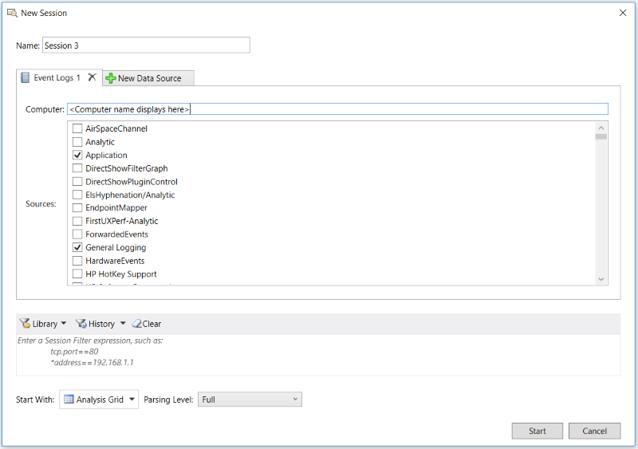

# Loading System Event Log Data

Message Analyzer enables you to load system event data that is typically displayed in the  **Microsoft Event Viewer**. The types of logs for which you can load data into Message Analyzer consist of **Applications and Services**, **Windows**, and others. To load data from a particular log, you simply select the log name on the **Event Logs** tab of the **New Session** dialog in the **Sources** list and then click the **Start** button to load the data into Message Analyzer. The interface from which you will work   to load Event Log data into Message Analyzer is shown in the figure that follows.  
  
   
  
 **Figure 34: Event Logs data retrieval interface**  
  
 After you load the data into the **Analysis Grid** viewer, you will typically see a row of data for each log entry, where the details of the log entry are contained in the **Summary** column of the **Analysis Grid**. If you select a row of data, you can view field names and values in the **Details** **Tool Window** below the **Analysis Grid** that correspond to the **Summary** column data. In addition, any diagnostic message that is  associated with the selected  entry is displayed in the **DiagnosisTypes** column of the **Analysis Grid** viewer for further examination.  
  
 To load data from a selected Event Log, perform the following procedure:  
  
> [!IMPORTANT]
>  Before you perform the following steps, ensure that the **Event Viewer Import** preview feature is selected on the **Features** tab of the **Options** dialog, which is accessible from the global Message Analyzer **Tools** menu. If not, select it and then restart Message Analyzer to enable the **Event Logs** option to appear in the **New Session** dialog under **Add Data Source**.  
  
### To load Event Log data into Message Analyzer  
  
1.  From the Message Analyzer **Start Page**, click the **New Session** button to display the **New Session** dialog.  
  
2.  Under **Add Data Source**, click the **Event Logs** button to display the **Event Logs** tab in the **New Session** dialog.  
  
3.  In the **Computer** text box, specify the name of the computer on which you wish to view **Event Logs**, which can be a remote or local computer. By default, the name of the local computer displays in this text box. Specify the computer name in the following format:  "*computerName*", without the quotes and without spaces.  
  
4.  In the **Sources** list, place a check mark in the check box to the left of the Event Log name for which you want to view data.  
  
5.  When you finish with the input configuration, click the **Start** button in the **New Session** dialog to begin loading data from the selected Event Log into Message Analyzer.  
  
> [!TIP]
>  You can also load system Event Log data into Message Analyzer from a \*.evtx or \*.xml file, if you save the former or export the latter from the **Microsoft Event Viewer**. In this case, you can load the data in these files through the **Add Files** feature in a Data Retrieval Session and examine the results in a chosen data viewer, which is typically the **Analysis Grid** viewer.