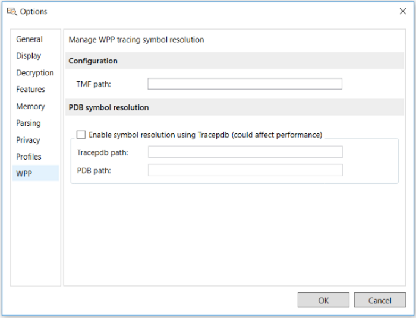

# Loading WPP-Generated Events

Message Analyzer supports parsing and display of Windows software trace preprocessor (WPP)-generated events. Because these events make use of the ETW framework, Message Analyzer can capture them live or load them from a saved event trace log (ETL) file that is created by a system tool such as Logman or Netsh.  
  
 WPP is typically used by developers who want to generate events in their code for troubleshooting purposes.  To do this, a developer embeds a simple function in code that, when executed, generates an ETW event. Unlike an ETW provider that relies upon a manifest to generate structured events for an ETW consumer, events generated by WPP are not defined by a manifest, but rather by a format contained in a PDB file, TMF file, configuration file, or a symbol server. Message Analyzer currently supports the first three of these.  
  
## Parsing WPP-Generated Events  

 To enable parsing of WPP-generated events, users must provide one of the following files to define the WPP event structure:  
  
-   **Program data base (PDB) file** — a symbol file for a trace provider that contains instructions for parsing and formatting  the provider  events. Unless you use the **Options** dialog method described in [Specifying the Event Structure File Location](loading-wpp-generated-events.md#BKMK_SpecifyEventStructureFileLoc) to specify the path to your PDB file, then you must manually place the PDB file in the same directory as the ETL file, as described in [Manually Locating a Directory](loading-wpp-generated-events.md#BKMK_ManuallyLocateDirectory). In addition, the PDB file must also have a name that is identical to the ETL file name, so that Message Analyzer can find the event structure information for parsing.  
  
-   **Trace message format (TMF) file** — a structured text file that contains instructions for parsing and formatting the events  generated by a  trace provider. Unless you use an XML configuration file or the **Options** dialog method described in [Specifying the Event Structure File Location](loading-wpp-generated-events.md#BKMK_SpecifyEventStructureFileLoc) to specify the path to your TMF file, then you must manually place the TMF file in the same directory as the ETL file, as described in [Manually Locating a Directory](loading-wpp-generated-events.md#BKMK_ManuallyLocateDirectory). In addition, the TMF file must also have a name that is identical to the ETL file name so that Message Analyzer can find the event structure information for parsing.  
  
-   **Configuration (.config) file** — an XML configuration file that enables you to create a store of one or more TMF files that parse events  generated by different trace providers. The XML wpp.config file provides a \<share&#124;drive:> tag where you enter a share or drive location that contains one or more TMF files with event structure information, as indicated in [Specifying the Event Structure File Location](loading-wpp-generated-events.md#BKMK_SpecifyEventStructureFileLoc). Note that by using a configuration file, you can avoid the task of renaming TMF files, as described in the previous  bullet point.  
  
> [!NOTE]
>  If you only have a PDB file, you can use features on the **WPP** tab of the **Options** dialog  to automatically convert it to TMF. If you  want to use the XML configuration file to point to a share containing event structure information, you can use the command-line tool *Tracepdb* to manually convert the PDB file to a TMF file for use with the configuration file. Tracepdb.exe creates a trace message format (.tmf) file by extracting event formatting instructions from a PDB symbol file for a trace provider that used WPP software tracing macros. See [Creating an XML Configuration File](loading-wpp-generated-events.md#BKMK_CreateXMLClonfigFile) for further details.  
  
 The section that follows describes the methods you can use to specify the location of PDB and TMF files that contain event structure information for parsing a WPP-generated ETL file.  
  
<a name="BKMK_SpecifyEventStructureFileLoc"></a>   
## Specifying the Event Structure File Location  
 There are three different ways that you can specify the location of  PDB and TMF files, the first of which is the easiest and overrides the others:  
  
-   **Use the Message Analyzer Options dialog** — specify the path to PDB and TMF files on the **WPP** tab of the **Options** dialog, as described in [Using the Options Dialog](loading-wpp-generated-events.md#BKMK_UsingOptionsDlg).  
  
-   **Manually locate a directory** — place a PDB or TMF event structure file in a specific directory location, as described in [Manually Locating a Directory](loading-wpp-generated-events.md#BKMK_ManuallyLocateDirectory).  
  
-   **Create an XML configuration file** — specify the share path to one or more TMF files in an XML configuration file that you create with specified XML code, as described in [Creating an XML Configuration File](loading-wpp-generated-events.md#BKMK_CreateXMLClonfigFile).  
  
<a name="BKMK_UsingOptionsDlg"></a>   
### Using the Options Dialog  
 The **Options** dialog now provides   a dedicated UI feature  on the **WPP** tab that  manages WPP tracing symbol resolution. You can specify the path to a TMF file in the dialog and Message Analyzer will automatically reference such a file for the event structure required to parse a WPP-generated ETL file. In addition, if you only have a PDB file, you can specify the path to that file and the path to the  command-line tool *Tracepdb.exe* on the **WPP** tab of the **Options** dialog and Message Analyzer will convert  the PDB file to TMF  for you.  
  
 You can display the **Options** dialog by clicking the global Message Analyzer **Tools** menu and the selecting the **Options** item. After displaying the **Options** dialog, click the **WPP** tab to use the features shown in the figure that follows:  
  
   
  
 **Figure 37: WPP tracing symbol resolution configuration**  
  
 The list that follows describes the indicated features.  
  
-   **Configuration** section  
  
    -   **TMF path** — in this text box, specify the path to one or more existing TMF files, with each entry separated by a colon. Message Analyzer will create an OPN description from the information in each file that you specify so that the WPP-generated ETL file/s can be parsed.  
  
-   **PDB symbol resolution** section  
  
     You must select the **Enable symbol resolution using Tracepdb** check box to enable the following text boxes for data entry. Use this option if you have only a PDB file generated from the  trace provider compilation or build process, in which case, Message Analyzer will convert the PDB file to TMF and  create an OPN description for parsing WPP-generated ETLs.  
  
    -   **Tracepdb path** — in this text box, specify the path to the command-line tool *Tracepdb* to convert an existing PDB file to TMF. If you have a 64-bit installation of Windows Driver Kit 8.1 or Visual Studio, the path to Tracepbd is as follows: `C:\Program Files (x86)\Windows Kits\8.1\bin\x64\tracepdb.exe`  
  
---  
  
**More Information**   
**To learn more** about *Tracepdb*, the commands that it provides, and download information, see [Tracepdb](https://msdn.microsoft.com/en-us/library/windows/hardware/ff553034(v=vs.85).aspx).  

---  
  
-   **PDB path** — in this text box, specify the path to the PDB file that contains the event structure you want to convert to TMF for parsing a WPP-generated ETL file. Note that you can add multiple PDB paths in this text box if you have multiple ETL files to parse, but you must separate each path with a colon.  
  
For each PDB file that you specify, Message Analyzer generates and compiles an OPN description for parsing associated WPP-generated ETL files when loaded through a Data Retrieval Session.  
  
 When you click the **OK** button to exit the **Options** dialog, the WPP configuration immediately takes effect; however, OPN descriptions are created dynamically as described in [Generating an OPN Description for PDB and TMF Files](loading-wpp-generated-events.md#BKMK_GenerateOPNs).  
  
<a name="BKMK_ManuallyLocateDirectory"></a>   
### Manually Locating a Directory  
 To manually locate a directory for  a PDB or TMF file and to make the file discoverable, you will need to do the following:  
  
-   Place the PDB or TMF file   in the same directory as the target ETL file.  
  
-   Name the PDB or TMF file to match the name of the target ETL file.  
  
     For example, if the name of your WPP-generated ETL file is events.etl, then your event definition file must be named events.pdb or events.tmf, as appropriate.  
  
 Message Analyzer will then be able to locate the appropriate directory location, given that it will know the directory from where you open the ETL file;   it will also find the appropriate event definition file by matching the GUID in the ETL file with that of the PDB or TMF file that you are using.  
  
<a name="BKMK_CreateXMLClonfigFile"></a>   
### Creating an XML Configuration File  
 You have the option to create a wpp.config file that specifies the path to one or more TMF files. You might want to use such a configuration file if you need to store multiple files that contain event structure information for parsing the events that were written by several different trace providers, or you might have multiple versions of the same TMF file for test purposes. The configuration file must contain the following XML:  

```XML
<?xml version="1.0" encoding="utf-8"?>  
<root>  
<tmf>  
<storeLocation>  
<share|drive:>\events\wpp\WppTest\tmffile1  
<share|drive:>\events\wpp\WppTest\tmffile2  
  . . .  
</storeLocation>  
  
<versionMapping>  
<startWith>6.0</startWith>  
<folder>Vista</folder>  
</versionMapping>  
  
<versionMapping>  
<startWith>6.1</startWith>  
<folder>Windows7</folder>  
</versionMapping>  
  
<versionMapping>  
<startWith>6.2</startWith>  
<folder>Windows8</folder>  
</versionMapping>  
</tmf>  
</root>  
```  
  
 When using the wpp.config file, you must specify the directory location for all TMF files under the \<store location/> tag in the XML above by using the \<share&#124;drive:> tag, rather than specifying PDB files, which are not supported in this configuration. If you only have a PDB file, you can use the command-line tool *Tracepdb* to convert the PDB file to a TMF file, as previously described. When this is the case, you should specify the TMFDirectory output  path from the *Tracepdb* tool in the \<share &#124; drive:> tag of the XML code above.  
  
 Note that the \<store location/> tag allows you to specify multiple TMF file versions, as shown in the code example above. Thereafter, you must place the wpp.config file in the following directory location. Note that you will need to create the “WppConfiguration” directory: `%localappdata%\Microsoft\MessageAnalyzer\OPNAndConfiguration\WppConfiguration\`  
  
> [!NOTE]
>  When you place your wpp.config file in this location, Message Analyzer will automatically search the store location to match the GUID of the appropriate TMF file  with that of the ETL file you are attempting to parse.  
  
## Obtaining PDB and TMF Files  

 Depending on the tools you are using to log and display formatted trace events, you might be using either a TMF or PDB symbol file to store formatting information. Some tools require one or the other, while others can use either to extract the required formatting information.  
  
 A PDB symbol file for a WPP trace provider contains instructions for parsing and formatting events that are generated by the provider. Because these instructions are part of the trace provider source code, the WPP preprocessor can extract them from the code and add them to a PDB symbol file during compilation of a debug version of the trace provider or during the provider build process.  
  
 A TMF file for a WPP trace provider is a structured text file that also contains instructions for parsing and formatting events that are generated by the provider. A TMF file can be automatically generated by the trace provider build process. However, if for some reason you do not have a TMF file for your trace provider, you can generate one with the tool *Tracepdb*, as previously indicated, which extracts the formatting instructions from a PDB symbol file and then creates a TMF file to store them. You can perform this task manually at the command line, or you can direct Message Analyzer to do it by making use of the configuration in the **WPP** tab of the **Options** dialog, as described earlier.  
  
<a name="BKMK_GenerateOPNs"></a>   
## Generating an OPN Description for PDB and TMF Files  
 The WPP feature is enabled by default in Message Analyzer. When some component or trace provider code generates one or more ETW events from WPP, the events can be written to an .etl file by a system tool such as Logman or Windows Performance Monitor. The format that defines how to parse the events in the .etl file is stored in the previously mentioned PDB or TMF files. Message Analyzer uses an ETW adapter extension known as the WPP Import Adapter to process the events in an .etl file when you load one through a Data Retrieval Session or when you capture events in a Live Trace Session. However, before Message Analyzer can actually parse the event data, the WPP Import Adapter must generate an OPN description.  
  
 To enable Message Analyzer to parse WPP events, an OPN module needs to be generated so that the OPN description required to parse the WPP events can be compiled to the protocol object model (POM) in the PEF architecture and made accessible to PEF Runtime processing.  The WPP Import Adapter dynamically generates the OPN module for the WPP trace provider and dynamically inserts WPP entry parameters as annotations in the individual WPP-generated events by locating such parameters in the PDB or TMF files.  
  
## Capturing WPP-Generated Events Live with Message Analyzer  

 For developers who want to use Message Analyzer to capture WPP-generated events live, you can do so if you have a corresponding managed object format (MOF) provider that is registered on your system. If it is registered, then Message Analyzer should expose the WPP/MOF provider in the **Available System Providers** list in the **Add System Providers** dialog. This dialog  displays when you click **Add System Providers** in the **Add Providers** drop-down list on the toolbar of the **New Session** dialog during Live Trace Session configuration.  You can then select the provider and run a trace to capture the events that are generated by the WPP/MOF-based trace provider. If the MOF provider is not registered on your system and you have the MOF file, you can manually register it by using the MOF compiler [mofcomp](http://go.microsoft.com/fwlink/?LinkId=523813).  
  
---  
  
 **More Information**   
 **To learn more** about WPP, see [WPP Software Tracing](http://go.microsoft.com/fwlink/?LinkId=213198).  
**To learn more** about PDB files, see [PDB Symbol Files](http://go.microsoft.com/fwlink/?LinkId=523820).  
**To learn more** about TMF files, see [Trace Message Format Files](http://go.microsoft.com/fwlink/?LinkId=523821).   

---