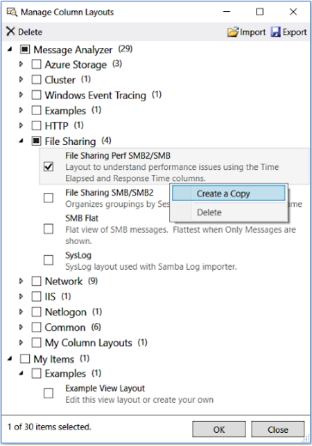

# Managing User Libraries

Message Analyzer enables you to manage any user Library by using a common and centralized set of management features. These features consist of commands and configuration settings that are available from user Library drop-down lists and from the common **Manage** ***\<AssetType>*** dialog that is accessible from such drop-down lists and other locations.  
  
 You can use the Library drop-down lists to do the following:  
  
-   Apply the functionality of asset collection Library items to select specific information when loading data through a Data Retrieval Session or while capturing data in a Live Trace Session.  
  
-   Apply Library items to a set of trace results in an Analysis Session to manipulate your message data, so you can achieve a focused analytical perspective.  
  
-   Work with example items.  
  
-   Create new asset collection Library items.  
  
-   Execute the commands that are specified in the table of this section for items in the indicated user Libraries.  
  
-   Open the **Manage** ***\<AssetType>*** dialog to access additional management functions, such as the **Export** and **Import** commands.  
  
You can use the **Manage** ***\<AssetType>*** dialog to import and export selected asset collection Library items from and to a user file share or other location, respectively, for mutually sharing Library items with others. In addition, the **Manage** ***\<AssetType>*** dialog also enables you to perform other operations, for example, modifying and deleting existing items in certain categories.  
  
## Centrally Managing User Libraries  

 The central locations from where you can manage the items in any asset collection Library and the specific commands that are available from these locations are described in this section. The list that follows describes the management locations and indicates how to access commands:  
  
-   **Library drop-down list** — from the drop-down list of a Library, you can access a right-click context menu that provides different sets of commands, depending on whether you right-click an item in the default **Message Analyzer** category or an item in the **My Items** category of an asset collection Library. The available context menu commands are described ahead.  
  
-   **Manage**  ***\<AssetType>***  dialog — from this dialog, which is common to all asset collection Libraries, toolbar commands are available for importing and exporting items in any category from and to a file share or other location. Other commands that you can access from this dialog are described ahead.  
  
An example of the management dialog is shown in the figure that follows, which in this case is the **Manage Column Layouts** dialog that provides various column **Layouts** that you can select for the **Analysis Grid** viewer. Note that the right-click context menu commands for the **File Sharing Perf SMB2/SMB** view **Layout** are displayed in the figure.  
  
  
  
**Figure 71: Manage Column Layouts dialog**  
  
The management features and context menu commands that are available in the user Library drop-down lists for Message Analyzer asset collection Libraries are described in the table that follows. Note that the available context menu commands specified in this table are also accessible from the **Manage** ***\<AssetType>*** dialog for corresponding user Libraries, but in some cases with the exception of the **Favorites** command.  
  
### Table 27. Asset Collection Library Drop-Down Management Features  
  
|Asset Collection Library Name|Library Drop-Down List (Y/N)|Management Entities|Example Item (Y/N)|Available Context|Menu Commands|  
|-----------------------------------|---------------------------------------|-------------------------|---------------------------|-----------------------|-------------------|  
|||||**Message Analyzer** Library category commands|**My Items** Library category commands|  
|**Message Analyzer Filters**|Yes|**New Filter** and **Manage Filters** items; **Import** and **Export** commands For more information about creating new filters, see [Working with Session Filters in a Live Trace Session](working-with-session-filters-in-a-live-trace-session.md).|Yes|**Create a Copy**, **Delete**, **Favorite**|**Edit**, **Create a Copy**, **Delete**, **Favorite**|  
|**Message Analyzer Viewpoints**|Yes|**Manage Viewpoints** item; **Import** and **Export** commands  For more information about **Viewpoints**, see [Applying and Managing Viewpoints](applying-and-managing-viewpoints.md).|No|None|None|  
|**Message Analyzer Color Rules**|Yes|**New Color Rule** and **Manage Color Rules** items; **Import** and **Export** commands For more information about creating **Color Rules**, see [Using and Managing Color Rules](using-and-managing-color-rules.md).|Yes|**Create a Copy**|**Edit**, **Create a Copy**, **Delete**|  
|**Message Analyzer View Layouts**|Yes|**Save Current Layout As..**, **Save Current as Default User Layout**, **Load Default User Layout**, **Restore Application Default Layout**, and **Manage Layout**  items; **Import** and **Export** commands  For more information about saving and restoring **Analysis Grid View Layouts**, see [Applying and Managing Analysis Grid Viewer Layouts](applying-and-managing-analysis-grid-viewer-layouts.md).|Yes|**Create a Copy**, **Favorite**|**Edit**, **Create a Copy**, **Favorite**, **Delete**|  
|**Message Analyzer Grouping View Layouts**|Yes|**Save Current Layout As..**, **Save Current as Default User Layout**, **Load Default User Layout**, **Restore Application Default Layout**, and **Manage Layout** items; **Import** and **Export** commands  For more information about saving and restoring **Grouping View Layouts**, see [Managing Grouping View Layouts](grouping-viewer.md#BKMK_ManageGroupViewLayouts).|No|**Create a Copy**, **Favorite**|**Edit**, **Create a Copy**, **Favorite**, **Delete**|  
|**Message Analyzer Pattern Expressions**|Yes|**Create Pattern** and **Manage Pattern Expressions** items; **Import** and **Export** commands  For more information about creating **Pattern Expressions**, see the [Pattern Match Viewer](pattern-match-viewer.md) topic.|Yes|**Create a Copy**|**Edit, Create a Copy, Delete**|  
|**Message Analyzer Correlations**|Yes|**New Union**, and **Manage Unions** items; **Import** and **Export** commands For more information about **Unions**, see [Configuring and Managing Message Analyzer Unions](configuring-and-managing-message-analyzer-unions.md).|No|**Create a Copy**|**Edit**, **Create a Copy**, **Delete**|  
|**Message Analyzer Chart View Layouts**|Yes|**Save Current Layout As..**, **Save Current as Default User Layout**, **Load Default User Layout**, **Restore Application Default Layout**, **Manage Layouts**, **Edit**; **Import** and **Export** commands For more information on how to manage charts, see [Managing Chart Viewer Layouts](managing-chart-viewer-layouts.md).|No|**Create a Copy**|**Edit**, **Create a Copy**, **Favorite**, **Delete**|  
|**Message Analyzer Trace Scenarios**|Yes|**Manage Trace Scenarios**;  **Import** and **Export** commands For more information on how to  manage trace scenarios, see [Managing Trace Scenarios](managing-trace-scenarios.md).|No|**Create a Copy**, **Favorite**|**Edit**, **Create a Copy**, **Favorite**, **Delete**|  
|**Message Analyzer Parsing Levels**|Yes|None|No|None|None|  
|**Message Analyzer Window Layouts**|Yes|None|No|None|None|  
|**Aliases**|Yes|**Create Alias for \<field> ...**, an **Analysis Grid** context menu item, the **Manage Aliases** item; **Import** and **Export** commands For more information about **Aliases**, see [Using and Managing Message Analyzer Aliases](using-and-managing-message-analyzer-aliases.md).   **Note:** The **Aliases** Library is not a collection that is updated by Microsoft, given that you typically customize aliases to your own environment.|No|None|**Edit**, **Create a Copy**, **Delete**|  
  
## Exporting and Importing Library Items  

 In addition to the available commands specified in the previous table, the **Manage** ***\<AssetType>*** dialog also enables you to perform the following operations:  
  
-   **Export Library items** — the **Manage** ***\<AssetType>*** dialog enables you to create an export configuration by choosing the items you want to include in the export. For example, you can select individual items or all items in subcategories such as **Network** and **Examples** or you can select all items in either or both top-level categories such as **Message Analyzer** or **My Items**, to comprise the export configuration. After you decide which items in an asset collection Library you want to export, click the **Export** button in the **Manage** ***\<AssetType>*** dialog to display the **Save Library** dialog, which enables you to specify the following information:  
  
    -   **Title** — specify a title for the Library items you are exporting.  
  
    -   **Description** — optionally specify a description for the Library items you are exporting.  
  
    -   **Author**— optionally specify the author of the Library items you are exporting.  
  
    -   **Organization** — optionally specify the name of your organization.  
  
 When you finish specifying the **Save Library** dialog information, click **Save** to display the **Select Library Location** dialog from where you can save your export items as a *.asset file, with a file name of your choice, to a designated location such as a file share. Other team members can then access your saved collection and import it to the appropriate Library for use in their own Message Analyzer installations.  
  
-   **Import Library items** — the **Manage** ***\<AssetType>*** dialog enables you to specify the items you want to import from a designated location by selecting the ones you want from the **Select Library to Open...** dialog. This dialog displays when you click the **Import** button in the **Manage** ***\<AssetType>*** dialog. The **Select Library to Open…** dialog enables you to navigate to the share or other location that contains a collection of items that you want to import to an appropriate asset collection Library in your Message Analyzer installation. After you select the \*.asset file you want to import and click **OK**, the **Select Items to Import** dialog displays from where you can specify the following:  
  
    -   **Select the items you want to import** — Message Analyzer automatically locates the appropriate Library in which to import selected items, based on the type of \*.asset file you specified in the **Select Library to Open…** dialog, for example, a **My_Filters.asset** file for the **Message Analyzer Filters** asset collection Library. You can choose which items to import by selecting the check boxes for the items and/or categories you want.  
  
    -   **Choose the Library category for the imported items** — you can choose to place imported items into the existing categories by accepting the default **Use Existing Categories** option in the **Select Items to Import** dialog, or you can optionally deselect this check box and select the category from the **Add to Category** drop-down list. After you are finished with specifying the import configuration and you click **OK**, the **Manage** ***\<AssetType>*** dialog appears with the selected items imported into the Library category that you specified.  
  
    > [!NOTE]
    >  You are advised to not use the **Import** feature to retrieve asset collection items from a user-configured subscriber feed that is part of the Message Analyzer Sharing Infrastructure, as duplicates are not overwritten, but rather to obtain them by performing a download or auto-sync operation from the Message Analyzer **Asset Manager** dialog, as described in [Managing Asset Collection Downloads and Updates](managing-asset-collection-downloads-and-updates.md).  
  
## Expanding User Libraries  

 There are four ways to add items to an asset collection Library, as follows:  
  
-   Create new items such as **Session Filters**, **Color Rules**, **Pattern Expressions**, **Aliases**, **Chart** viewer **Layouts**, and **Trace Scenarios**, or configure and save a new **Layout** for the **Analysis Grid** or **Grouping** viewer. After you create a new item, you can specify the Library category in which to place it.  
  
-   Modify an existing item and save it in the current user Library for that item.  
  
-   Import one or more items or asset collections from a user file share or other designated location.  
  
-   Download asset collections and updates from Microsoft when they are available.  
  
> [!NOTE]
>  When you are using the common **Manage** ***\<AssetType>*** dialog to **Export** asset collection Library items, several commands are available that you can utilize before you **Export**. Be aware that any changes that you make to an asset collection item are saved in the Library as soon as you make them. You can access these commands by right-clicking a Library item to select one of them, which can include those in the list below. Note that all of the commands in the list that follows are available only when you are selecting an item in the **My Items** category of an asset collection Library. For most other Libraries, only the **Create a Copy** and/or **Favorite** commands are available outside this category:  
  
-   **Edit**  
  
-   **Create a Copy**  
  
-   **Favorite**  
  
-   **Delete**  
  
See the **Available Context Menu Commands** column in the previous table to review the commands that are available in the Library categories for each asset collection.  
  
---  
  
**More Information**   
**To learn more** about how to manage downloads and updates for asset collection Libraries, see [Managing Asset Collection Downloads and Updates](managing-asset-collection-downloads-and-updates.md).   

---  
  
## See Also  

[User Libraries](user-libraries.md)