# Message Analyzer Tutorial
This section begins with some background concepts about Microsoft Message Analyzer and then goes into several mini-tutorials or [Getting Started Primers](message-analyzer-tutorial.md#BKMK_Primers) that will help you get started with using this unique tool. Links are provided throughout so that you can navigate to more information about the described features as needed.  
  
 ___________________\_  
  
 **Go To Procedures**   
To go directly to procedures that provide examples of using Message Analyzer, see the following topics:   
[Procedures: Quick Start](procedures-quick-start.md)  
[Procedures: Using the Network Tracing Features](procedures-using-the-network-tracing-features.md)  
[Procedures: Using the Data Retrieval Features](procedures-using-the-data-retrieval-features.md)  
[Procedures: Using the Data Viewing Features](procedures-using-the-data-viewing-features.md)  
[Procedures: Using the Data Filtering Features](procedures-using-the-data-filtering-features.md)  
[Procedures: Using the Asset Management Features](procedures-using-the-asset-management-features.md)  
[Procedures: Using the Chart Viewer Layout Configuration Features](Topic/Procedures:%20Using%20the%20Chart%20Viewer%20Layout%20Configuration%20Features.md)  
___________________\_  
  
 **Introduction**   
The overarching and new approach that Message Analyzer uses when capturing traffic is to limit network noise and to expose at top-level both the issues that occur at lower levels and hidden information that is critical to quick analysis. Message Analyzer does this by the following.  
  
-   Enabling you to remove lower-layer messages in a capture so you can focus on higher-layer data of interest.  
  
-   Displaying individual message summaries as well as  high-level overviews of trace statistics and trends.  
  
-   Exposing diagnostics data in top-level transactions.  
  
-   Creating top-level Operation nodes that encapsulate request and response messages for quick assessment of details, such as server response time.  
  
-   Locating message fragment reassemblies within the origins tree (stack messages) rather than in a dispersed chronological display.  
  
-   Enabling you to control the layer up to which Message Analyzer will parse, with the use of Parsing Levels.  
  
-   Enabling you to "select" specific data that you want to view through filtering.  
  
 In this manner, the important information that you need to see for any particular message is readily exposed at top-level in the **Analysis Grid** viewer, which is the main analysis surface that Message Analyzer provides.  
  
 Another significant feature that enables you to focus on messages of interest is **Viewpoints**, which display data from the perspective of a chosen protocol, module, or layer with no messages above it. For example, you could select a TCP **Viewpoint** and drive all TCP messages to top-level in the **Analysis Grid** to facilitate better analysis of TCP messages. This is in contrast to Message Analyzer's predecessor Network Monitor, which shows only flat or static message packets in original capture order and does not hide any noise, reassemble fragments, or simulate protocol behavior to allow for interpreting states and maintaining a protocol model, such as Message Analyzer does.  Moreover, Message Analyzer formalizes its parser definitions to enable more artifacts to be derived from them, such as test cases and documentation.  
  
 You will learn more about these features in the next few sections that provide an overview of  acquiring data through a Message Analyzer session and using various tools  to focus data capture and analysis on specific types of data. After these sections, you can review the [Getting Started Primers](message-analyzer-tutorial.md#BKMK_Primers).  
  
## Acquiring Data Through a Message Analyzer Session  
 Message Analyzer enables you to capture, display, and analyze protocol messaging traffic, and to trace and assess system events, Windows component events, and device messages. It also provides the capability to retrieve, aggregate, and analyze data from one or more saved traces, which includes support for the .etl, .cap, .pcap, .pcapng, .tsv/.csv, .evtx, and .log input file formats, in addition to Message Analyzer native files in the .matp or .matu format, as described in [Locating Supported Input Data File Types](locating-supported-input-data-file-types.md). If you work with text based .log files, Message Analyzer enables you to retrieve data from various common text .log file types with the use of built-in text log parsers that are described in [Parsing Input Text Log Files](message-analyzer-tutorial.md#BKMK_ParsingLogFiles). Also note that if you have a custom text .log file, an extensibility feature of the Microsoft Protocol Engineering Framework (PEF) enables Message Analyzer to retrieve its data with the use of a custom configuration file. However, you will need to create this file in order to fully parse your text log, as described in [Parsing Input Text Log Files](message-analyzer-tutorial.md#BKMK_ParsingLogFiles). Message Analyzer also enables you to extend the functionality of the **Chart** viewer by creating custom view **Layouts** of your own design, as described in [Extending Message Analyzer Data Viewing Capabilities](extending-message-analyzer-data-viewing-capabilities.md).  
  
 Message Analyzer makes use of two different types of sessions to acquire input data, as described in [Starting a Message Analyzer Session](starting-a-message-analyzer-session.md). These consist of a Live Trace Session and a Data Retrieval Session, which provide data from the live capture of network traffic, events, system messages, and device messages; and saved traces, logs, and text logs, respectively. In a Live Trace Session, PEF provider-drivers and/or other system ETW Providers listen for and capture protocol messages and events at various stack layers or from other components. The messages and events are passed to the PEF Runtime where they are decoded by Open Protocol Notation (OPN) parsers and then temporarily saved in a Message Store. To access and display these messages, Message Analyzer consumes the PEF Runtime data, as described in the [PEF Architecture Tutorial](pef-architecture-tutorial.md). Messages are displayed by default in the **Analysis Grid** viewer, where you can begin your data analysis process; however, other data viewers and various **Tool Windows** are also available to streamline message analysis.  
  
 **Live Trace Session**   
In a Live Trace Session, you have the option to capture data from the local computer and/or multiple remote computers in concurrent subsessions that return all data to the common initiating live session that you configure with a chosen data viewer. Moreover, the local computer is the default host on which a Live Trace Session captures data; however, if you specify valid connection/authentication credentials for other remote computers, you can capture data simultaneously on those computers as well. Message Analyzer also provides you with the flexibility to run multiple concurrent Live Trace Sessions, optionally with each having different message provider and filtering configurations, to target different computers. You can do this by simply adding one or more **Live Trace** data sources in the **New Session** dialog, specifying the hosts from which to capture the data, and selecting or creating **Session Filters**, as described in [Configuring Session Scenarios with Selected Data Sources](configuring-session-scenarios-with-selected-data-sources.md).  
  
> [!TIP]
>  **Quick Tracing** — to get started very quickly with a Live Trace Session, you can make use of **Start Page** features that enable you to start a new Local trace session at Link Layer or begin the configuration phase for a new session—with a single click—as described in [Quick Session Startup](quick-session-startup.md).  
  
 ___________________\_  
  
 **More Information**   
 **To learn more** about configuring a Live Trace Session, see [Capturing Message Data](capturing-message-data.md).   
___________________\_  
  
 **Data Retrieval Session**   
In a Data Retrieval Session, Message Analyzer enables you to retrieve and aggregate saved message collections from multiple sources, including traces and logs, in any combination. This means you can mix and merge data from any of these sources and display it in the **Analysis Grid** or other selected data viewer. If you know that certain events of interest have occurred at a particular time in a collection of data sources, you can configure a **Time Filter** to view data in a window of time that you specify to eliminate extraneous data and improve performance. You can also set **Time Shifts** to accommodate for different time zones or skewed machine times across different data sources. You might also select a built-in **Session Filter** or configure one of your own design to return specific data that is based on the filtering criteria that you specify, while at the same time further improving performance.  
  
 **Special Input Sources**  Message Analyzer also provides access to special input sources such as Azure Storage Tables, Azure Storage Blobs, Event Logs, SQL databases, and Operations Management Suite (OMS) logs. It also provides an interface from where you can write PowerShell queries. For access to most of these input sources, you will need authentication credentials. The user interface for all of these input sources is located in the **New Session** dialog, which is accessible from the **Start Page** by clicking the **New Session** button.  
  
 Message Analyzer also provides a set of built-in parsers for common text logs such as Cluster, Netlogon, IIS, and so on. In addition, if you have a proprietary text log with a unique format, you have the option to create an OPN configuration file   which enables Message Analyzer to parse the data in your log file, as described in [Parsing Input Text Log Files](message-analyzer-tutorial.md#BKMK_ParsingLogFiles).  
  
 ___________________\_  
  
 **More Information**   
 **To learn more** about configuring a Data Retrieval Session, see [Retrieving Message Data](retrieving-message-data.md).   
**To learn more** about accessing data from the previously mentioned special input sources, see [Acquiring Data From Other Input Sources](acquiring-data-from-other-input-sources.md).  
___________________\_  
  
## Focused Tracing and Analysis  
 Although Message Analyzer enables you to capture messages from many system components, the PEF providers used by Message Analyzer enable you to capture data at several different layers, which provide unique inspection points into the protocol stack. For example, by specifying any  **Trace Scenario** that uses the **Microsoft-PEF-WFP-MessageProvider**, you can focus on capturing messages above the IP/Network Layer by filtering out lower-level Link Layer messages through the Windows Filtering Platform (WFP), upon which the **Microsoft-PEF-WFP-MessageProvider** is based. Moreover, by specifying any **Trace Scenario** that uses the **Microsoft-PEF-NDIS-PacketCapture** or **Microsoft-Windows-NDIS-PacketCapture** provider, you can capture messages at Link Layer and above. Message Analyzer also enables you to temporarily set a predefined **Viewpoint** that filters, reorganizes, and redisplays the data from the perspective of a selected protocol or module type, such as HTTP, TCP, SMB, or ETW, so that you can focus on specific message traffic that is defined by the **Viewpoint**, while removing all messages above the **Viewpoint** level to create a focused set of messages.  
  
 You can also select a predefined **Parsing Level** that controls the stack level to which Message Analyzer parses, while passing certain messages in these scenarios that are useful to your data analysis perspective, as described in [Setting the Session Parsing Level](setting-the-session-parsing-level.md). In addition, you can make use of **Aliases**, as described in [Using and Managing Message Analyzer Aliases](using-and-managing-message-analyzer-aliases.md), to configure user-friendly names for cryptic field values; and you can take advantage of the **Unions** feature, described in [Configuring and Managing Message Analyzer Unions](configuring-and-managing-message-analyzer-unions.md), to correlate differently named fields that are of the same type in different data sources. You can even capture and analyze loopback traffic for local application communications that use the IPv4 or IPv6 loopback addresses, by specifying the **Loopback and Unencrypted IPSEC** or **Local Loopback Network** **Trace Scenario**, as described in [Built-In Trace Scenarios](built-in-trace-scenarios.md).  
  
 You also have the option to *select* specific data that you want to isolate for focused analysis by making use of any of the following:  
  
-   **Fast Filter** — a provider/driver-level filter that is very fast and efficient, as described in [PEF-NDIS Fast Filters](pef-ndis-fast-filters.md).  
  
-   **Keyword Filter** — returns only the events from an ETW Provider that are defined by one or more  designated event **Keywords**, as described in [System ETW Provider Event Keyword/Level Settings](system-etw-provider-event-keyword-level-settings.md).  
  
-   **Session Filter** — creates a focused set of trace results that is determined by filtering criteria, as described in [Working with Session Filters in a Live Trace Session](working-with-session-filters-in-a-live-trace-session.md).  
  
-   **Time Filter** — creates a window of time in which to view data, as described in [Applying an Input Time Filter to a Data Retrieval Session](applying-an-input-time-filter-to-a-data-retrieval-session.md) and [Applying a Time Filter to Session Results](applying-a-time-filter-to-session-results.md).  
  
-   **View Filter** — when applied to a set of trace results, passes only the message data that meets the filtering criteria that you specify, as described in [Applying and Managing Filters](applying-and-managing-filters.md). Enables you to create a focused set of results during an Analysis Session.  
  
 Furthermore, Message Analyzer enables you to decrypt data that is encrypted with the Transport Layer Security (TLS) and Secure Sockets Layer (SSL) protocols, for example Remote Desktop Protocol (RDP) and HTTPS messages, respectively. The **Decryption** feature also provides a **Decryption** **Tool Window** that presents summary and statistical data for the decryption session to facilitate  analysis, as described in [Decrypting TLS and SSL Encrypted Data](decrypting-tls-and-ssl-encrypted-data.md).  
  
 These capabilities solve many inherent capture, data display, and analysis problems, such as the visibility of encrypted data, assessment of loopback traffic that is enabled by the **Local Loopback Network** scenario, and seeing traffic from the **Viewpoint** of a protocol. The underlying technologies that support Message Analyzer also machine-validate message structure and values, behavior, and architecture based on protocol specifications; and if errors occur, they are surfaced very quickly to top-level as Diagnosis messages. To this end, Message Analyzer also provides a **Diagnostics** **Tool Window** that summarizes all the Diagnostic messages in a trace, which interactively drives selection of corresponding messages in the **Analysis Grid** viewer to facilitate further review of message **Details**, **Message Stack** information, and **Message Data**.  
  
> [!NOTE]
>  Message Analyzer is also an effective tool for testing and verifying protocol implementations. See the [Open Specifications](http://go.microsoft.com/fwlink/?LinkId=246356) documentation library for more information about protocol technical specifications.  
  
   
## Getting Started Primers  
 The sections that follow provide brief conceptual tutorials that serve as getting started primers for Message Analyzer functionality. These tutorials correspond to the major tasks that you perform from the Message Analyzer user interface, where you can:  
  
 _______________________\_  
  
 [Capture Message Data](message-analyzer-tutorial.md#BKMK_CapturingMessageData)   
 [Retrieve Message Data](message-analyzer-tutorial.md#BKMK_LoadingMessageData)   
 [Edit Message Data](message-analyzer-tutorial.md#BKMK_EditSessionData)   
 [View Message Data](message-analyzer-tutorial.md#BKMK_ViewingMessageData)   
 [Filter Message Data](message-analyzer-tutorial.md#BKMK_FilteringMessageData)   
 [Analyze Message Data](message-analyzer-tutorial.md#BKMK_AnalyzingMessageData)   
 [Save Message Data](message-analyzer-tutorial.md#BKMK_SavingMessageData)   
_______________________\_  
  
   
## Capture Message Data  
 When capturing data live, Message Analyzer makes use of various message providers that focus on different layers or types of data. These providers are included in every Message Analyzer installation and consist of common Microsoft-PEF providers, the Microsoft-Windows-NDIS-PacketCapture provider, and various ETW Providers that are registered on the Windows system by default. These providers are briefly described in "Common Message Providers Used by Message Analyzer", which follows. Thereafter, this section describes how to configure and start  a Live Trace Session; provides examples of the Message Analyzer global options you can set;  describes how Message Analyzer integrates event tracing into the capture process; how to optimize ETW sessions; and how Message Analyzer parses  messages from MOF-based system ETW providers. The subject matter is discussed in the following topics.  
  
 ________________________________\_  
  
 [Configuring a Live Trace Session](message-analyzer-tutorial.md#BKMK_ConfigLiveTraceSession)   
 [Starting a Live Trace Session](message-analyzer-tutorial.md#BKMK_StartLiveTraceSession)   
 [Setting Message Analyzer Global Options](message-analyzer-tutorial.md#BKMK_GlobalOptions)   
 [Protocol Modules and Specifications](message-analyzer-tutorial.md#BKMK_protoModules)   
 [Integrating Event Tracing](message-analyzer-tutorial.md#BKMK_EventTraces)   
 [Optimizing ETW Session Performance](message-analyzer-tutorial.md#BKMK_OptimizeETWSessionPerf)   
 [Using MOF-Based ETW Providers](message-analyzer-tutorial.md#BKMK_MOFProviders)   
________________________________\_  
  
 **Common Message Providers Used by Message Analyzer**   
The following message providers are included in Message Analyzer **Trace Scenarios**, which contain either one of these providers as the exclusive data source or a combination of several providers, depending on the scenario requirements.  
  
-   **Common Microsoft PEF Message Provider-Drivers** — all PEF drivers are instrumented with Event Tracing for Windows (ETW) provider technology, which enables them to take advantage of the ETW event tracing, buffering, logging, and event delivery infrastructure. In addition to numerous system ETW providers and other message capture components, all Message Analyzer installations contain the PEF provider-drivers in the list that follows, the configurations for which are accessible after you select a **Trace Scenario** from the **Select Scenario** drop-down list on the **Live Trace** tab of the **New Session** dialog for a Live Trace Session.  
  
    > [!IMPORTANT]
    >  Some of the message providers described in this section may be different than what you find on your computer, because of an operating system version dependency. For example, on computers running the Windows 7, Windows 8, or Windows Server 2012 operating system, the **Microsoft-Windows-NDIS-PacketCapture** provider does not exist for the **Local Network Interfaces** **Trace Scenario**. Instead, the **Microsoft-PEF-NDIS-PacketCapture** provider is included in the **Local Network Interfaces** scenario on those computers. On computers running the Windows 8.1, Windows Server 2012 R2, and Windows 10 operating systems, the **Microsoft-Windows-NDIS-PacketCapture** provider is installed as part of the operating system and is used in the **Local Network Interfaces**, **Remote Network Interfaces**, and other **Trace Scenarios**.  
  
    -   **Microsoft-PEF-NDIS-PacketCapture** provider — an ETW-instrumented, Network Data Interface Specification (NDIS) light weight filter (LWF) driver that captures Ethernet frames at the Link Layer and delivers them to Message Analyzer through the ETW infrastructure. Also includes the capability to configure **Fast Filters** that operate efficiently at the driver-level to isolate specific message types, thereby passing less data and reducing system loads and resource consumption.  
  
         ___________________\_  
  
         **More Information**   
         **To learn more** about the **Microsoft-PEF-NDIS-PacketCapture** provider, see [Microsoft-PEF-NDIS-PacketCapture Provider](microsoft-pef-ndis-packetcapture-provider.md).   
        ___________________\_  
  
    -   **Microsoft-PEF-WFP-MessageProvider** — an ETW-instrumented driver that is based on the Windows Filtering Platform (WFP). It captures message traffic above the IP/Network Layer and delivers that traffic to Message Analyzer through the ETW infrastructure. This provider also enables you to configure **Fast Filters** to isolate specific messages of interest and improve trace performance. This provider is now enabled for remote capabilities when capturing data on remote Windows 10 computers only. In addition, you can set the **Select Discarded Packet Events** option when configuring this provider to log discarded packets.  
  
         ___________________\_  
  
         **More Information**   
         **To learn more** about the **Microsoft-PEF-WFP-MessageProvider**, see [Microsoft-PEF-WFP-MessageProvider](microsoft-pef-wfp-messageprovider.md).   
        ___________________\_  
  
    -   **Microsoft-PEF-WebProxy** — an ETW-instrumented provider that uses the Fiddler API and acts as an HTTP proxy to intercept and capture all HTTP traffic to and from a client web browser in unencrypted format. Also provides the capability to configure driver-level **Hostname** and **Port** filters to isolate specific messages and improve performance.  
  
         ___________________\_  
  
         **More Information**   
         **To learn more** about the **Microsoft-PEF-WebProxy** provider, see [Microsoft-PEF-WebProxy Provider](microsoft-pef-webproxy-provider.md).   
        ___________________\_  
  
-   **Microsoft-Windows-NDIS-PacketCapture** provider — an ETW-instrumented provider that has remote capabilities along with special NDIS stack and Hyper-V-Switch extension layer filtering, adapter configurations, packet traversal path directivity, and other filters and specifiers that you can configure.  
  
    > [!NOTE]
    >  The **Microsoft-Windows-NDIS-PacketCapture** provider with remote capabilities is used on the Windows 8.1, Windows Server 2012 R2, and Windows 10 operating system only, as described in [Built-In Trace Scenarios](built-in-trace-scenarios.md).  
  
     ____________________  
  
     **More Information**   
     **To learn more** about the **Microsoft-Windows-NDIS-PacketCapture** provider, see [Microsoft-Windows-NDIS-PacketCapture Provider](microsoft-windows-ndis-packetcapture-provider.md).  
    **To learn more** about capturing messages from one or more remote hosts and configuring the **Microsoft-Windows-NDIS-PacketCapture** provider, see [Configuring a Remote Capture](configuring-a-remote-capture.md).   
    ____________________  
  
-   **System ETW providers** — write events for various components on your system that have been instrumented as ETW event providers. This includes ETW providers that define their events with the use of the following:  
  
    -   Standard provider manifests, as described in [Event Manifest](etw-framework-conceptual-tutorial.md#BKMK_EventManifest).  
  
    -   Managed object format (MOF) schemas, as described in [Using MOF-Based ETW Providers](message-analyzer-tutorial.md#BKMK_MOFProviders).  
  
    -   Windows WPP-generated events that are issued by software components, as described in [Loading WPP-Generated Events](loading-wpp-generated-events.md).  
  
   
### Configuring a Live Trace Session  
 You can specify the message providers that you want to use to capture data from the network or other components by configuring a Live Trace Session, as shown in the figure that follows. In the figure, the **Microsoft-PEF-WFP-MessageProvider** appears in the list after selecting the **Loopback and Unencrypted IPSEC** **Trace Scenario** in the **Select Scenario** drop-down list on the **ETW Providers** toolbar in the **New Session** dialog. The **Windows-Firewall-Service** ETW Provider appears in the list after selecting this provider in the **Add System Providers** dialog that displays when you click the **Add Providers** drop-down list on the same toolbar and then select the **Add System Providers** item.  
  
 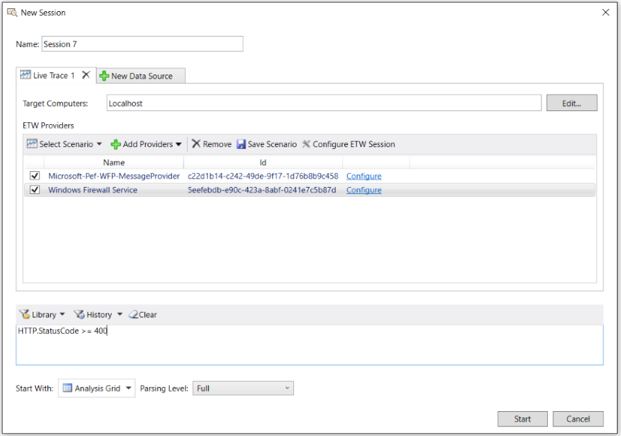  
  
 **Figure 2: Message Analyzer Live Trace Session configuration**  
  
 Predefined provider configurations are contained in all the built-in **Trace Scenarios** that you can select from the **Select Scenario** drop-down list on the **ETW Providers** toolbar on the **Live Trace** tab of the **New Session** dialog. These **Trace Scenarios** are templates that contain predefined message provider configurations that are tailored for capturing data from various components and/or at different stack layers.  
  
 Optionally, you can enhance the scope of data capture by adding other system ETW providers to the scenario. Also, if you have created and saved any custom **Trace Scenarios** by using the **Save Scenario** feature on the **ETW Providers** toolbar, these are also available for selection in the **My Items** category of the **Select Scenario** drop-down list. See [Creating and Managing Custom Trace Scenarios](creating-and-managing-custom-trace-scenarios.md) for further details on creating your own scenarios. You can also modify the capture configuration of PEF and other **ETW Providers** from the **Live Trace** tab of a **New Session** to isolate specific message traffic and realize performance enhancements.  
  
 For example, by clicking the **Configure** link for a selected message provider in the **ETW Providers** list, such as the **Microsoft-PEF-WFP-MessageProvider**, you can display a configuration dialog and specify **Fast Filters** that work very efficiently at the kernel level. These low-level filters enable you to quickly retrieve specific messages that meet the filtering criteria that you specify, which reduces the scope of the data to be returned by the trace. In turn, this accelerates the data capture process and minimizes the Message Analyzer parsing time.  
  
 You also have the option to select or create a **Session Filter** for a Live Trace Session (or a Data Retrieval Session) to reduce the scope and count of messages that you retrieve, and as a result realize performance improvements. The difference between a **Fast Filter** and a **Session Filter** is that **Fast Filters** work at the provider/driver level and are therefore not subject to the Runtime parsing process, which makes them faster, whereas **Session Filters** are applied to an already parsed set of results, which makes them a little slower because of the  additional processing time required.  
  
 Other **ETW Provider** settings that you can configure for a Live Trace Session are described in the list that follows. Note that the **Provider** tabs of all the **Advanced Settings** dialogs that are referenced in the list items are accessible by clicking the **Configure** link to the right of the providers when they display in the **ETW Providers** list of the **New Session** dialog.  
  
-   **System Network** adapter filters and logically ANDed **Fast Filter** group settings — the configuration is accessible from the **Provider** tab of the **Advanced Settings – Microsoft-PEF-NDIS-PacketCapture** dialog for **Local Network Interfaces** **Trace Scenarios**, as described in the [Microsoft-PEF-NDIS-PacketCapture Provider](microsoft-pef-ndis-packetcapture-provider.md) section and in [Using the Advanced Settings - Microsoft-PEF-NDIS-PacketCapture Dialog](using-the-advanced-settings-microsoft-pef-ndis-packetcapture-dialog.md).  
  
    > [!NOTE]
    >  The **Microsoft-PEF-NDIS-PacketCapture** provider is available on  computers running the Windows 7, Windows 8, or Windows Server 2012 operating system only.  
  
-   **Advanced filters** — includes settings for NDIS stack filters; extension layer filters for Hyper-V-Switches that service virtual machines (VMs); and **Direction** (packet traversal), **EtherType**, **IP Protocol Number**, **MAC Address**, and **IP Address** filter settings. The configuration is accessible from the **Provider** tab of the **Advanced Settings – Microsoft-Windows-NDIS-PacketCapture** dialog for the **Local Network Interfaces** **Trace Scenario**, as described in the [Microsoft-Windows-NDIS-PacketCapture Provider](microsoft-windows-ndis-packetcapture-provider.md) section and in [Using the Advanced Settings - Microsoft-Windows-NDIS-PacketCapture Dialog](using-the-advanced-settings-microsoft-windows-ndis-packetcapture-dialog.md).  
  
-   **WFP Layer Set** and **Fast Filter** settings — the configuration is accessible from the **Provider** tab of the **Advanced Settings - Microsoft-Pef-WFP-Message Provider** dialog, as described in the [Microsoft-PEF-WFP-MessageProvider](microsoft-pef-wfp-messageprovider.md) section.  
  
-   **Hostname** and **Port Filter** settings — the configuration is accessible from the **Provider** tab of the **Advanced Settings – Microsoft-Pef-WebProxy** dialog for the **Pre-Encryption for HTTPS** **Trace Scenario**, as described in the [Microsoft-PEF-WebProxy Provider](microsoft-pef-webproxy-provider.md) section.  
  
-   **Keyword** event and error **Level** filters — the configuration is accessible from the **ETW Core** tab in the **Advanced Settings** of all provider configuration dialogs; however, not all **ETW Providers** make **Keyword** and **Level** filter settings available, as some providers are not instrumented with them. See [System ETW Provider Event Keyword/Level Settings](system-etw-provider-event-keyword-level-settings.md) for additional details.  
  
 ___________________\_  
  
 **More Information**   
 **To learn more** about configuring a Live Trace Session, see [Capturing Message Data](capturing-message-data.md).   
**To learn more** about usage configurations for PEF-based providers and other message providers, see the [Built-In Trace Scenarios](built-in-trace-scenarios.md) topic.  
___________________\_  
  
   
### Starting a Live Trace Session  
 After you complete  the configuration phase for a Live Trace Session, you can start the session by clicking the **Start** button in the **New Session** dialog, at which time Message Analyzer will begin capturing data. If you have a specific issue that you are trying to resolve, this would be the time to start the function/s or application/s that you suspect are causing a problem.  
  
 Note that you can very quickly start capturing data with Message Analyzer by clicking either of the following on the Message Analyzer **Start Page**; however, you cannot set any configuration options for a Live Trace Session when using these methods.  
  
-   **Start Local Trace** button — starts a local trace at the Link Layer with the **Microsoft-Windows-NDIS-PacketCapture** provider.  
  
-   **Favorite Scenarios** list — starts a local trace with the default **Local Network Interfaces**, **Loopback and Unencrypted IPSEC**, or **Pre-Encryption for HTTPS** **Trace Scenario** favorites, each of which has a default message provider configuration. Note that you can add other scenarios to the **Favorites** list.  
  
 ___________________\_  
  
 **More Information**   
 **To learn more** details about starting a Live Trace Session, see [Performing a Live Capture](performing-a-live-capture.md).  
___________________\_  
  
   
### Setting Message Analyzer Global Options  
 Message Analyzer provides numerous global options that enable you to specify certain default values or make default selections that can affect Message Analyzer performance, display configurations, or feature activation. For example, you can specify a default **Session Viewer**, the default configuration for **Text Log Files**, **Time Display** format, **Decryption** certificate data, **Parsing** options, preview **Features**, **Profiles** to enable, symbol files for parsing WPP-generated events, and so on. You can set these options at any time; however, you would typically do so prior to starting a Live Trace Session or a Data Retrieval Session.  
  
> [!IMPORTANT]
>  If you are enabling preview features on the **Features** tab of the **Options** dialog, as accessible from the global Message Analyzer **Tools** menu, you will need to restart Message Analyzer for the configuration to take effect.  
  
 ___________________\_  
  
 **More Information**   
 **To learn more** about the global Message Analyzer options that you can set, see [Setting Message Analyzer Global Options](setting-message-analyzer-global-options.md).  
___________________\_  
  
   
### Protocol Modules and Specifications  
 Message Analyzer can display message traffic that is captured from specific protocol modules only if the protocol object model (POM) repository within the PEF architecture contains compiled OPN descriptions representing the architecture, behavior, and data for those protocols. Message Analyzer ships with OPN descriptions for a large number of protocols, such as Microsoft Windows and other common public protocols, in addition to Office, Exchange, SharePoint, and SQL protocols. This enables you to capture a wide array of network protocol and application messages. In addition, to support your data analysis process, Microsoft makes [Protocol Technical Specifications](http://go.microsoft.com/fwlink/?LinkId=523812) available on the Microsoft Developer Network (MSDN) web site, while you can find other standard RFC specifications for public protocols on the Internet.  
  
 You can use the technical documents (TDs) provided by Microsoft as references that depict protocol architecture, behavior, and data, as it was designed, to facilitate analysis of the messages you capture with Message Analyzer. For example, you could verify the value of a particular field or confirm the presence of required parameters for a particular method of a specific protocol that is failing to perform properly, although Message Analyzer has a built-in message validation feature that does this automatically.  
  
   
### Integrating Event Tracing  
 Event tracing functionality is integrated with all message providers that are used by Message Analyzer. Moreover, all Message Analyzer providers are instrumented with ETW technology so that events can be returned in a trace along with network traffic. The Message Analyzer trace model uses ETW to enable integrated capture and display of messages and events from a large number of system components. Whenever you start a Live Trace Session, the underlying message provider/s in the **Trace Scenario** that you select are enabled to an ETW Session Controller, which determines if there are any specific **Keyword** event or error **Level** settings that modify which events are to be returned to the ETW Consumer, which in this case is Message Analyzer. If there are no such settings, then the ETW Session Controller returns all events generated by the component that is instrumented for ETW. Message Analyzer then displays detailed, human-readable information for events at the **ETW** layer that is below the networking stack in all Message Analyzer traces.  
  
 At the **ETW** layer in the **Analysis Grid** viewer, ETW messages typically contain  an expandable **EventRecord** field and a **Payload** field, the latter of which integrates the  network stack. You can see these fields in the **Details** **Tool Window** if you click  an ETW message in the **Analysis Grid** viewer, as shown in the figure that follows.  
  
> [!TIP]
>  If you expand the **EventRecord** node in the **Details** window, you will see the **Header**, which contains fields such as **Size**, **ThreadId**, **ProcessId**, **ProviderId**, and the event **Descriptor**, which contains the fields described in the [Event Definition](etw-framework-conceptual-tutorial.md#BKMK_EvtDefinition) topic of the [ETW Framework Conceptual Tutorial](etw-framework-conceptual-tutorial.md).  
  
   
  
 **Figure 3: Message Analyzer with Analysis Grid ETW event**  
  
 For event parsing to be possible, Message Analyzer must generate OPN for any manifest-based system ETW Provider that you employ in a Live Trace Session so that ETW events can be properly parsed by the PEF Runtime. To generate the OPN, manifests for system ETW Providers in use are retrieved so that OPN descriptions can be inferred from them to provide the basis for Message Analyzer to successfully parse event structures. To facilitate this process, the PEF architecture contains an ETW Manifest Import Adapter. This is a protocol object model (POM) adapter that converts an ETW manifest for a given ETW Provider into a POM model, and then publishes it to the PEF Runtime so it can parse and dispatch ETW messages generated by that provider. The OPN actors and endpoints that enable parsing and dispatching messages for an ETW Provider that you specify in a Live Trace Session are dynamically generated at runtime by the ETW Manifest Import Adapter.  
  
> [!TIP]
>  An ETW Provider manifest defines the event descriptions and format in which events are written by the provider. In the current Message Analyzer v1.4 release, you can extend your system with additional system ETW Providers from which Message Analyzer can receive events. If you have a custom ETW Provider that you want to use in a Live Trace Session, you will need to specify a **Guid** and  a **Name** for the provider in the **Add Custom Provider** dialog, which displays after you select the **Add Custom Provider** item in the **Add Providers** drop-down list on the **ETW Providers** toolbar of the **New Session** dialog for a **Live Trace**.  
>   
>  However, you might also need to specify a provider manifest so that Message Analyzer can infer an OPN description for the POM to facilitate parsing of the event structure, as described earlier. Message Analyzer will first check to see if the system contains a registered manifest for your provider, and failing that, Message Analyzer looks in the following directory for a manifest:  
>   
>  `%LocalAppData%\Microsoft\MessageAnalyzer\OPNAndConfiguration\EtwManifests\`  
>   
>  If Message Analyzer does not find a registered manifest on your system for the custom provider you are specifying, you will need to place the manifest in this directory.  
  
 ___________________\_  
  
 **More Information**   
 **To learn more** about the POM, see the [PEF Architecture Tutorial](pef-architecture-tutorial.md).  
**To learn more** about ETW, see the [ETW Framework Conceptual Tutorial](etw-framework-conceptual-tutorial.md).  
___________________\_  
  
   
### Optimizing ETW Session Performance  
 Message Analyzer also enables you to modify certain aspects of ETW Sessions to focus on capture of specific events and/or to improve performance as follows:  
  
-   **ETW Provider** — you can specify the events that you want to receive from a system ETW Provider by configuring **Keyword** and/or **Level** filtering. You can configure **Keyword** and **Level** filters from the **ETW Core** tab in the **Advanced Settings** dialog for the particular message provider that underlies the **Trace Scenario** that you selected, as described in [Configuring a Live Trace Session](message-analyzer-tutorial.md#BKMK_ConfigLiveTraceSession), that is, for system ETW Providers that permit **Keyword** and **Level** filter configuration. Configuring system ETW Provider filtering for event tracing enables you to decrease the event volume and capture time by isolating specific types of events to retrieve in the trace, rather than all events, and enables you to focus your analysis on specific events that you choose.  
  
-   **ETW Session Configuration** — you can configure certain aspects of the underlying ETW Session in which an ETW Provider participates to enhance session performance. This mainly involves adjusting settings for the ETW buffer configuration of the ETW Session that is managed by an ETW Session Controller. These adjustments are available from the Message Analyzer **ETW Session - Advanced Configuration** dialog that is accessible by clicking the **Configure ETW Session** button on the **ETW Providers** toolbar in the **New Session** dialog, as shown in Figure 2.  
  
 ___________________\_  
  
 **More Information**   
 **To learn more** about optimizing an ETW Session, see [Specifying Advanced ETW Session Configuration Settings](specifying-advanced-etw-session-configuration-settings.md).  
**To learn more** about how system ETW Providers function in the ETW framework, see the [ETW Framework Conceptual Tutorial](etw-framework-conceptual-tutorial.md).  
**To learn more** about configuring system ETW Providers, including **Keyword** and **Level** filters, see [Adding a System ETW Provider](adding-a-system-etw-provider.md) and [System ETW Provider Event Keyword/Level Settings](system-etw-provider-event-keyword-level-settings.md).   
___________________\_  
  
   
### Using MOF-Based ETW Providers  
 Message Analyzer also supports registered event providers on your system that use the managed object format (MOF) schema as the basis of generating their events. Event providers that use the MOF schema are typically employed in systems that are managed by Windows Management Instrumentation (WMI). These providers appear in the **Add System Providers** dialog along with various other types of  providers, such as those  that  are manifest-based. The **Add System Providers** dialog displays after you click the **Add Providers** drop-down list on the **ETW Providers** toolbar in the **New Session** dialog and you select the **Add System Providers** item. Because Message Analyzer supports MOF schema, events that are captured by Message Analyzer from MOF-instrumented providers can be fully parsed. Without MOF support, messages that are captured from MOF-based providers would be displayed as simple ETW messages with a summary string and no additional parsing of event fields.  
  
 To provide support for MOF-instrumented providers, including fully parsing events from such providers, Message Analyzer uses an extension to the existing ETW adapter. This adapter normally handles ETW providers that have a manifest that is created at the time the provider is instrumented for ETW. When an ETW event arrives, Message Analyzer checks to see whether an OPN description exists that can parse the event. If an OPN description cannot be found, then Message Analyzer attempts to retrieve the manifest-based event schema, from which it can generate OPN. In a similar manner, Message Analyzer does the following to support MOF when events arrive:  
  
-   Verifies whether events are generated by an MOF-based provider.  
  
-   Checks the local system for an existing OPN description that can parse the events.  
  
-   Uses the extended version of the ETW adapter to generate an OPN description based on the MOF schema of the provider, if an existing OPN description was not found.  
  
 **Detecting MOF Schema**   
In Message Analyzer, there are typically three sources from which MOF events can derive, including live traces, saved trace files such as the native Message Analyzer parsed format (.matp), and saved trace files in other supported formats such as .matu, .etl, and .cap. As previously indicated, if there is an existing OPN module (see [Protocol Modules and Specifications](message-analyzer-tutorial.md#BKMK_protoModules)) that can consume the events, then the events are parsed according to the OPN description and background generation of OPN is not required. However, if there is no existing OPN module to parse the events, Message Analyzer then attempts to locate the MOF schema as follows:  
  
-   **Live trace** — when you run a Live Trace Session that utilizes MOF-based event providers, the locally installed MOF schemas are retrieved from the appropriate event provider/s that are installed on the local machine, and OPN descriptions for the provider events are automatically generated for parsing the event fields.  
  
-   **Saved .matp files** — if one or more MOF schemas were used to parse messages from an MOF provider when a trace is taken with Message Analyzer, the schemas become part of the .matp trace file when it is saved in the same format. The schema is thereafter provided to Message Analyzer at the time the .matp trace file is loaded, making it independently available to facilitate event parsing whether or not MOF schemas exist on the local system or were deployed during Message Analyzer installation.  
  
-   **Saved non-.matp files** — these files will not contain the embedded schema information, therefore Message Analyzer looks up local files deployed during installation. If a local .mof file is discovered, it is used as the MOF schema from which an OPN description is generated for parsing events. Otherwise, the system MOF schema is retrieved and used in a similar manner.  
  
> [!NOTE]
>  If Message Analyzer requires a MOF schema for a provider that is installed on the local system and cannot find one, then Message Analyzer will display simple ETW messages only, with minimal parsing for that provider’s messages.  
  
 **Deploying a Custom MOF Provider**   
If you have a custom MOF-based provider that you want to deploy on your local system, you can use the WMI compiler tool *mofcomp.exe* to register your provider and its MOF schema. Thereafter, Message Analyzer will be able to locate the MOF schema, should an OPN description need to be created to parse the MOF-based events of the provider. You will find the *mofcomp.exe* tool in the following directory on your computer:  
  
 `C:\Windows\System32\wbem\`  
  
 ___________________\_  
  
 **More Information**   
 **To learn more** using the *mofcomp.exe* tool, see [mofcomp](http://go.microsoft.com/fwlink/?LinkId=523813) in the *WMI Command Line Tools* topic on MSDN.   
___________________\_  
  
   
## Retrieve Message Data  
 This section briefly describes  how to create a Data Retrieval Session, how to create a message collection from a set of specified input files (or by selecting a subset of specified  input files),  the  features you can use to *select* specific data from a collection of messages in one or more input files, in addition to how to parse text-based log files (with a .log extension). The subject matter is discussed in the following topics.  
  
 ______________________________________\_  
  
 [Loading Data into Message Analyzer](message-analyzer-tutorial.md#BKMK_LoadingDataIntoMA)   
 [Acquiring Input From Other Data Sources](message-analyzer-tutorial.md#BKMK_AcquireInputData)   
 [Selecting Data to Retrieve](message-analyzer-tutorial.md#BKMK_SelectDataToRetrieve)   
 [Parsing Input Text Log Files](message-analyzer-tutorial.md#BKMK_ParsingLogFiles)   
______________________________________\_  
  
   
### Loading Data into Message Analyzer  
 When you start a Data Retrieval Session, the configuration of which is shown in the figure that follows, you can load data from saved trace files and logs into Message Analyzer, which includes .matu, .matp, .etl, .cap, .pcap, .log files, and others, as described by the table in [Locating Supported Input Data File Types](locating-supported-input-data-file-types.md). After clicking the **Add Files** button on the **Files** tab in the **New Session** dialog for a Data Retrieval Session, you can navigate to target files that contain the data you want to load into Message Analyzer. After the files containing the target data display on the **Files** tab, you can also specify subsets of those files in your **Files** list to create message collections that target specific data to be loaded into Message Analyzer and parsed. To create a subset, you simply select the check box to the left of the file that contains the data you want to load. Note that a Data Retrieval Session enables you to aggregate and merge message data from multiple data sources that include various types of log files and traces.  
  
 To create a uniform analysis context for your data, you can  apply a common filtering configuration to each collection of input files that you specify as a separate **Data Source** in the **New Session** dialog. Such filtering includes specifying a **Session Filter** or **Parsing Level**. However, you have the option to apply a *different* **Time Filter** configuration to each **Data Source** (on a **Files** tab), which gives you the flexibility to aggregate messages from multiple  data sources in a specific window of time.  You can also specify a data viewer of choice that applies to all **Data Sources**, by choosing it from the **Start With** drop-down list in the **New Session** dialog.  
  
 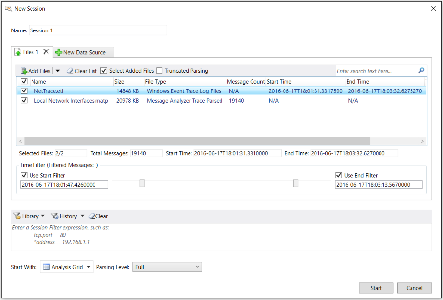  
  
 **Figure 4: Message Analyzer Data Retrieval Session configuration**  
  
 ___________________\_  
  
 **More Information**   
 **To learn more** about working with a Data Retrieval Session, see [Configuring a Data Retrieval Session](configuring-a-data-retrieval-session.md).  
___________________\_  
  
   
### Acquiring Input From Other Data Sources  
 Message Analyzer can load and process data from other input **Data Source** types besides trace files and common log files. The other sources with which Message Analyzer can work include the following:  
  
-   **Azure Tables** — Message Analyzer enables you to load input data from Azure tables. You can do this by creating an Azure input configuration from the **New Session** dialog that specifies Azure **Account** connection information and a **Table Name**.  
  
     **Azure Storage Blobs** — Message Analyzer enables you  to browse for, select, and view data from log files that are stored in Azure binary large object (BLOB) containers. You can do this my making use of the **File Selector** dialog, which is accessible by clicking the **From Other File Sources** item in the **Open** drop-down list that appears on the global Message Analyzer **File** menu.  
  
     ___________________\_  
  
     **More Information**   
     **To learn more** about working with Azure data as an input source to Message Analyzer, see [Handling Azure Data](handling-azure-data.md).  
    ____________________  
  
-   **Event Logs** — Message Analyzer enables you to load system event data that is typically displayed in the Microsoft Event Viewer.  
  
     ___________________\_  
  
     **More Information**   
     **To learn more** about working with system event data in Message Analyzer, see [Loading System Event Log Data](loading-system-event-log-data.md).  
    ___________________\_  
  
-   **PowerShell** — enables Message Analyzer to acquire input data through PowerShell. For example, you can import data with a saved PowerShell script file that you target as a supported input file type (\*.ps1) through a Data Retrieval Session. The script contained in such a file may invoke specific processes or functions which return data that you can view in Message Analyzer. You also have the option to use a PowerShell interface that is built into Message Analyzer to create a PowerShell query that returns its data to a viewer such as the **Analysis Grid**.  
  
     ___________________\_  
  
     **More Information**   
     **To learn more** about working with PowerShell as an input source to Message Analyzer, see [Deriving Input Data with PowerShell Scripts](deriving-input-data-with-powershell-scripts.md).  
    ___________________\_  
  
-   **SQL** — enables you to retrieve data from a SQL database table by using a built-in interface to provide connection information, SQL query code, and a reference timestamp.  
  
     ___________________\_  
  
     **More Information**   
     **To learn more** about working with SQL data as an input source to Message Analyzer, see [Loading SQL Data](loading-sql-data.md).  
    ____________________  
  
-   **OMS** — enables you to load data from Operations Management Suite (OMS) logs through a search interface to OMS Log Analytics that Message Analyzer provides.  
  
     ___________________\_  
  
     **More Information**   
     **To learn more** about working with OMS data as an input source to Message Analyzer, see [Loading OMS Log Data](loading-oms-log-data.md).  
    ___________________\_  
  
-   **WPP-generated events** — enables you to parse and display Windows software trace preprocessor (WPP)-generated events in Message Analyzer, which can capture these events live or load them from a saved event trace log (ETL) file. However, you will need to provide a program data base (PDB) or trace message format (TMF) file  that defines the event structure and format so that Message Analyzer can parse the WPP-generated events.  
  
     ___________________\_  
  
     **More Information**   
     **To learn more** about the configuration required for Message Analyzer to parse  WPP-generated events, see [Loading WPP-Generated Events](loading-wpp-generated-events.md).  
    ___________________\_  
  
   
### Selecting Data to Retrieve  
 You can also *select* specific data to retrieve from a target message collection while blocking all other messages that do not meet the filtering criteria that you define, by using a **Session Filter**, **Time Filter**, or a **Parsing Level**. A **Session Filter** narrows the scope of data retrieval to only the message types that meet the criteria of a Filter that you manually define, or one that you select from the centralized filter **Library** in the lower section of the **New Session** dialog. A **Time Filter** enables you to specify a window of time in which to view data in a correlated target message collection that can consist of one or more sources from which you load data into Message Analyzer. A **Parsing Level** enables you so specify how far up the network stack that Message Analyzer will parse, which creates a focused set of messages that temporarily eliminates all other messages above the specified **Parsing Level**. For example, you might set the **Parsing Level** known as **Network Analysis** to create a set of results that focuses on the Network and Transport Layer messages.  
  
 ___________________\_  
  
 **More Information**   
 **To learn more** about configuring a Data Retrieval Session, see [Retrieving Message Data](retrieving-message-data.md).   
**To learn more** about how to use a **Session Filter** in a Data Retrieval Session, see [Applying a Session Filter to a Data Retrieval Session](applying-a-session-filter-to-a-data-retrieval-session.md).  
**To learn more** about how to use a **Time Filter** in a Data Retrieval Session, see [Applying an Input Time Filter to a Data Retrieval Session](applying-an-input-time-filter-to-a-data-retrieval-session.md).  
**To learn more** about how to work with **Parsing Levels**, see [Setting the Session Parsing Level](setting-the-session-parsing-level.md).  
___________________\_  
  
   
### Parsing Input Text Log Files  
 If you have a text-based log file containing log entries that you want to view, Message Analyzer enables you to load and view the data from the log file, but you will need to specify an OPN configuration file to drive the process. Message Analyzer provides several built-in configuration file types that you can select from in the **Text Log Configuration** column  that appears below the toolbar on the **Files** tab of the **New Session** dialog for a Data Retrieval Session, as shown in the figure that follows.  
  
 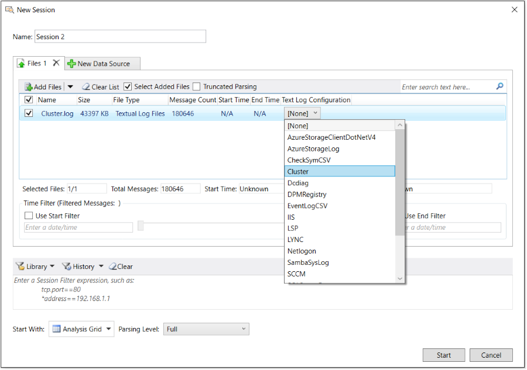  
  
 **Figure 5: Message Analyzer Textlog parsers**  
  
 The drop-down list shown in the figure is populated with common built-in configuration files that are available for selection only after you click the **Add Files** button and retrieve a *.log file that contains the data you want to load into Message Analyzer. The built-in configuration files are described in the subsection "Built-In OPN Configuration Files" that immediately follows; however, if you have a text-based log file that contains log entries in a unique/proprietary format, it is  likely that you will need to create a custom OPN configuration file so that Message Analyzer can parse your log, as described  in [Opening Text Log Files](opening-text-log-files.md).  
  
 **Built-In OPN Configuration Files**   
The built-in OPN configuration file types that are currently available for selection are specified in the list that follows. A  short description of the purpose of each configuration file type is included:  
  
-   **AzureStorageClientDotNetV4** — provides the OPN configuration that parses Azure .net client storage logs.  
  
-   **AzureStorageLog** — provides the OPN configuration that parses Azure .log files that are saved in BLOB containers.  
  
-   **CheckSymCSV** — provides the OPN configuration that parses the CSV output of the Exchange CHECKSYM utility, which is commonly used to perform file version and checksum comparisons of binaries and configuration files.  
  
-   **Cluster** — provides the OPN configuration that parses Cluster text logs.  
  
-   **Dcdiag** — provides the OPN configuration that parses the output of the [Domain Controller Diagnostics Tool (Dcdiag)](http://www.microsoft.com/en-us/download/details.aspx?id=31063).  
  
-   **DPMRegistry** — provides the OPN configuration that parses special registry output text logs for the Data Protection Manager (DPM) component.  
  
-   **EventLogCSV** — provides the OPN configuration that parses traces that are exported as a CSV file, but with more value than a regular CSV file.  
  
-   **IIS** — provides the OPN configuration that parses text logs generated by IIS web servers.  
  
-   **LSP** — provides the OPN configuration that parses text logs generated by the Local Security Authority (LSA) component, which applications can use to authenticate and log users on to the local system. The log files provide access to some data in clear text that is otherwise encrypted by messages on the wire. Administrative privileges are required to view these logs.  
  
-   **LYNC** — provides the OPN configuration that parses [UCCAPI logs](http://blogs.technet.com/b/rischwen/archive/2013/11/18/lync-2013-uccapi-logging-configuration.aspx) from the Lync client application.  
  
-   **Netlogon** — provides the OPN configuration that parses Netlogon logs for diagnosing logon issues on domain controllers.  
  
-   **SambaSysLog** — provides the OPN configuration that parses SambaSysLog text logs generated for Unix and Linux machines.  
  
-   **SCCM** — provides the OPN configuration that parses System Center logs.  
  
-   **SQLServerError** — provides the OPN configuration that parses [SQL Server error logs](http://technet.microsoft.com/library/ms187885\(v=SQL.105\).aspx).  
  
-   **SQLServerSetup** — provides the OPN configuration that parses [SQL Server setup logs](http://msdn.microsoft.com/library/ms143702.aspx).  
  
-   **ULS** — provides the OPN configuration that parses SharePoint logs.  
  
-   **VMM** — provides the OPN configuration that parses [System Center Virtual Machine Manager logs](http://support.microsoft.com/kb/2913445/en-us).  
  
-   **DefaultSimpleLogFileReaderConfig** — a generic configuration file that can parse most text logs, for example those from a domain controller.  
  
> [!NOTE]
>  With exception of the configuration files for Azure storage logs, the listed  text log configuration files are contained in  the Message Analyzer **Device and Log File Version 1.4** asset collection that you can configure for automatic downloads and updates from a Microsoft web service through the [Sharing Infrastructure](sharing-infrastructure.md). The configuration files for Azuze storage logs are contained in the **Azure Storage Parsers Version 1.0** asset collection. The management features for the Azure storage parsers and all other Message Analyzer asset collections are available from the **Asset Manager** dialog, which is accessible from the global Message Analyzer **Tools** menu.  
>   
>  ___________________\_  
>   
>  **More Information**   
>  **To learn more** about managing Message Analyzer asset collections, including downloading and auto-syncing any collection for automatic updates, see [Managing Message Analyzer Assets](managing-message-analyzer-assets.md).   
> ___________________\_  
  
 **Selecting Versus Creating an  OPN Configuration File**   
The built-in text log OPN configuration files are named in such a way that it should be obvious which one to select for your text log. For example, a Cluster text log will use the **Cluster** configuration file, the IIS text log will use the **IIS** configuration file, and so on.  
  
 If none of the built-in text log configuration files apply to your text log, then you can create a new one that is specifically designed to parse the data in your text log, as described in [Opening Text Log Files](opening-text-log-files.md). Whenever you create a new configuration file for a text log, it is added as an item to the **Text Log Configuration** drop-down list that appears below the toolbar on the **Files** tab of the **New Session** dialog. It is also added to the **Default text log configuration** drop-down list in the **Text Log Files** pane on the **General** tab of the **Options** dialog, which is accessible from the global Message Analyzer **Tools** menu. From the latter drop-down list, you have the option to set a specific configuration file as the global default for all text log files from which you will load data into Message Analyzer. This makes it convenient if you work with a particular type of .log file consistently.  
  
 **OPN Configuration File Contents**   
A configuration file contains a description of the log's messages in OPN and RegEx notation, which ensures that text log data that is loaded into the system can be properly parsed and then displayed in Message Analyzer. The text-based log data is loaded into the Message Analyzer Runtime through a Log File Adapter and the OPN configuration file drives the process. The message definitions contained in the OPN configuration file are compiled by the OPN Compiler to confirm the validity of the configuration file and the integrity of the OPN description that will reside in the POM, which is referenced by the Runtime when the parsing process begins for your text log.  
  
 To create an OPN configuration file, you will need to identify each unique log entry and map it to a message structure. You can do this with RegEx notation, which is designed for matching strings of text. RegEx provides the functionality you will need to match data through the mechanism of capture variables, which you can use to map extracted log file data to field names that you define in OPN; in turn, these  become data columns in the **Analysis Grid** viewer.  
  
> [!TIP]
>  Message Analyzer also supports loading regular comma-separated-value (CSV) and tab-separated-value (TSV) data file formats directly, without the need for an OPN configuration file.  
  
 ___________________\_  
  
 **More Information**   
 **To learn more** about how to create an OPN configuration file, download the [OPN Configuration Guide for Text Log Adapter](http://download.microsoft.com/download/C/D/E/CDED67DB-2C74-4FE4-B184-123CEE0E273F/OPN%20Configuration%20Guide%20for%20Text%20Log%20Adapter%20V2.docx) document.   
**To learn more** about other OPN configuration file requirements, see the [Addendum 1: Configuration Requirements for Parsing Custom Text Logs](addendum-1-configuration-requirements-for-parsing-customtext-logs.md) topic.   
___________________\_  
  
   
## Edit Message Data  
 Message Analyzer enables you to edit the data of any Live Trace Session or Data Retrieval Session. You can achieve this by modifying the session configuration and applying the changes you make. To modify the configuration for either of these types of sessions,  simply click the **Edit Session** button on the global Message Analyzer toolbar to display the **Edit Session** dialog. The session configuration that displays in the **Edit Session** dialog depends on the session viewer tab that has focus (viewer tabs are below the global Message Analyzer toolbar). Note that only one session configuration exists for a specified session, regardless of how many data viewers are open in that session.  
  
 Note that the **Edit Session** dialog for a Live Trace Session is similar to the **New Session** dialog shown earlier in Figure 2, while the **Edit Session** dialog for a Data Retrieval Session is similar to the **New Session** dialog shown earlier in Figure 4, with exception of the **Restricted Edit** information bar.  
  
 **Editing a Data Retrieval Session**   
When you open the **Edit Session** dialog for a Data Retrieval Session, it opens  in **Restricted Edit** mode, which means you can add more files to the files list and display the data contained in such files without incurring a full reload of data. When the session changes take effect (after you click **Apply** in the dialog), the data from the new input files is appended to the existing data file import results. However, if you click the **Full Edit** button on the information toolbar, you have additional options to modify the session configuration.  
  
 Similar to initial configuration of a Data Retrieval Session, the changes you can make to the Data Retrieval Session configuration include not only more input data files, but one or more of the following as well:  
  
-   **Time Filter** — configure a window of time in which to view messages.  
  
-   **Session Filter** — apply a built-in or custom-written Filter to the session configuration.  
  
-   **Parsing Level** — apply a parsing level to the session to establish the level up to which Message Analyzer will parse messages. Accessible from the **Parsing Level** drop-down list in the **New Session** dialog.  
  
-   **Truncated Parsing** — specify the **Truncated Parsing** option for input files that contain truncated messages. Results in improved performance.  
  
 When you edit a Data Retrieval Session with any of these features, the session data will be reloaded with the specified asset/s applied, for example, a **Session Filter** and/or a **Time Filter**. This enables you to modify the session results and obtain a different view of the data. You can edit a Data Retrieval Session in the specified manner as many times as you wish.  
  
 **Editing a Live Trace Session**   
When you open the **Edit Session** dialog for a running, paused, or stopped Live Trace Session, it opens  with no editing restrictions; this means you can make modifications to the session configuration and **Apply** them as required. Whatever changes you make to a *running* Live Trace Session will take effect on subsequent messages that the Live Trace Session in progress is capturing, that is, after you click **Apply** in the **Edit Session** dialog. If you edit a *stopped* or *paused* Live Trace Session, the changes do not take effect until you restart the session, either by clicking the **Restart** button or the **Pause/Resume** button, respectively, on the global Message Analyzer toolbar.  
  
 Similar to initial configuration of a Live Trace Session, the changes that you can make to the Live Trace Session configuration include one or more of the following:  
  
-   **Trace Scenario** — replace any existing **Trace Scenario** with a new one, as you can only have a single scenario in the session configuration at any one time.  
  
-   **Specific ETW Provider/s** — add system ETW Providers or custom ETW Providers that you specify from the **Add Providers** drop-down list on the **ETW Providers** toolbar in the **New Session** dialog.  
  
-   **Advanced Settings** — specify advanced settings for a selected provider. Accessible from the **Configure** link next to each message provider in the **ETW Providers** list. Displays the **Advanced Settings** dialog, from where you can specify ETW **Keyword** or **Level** filters and other provider filtering settings that are unique to each provider type.  
  
-   **ETW Session Configuration** — specify settings for the ETW session such as buffer size, buffer count, and buffer flush timing for ETW events. Accessible from the **ETW Session - Advanced Configuration** dialog that displays when you click the **Configure ETW Session** button on the **ETW Providers** toolbar.  
  
-   **Session Filter** — apply a built-in or custom-written Filter to the session configuration.  
  
-   **Parsing Level** — apply a parsing level to the session that establishes the level up to which Message Analyzer will parse messages. Accessible from the **Parsing Level** drop-down list in the **New Session** dialog.  
  
-   **Target Computers** — specify one or more target computers on which you want to capture data. Accessible from the **Edit Target Computers** dialog which appears after you click the **Edit** button next to the **Target Computers** text box in the **New Session** dialog.  
  
-   **Data Source** — add and configure a new **Data Source** through which you can capture messages. Accessible from the **New Data Source** tab in the **New Session** dialog.  
  
 ___________________\_  
  
 **More Information**   
 **To learn more** about editing a session, see [Editing Existing Sessions](editing-existing-sessions.md).  
**To learn more** about **Trace Scenarios**, see the [Built-In Trace Scenarios](built-in-trace-scenarios.md) topic.  
**To learn more** about working with system ETW providers, see [Adding a System ETW Provider](adding-a-system-etw-provider.md).  
**To learn more** about **Advanced Settings** for system ETW Providers, see the topics [Using the Advanced Settings - Microsoft-PEF-NDIS-PacketCapture Dialog](using-the-advanced-settings-microsoft-pef-ndis-packetcapture-dialog.md) or [Using the Advanced Settings - Microsoft-Windows-NDIS-PacketCapture Dialog](using-the-advanced-settings-microsoft-windows-ndis-packetcapture-dialog.md).  
**To learn more** about ETW session configuration, see [Specifying Advanced ETW Session Configuration Settings](specifying-advanced-etw-session-configuration-settings.md).  
**To learn more** about **Session Filters**, see [Working with Session Filters in a Live Trace Session](working-with-session-filters-in-a-live-trace-session.md) and [Applying a Session Filter to a Data Retrieval Session](applying-a-session-filter-to-a-data-retrieval-session.md).  
**To learn more** about **Time Filters**, see [Applying an Input Time Filter to a Data Retrieval Session](applying-an-input-time-filter-to-a-data-retrieval-session.md).  
**To learn more** about **Parsing Levels**, see [Setting the Session Parsing Level](setting-the-session-parsing-level.md).  
**To learn more** about how to configure a session for capturing  traffic on remote computers, see [Configuring a Remote Capture](configuring-a-remote-capture.md).  
**To learn more** about how to configure multiple data sources, see [Configuring Session Scenarios with Selected Data Sources](configuring-session-scenarios-with-selected-data-sources.md).  
___________________\_  
  
   
## View Message Data  
 Message Analyzer provides many different data viewers and **Layouts** in which to present data that you capture from a Live Trace Session or load from a Data Retrieval Session.  It even provides **Window Layout** presets that each have  the **Analysis Grid** viewer in common along with varying arrangements of Message Analyzer **Tool Windows**, to create  custom working environments that suit the type of troubleshooting and analysis that you typically perform.  
  
 The **Analysis Grid** viewer is the main analysis surface provided by Message Analyzer. It has a tree grid configuration with selectable column **Layouts** that expose a wide array of data fields that are useful for analyzing different types of data. It also uses a unique message encapsulation and stacking scheme to organize data so that important information is readily accessible at the top-level of the display. This configuration eliminates the time normally needed to search for related but dispersed information in trace files that contain a high volume of messages.  
  
 For example, in the **Analysis Grid** viewer, the message stack is encapsulated under expandable top-level transactional messages and Operations, while  message fragments at the Transport Layer are reassembled as part of the PEF Runtime parsing process. Moreover, each line of data in the **Analysis Grid** viewer displays message data as expandable top-level parent nodes that contain all the child node (message stack) messages and message fragments that were involved in a particular transaction or Operation. Note that you do have the option to display message data  in any Message Analyzer data viewer that you select, however, the encapsulation and stacking scheme only exists in the **Analysis Grid** viewer. The **Analysis Grid** viewer, which is shown in the  subsection that follows, is fully described in the [Analysis Grid Viewer](analysis-grid-viewer.md) topic.  
  
 The material of this section is covered in the following topics.  
  
 __________________________________________________\_  
  
 [Organizing Messages in the Analysis Grid Viewer](message-analyzer-tutorial.md#BKMK_OrgMessagesInAG)   
 [Grouping Messages in the Analysis Grid Viewer](message-analyzer-tutorial.md#BKMK_GroupingInAG)   
 [Grouping Messages in the Grouping Viewer](message-analyzer-tutorial.md#BKMK_GroupingInGroupingViewer)   
 [Applying Viewpoints](message-analyzer-tutorial.md#BKMK_ApplyViewpoints)   
 [Viewing Message Details](message-analyzer-tutorial.md#BKMK_ViewMsgDetails)   
 [Viewing Other Message Data](message-analyzer-tutorial.md#BKMK_ViewOtherMsgData)   
 [Viewing Data from Multiple Sessions](message-analyzer-tutorial.md#BKMK_ViewMultipleSessions)   
 [Limiting the Scope of Applied Assets](message-analyzer-tutorial.md#BKMK_LimitScopeOfAssets)   
 [Driving Interaction Between Data Viewers](message-analyzer-tutorial.md#BKMK_DriveViewerInteraction)   
 [Using Window Layouts](message-analyzer-tutorial.md#BKMK_WindowLayouts)   
 [Using Message Analyzer Profiles](message-analyzer-tutorial.md#BKMK_UsingMAProfiles)   
__________________________________________________\_  
  
   
### Organizing Messages in the Analysis Grid Viewer  
 As indicated earlier in this Tutorial, the overarching approach to analysis in Message Analyzer is to bring key data into focus wherever possible to make it more accessible, which streamlines and therefore expedites the analysis process. In keeping with this approach, the Message Analyzer Runtime creates Operation nodes for protocols that use the request/response conversation architecture, such as DNS, HTTP, SMB2, and so on. The  Runtime also reassembles the message stack, including fragments (such as TCP virtual segments), and by default hides them under expandable top-level message nodes in the **Analysis Grid** viewer for easy access. For example, a top-level message node could be an Operation that encapsulates a request/response message pair, under each of which resides the message stack and fragments that supported the Operation.  
  
 By organizing messages this way, you can easily determine such important values as the **ResponseTime**, which can tell you how long it is taking to receive the first server response to a request message; by utilizing this feature, you can avoid searching through potentially hundreds, if not thousands of messages to find such a response message. The **ResponseTime** is important to analysis because it can indicate how long a service is taking to respond, which can rule out network issues while potentially indicating    server issues instead. Note that by sorting the **ResponseTime** column in the **Analysis Grid** viewer, you can readily determine the specific  Operations that had the longest response times. However, to view **ResponseTime** data, you will need to add this **Global Annotation** from the **Field Chooser** **Tool Window** as a new **Analysis Grid** column.  
  
 Another important value is the **ElapsedTime**, which can tell you how long an Operation is taking to complete; this includes how long it took to receive all the associated message fragments. If the **ElapsedTime** is a comparatively high value with respect to **ResponseTime**, this could be an indication of a network issue. Also, by performing a sort of the **ElapsedTime** column in the **Analysis Grid** viewer, you can determine the specific  Operations (with fragments) that took the longest to complete — which can be a cue for further investigation.  
  
 ___________________\_  
  
 **More Information**   
 **To learn more** about the **Field Chooser**, see [Using the Field Chooser](using-the-field-chooser.md) and the [Field Chooser Tool Window](field-chooser-tool-window.md) topics.   
**To learn more** about **ResponseTime**, see the [Average Response Time for Operations](average-response-time-for-operations.md) topic.  
___________________\_  
  
 Another important aspect of organizing messages as top-level nodes with an encapsulated network stack, is that it enables you to have immediate access to  stack messages for quick analysis of details, whereas in other tools such as Microsoft Network  Monitor, stack messages are typically chronologically dispersed across a set of trace results, making them difficult to find and correlate to a top-level transaction.  
  
 The top-level node and encapsulation configuration also provides a visual cue of **Diagnosis** messages that Message Analyzer drives to top-level, even when those errors occur at deeper stack levels. Although such errors can be initially hidden in the child messages that make up the encapsulated stack, nevertheless you can simply click the error icon at top-level to display the **Diagnosis** tab of the inline message details where you can review the error text, correlated to the Operation or other top-level message at hand. This provides easy access to error information without having to search through a multitude of messages to discover it. If you want to know exactly where in the stack the error occurred, you can merely expand the child message nodes until you find the specific message that contains the error icon that initially displayed at top-level.  
  
 As an example of the benefits of the described message organization, the figure that follows shows the **Analysis Grid** viewer with an expanded SMB2 Operation node containing a request/response message pair and the expanded message stack showing  message fragments for a  response message (which also has a Diagnosis error).  
  
 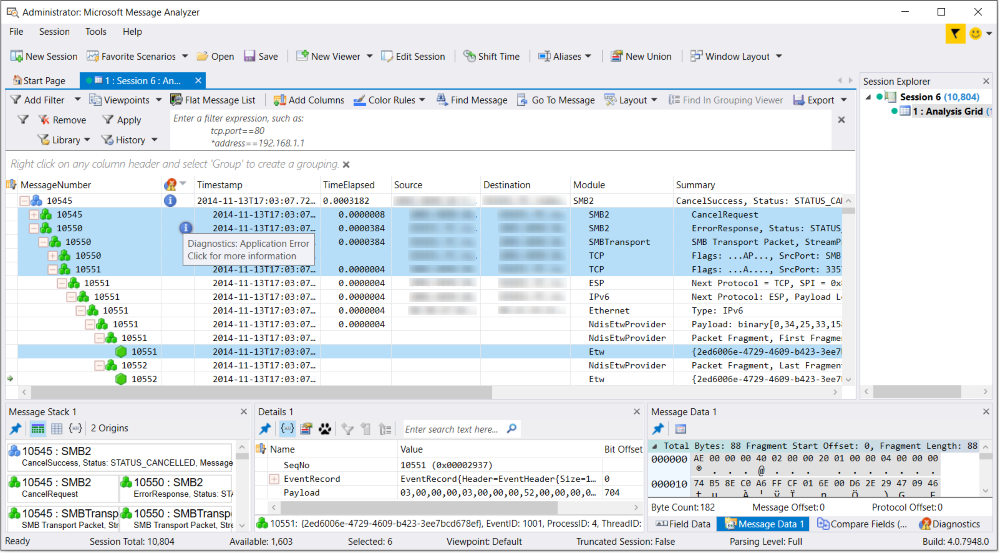  
  
 **Figure 6: Message Analyzer expanded Operation node, message stack, fragments, and Diagnosis error**  
  
 In this figure, note the highlighted **SMB2** request and response message numbers **10545** and **10550**, respectively, that are encapsulated under a top-level **SMB2** Operation node which is designated by a blue-cubed icon. Also, the response message stack is expanded to show the stack messages which includes the message fragments that consist of one **SMBTransport** and two **TCP** fragments. Also note that the Operation message number **10545** contains a blue **Diagnosis** error icon that Message Analyzer bubbled up from the response message **10550** where the error actually occurred, so that you can see it at-a-glance from the top-level Operation node, even when this node is in the unexpanded state. Note that you can click the **Diagnosis** error icon in either location for more information, which in this case happens to specify an **Application** error with a **Warning** level.  
  
   
### Grouping Messages in the Analysis Grid Viewer  
 Another feature that is important to data analysis is the **Group** feature. By right-clicking selected **Analysis Grid** viewer columns in succession and selecting the context menu **Group** item for each one, you can create a data display of nested groups that provides a convenient way to organize and explore targeted trace data. As an additional example of grouping, you could create IPv4 **Network** and TCP **Transport** groups in the **Analysis Grid** viewer by executing the **Add as Grouping** command from the right-click context menu for these fields in the **Field Chooser** window to **Group** your data into these field-categories. This quickly organizes your data into groups of IP conversations that took place across a trace, with the TCP ports that supported those conversations nested within each IP group, resulting in a unique analysis perspective.  However, to perform this operation, the **Analysis Grid** viewer must be in focus.  
  
 The **Analysis Grid** viewer **Group** feature essentially categorizes your data according to the field data you are grouping and the order in which you group it. The **Group** feature enables you to extract all the data from your trace into the categories that you establish through the grouping process, which results in bringing hidden or dispersed trace messages into what you might call a "categorical focus". A figure that shows the results of grouping data in the **Analysis Grid** viewer is provided in the topic that is referenced in the "More Information" section that immediately follows.  
  
 ___________________\_  
  
 **More Information**   
 **To learn more** about the **Group** function in the **Analysis Grid** viewer, see [Using the Analysis Grid Group Feature](using-the-analysis-grid-group-feature.md).  
___________________\_  
  
   
### Grouping Messages in the Grouping Viewer  
 You can also make use of the **Grouping** viewer, which has a set of built-in view **Layouts** that render your message data into a separate view of predefined nested Group configurations that integrate and interact with other data viewers to create unique analysis contexts. You can also create and save your own **Grouping** view **Layouts** that you customize to your environment based on message fields that you select from the **Field Chooser** window. The **Grouping** viewer is accessible from the **New Viewer** drop-down list that appears on the global Message Analyzer toolbar. A **Layouts** drop-down list is included on the **Grouping** viewer toolbar.  
  
 The **Grouping** viewer has functional similarities with the **Analysis Grid** viewer **Group** feature, in that they both enable you to create nested groups of data that are hierarchically categorized by the message fields that you use for the groupings. With the **Grouping** viewer, you can organize your traffic into summary hierarchies based on built-in or custom-designed **Grouping** view **Layouts** that are configured with message field groups in nested configurations.  You can also manually adjust (pivot) your group **Layout** by dragging and dropping Group labels to change the nesting order and obtain different message correlation configurations that result in unique analysis contexts.  
  
 **Grouping Viewer Advantages**  The following summarizes the advantages of viewing data with the **Grouping** viewer, where you can:  
  
-   Organize data into unique hierarchies to expose targeted information that you can quickly extract from large data sets, which can otherwise be difficult to do.  
  
-   Arrange nested Group configurations so you can isolate messages of interest into specified categories, which enable you to drill down into the nested Groups to obtain a concise analytical focus.  
  
-   Create a coherent analysis context for messages that can otherwise appear as disassociated.  
  
-   Locate the Group(s) with the highest message volumes for performance assessments.  
  
-   Correlate message volumes in different Groups.  
  
-   Drive the display of Group messages into the **Analysis Grid** viewer for assessment of message details.  
  
> [!NOTE]
>  Every Message Analyzer installation provides a default **Message Analyzer Grouping View Layouts** asset collection that appears in the **Asset Manager** dialog, where you can manage downloads and the auto-sync feature to update the collection. You can access the **Asset Manager** dialog from the global Message Analyzer **Tools** menu.  
  
 **Example Layout**  The figure that follows shows an example of the **Grouping** viewer with the **File Sharing SMB/SMB2** view **Layout**, that displays three nested Groups as identified by the labels below the **Grouping** viewer toolbar: **SessionIdName**, **TreeIdName**, and **FileName**. This built-in **Grouping** viewer **Layout** was pre-configured with these Group names by locating the corresponding fields in the **Field Chooser** window under the **QueryDirectoryRequest** node of the **SMB2** message hierarchy. You can add other related SMB2 fields as Groups at your discretion, by right-clicking a particular field in **Field Chooser** and selecting the **Add As Grouping** item in the context menu that appears. This action will create a new nested Group identified by the field name that you selected, at which time, the **Grouping** viewer data display will be refreshed to include the new Group.  
  
 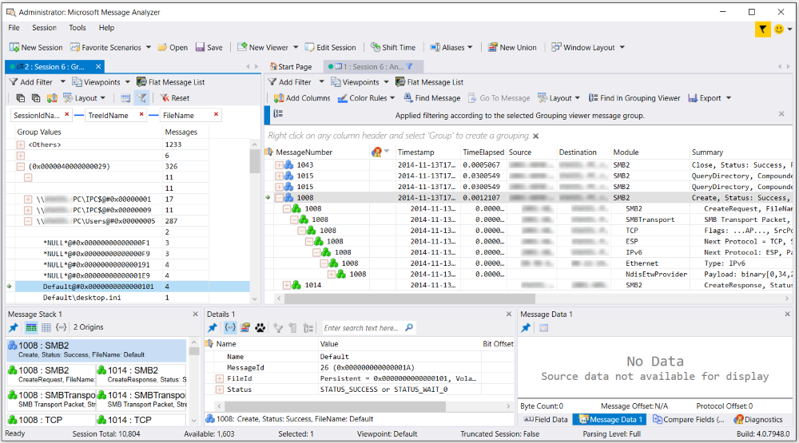  
  
 **Figure 7: Message Analyzer Grouping viewer selection interactively driving Analysis Grid message display**  
  
 In this figure, the **Grouping** viewer shows a file name selected in the **FileName** group, which is **\*NULL\*@#0x0000000000000191**, and  this group is nested under the **TreeIdName** Group value of **\\\PC\Users@#0x00000005**, which in turn is nested under the **SessionIdName** Group value of **(0x0000040000000029)**. The number of messages associated with this particular SMB2 operation is specified in the corresponding row under the **Messages** column of the **Grouping** viewer. Whenever you select a row of data in any Group in the **Grouping** viewer, the corresponding messages are interactively displayed in the **Analysis Grid** viewer for further analysis of message details. message stack, message data, field data, diagnostics, and so on.  
  
 ___________________\_  
  
 **More Information**   
 **To learn more** about the **Grouping** viewer, see the [Grouping Viewer](grouping-viewer.md) topic.  
___________________\_  
  
   
### Applying Viewpoints  
 To simplify troubleshooting, Message Analyzer provides the **Viewpoints** feature that enables you to examine network traffic from the perspective of a protocol. An applied **Viewpoint** enables you to bring the messages of a particular protocol or module into focus for targeted analysis. By applying a built-in **Viewpoint** from the **Viewpoints** drop-down list on the Filtering toolbar shown in the figure below, you can focus on specific messages at top-level in the **Analysis Grid** viewer with no layers above them, as defined by the applied **Viewpoint**. Moreover, because the **Viewpoint** temporarily removes all messages above the applied protocol **Viewpoint**, only the protocol messages associated with the applied **Viewpoint** appear at top-level in the **Analysis Grid** viewer. This feature is advantageous when you have higher-layer traffic that obscures the underlying messages that you want to troubleshoot. For example, if you were interested in focusing on SMB messages at the Application Layer, you could apply the **SMB/SMB2** **Viewpoint** as shown in the figure that follows. Upper sublayer protocols such as RPC will be removed from the display, as you will see SMB messages only.  
  
> [!NOTE]
>  Every Message Analyzer installation provides a built-in **Message Analyzer** **Viewpoints** asset collection that appears in the **Asset Manager** dialog, where you can manage downloads and the auto-sync feature to update the collection.  
  
 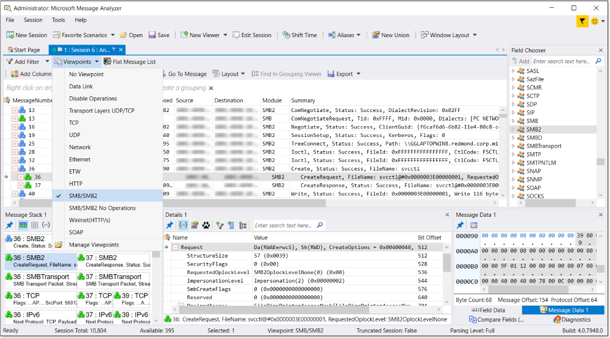  
  
 **Figure 8: Message Analyzer SMB/SMB2 Viewpoint applied**  
  
 In this figure, you can see that only **SMB2** messages display in the **Analysis Grid** viewer when the **SMB/SMB2** **Viewpoint** is applied, as indicated by the check mark  in the **Viewpoints** drop-down list. To return to your original message set, simply select the **No Viewpoint** item in the list; if you want to create a different  **Viewpoint**, you can select another one directly without necessarily selecting the **No Viewpoint** item first.  
  
 You also have the option to disable Operations, which breaks apart the request and response messages so that they appear in their original chronological order, similar to the way Network Monitor displays messages. You can do this by selecting the **Disable Operations** **Viewpoint**. The result has similarities with the data view that is achieved when you click the **Flat Message List** button, which also simulates the Network Monitor display as described in [Creating a Flat Message List](creating-a-flat-message-list.md).  
  
 ___________________\_  
  
 **More Information**   
 **To learn more** about **Viewpoints**, see the [Applying and Managing Viewpoints](applying-and-managing-viewpoints.md) topic.  
___________________\_  
  
   
### Viewing Message Details  
 You can obtain a full visual representation of message details in the **Analysis Grid** viewer, including field names, values, and types, by double-clicking any top-level parent message node or nested child message node. The indicated information is presented inline on a **Fields** tab. Note that the inline data can also include other data tabs such as the **Stack**, **Diagnosis**, and **Embedded** tabs, which provide other related message information that is described in the [Message Details Tool Window](message-details-tool-window.md) topic.  The figure below shows message  field details inline on the **Fields** tab that displays when you double-click a message in the **Analysis Grid** viewer.  
  
   
  
 **Figure 9: Message Analyzer inline message Details**  
  
 You can also select any message in the **Analysis Grid** viewer to see the identical field details data in a separate window that is called the **Details** window, which typically displays below the **Analysis Grid** viewer and includes field **Name**, **Value**, **Bit Offset**, **Bit Length**, and **Type** data. For example, by selecting an **Analysis Grid** viewer message, the **Details** window immediately snaps to the selection and presents the field data for the selected message. Note that any field that you select in the **Details** window can drive the display of a hexadecimal value in the **Message Data** window or a decimal value in the **Field Data** window.  
  
   
### Viewing Other Message Data  
 Other **Tool Windows** are also available to enhance your data analysis perspective, for example, the **Message Data**, **Field Data**, **Diagnostics**, and **Decryption** **Tool Windows**. You can also view stack information in a separate window known as the **Message Stack** **Tool Window**, which provides an alternate view of the origins tree (message stack) below any top-level message that is normally hidden by collapsed message nodes in the **Analysis Grid** viewer. Note that many Message Analyzer **Tool Windows** are interactive, because they either drive or are driven by message or data selection in other windows or data viewers. For instance, by selecting a field in the **Details** **Tool Window**, the **Message Data** window immediately snaps to the selection and highlights the corresponding hexadecimal value of the selected field.  
  
 ___________________\_  
  
 **More Information**   
 **To learn more** about Message Analyzer **Tool Windows**, see the [Tool Windows](tool-windows.md) topic.  
___________________\_  
  
   
### Viewing Data from Multiple Sessions  
 Message Analyzer also provides session viewer navigation functionality from the **Session Explorer** **Tool Window**, to enable you to easily explore the data in different types of session data viewers, which can include **Chart** viewer **Layouts** that employ top-level data summaries in various graphic and tabular formats, the **Grouping** viewer, a **Pattern Match** viewer, the **Gantt** viewer, and several others that Message Analyzer provides. The **Session Explorer** window is accessible from the **Windows** drop-down list in the global Message Analyzer **Tools** menu.  
  
> [!NOTE]
>  By right-clicking a session node in **Session Explorer**, you are presented with the **New Viewer** context menu item, which displays a drop-down list that enables you to select other data viewers that display data in separate session viewer tabs. Thereafter, any new data viewer that you specified is listed and uniquely identified by a color code in the **Session Explorer** window navigation area. If you select any **Session Explorer** node, Message Analyzer responds by immediately displaying the data on the session viewer tab that corresponds with the selected node.  
  
 The figure that follows shows an example of the **SMB Top Commands** **Layout** for the **Chart** viewer  that you can select from the **Charts** drop-down list in the **New Viewer** drop-down list, which is accessible from the **Session Explorer** context menu. This **Layout** enables you to obtain a high-level summary view that depicts the relative distribution of traffic volume, from the highest to the lowest volume, for SMB commands in a set of trace results. The **Layout** uses a Bar element visualizer component to display the command volumes for various operations such as **Create**, **Read**, **Close**, and **QueryInfo**, which enables you to quickly evaluate the SMB commands that are consuming the most bandwidth.  
  
 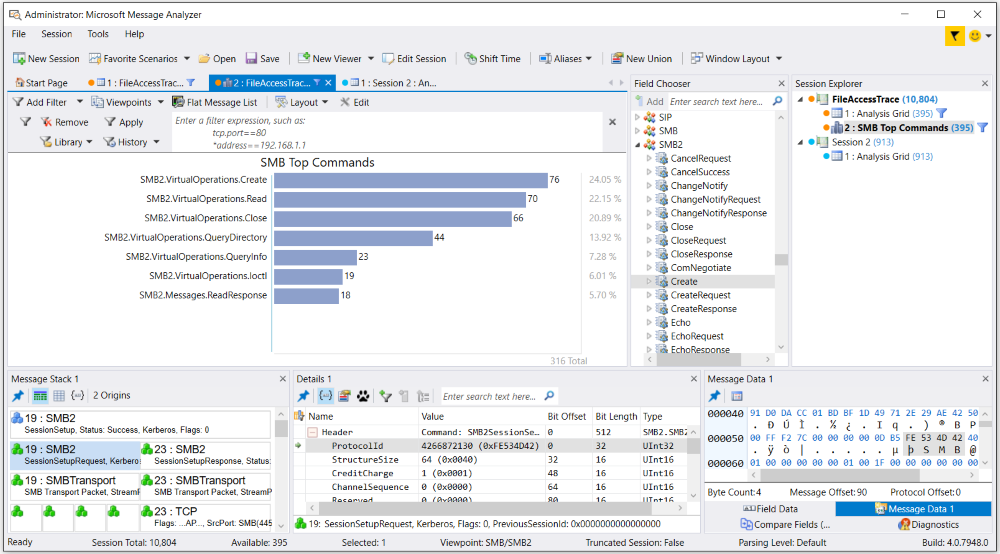  
  
 **Figure 10:  Message Analyzer SMB Top Commands Chart viewer Layout**  
  
 In the figure,  note that the **Session Explorer** window uses a common color code to identify session and viewer nodes of  the same session. The same color code is used to correlate the corresponding session viewer tabs above the main analysis surface, for ease of identification. Also, session viewer nodes in **Session Explorer** and session viewer tabs are assigned a *different* color code to distinguish the data  of different sessions. In addition, if any assets have been applied to a session, such as a view **Filter** or **Viewpoint**, a funnel icon displays to the right of the session viewer node in **Session Explorer**. Also note that when hovering your mouse over a session node in **Session Explorer** or over a session viewer tab, a tool tip appears with additional information, for example, the available message count and/or  type of asset applied to the session viewer.  
  
   
### Limiting the Scope of Applied Assets  
 The effects of assets that you apply to any data viewer are limited in scope to the data viewer where you apply the asset. This means that no other data viewer will be affected by this action, whether the viewer is in the same session or a different session. You should  note that the Filtering toolbar, from where you apply assets such as view **Filters**, **Time Filters**, and **Viewpoints**, is displayed above every data viewer that contains trace results. This is the case for **Chart** viewer **Layouts** as well. This enables you to apply different assets to different data viewers without the effects extending outside a particular  viewer where an asset is applied. Note that the **Grouping** viewer has a separate instance of the same Filtering toolbar and any assets that you apply to the **Grouping** viewer affects the **Grouping** viewer display only.  
  
   
### Driving Interaction Between Data Viewers  
 Some Message Analyzer data viewers are  *interactive*, in that data selection in one viewer drives the display of data in another viewer (or **Tool Window**). For example, in a **Chart** viewer **Layout**, you can double-click a bar element in the **Bar** visualizer component or a module node in the **Timeline** visualizer component that represents the messages of a particular protocol that were captured in a trace, and display only those messages in a new **Analysis Grid** viewer tab for data assessment purposes. You might do this, to isolate a group of messages where further investigation is required. Similarly, you can select a message in the **Analysis Grid** viewer and drive the display of the network stack in the **Message Stack** window.  
  
 Other types of interactions that occur when performing actions such as message, field, or session selection, include the following.  
  
-   Selecting individual messages in a viewer such as the **Analysis Grid** and displaying corresponding message details in the **Details** window.  
  
-   Selecting a message Group in the **Grouping** viewer and displaying/isolating those messages in the **Analysis Grid** viewer.  
  
     Altering the data display in a **Chart** viewer **Layout** by message  Group selection.  
  
-   Selecting a message row in the **Diagnostics** window, which highlights the corresponding message/s in the **Analysis Grid** viewer.  
  
-   Selecting a field in the **Details** window that drives the highlighting of hexadecimal values in the **Message Data** window.  
  
-   Selecting a session, which refreshes the data in the **Diagnostics** window, **Message Data** window, and the **Decryption** window (if displayed with decryption results data).  
  
   
### Using Window Layouts  
 Message Analyzer enables you to customize the working environment in which you manipulate data and perform analysis. Message Analyzer does this by providing several built-in **Window Layouts** that organize the **Analysis Grid** viewer along with different **Tool Windows** into preset configurations that enable you to customize your working environment for the type of troubleshooting and analysis you perform. The window layouts are accessible from the **Window Layout** drop-down list on the global Message Analyzer toolbar. When you shut down Message Analyzer, the window configuration that you last displayed is registered in a configuration file so that the window configuration persists through subsequent Message Analyzer startups.  
  
 The **Window Layout** presets that you can select range from simple to increasingly more complex selections, given that they are intended to accommodate a cross-section of typical Message Analyzer users. The typical layout configuration consists of a single/default data viewer and an arrangement of one or more **Tool Windows**. However, you can organize your data windows any way you want.  
  
 By default, Message Analyzer uses the **Analysis Grid** viewer in all the built-in **Window Layouts**; however, after you display one of the presets, you can select a different viewer of choice if you wish. You can also add other **Tool Windows** to any of the built-in **Windows Layouts**, as needed, although you cannot modify the configuration of the built-in **Window Layouts**. Rather, any **Tool Windows** that you add to a displayed **Window Layout** are registered in the previously mentioned configuration file to persist the configuration across Message Analyzer restarts.  
  
 ___________________\_  
  
 **More Information**   
 **To learn more** about **Window Layouts**, see [Working with Message Analyzer Window Layouts](working-with-message-analyzer-window-layouts.md)  
___________________\_  
  
   
### Using Message Analyzer Profiles  
 Message Analyzer now provides the **Profiles** feature, which enables you to use built-in or custom-specified data viewer and **Layout** presets that activate whenever you load data from specific types of input files. Prior to the introduction of this feature, you had to manually select viewer **Layouts** in which to display your data, whenever you wanted to analyze data from different types of input files that you load into Message Analyzer. Although, it is likely that you had to engage in a trial-and-error process to discover the best **Layout** with the right context for the type of data you are analyzing. Even then, earlier versions of Message Analyzer had a minimal selection of **Layouts** from which to choose, but this is remediated in Message Analyzer v1.4.  
  
 Because Message Analyzer viewing components can expose  data in different ways, you can obtain different analysis contexts for the data with different viewer **Layouts**, although if you are a new user, you may not always know which viewer **Layout** will maximize your data analysis capabilities in a given instance. The default **Layout** for the **Analysis Grid** viewer contains a baseline set of data columns that is suitable for many environments, as described in the [Default View Layout](analysis-grid-viewer.md#BKMK_DefaultViewLayout) topic. However, this is only a starting point, as there are many different **Layouts** that you can select from the **Layout** drop-down list on the **Analysis Grid** viewer toolbar. Similarly, you can select numerous **Layouts** for the **Grouping** and **Chart** viewers.  
  
 **Displaying Predefined Analysis Environments with  Built-in Profiles**   
Some of the **Layouts** that Message Analyzer provides for the previously indicated data viewers are designed to work with each other to create an integrated and interactive analysis environment that exposes key information. You can select these manually if you know which ones are designed for integrated analysis, or to automate the process, you can simply select one of many built-in Message Analyzer **Profiles** that each define different **Layout** configurations for the **Analysis Grid**, **Chart**, and **Grouping** viewers, depending on the type of input data to be analyzed.  
  
 After a specific **Profile** is enabled in the **Options** dialog, as shown in the next figure, its preset viewer and **Layout** configuration automatically displays  with populated data whenever you load data from an input file type for which the enabled **Profile** is designed, for example, a \*.etl,  \*.cap, or \*.log file. The analysis environments created by the built-in **Profiles** are predefined by Microsoft to expose the data that is typically the most important for problem solving and to expose it in a way that provides multiple perspectives  on the data, from low-level details and calculated statistics to high level overviews and other data summaries.  
  
 The built-in **Profiles** along with usage overviews and analysis examples are described in  [Working With Message Analyzer Profiles](working-with-message-analyzer-profiles.md).  
  
> [!NOTE]
>  Message Analyzer **Profiles** are contained in an updatable package that is known as the **Message Analyzer Profiles** asset collection. You can set this asset collection for automatic updates in the **Asset Manager** dialog, which is accessible from the global Message Analyzer **Tools** menu.  
  
 **Locating the Built-In Profiles**   
The figure that follows shows the **Profiles** tab of the **Options** dialog, where the **Advanced Profiles** list contains all the built-in **Profiles** that are available for selection/enabling. You can use these **Profiles** as is, or you can create your own **Profiles** with the use of the **Add Profile** feature. If you want to see the internal configuration of viewer **Layouts** for any of the built-in **Profiles**, select the **Profile** of interest and then click the **Edit Profile** button on the **Advanced Profiles** toolbar. Note that the built-in **Profiles** are ReadOnly and cannot be edited, although you can edit any **Profile** that you custom design. You can access the **Options** dialog from the global Message Analyzer **Tools** menu.  
  
 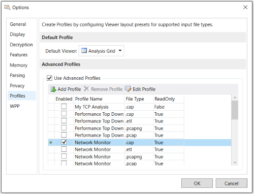  
  
 **Figure 11: Message Analyzer Profiles tab of the Options dialog**  
  
 **Example Scenario**   
A scenario in which you could use a built-in **Profile** might be if you regularly analyze \*.cap files for specific types of information that require a particular view of data that quickly exposes the information you need to examine for capture file analysis. To display a typical viewer and **Layout** configuration for data in this file type, Message Analyzer enables you to use the built-in **Network Monitor** **Profile** for \*.cap files, which defines a data viewer and **Layout** configuration that is suitable for analysis of capture file data. When this **Profile** is *enabled* and you load data from a \*.cap file, Message Analyzer will automatically populate the data in the viewer and **Layout** configuration that is described in the table that follows. You can view this configuration of  viewers and **Layouts** in the **Network Monitor  Profile** dialog that displays when you click **Edit Profile** while the **Network Monitor** **Profile** for  \*.cap files is selected in the **Advanced Profile** list on the **Profiles** tab of the **Options** dialog.  
  
### Table 2. Viewer/Layout Configuration for the Network Monitor Profile  
  
||||  
|-|-|-|  
|**Viewer**|**Layout**|**Type**|  
|Analysis Grid|Network Monitor|Tree grid|  
|Grouping|Process Name and Conversations|Nested group|  
|Chart|Top TCP/UDP Conversations by Message Count|Table grid|  
  
 The figure that follows shows what this viewing configuration looks like after data from a .cap file is loaded into Message Analyzer.  
  
> [!NOTE]
>  You will need to manually open the **Chart** viewer **Layout** for the **Profile** by selecting the **Default** item in the **Chart** drop-down list in the **New Viewer** drop-down list on the global Message Analyzer toolbar. Whenever the data of an input file related to an enabled **Profile** is loaded into Message Analyzer, selecting the **Default** item references the **Chart** viewer **Layout** configured in the **Profile** and causes it to be displayed.  
  
 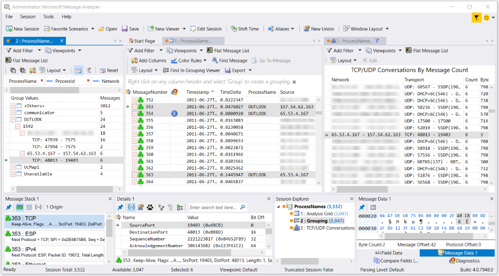  
  
 **Figure 12: Message Analyzer Network Monitor Profile components**  
  
 In the figure, an  IP conversation is selected under the Outlook **ProcessName** group in the **Grouping** viewer, which is on the left side of the Message Analyzer user interface (UI). Because the **Grouping** viewer is in **Selection Mode**, as described in [Grouping Viewer Modes of Operation](grouping-viewer.md#BKMK_ModesofOperation), Group selection causes the messages that correspond to the conversation to be interactively highlighted in the **Analysis Grid** viewer — of which the preceding figure shows only three due to display constraints. By identifying these messages, you can then analyze them in further detail with the use of the **Message Stack**, **Details**, and **Message Data** **Tool Windows**.  
  
 In addition, the same conversation is selected in the **TCP/UDP Conversations by Message Count** view **Layout**, which uses a **Table** grid visualizer component to provide a data set that includes statistics such as conversation message count, payload,  data transmission rate, and duration. Note that many of the data column values, such as **Count**, **Bytes**, **KBs**, **Duration**, and **BPS**, are calculated values based on data formulas that were created by Microsoft with the **Edit Chart Layout** dialog.  
  
 ___________________\_  
  
 **More Information**   
 **To learn more** about using the **TCP/UDP Conversations by Message Count** Chart viewer **Layout**, see the [TCP/UDP Conversations by Message Count](tcp-udp-conversations-by-message-count.md) topic.  
___________________\_  
  
 **In Conclusion**   
The  built-in Message Analyzer **Profiles** are important tools for data correlation, analysis, and problem solving. They enable  you to display integrated analysis environments that expose key data fields, calculated statistics or other low-level details, and data summaries that help you to achieve the data perspectives you need to quickly discover areas where issues are occurring. If you configure your own custom-designed **Profile/s** you have the opportunity to decide which viewers and **Layouts** you will use to expose your data.  
  
 ___________________\_  
  
 **More Information**   
 **To learn more** about Message Analyzer **Profiles**, see [Working With Message Analyzer Profiles](working-with-message-analyzer-profiles.md).  
**To learn more** about the Message Analyzer **Session Explorer** **Tool Window**, see the [Session Explorer Tool Window](session-explorer-tool-window.md) topic.  
**To learn more** about using the **Asset Manager** dialog, see the [Asset Manager](asset-manager.md) topic.  
**To learn more** about the Message Analyzer data viewer infrastructure, see [Data Viewer Concepts](data-viewer-concepts.md).  
**To learn more** about Message Analyzer data viewers that you can work with during data analysis, including numerous **Layouts** for the **Chart** viewer, see the [Data Viewers](data-viewers.md) topic.  
___________________\_  
  
   
## Filter Message Data  
 Message Analyzer provides numerous filtering capabilities to enhance data retrieval, capture, and assessment processes. Filtering is critical for focusing on specific messages and enhancing performance. For example, if you were unable to filter message data in a Live Trace Session, you might need to examine potentially tens of thousands of messages to isolate a specific problem. What most Message Analyzer users need to observe is usually related to a specific protocol, error message, conversation, or process. By providing the ability to filter while retrieving, capturing, or viewing data, Message Analyzer provides a convenient way to reduce the scope of the data that you are working with and more effectively pinpoint your issues.  
  
 The material that describes these capabilities is included in the sections that follow.  
  
 _________________________\_  
  
 [Using a Session Filter](message-analyzer-tutorial.md#BKMK_UsingSessionFilter)   
 [Using Special Filters for a Live Trace](message-analyzer-tutorial.md#BKMK_UseSpecialFilters)   
 [Using View Filters to Manipulate a Set of Trace Results](message-analyzer-tutorial.md#BKMK_UseViewFilters)   
 [Creating Custom Filters](message-analyzer-tutorial.md#BKMK_CreateCustomFilters)   
_________________________\_  
  
   
## Using a Session Filter  
 When capturing data or loading data into Message Analyzer through a Live Trace Session or a Data Retrieval Session, as shown in the figures  of the earlier sections: [Configuring a Live Trace Session](message-analyzer-tutorial.md#BKMK_ConfigLiveTraceSession) and [Retrieve Message Data](message-analyzer-tutorial.md#BKMK_LoadingMessageData), you can use the **Session Filter** feature to isolate specific data that you want to work with. You can select a built-in **Session Filter** from the **Message Analyzer Filters** asset collection **Library** drop-down list that appears on the **Session Filter** toolbar of the **New Session** dialog, or you can create a custom **Filter** of your own design. After specifying a **Session Filter** and clicking the  **Start** button for a configured Live Trace Session or Data Retrieval Session, the filtering action is automatically applied in the background as messages are filtered and delivered to the default data viewer, for example, the **Analysis Grid** viewer. A **Session Filter** works in the same way most filters work,  by passing data that matches the filtering criteria and dropping any data that does not. However, you should carefully note that you can never recapture the data that you filter out with a **Session Filter** in a Live Trace Session, whereas with a Data Retrieval Session, you can always click the **Edit Session** button on the global Message Analyzer toolbar to return to session configuration, where you can remove or recast your filtering criteria and then reload the data from the originally specified saved files. A **Session Filter** is shown in the figure that follows.  
  
   
  
 **Figure 13: Session Filter for a Live Trace Session**  
  
 For instance, when configuring a **Session Filter**, you could specify a Filter Expression that isolates messages to a specific network address, port, or protocol, or that contains a particular field value or other text. For a Live Trace Session, the effects of a **Session Filter** are applied at the time of data capture, therefore, your trace results will already reflect application of the filtering. For a Data Retrieval Session, the effects of a **Session Filter** are applied at the time of data loading, therefore, the loaded data will already reflect application of the filtering.  By contrast, the  effects of a view **Filter** are applied to a set of trace results or loaded data *results* and are temporary, as you can alternately remove or apply the **Filter** repeatedly as required, or even modify it, during data analysis.  
  
 The figure that follows reflects the application of the above specified  **Session Filter**`SMB.FileName ~= "" OR SMB2.FileName ~= ""` during data capture, which limits the trace to SMB or SMB2 messages that have a  **FileName** field populated with data, as described in the [File Sharing Category](filtering-live-trace-session-results.md#BKMK_FileSharingCategory) topic. Thereafter, an **IPv4 Gradient Right** **Color Rule** (with dark green highlights) was applied to the Live Trace Session results to quickly expose messages that are using the IPv4 protocol, for analysis purposes.  
  
 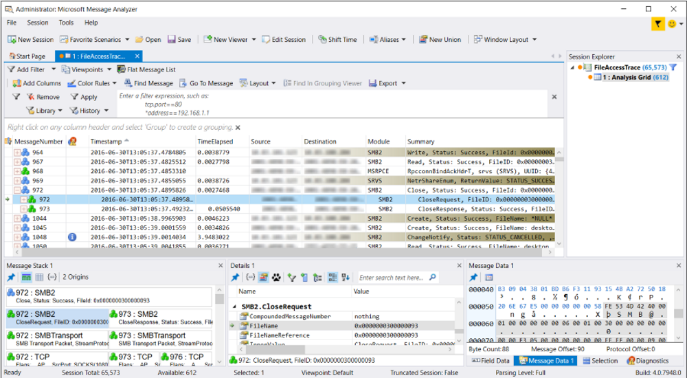  
  
 **Figure 14: Message Analyzer Analysis Grid viewer results with   a Session Filter and Color Rule Applied**  
  
   
## Using Special Filters for a Live Trace  
 You also have the option to use many other types of filters in a Live Trace Session, depending on the **Trace Scenario** and operating system you are running, as follows:  
  
-   **Fast Filters** and **WFP Layer Set** filters — accessible from the **Provider** tab of the **Advanced Settings – Microsoft-PEF-WFP-MessageProvider** configuration dialog. You can display this dialog by clicking the **Configure** link to the right of the **Microsoft-PEF-WFP-MessageProvider** listing on the **Live Trace** tab of the **New Session** dialog, after you select one of several **Trace Scenarios** that contain this provider from the **Select Scenario** drop-down list on the **ETW Providers** toolbar of the **Live Trace** tab. For example, the **Network Tunnel Traffic and Unencrypted IPSEC**, **Loopback and Unencrypted IPSEC**, and **Local Loopback Network** **Trace Scenarios** all use the **Microsoft-PEF-WFP-MessageProvider**.  
  
-   **Fast Filter Groups** and **Adapter filters** — accessible from the **Provider** tab of the **Advanced Settings – Microsoft-PEF-NDIS-PacketCapture** configuration dialog. You can display this dialog by clicking the **Configure** link to the right of the **Microsoft-PEF-NDIS-PacketCapture** listing on the **Live Trace** tab of the **New Session** dialog, after you select the **Local Network Interfaces** **Trace Scenario** from the **Select Scenario** drop-down list on the **ETW Providers** toolbar of the **Live Trace** tab. The **Microsoft-PEF-NDIS-PacketCapture** provider is available on computers running the Windows 7, Windows 8, or Windows Server 2012 operating system only.  
  
-   **HostName** and **Port** filters — accessible from the **Provider** tab of the **Advanced Settings – Microsoft-Pef-WebProxy** configuration dialog. You can display this dialog by clicking the **Configure** link to the right of the **Microsoft-Pef-WebProxy** provider listing on the **Live Trace** tab of the **New Session** dialog, after you select the **Pre-Encryption for HTTPS** **Trace Scenario** from the **Select Scenario** drop-down on the **ETW Providers** toolbar of the **Live Trace** tab.  
  
-   **Event**  **Keyword** and error **Level** filters — accessible from the **ETW Core** tab of any **Advanced Settings** dialog for any **Trace Scenario** that you select from the **Select Scenario** drop-down list. You can display this dialog by clicking the **Configure** link to the right of any provider listing on the **Live Trace** tab of the **New Session** dialog. Note that not all ETW Providers contain an event  **Keyword** configuration.  
  
-   **NDIS stack, Hyper-V-Switch extension layer, and Host adapter filters** — accessible from the **Provider** tab of the **Advanced Settings – Microsoft-Windows-NDIS-PacketCapture** provider configuration dialog. You can display this dialog by clicking the **Configure** link to the right of the **Microsoft-Windows-NDIS-PacketCapture** provider listing on the **Live Trace** tab of the **New Session** dialog, after you select the **Local Network Interfaces**, **Remote Network Interfaces**, or **Remote Network Interfaces with Drop Information** **Trace Scenario** from the **Select Scenario** drop-down list on the **ETW Providers** toolbar of the **Live Trace** tab. The **Microsoft-Windows-NDIS-PacketCapture** provider has remote capabilities and is available on computers that are running the Windows 8.1, Windows Server 2012 R2, or Windows 10 operating system only.  
  
     The filters that are available for the **Microsoft-Windows-NDIS-PacketCapture** provider in these scenarios consist of advanced driver-level filters that include the following:  
  
    -   Host adapter filters  
  
        > [!NOTE]
        >  If you want to isolate traffic to a particular virtual machine (VM) that is serviced by a Hyper-V-Switch, you should select the VM adapter in the Interface Selection (upper) section of the **Advanced Settings - Microsoft-Windows-NDIS-PacketCapture** dialog to select the adapter and then specify the MAC address of the VM adapter in the **MAC Addresses** box in the **Filters** section of the dialog, rather than simply selecting (enabling) the adapter. Otherwise, you could return all switch traffic rather than the traffic of a selected VM, given that a Hyper-V-Switch driver cannot distinguish between VMs.  
  
    -   NDIS stack and Hyper-V-Switch extension layer filters  
  
    -   Truncation filters  
  
    -   Packet traversal direction filters  
  
    -   IP protocol number filters  
  
    -   MAC address filtering  
  
    -   IP address filters  
  
     ___________________\_  
  
     **More Information**   
     **To learn more** about the filtering capabilities of the **Microsoft-Windows-NDIS-PacketCapture** provider, see [Using the Advanced Settings - Microsoft-Windows-NDIS-PacketCapture Dialog](using-the-advanced-settings-microsoft-windows-ndis-packetcapture-dialog.md).   
    **To learn more** about **Fast Filters** and **WFP Layer Set** filters, see the [Microsoft-PEF-WFP-MessageProvider](microsoft-pef-wfp-messageprovider.md) topic.   
    **To learn more** about **Fast Filter Groups** and **System Network Adapter** Group filters, see the [PEF-NDIS Fast Filters](pef-ndis-fast-filters.md) and [Using the Advanced Settings - Microsoft-PEF-NDIS-PacketCapture Dialog](using-the-advanced-settings-microsoft-pef-ndis-packetcapture-dialog.md) topics.   
    **To learn more** about **HostName** and **Port** filters, see the [Microsoft-PEF-WebProxy Provider](microsoft-pef-webproxy-provider.md) topic.  
    **To learn more** about **Keyword** event and error **Level** filters, see the [System ETW Provider Event Keyword/Level Settings](system-etw-provider-event-keyword-level-settings.md) topic.  
    **To learn more** about NDIS stack, Hyper-V-Switch extension layer, host adapter, and other special filters, see the [Configuring a Remote Capture](configuring-a-remote-capture.md) and [Using the Advanced Settings - Microsoft-Windows-NDIS-PacketCapture Dialog](using-the-advanced-settings-microsoft-windows-ndis-packetcapture-dialog.md) topics.  
    ___________________\_  
  
-   **Time Filter** — you can utilize a **Time Filter** to configure a window of time in which to view the results of a Message Analyzer session. This is particularly useful if you can approximate a time frame in which you suspect a particular issue occurred that you need to detect. It is also useful in situations where you are working with data from multiple input files in different time zones to which you have applied a **Time Shift** and you want to view all the data that exists in a particular time slot, for which you can create a **Time Filter** window.  
  
     **Applying a Time Filter to Captured Data**   
    The major advantage of using a **Time Filter** against a set of trace results is that you can remove it, modify the time window, reapply it, and repeat this process as many times as needed. You can display  the **Time Filter** configuration controls for session results by selecting **Add Time Filter** from the **Add Filter** drop-down list on the Filtering toolbar that appears above all session data viewers. The **Time Filter** configuration panel contains  the time slider controls and window definition readouts, along with the **Apply** and **Remove** buttons that enable you to alternately apply a **Time Filter** or remove its effects as required.  
  
     **Applying a Time Filter to Loaded Data**   
    You can also utilize a **Time Filter** to configure a window of time in which to view static data that you load into Message Analyzer from selected input files. Note in this case that the **Time Filter** configuration is applied *as* you load the data, rather than *after* you load the data. To apply a **Time Filter** to data that you are loading, you must create the **Time Filter** window during Data Retrieval Session configuration in the **New Session** dialog, where the **Time Filter** controls are located below the input **Files** list in the dialog. The **Time Filter** configuration will be applied by Message Analyzer after you click the **Start** button in the **New Session** dialog.  
  
     Note that you have the option to modify the original **Time Filter** configuration in the **Edit Session** dialog for  the Data Retrieval Session by clicking **Edit Session** on the global Message Analyzer toolbar. You will need to set the **Edit Session** dialog for **Full Edit** mode to enable the **Time Filter** controls. When the adjustments are complete, click the **Apply** button in the **New Session** dialog to apply the **Time Filter** changes to the data set.  
  
     Also note that if you did not apply a **Time Filter** to  the data loading process in a Data Retrieval Session, you still have the option to utilize the **Time Filter** feature from the **Add Filter** drop-down list on the Filtering toolbar. From  this location, you can use simple button clicks to alternately **Apply** and **Remove** the filtering effects as required.  
  
    > [!IMPORTANT]
    >  Message Analyzer provides you with the versatility to apply a **Time Filter** to the results of a Live Trace Session, the results of a Data Retrieval Session, or to the data loading process.  In the latter case, you can achieve performance enhancements due to the effects of a **Time Filter** on reducing the input message volume that is loaded into Message Analyzer. But this can have an effect on usability when the filtered-out messages have a bearing on the analysis in which you are engaged. When this is the case and you want to recover messages that the input **Time Filter** dropped, you will need to edit the session as described earlier, to create a different **Time Filter** configuration; this also has an impact on usability. Therefore, you might want to further consider the tradeoffs between performance and usability, especially when loading data from very large files.  
    >   
    >  ___________________\_  
    >   
    >  **More Information**   
    >  **To learn more** about the impacts on performance and usability with the **Time Filter** feature, see [Considering Performance vs. Usability Factors for Time Filter Application](applying-a-time-filter-to-session-results.md#BKMK_PerfVsUsability).  
    > ___________________\_  
  
 ___________________\_  
  
 **More Information**   
 **To learn more** about **Time Filters**, see [Applying a Time Filter to Session Results](applying-a-time-filter-to-session-results.md) and [Applying an Input Time Filter to a Data Retrieval Session](applying-an-input-time-filter-to-a-data-retrieval-session.md).  
___________________\_  
  
   
## Using View Filters to Manipulate a Set of Trace Results  
 After you capture or retrieve your message data in a Live Trace Session or Data Retrieval Session, respectively, you have a baseline set of trace results to work with. However, it is very likely that to analyze the data, you will want to manipulate it with various Message Analyzer tools to isolate specific messages of interest that can expose issues you are trying to detect. One of the most common ways to do this, is to use a view **Filter** to filter for data that is relevant to the problem you are trying to solve while filtering out data that isn't. This enables you to create a set of messages that is focused on the data you need to examine, without the encumbrance of scrutinizing potentially hundreds if not thousands of messages that are irrelevant to the issue at hand. When you apply a view **Filter**, the original data set is always preserved and re-displays after you remove it. Note that the effects of a view **Filter** apply to the in-focus data viewer only and do not impact other viewers, even in the same session.  
  
 You can display the configuration controls for a view **Filter** by selecting **Add Filter** from the **Add Filter** drop-down list on the Filtering toolbar that appears above all session data viewers. The controls that display in the **Filter** configuration panel enable you to specify a built-in or custom **Filter**, and then apply and remove it as required, as described in [Applying and Managing Filters](applying-and-managing-filters.md).  
  
 The built-in view **Filters** are contained in a centralized **Library** that is exposed in the following locations.  
  
-   **Filter** configuration panel that appears when you select **Add Filter** in the **Add Filter** drop-down list on the Filtering toolbar above any session data viewer.  
  
-   **Filter** configuration panel that appears when you select **Add Filter** in the **Add Filter** drop-down list on the Filtering toolbar above the **Grouping** viewer toolbar.  
  
-   **Session Filter** toolbar in the **New Session** dialog; for use when you are configuring a new Live Trace Session or Data Retrieval Session.  
  
-   **Add Viewpoint Filter** panel that appears when you select the **Add Viewpoint Filter** item from the **Add Filter** drop-down list on the Filtering toolbar. Note that a **Viewpoint** must be already applied to a set of trace results for this list item to be available for selection. Helps you to further refine your analytical focus on specific messages.  
  
-   **Find Message** panel that is accessible from the **Analysis Grid** viewer toolbar.  
  
-   **Edit Color Rule** dialog, which is accessible by clicking the **New Color Rule** in the **Color Rule** drop-down list on the **Analysis Grid** toolbar. Note that typical configuration of a **Color Rule** includes specifying a Filter Expression from the centralized **Library**.  
  
> [!TIP]
>  You can also specify a view **Filter** for a set of trace results by right-clicking a data field value in an **Analysis Grid** viewer column and selecting **Add '\<ColumnName>' to Filter**, where "\<ColumnName>" is a placeholder for the data column under which the data field appears. Note that this action automatically creates the Filter Expression in the **Filter** configuration panel, but does not apply it. As a result, you must manually apply such a **Filter** by clicking the **Apply** button in the **Filter** configuration panel. This feature enables you to automatically code a column value into a valid Filter Expression, which you can quickly apply to a set of trace results.  
  
 To specify a  view **Filter**, **Session Filter**, **Find Message** filter, **Color Rule** filter, or **Viewpoint Filter** for a set of trace results, you will need to either select a built-in Filter Expression from the centralized **Library** in the above specified locations, or manually create one as described in [Writing Filter Expressions](writing-filter-expressions.md). You will then need to click the **Apply** button (or **Find** command in the case of **Find Message** filters) for the **Filter** configuration to take effect. The centralized **Library** contains the built-in Filter Expressions that are provided by the **Message Analyzer Filters** asset collection in every Message Analyzer installation, for which you can use the following for the indicated purpose:  
  
-   **Asset Manager** dialog — to manage downloads and auto-sync updates for the **Message Analyzer Filters** asset collection or other collections. Asset Manager is accessible from the global Message Analyzer **Tools** menu.  
  
-   **Manage Filters** dialog — to export and import asset collection items to and from others, respectively, for mutual sharing. The **Manage Filters** dialog is accessible from every user **Library** drop-down list.  
  
 ___________________\_  
  
 **More Information**   
 **To learn more** about the functionality of the built-in view **Filters**, see the [Filtering Live Trace Session Results](filtering-live-trace-session-results.md) topic, which describes each **Filter** in the centralized Filter Expression **Library**.  
**To learn more** about auto-syncing, downloading, and managing the **Message Analyzer Filters** asset collection with the **Asset Manager** dialog, see the [Sharing Infrastructure](sharing-infrastructure.md) and [Managing Asset Collection Downloads and Updates](managing-asset-collection-downloads-and-updates.md) topics.  
___________________\_  
  
   
## Creating Custom Filters  
 To create your own Filter Expressions, you will need to understand the Message Analyzer Filtering Language. This Operating Guide devotes a significant amount of coverage to the subject, to help you  understand and use  the Filtering Language, as described in the "More Information" section that follows. Note that Message Analyzer provides the Filter IntelliSense service to assist you in creating your own Filter Expressions. Filter IntelliSense is an interactive and intelligent statement completion service that responds to the text that you enter in any Filter Expression text box, by providing a display of choices in response to the characters you type.  
  
 When you create your own custom **Filters** you must save them to the centralized Filter Expression **Library** that is exposed in the locations described earlier,  that is, if you want such **Filters** for future use and for sharing with others. However, before you save a **Filter** that you created, Message Analyzer performs a simple verification check to ensure that you have a valid expression, although checks on field names are  less restrictive in Message Analyzer v1.4 to enable operation with other parsers. Note that when you create and save a  custom **Filter**, it is located to the **My Items** category in the Filter Expression **Library**. Thereafter, you can simply select your custom **Filter** from the **Library** whenever you want to use it.  
  
 ___________________\_  
  
 **More Information**   
 **To learn more** about the Filtering Language, see [Writing Filter Expressions](writing-filter-expressions.md).  
**To learn more** about the Filter IntelliSense feature, see [Filter IntelliSense Service](filter-intellisense-service.md).  
 ___________________\_  
  
   
## Analyze Message Data  
 When analyzing data that you have either captured live on the network, loaded into Message Analyzer, or retrieved from a device such as a Bluetooth, you have the option to apply various types of filters to manipulate the way data is presented for analysis purposes. For example, you could apply various view **Filter**, **Time Filter**, **Color Rule**, **Column Filter**, and **Grouping** configurations to a set of trace results, to name a few. In addition, you might use the **Pattern Match** capability to detect message patterns across a set of trace results.  
  
 ___________\_  
  
 **Advisory**   
To review summary descriptions of the analysis tools that are available in Message Analyzer, see [Analyzing Message Data](analyzing-message-data.md). For further details about the tools mentioned in this topic, see "More Information" at the end of this section.   
___________\_  
  
 **Data Analysis Feature Highlights**   
Some highlights of the options you have for manipulating data are included here in the following features.  
  
-   **Viewpoints** — you have the option to apply a **Viewpoint** to enhance your data analysis and troubleshooting perspectives. When a **Viewpoint** is applied, you can examine network traffic from the perspective of a protocol because all messages above the “viewpoint” protocol are temporarily removed from display. This feature is advantageous when you have higher-layer traffic that obscures the underlying messages that you want to troubleshoot. To apply a **Viewpoint**, select one from the **Viewpoints** drop-down list on the Filtering toolbar that appears above each Message Analyzer session viewer that you open.  
  
     For example, you might apply a **TCP** **Viewpoint** to display TCP messages at top-level for diagnostic purposes. You could then select one of the **TCP** view **Layouts** for the **Analysis Grid** viewer or **Chart** viewer to expose additional data field values, calculated statistical values, or high-level data summaries that are particularly important to your analytical proceedings. You can do the same thing with an **HTTP** **Viewpoint** and then select one of the **HTTP** view **Layouts** for these same data viewers.  
  
-   **Grouping** — you have the option to organize trace results data into Groups that expose messages in a nested Group configuration that you can specify by executing the **Group** command that displays when you right-click an **Analysis Grid** viewer column. You can also utilize the **Grouping** viewer and select built-in  **Grouping** viewer **Layouts** that organize data into unique Group configurations that are designed to create a specific analytical focus, where you can summarize and expose target data in grouping categories across a high volume of messages.   The **Grouping** viewer also provides different modes of interaction with the **Analysis Grid** viewer, which includes the **Selection** and **Filtering** modes. For example, in the **Selection** mode, Group selection causes the Group messages to be *selected* in the **Analysis Grid** viewer; in the **Filtering** mode, Group selection causes the Group messages to be *filtered* in the **Analysis Grid** viewer.  
  
-   **Analysis Grid** viewer **Layouts** — you have the option to apply built-in view **Layouts** that contain an arrangement of data columns that are designed to assist you in data analysis and troubleshooting processes, for example, the **File Sharing SMB/SMB2**, **Network Conversation Tree with Process ID**, and **TCP Deep Packet Analysis with ABSOLUTE Sequence Number with Grouping** view **Layouts**. You can select a view **Layout** for the **Analysis Grid** viewer from the **Layout** drop-down list on the **Analysis Grid** viewer toolbar in an Analysis Session.  
  
-   **Flatten messages** — you can click the **Flat Message List** button on the Filtering toolbar to create a message display that resembles  how messages appear in Microsoft Network Monitor. This action breaks apart request and response message pairs that Message Analyzer encapsulates in Operation nodes by default, which can have an impact on analysis. This results in reorganizing messages in their original chronological order, with the exception of message fragments which remain under the expandable top-level message nodes that are each designated by a green-cubed icon. To re-establish the default Message Analyzer display, click the **Flat Message List** button again. A disadvantage of creating a flat message list is that responses to specific requests may be difficult to locate in high volume traces.  
  
-   **Field Chooser** — for any given set of data that displays in the **Analysis Grid** viewer, you should be aware that there are many more columns of data that you can add to the grid beyond the default column layout, to expose the values of message fields that could be critical to troubleshooting processes. You simply find the relevant protocol or module of interest in the **Field Chooser** **Tool Window**, expand the protocol node, and navigate to the data field you want to add to the **Analysis Grid** viewer column **Layout**. After you double-click the field name, the field is added to the **Analysis Grid** viewer as a new column, provided that the **Analysis Grid** viewer is in focus when you do so. At this time, data should display in the new field for the particular protocol or module of interest, unless the field is not used or contains no data.  
  
     If the [Grouping Viewer](grouping-viewer.md) is in focus, then double-clicking a field name in **Field Chooser** window will add a new nested Group to the current **Grouping** viewer **Layout** configuration. Note that you can also right-click any field in **Field Chooser** window and choose the **Add as Column** or **Add as Grouping** context menu command to add a column to the **Analysis Grid** viewer or a new nested Group to the **Grouping** viewer, respectively.  
  
    > [!NOTE]
    >  To access the **Field Chooser** window, if it is not already displayed, click the **Add Columns** button on the toolbar of the **Analysis Grid** viewer. If the **Grouping** viewer is in focus, you can access the **Field Chooser** by clicking the **Add Groupings** button on the toolbar of the **Grouping** viewer. The **Field Chooser** also appears in the **Windows** submenu of the global Message Analyzer **Tools** menu.  
  
    > [!TIP]
    >  View **Layouts** and column layouts are different terms that essentially describe the same feature or function in the **Analysis Grid** viewer. Also note that the **Grouping** viewer has its own set of view **Layouts** that are independent of view **Layouts** for the **Analysis Grid** viewer.  
  
-   **Pattern Matching** — provides a pattern matching capability that can identify sequential message patterns in a group of messages, for example virus signatures, processes in a faulty state that form a specific pattern, and other patterns such as request/response pairs.  You can match message sequences by executing user-designed or built-in Pattern expressions that are provided with the **Pattern Match** viewer.  
  
     Note that you can create a Pattern expression that is pre-populated with an initial configuration by selecting and right-clicking one or more related messages in the **Analysis Grid** viewer, such as HTTP or DNS, and then selecting the **Create Pattern** command that displays in the context menu that appears. You can also display the **Pattern Match** viewer from the **New Viewer** drop-down list on the global Message Analyzer toolbar to create a Pattern expression without any data population automation.  
  
-   **Filtering columns** — you can apply a **Column Filter** to any **Analysis Grid** viewer column, to filter your trace results according to search text that you specify for a column. You can also do the same for columns in the **Details** **Tool Window**, to filter for specific message field names or other data values in the **Details** window. Be aware that **Column Filters** search only on data that displays in top-level parent nodes; child nodes will not be included in the search unless you first expand them.  
  
-   **Aliases** — if you have any data fields that are difficult to work with, due to their cryptic or complex values, for example an IPv6 address, Message Analyzer enables you to convert their data values to a more user-friendly name for ease of recognition. To configure an **Alias**, right-click a field value that you want to convert and then select the **Create Alias for ‘** ***\<columnName>*** **’…** context menu item. This action causes the **Alias Editor** to display, from where you can configure a new **Alias**.  
  
-   **Unions**— if you have multiple data sources that relate to a common environment or service from which you have run traces or generated logs, it is not uncommon for the different data sources to specify different names for fields that have identical meaning and value types. If this occurs, you can create a **Union** to correlate the field values into a single, newly-named entity that you specify to reflect those values. This makes it easier to locate and analyze data in an interlaced set of messages from multiple sources.  
  
-   **Chart** viewer **Layouts** — Message Analyzer provides a wide range of **Layouts** that you can select for the **Chart** viewer. They are accessible from the **New Viewer** drop-down list on the global Message Analyzer toolbar. A description of the available **Layouts** are provided in the [Chart Viewer Layouts](chart-viewer-layouts.md) topic. In general, they display high-level data summaries and data formula-generated statistics in several graphic formats to enhance your analysis contexts through various types of data overviews. Some of these **Layouts** are designed to work together with the **Grouping** and **Analysis Grid** viewers to create integrated and interactive analysis environments, as described in [Working With Message Analyzer Profiles](working-with-message-analyzer-profiles.md). Note that you can even create your own custom-designed **Chart** viewer **Layouts** for the environment in which you typically work, as described in [Extending Message Analyzer Data Viewing Capabilities](extending-message-analyzer-data-viewing-capabilities.md).  
  
 **Other Data Analysis Features**   
Other techniques that you can use to analyze data consist of the following:  
  
-   **Tool Windows** — you can display additional **Tool Windows** to dramatically enhance the scope of analysis capabilities. These tools are accessible from the **Windows** submenu of the global Message Analyzer **Tools** menu.  
  
-   **Finding messages** — you can use the **Find Message** feature to locate individual messages. The **Find** command is designated by the **Find** binoculars icon in the **Find Message** window that displays when you click the **Find Messages** button on the toolbar of the **Analysis Grid** viewer. This command enables you to locate the next message that matches a specified Filter Expression, while still retaining visibility and context of all the messages in the original trace results. You can select either a built-in Filter Expression from the **Library** drop-down list in the **Find Message** window, or you can manually configure one, such as `contains “bing”` (or some other string), or `#MessageNumber==messagenumber`, to locate the next message that contains the value that you specify.  
  
     By using this command, you can dramatically impact your data analysis experience. Although Message Analyzer already provides the view **Filter** capability that works similarly, the disadvantage of a view **Filter** is that all messages surrounding the target message/s are hidden after view **Filter** application, unless they match the filter criteria. However, in many cases the context of the surrounding messages is key to the analysis. When this is the case, it might be better to employ a **Find** filter. A **Find** filter highlights the next top-level message that matches the filtering criteria, even if the match is to a message that is *within* the message stack of the highlighted top-level message, also known in this documentation as the origins tree.  
  
    > [!TIP]
    >  You can also use the **Go To Message** feature to locate a specified message by its number across one or more data sources or sessions.  
  
-   **Sorting** — you can sort data columns in the **Analysis Grid** viewer in ascending,  descending, or original capture order, to expose values or trends that can identify potential issues. For example, you can sort the **DiagnosisTypes** column of the **Analysis Grid** to bubble up all diagnostic messages for quick analysis.  
  
-   **Applying time shift values** — Message Analyzer provides a **Shift Time** dialog that enables you to apply a specific incremental time shift value to a message collection from a selected data source, when you *know* beforehand that a time shift is required. You can also specify a time shift for a particular message when you *discover* through analysis that a shift is required. Applying a time shift to a selected message then causes a recalculation of time stamps for all messages in a selected data source.  
  
     You can use this feature to synchronize multiple traces that you load into Message Analyzer, for example to adjust for machine clock skew or time zone changes across traces. You might also want to simply match the **Timestamp** of one message loaded from a particular data source to that of another message loaded from a different data source.  
  
-   **Adding bookmarks and comments** — you can add **Bookmarks** and **Comments** for annotation purposes to coordinate data analysis with other team members.  
  
    > [!NOTE]
    >  To quickly locate messages that have a **Comment**, you can add  the **HasComments** field as a new **Analysis Grid** viewer column from the **General** node of the **Field Chooser**.  
  
-   **Find in Grouping Viewer** — for any message that displays in the **Analysis Grid** viewer, you can locate the **Grouping** viewer Group that contains it. You simply right-click a message  in the **Analysis Grid** viewer and select the **Find in Grouping Viewer** context menu command. This results in a cross-correlation of data between viewers that can provide unique analysis contexts.  
  
-   **Parse As** — for any message type that displays in the **Analysis Grid** viewer, you can specify a different port on which that  message type will be parsed. Enables you to reparse a set of trace results based on alternate ports that you specify for specific protocols, to accommodate for network traffic that used alternate ports for security purposes.  
  
-   **Message Details** — you can click the blue- or green-cubed icon to the left of any message to display the **Details** of that message inline.  
  
 ___________________\_  
  
 **More Information**   
 **To learn more** about the details of working with filters and other data manipulation features for analysis, see the following topics:   
[Using the Filtering Toolbar](using-the-filtering-toolbar.md)  
[— Applying and Managing Filters](applying-and-managing-filters.md)  
[— Applying a Time Filter to Session Results](applying-a-time-filter-to-session-results.md)  
[— Applying and Managing Viewpoints](applying-and-managing-viewpoints.md)  
[— Working With Operations](working-with-operations.md)  
[— Creating a Flat Message List](creating-a-flat-message-list.md)  
[Using the Find Message Feature](using-the-find-message-feature.md)  
[Using the Go To Message Feature](using-the-go-to-message-feature.md)  
[Filtering Column Data](filtering-column-data.md)  
[Using and Managing Color Rules](using-and-managing-color-rules.md)  
[Pattern Match Viewer](pattern-match-viewer.md)  
[Using the Analysis Grid Group Feature](using-the-analysis-grid-group-feature.md)  
[Grouping Viewer](grouping-viewer.md)  
[Applying and Managing Analysis Grid Viewer Layouts](applying-and-managing-analysis-grid-viewer-layouts.md)  
[Using the Field Chooser](using-the-field-chooser.md)  
[Using and Managing Message Analyzer Aliases](using-and-managing-message-analyzer-aliases.md)  
[Configuring and Managing Message Analyzer Unions](configuring-and-managing-message-analyzer-unions.md)  
[Setting Time Shifts](setting-time-shifts.md)  
[Tool Windows](tool-windows.md)  
___________________\_  
  
   
## Save Message Data  
 After you have performed analysis of your message data, you have the option to save it in the Message Analyzer native  .matp file format or in the .cap format, as described in [Saving Message Data](saving-message-data.md). Thereafter, if you want to work further with the data or share it with others, you can quickly load the data back into Message Analyzer through a Data Retrieval Session, or you can load the data by using the **Open** dialog, which is accessible from the global Message Analyzer **File** menu or from the global Message Analyzer toolbar.  
  
 The figure that follows illustrates the **Save/Export Session** dialog, in which you can choose the messages you want to save. You have the option to save all messages that you captured in a Live Trace Session or loaded from a Data Retrieval Session, filtered messages only, or you can select specific messages to save.  
  
 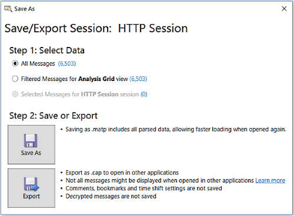  
  
 **Figure 15: Message Analyzer Save/Export Session dialog**  
  
 The following summarizes the different ways to save message data:  
  
-   **Use the Windows Save As dialog** — highlight one or more messages in the **Analysis Grid** viewer, right-click the group of messages, and then select the **Save Selected Messages…** context menu command to display the Windows **Save As** dialog. After you specify a name for the session messages you are saving, click the **Save** button to save the session in the native .matp file format only.  
  
-   **Use the Export feature** — click the **Export** button on the **Analysis Grid** viewer toolbar to save **All** or **Selected** messages in comma separated value (CSV) file format.  
  
-   **Use the Message Analyzer Save As dialog options** — highlight one or more messages in the **Analysis Grid** viewer and then click **Save As** in the **File** menu to display the **Save As** dialog. When you use this dialog to save data, you can specify additional save options with the use of three radio buttons under **Step 1** of the dialog, which includes the following:  
  
    -   **All Messages ()** — saves all messages in a set of trace results.  
  
    -   **Filtered Messages for \<viewerName> view ()** — saves the messages that result from a filtering operation.  
  
    -   **Selected Messages for \<sessionName> session ()** — saves only the messages that are selected in a set of trace results.  
  
     To save selected messages only with the dialog, use the third option, which parenthetically indicates the number of messages that you highlighted in the in-focus data viewer. Thereafter, click the **Save As** button in **Step 2** of the dialog to open the Windows **Save As** dialog, from where you can navigate to an appropriate directory location for saving the data in the native Message Analyzer .matp file format. To export the selected messages to a .cap file, click the **Export** button in **Step 2** of the dialog to display the Windows **Save As** dialog.  
  
 If you have a session configuration that consists of an aggregation of data from multiple sources that you have analyzed, Message Analyzer enables you to save your results to a single file in the default .matp format. Note then when you export your data as a .cap file, it will be compatible with the Microsoft Network Monitor tool and other applications, with certain exceptions that are described in [Compatibility with Exported CAP Files](compatibility-with-exported-cap-files.md).  
  
 ___________________\_  
  
 **More Information**   
 **To learn more** about saving Message Analyzer data, see [Saving Message Data](saving-message-data.md).   
___________________\_