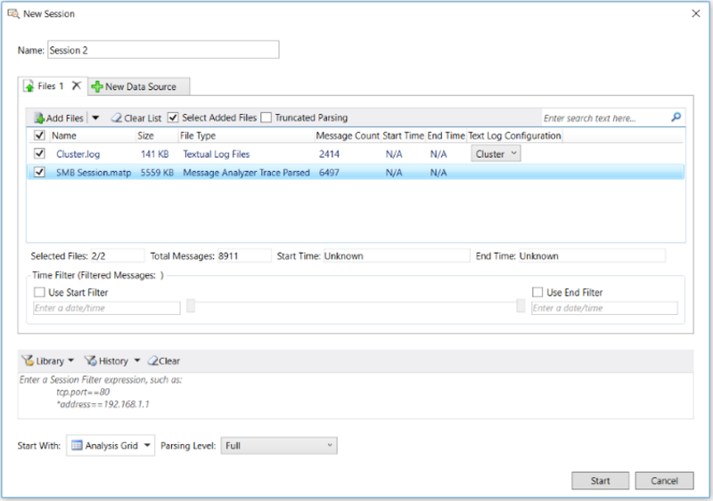

# Configuring a Data Retrieval Session
This section describes the typical tasks that you will perform when configuring a Data Retrieval Session, along with some background information on the features you will be using. Locating and selecting saved files or logs that contain the data you want to load into Message Analyzer is the only required task, while most others described in this section are optional, depending on what you wish to accomplish.  
  
 For example, if you are loading messages into Message Analyzer from a textual log file, you will need to make sure that you have a configuration file that enables Message Analyzer to parse such messages. You can do this by either selecting a built-in  configuration file from the **Text Log Configuration** drop-down menu on the **Files** tab of the **New Session** dialog, or by custom-coding one, as described in [Opening Text Log Files](../messageanalyzer_content/opening-text-log-files.md). On the other hand, specifying a **Session Filter** or a **Time Filter** is optional, although advised if you are working with large data files and you want to focus and limit data retrieval in a specific way.  
  
 In the discussions  that follow, see the following figure for the location of  referenced features.  
  
   
  
 **Figure 31: Data Retrieval Session configuration**  
  
## Data Retrieval Session Workflow Overview  
 The following steps are an overview of the workflow that you can generally follow when configuring a Data Retrieval Session. Features for the following configuration tasks are accessible from the **Files** tab of the **New Session** dialog:  
  
1.  Verify that the input data files from which you will be retrieving data are file types that are supported by Message Analyzer, as described in [Locating Supported Input Data File Types](../messageanalyzer_content/locating-supported-input-data-file-types.md).  
  
2.  Target the message data to be retrieved from one or more data sources such as saved trace files or logs, as described in [Performing Data Retrieval](../messageanalyzer_content/performing-data-retrieval.md).  
  
    > [!NOTE]
    >  You have the option to aggregate multiple data sources into a single session by making use of the **New Data Source** tab in a Data Retrieval Session. For additional details, see [Configuring Session Scenarios with Selected Data Sources](../messageanalyzer_content/configuring-session-scenarios-with-selected-data-sources.md).  
  
3.  Select specific files that contain the data you want to work with, to create a subset of a larger targeted set of input files, as described in [Performing Data Retrieval](../messageanalyzer_content/performing-data-retrieval.md).  
  
4.  Optionally, if you have saved messages that are truncated, you can use the **Truncated Parsing** mode to handle trace files that contain such truncated messages, for example, a .cap file. This results in retrieving a smaller number of messages and improving performance, based on a pared-down message parser set, as described in [Detecting and Supporting Message Truncation](../messageanalyzer_content/detecting-and-supporting-message-truncation.md).  
  
5.  Specify a built-in or custom **Text Log Configuration** file that is required to parse a textual log file containing messages that you want to load and analyze with Message Analyzer, as described in [Opening Text Log Files](../messageanalyzer_content/opening-text-log-files.md).  
  
6.  Optionally, if you have a very large set of input messages, you can configure and apply a **Time Filter** to create a precisely focused view of data in a specified window of time, as described in [Applying an Input Time Filter to a Data Retrieval Session](../messageanalyzer_content/applying-an-input-time-filter-to-a-data-retrieval-session.md).  
  
    > [!NOTE]
    >  Features for the configuration tasks that follow are accessible from outside the **Files** tab in the **New Session** dialog.  
  
7.  Optionally, configure and apply a **Session Filter** expression to the data being loaded to isolate specific data to be retrieved, as described in [Applying a Session Filter to a Data Retrieval Session](../messageanalyzer_content/applying-a-session-filter-to-a-data-retrieval-session.md).  
  
8.  Optionally, choose a built-in **Parsing Level** scenario that limits the stack level to which Message Analyzer parses and provides filtering that creates a focused set of messages for analysis purposes. In addition, applying a **Parsing Level** can also dramatically improve performance, as described in [Setting the Session Parsing Level](../messageanalyzer_content/setting-the-session-parsing-level.md).  
  
9. Optionally, specify a data viewer in which to display the results of your Data Retrieval Session, other than the default viewer, as described in [Selecting a Data Retrieval Session Viewer](../messageanalyzer_content/selecting-a-data-retrieval-session-viewer.md).  
  
10. Optionally, specify a **Name** for your Data Retrieval Session and a **Description**, as described in [Naming a Session](../messageanalyzer_content/naming-a-session.md).  
  
## Data Retrieval Session Filtering Overview  
 Two of the most important features that you can utilize to narrow the focus of data retrieval and significantly enhance Message Analyzer performance are the **Time Filter** and **Session Filter**. The following sections provide a brief overview of the advantages of using these filters in a Data Retrieval Session. Further details about these filters are described in the topics that are linked to in these sections.  
  
 **Using a Time Filter**   
The Data Retrieval Session configuration options in the **New Session** dialog also include a **Time Filter** that enables you to select a time window in which to view data from files that are selected in the files list on the **Files** tab of the **New Session** dialog. This filter provides timeline slider controls with which you can set a time window. As you adjust these controls, Message Analyzer displays the time boundaries and the number of messages contained in the window that you select, as described in [Applying an Input Time Filter to a Data Retrieval Session](../messageanalyzer_content/applying-an-input-time-filter-to-a-data-retrieval-session.md).  
  
 This feature is useful when you have a large data set and you can estimate the time window in which a particular issue has occurred. By configuring a **Time Filter**, you can load, view, and analyze messages in a specified time window only, without incurring the additional overhead of loading the entire message set. If necessary, you can even edit the session and reconfigure the **Time Filter** so you can view messages in another time frame. However, **Time Filter** reconfiguration is available only in the **Full Edit** mode for which a button displays in the **Edit Session** dialog when you **Edit** an existing session, as described in [Editing Existing Sessions](../messageanalyzer_content/editing-existing-sessions.md).  
  
> [!NOTE]
>  If you have an input file for which a Message Analyzer Data Retrieval Session does not display **Start Time** and **End Time** values, you can specify date-times in a format appropriate for the data file in the text boxes below the **Use Start Filter** and **Use End Filter** check boxes, as described in [Applying an Input Time Filter to a Data Retrieval Session](../messageanalyzer_content/applying-an-input-time-filter-to-a-data-retrieval-session.md).  
  
 **Using a Session Filter**   
If the input files for your Data Retrieval Session are large, you can limit the amount of data that you retrieve from such files and reduce consumption of system resources. You can do this by applying a **Session Filter** to the data to be loaded into Message Analyzer, to narrow the focus of retrieved data, improve performance, and streamline the analysis process, as described in [Applying a Session Filter to a Data Retrieval Session](../messageanalyzer_content/applying-a-session-filter-to-a-data-retrieval-session.md).  
  
## Data Retrieval Session Configuration Features  
 The following subtopics describe the Data Retrieval Session configuration features that Message Analyzer provides and various operations that Message Analyzer supports:  
  
 [Locating Supported Input Data File Types](../messageanalyzer_content/locating-supported-input-data-file-types.md)   
 [Detecting and Supporting Message Truncation](../messageanalyzer_content/detecting-and-supporting-message-truncation.md)   
 [Decrypting Input Data](../messageanalyzer_content/decrypting-input-data.md)   
 [Selecting Data to Retrieve](../messageanalyzer_content/selecting-data-to-retrieve.md)   
 [Selecting a Data Retrieval Session Viewer](../messageanalyzer_content/selecting-a-data-retrieval-session-viewer.md)   
 [Working With Special Input Requirements](../messageanalyzer_content/working-with-special-input-requirements.md)   
 [Acquiring Data From Other Input Sources](../messageanalyzer_content/acquiring-data-from-other-input-sources.md)   
 [Merging and Aggregating Message Data](../messageanalyzer_content/merging-and-aggregating-message-data.md)   
 [Naming a Session](../messageanalyzer_content/naming-a-session.md)  
  
 _____________________\_  
  
 **Retrieving the Data**   
When you are ready to load data into Message Analyzer, see  [Performing Data Retrieval](../messageanalyzer_content/performing-data-retrieval.md) to review various methods for retrieving saved data with Message Analyzer.   
_____________________\_