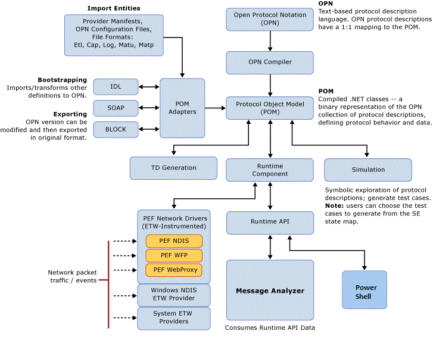

# PEF Architecture Tutorial
This tutorial briefly describes the main features of the Microsoft Protocol Engineering Framework (PEF) that directly support the functions of Message Analyzer. A diagram of PEF architecture is included along with supporting conceptual descriptions, to show how Message Analyzer functions are enabled by the framework.  
  
## PEF Components  
 Message Analyzer is a new tool for capturing, displaying, and analyzing network traffic, system events, device messages, and log data. It is the key, outwardly-facing component in the Protocol Engineering Framework. PEF was created by Microsoft to help improve protocol design, development, documentation, and testing. The following major messaging functions are provided by various PEF components:  
  
-   Message capturing  
  
-   Message representation as Open Protocol Notation (OPN) descriptions  
  
-   Message parsing, stack and fragment reassembly, and filtering  
  
-   Message validation (data, behavior, and architecture) based on protocol-specification standards  
  
 Message Analyzer directly relies upon the following components of the PEF architecture to support its functionality:  
  
-   **OPN** — the protocol description language that enables developers to model protocol architecture, behavior, and data. The entire OPN system, including types, actors, endpoints, and flow is implemented in .NET classes. OPN and .NET classes are compiled to produce a binary representation of each OPN protocol description that defines specific protocol architecture, behavior, and data. Compiled versions of the OPN descriptions reside in a binary model cache known as the protocol object model (POM), which is in turn consulted by the Runtime component for matches to messages  received on the wire.  
  
     Message Analyzer relies upon the presence of compiled OPN protocol descriptions so it can display messages that have been captured and parsed by the PEF Runtime.  
  
-   **OPN Compiler** — provides the compilation infrastructure for OPN protocol descriptions. The OPN Compiler generates the binary structures that comprise the POM.  
  
     Message Analyzer relies upon the OPN Compiler to ensure that all OPN definitions, descriptions, and filter expressions are verified, so that messages captured in a Live Trace Session or loaded into Message Analyzer from logs and/or trace files in a Data Retrieval Session can be properly parsed by the PEF Runtime and thereafter displayed in a Message Analyzer viewer.  
  
-   **POM** — a binary representation of a set of OPN text files in the form of a decorated syntax tree. These descriptions are utilized by the PEF Runtime to parse messages whenever you run a Live Trace Session, if you load an unparsed trace file in .matu format, if you load a log file such as an ETL, or whenever you reparse a trace file.  
  
-   **PEF Runtime** — accepts messages from various components, such as network drivers, ETW instrumented message providers, and logs, and processes them by using the parsing information (compiled protocol descriptions) that reside in the POM. The Runtime component also provides an API that enables Message Analyzer and PowerShell to interface with it. Message Analyzer relies upon the Runtime to capture and parse messages and to provide those messages through its API so that Message Analyzer can access and display them in selected data viewers.  
  
     The PEF Runtime is of central importance to Message Analyzer in performing the following tasks:  
  
    -   Listening for message packets from network driver interfaces, input adapters, and other components that are instrumented as ETW providers.  
  
    -   Querying the POM to determine if OPN protocol descriptions exist that correspond to retrieved message packets.  
  
    -   Constructing OPN representations of retrieved packets, providing that corresponding OPN protocol message descriptions were written and compiled.  
  
    -   Dispatching the OPN packet representations to internal "endpoints" that are monitored by POM "listeners", or “actors”, which in turn decode the packets and pass them to higher endpoints up the processing chain, repeating this process until all packets in the message stack are decoded.  
  
    -   Enabling Message Analyzer to access the decoded messages through the Runtime API and to display them in a data viewer such as the **Analysis Grid**.  
  
    -   Allowing PowerShell to access messaging functions through the Runtime API.  
  
-   **PEF Driver-Providers** — provide the network interfaces for capturing events and messages that are passed to the Runtime parsing engine. For example, the **Microsoft-PEF-NDIS-PacketCapture** provider captures data on the wire starting at the Data Link Layer; the **Microsoft-PEF-WFP-MessageProvider** captures data above the Network/IP Layer; and the **Microsoft-PEF-WebProxy** provider captures HTTP client browser traffic, unencrypted HTTPS, and other messages at the Application layer.  
  
    > [!NOTE]
    >  The **Microsoft-Windows-NDIS-PacketCapture** provider also captures messages at the Data Link Layer and above; however, this provider also has remote capabilities that you can employ in certain scenarios, as described in [Built-In Trace Scenarios](built-in-trace-scenarios.md). In addition, this provider is available on computers running the Windows 8.1, Windows Server 2012 R2, Windows 10, or later  operating systems only.  
  
     All PEF drivers are instrumented for Event Tracing for Windows (ETW) so they can take advantage of the ETW infrastructure and deliver both events and captured network traffic. In turn, the events and network messages are passed to the Runtime parsing engine and thereafter Message Analyzer can display them.  
  
    > [!NOTE]
    >  The PEF Runtime can also parse messages from system ETW providers that exist on your computer, as long as Message Analyzer was able to retrieve a manifest for them during installation. After Message Analyzer successfully finds and stores the manifest for a system ETW provider, you can capture the  provider's events during a Live Trace Session. However, you must first select the ETW provider you want to use  in the ***Add Providers*** drop-down list on the **ETW Providers** toolbar of the **New Session** dialog during Live Trace Session configuration, as described in [Adding a System ETW Provider](adding-a-system-etw-provider.md).  
  
   ---  
  
     **More Information**   
     **To learn more** about PEF providers and their features, see [PEF Message Providers](pef-message-providers.md).   
  ---  
  
-   **Input Adapters** — provide the interfaces that define entry points or “chokepoints” into the PEF Runtime for various Import Entities, in message file formats such as .etl, .cap, .log, .matu, and .matp.  
  
 PEF architecture also contains other components, such as a POM Adapter that provides importing and exporting facilities; Simulation, which enables modeling of protocol test suites; and technical document (TD) generation, which produces documentation stubs and other artifacts for writers. These components are mentioned here because they interact with OPN protocol descriptions as part of PEF architecture, but are not directly related to Message Analyzer functions, with the exception of certain POM adapters.  
  
## Message Analyzer Integration into the PEF Architecture  
 The diagram that follows shows how Message Analyzer fits into the PEF architecture.  
  
   
  
 **Figure 16: PEF component architecture**  
  
---  
  
 **More Information**   
 **To learn more** about OPN programming, see the [OPN Programming Guide](http://download.microsoft.com/download/3/E/8/3E845130-349C-4EFC-B634-C7DBD46140B7/OPN%20Programming%20Guide%20v4.4.docx), which is currently available from the Microsoft download site. In the future, an *OPN SDK* may be available on MSDN to include tutorials, walkthroughs, standard library, language, and other managed reference documentation, depending on demand.  
**To learn more** about viewing the OPN definition for any protocol or module that Message Analyzer parses, see [Viewing OPN Source Code](viewing-opn-source-code.md).  
**To review** an OPN walkthrough for two TCP Pattern Expressions that are provided by default with Message Analyzer, see [Understanding Message Pattern Matching](understanding-message-pattern-matching.md).  
**To learn more** about how to create an OPN configuration file that parses a custom text *.log file, see [Parsing Input Text Log Files](message-analyzer-tutorial.md#BKMK_ParsingLogFiles).  
---