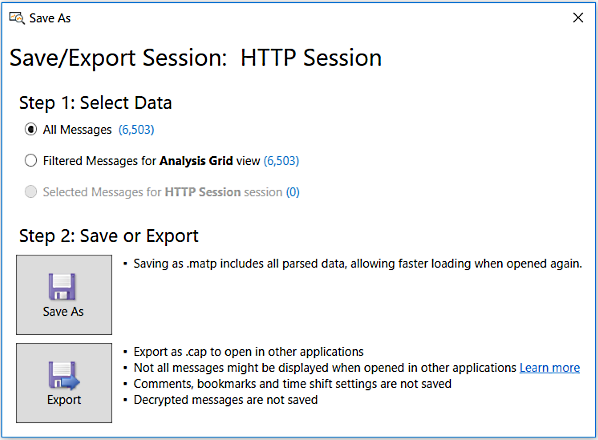

# Saving Session Data
Message Analyzer enables you to save message data that is loaded from any Data Retrieval Session or captured in any Live Trace Session. If you start a new Data Retrieval Session and load data from one or more saved message files, or you capture messages in a Live Trace Session, you can save certain modifications that you made to the data set if you save in the Message Analyzer native parsed (.matp) file or .cap file formats only. The modifications to a set of trace *results* that can be saved are described in [Saving Message Data](saving-message-data.md). Note that the capture file (.cap) format can be viewed in other applications such as Microsoft Network Monitor.  
  
 If you open a supported message file (see [Locating Supported Input Data File Types](locating-supported-input-data-file-types.md)) of non-native format, for example with the **Open** feature, and you manipulate the data, you can save the resulting data set in one of the previously indicated file formats only. Also, if you load data from a saved file in parsed .matp format or any other supported format, and you need to resave it after manipulating the data, you can only save it again in the same .matp format, or you can export it as a .cap file. If you start a new Live Trace Session, you can save the session data that you capture in either of the indicated file formats.  
  
## Using the Save As/Export Session Dialog  
 When you are ready to save your data, click the **Save As** item in the Message Analyzer **File** menu to display the **Save/Export Session** dialog that is shown in the figure that follows. This dialog provides you with the option to save all messages, a message set that resulted from applying one or more filters or other operations, or a selected set of messages from the Data Retrieval Session or Live Trace Session results.  
  
> [!NOTE]
>  Message Analyzer also opens the **Save/Export Session** dialog when you click the **Save Trace (Ctrl+S)** icon in the upper left corner of the Message Analyzer user interface.  
  
   
  
 **Figure 68:  Save/Export Session dialog**  
  
 For example, the session results that you save might be one of the following:  
  
-   Data from multiple log files imported from a Data Retrieval Session that you consolidated and processed for analysis purposes.  
  
-   Analyzed data from a Data Retrieval Session or Live Trace Session, where you manipulated the data results, for example, by applying a view **Filter** and a **Time Shift**.  
  
-   Loaded trace data to which you applied a **Session Filter** or **Time Filter**, to narrow down the focus to a specific set of messages or a window of time, respectively.  
  
-   Live trace data to which you applied a **Session Filter** or **Fast Filter**, to reduce trace results to a focused set of messages with specific properties.  
  
-   Data captured in scenarios that used ETW system providers, keyword and level filters, adapter filters, or other special filtering and modifiers.  
  
> [!TIP]
>  When you want to save the results of a Live Trace Session that has never been saved before, use the **Save As** command from the Message Analyzer **File** menu to display the **Save/Export Session** dialog.  If you want to save the results of changes you have made to an existing session, for example, where you have applied a **Time Shift** or added **Bookmarks** and **Comments**, use the **Save** command from the Message Analyzer **File** menu to silently preserve the changes in the session file.  
  
## Saving Session Results  
 After loading, capturing, manipulating, and analyzing data, you can save your session results set to a single native file only for which you specify a new name, or you can overwrite an original file with the new results set. The save process aggregates all message data in the selected session (or a filtered subset of the data) into this single file no matter how many files you originally included in the input file configuration. Moreover, if you attempt to reload data from this newly saved file, Message Analyzer will display the name of the new file in the files list and retrieve all the aggregated data contained in that file after you start the Data Retrieval Session.  
  
 Message Analyzer also enables you to save session results after working with either of the following:  
  
-   Any file that you open from the **Recent File** list, which displays to the right of **Open** item when you click it in the Message Analyzer **File** menu.  
  
-   Any logs or files that you load into Message Analyzer through the **Open** feature.  
  
 Message Analyzer enables you to save data for one session at a time only. Even if you have multiple viewer tabs open for a particular session, only one data set will be saved for that session. If you save the session data and then reload it through a Data Retrieval Session, it will display in the **Analysis Grid** viewer by default, even if you had a viewer tab open for the session other than the **Analysis Grid** viewer. If you want to save data from more than one session that Message Analyzer displays, you will need to select appropriate session tabs and save the data for each session separately.  
  
> [!IMPORTANT]
>  When you save data from a Live Trace Session in the native .matp file format, Message Analyzer automatically stores the OPN parsers used in the trace so that .matp files become portable. This ensures that a different Message Analyzer installation will be able to parse the messages in ported files when they are reloaded through a Data Retrieval Session or the **Open** feature.  
  
## Saving Session Data to the Default Location  
 After you open the **Save/Export Session** dialog and you click the **Save As** button, a **Save As** dialog opens to the following default location for saving Message Analyzer session data:  
  
 `c:\Users\<username>\Documents\MessageAnalyzer\Traces\`  
  
 By saving session data in this location, you are assured that you will retain all historical trace data that you previously saved, should you need to perform an upgrade or reinstallation of Message Analyzer. Note that you can change the default location in which to save your session data; however, you should not save any session data (or assets) to the following location because it is overwritten during Message Analyzer upgrades or reinstallations:  
  
 `c:\Users\<username>\AppData\Roaming\Microsoft\MessageAnalyzer\`  
  
> [!TIP]
>  If for some reason you need to use this location for storing Message Analyzer data, you should back up any session data or assets that you have stored there, as they will be deleted during Message Analyzer installation.  
  
 ___________________\_  
  
 **More Information**   
 **To learn more** about saving message data that was loaded with a **Time Filter** applied, see the procedure [Apply a Time Filter to Data Loading and Save the Message Collection](procedures-using-the-data-retrieval-features.md#BKMK_importSaveMsgCollection).  
___________________\_