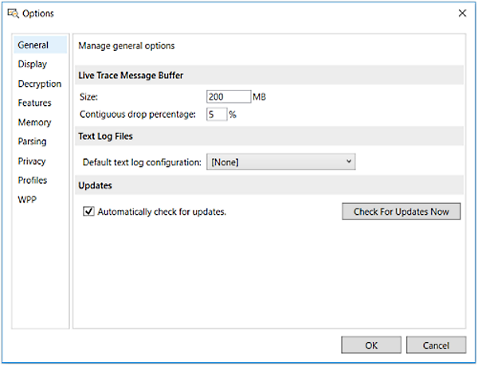

# Setting Message Analyzer Global Options

Message Analyzer provides a global **Options** dialog that is accessible by clicking the **Options** item in the Message Analyzer **Tools** menu. The **Options** dialog is shown in the figure that follows:

 

 **Figure 18: Message Analyzer Options Dialog**  

 In the dialog, you can specify several global options such as default values and selections that can affect Message Analyzer performance, display configurations, feature activation, and parsing functionality. You can set these options at any time; however, you would typically do so prior to starting a Live Trace Session where you capture new data, or prior to a Data Retrieval Session where you load data from saved files into Message Analyzer.

## Setting Global Options

 The Message Analyzer options that are available from the **Options** dialog on the indicated tabs below consist of the following:

- **General** tab — enables you to specify various default global settings for Message Analyzer, as follows:

  -   **Live Trace Message Buffer** pane — provides settings that determine the rate at which packets are dropped when exceeding the buffer limit.

       ---
         
       **More Information**  
       For information about setting the buffer size and count for an ETW session, see [Specifying Advanced ETW Session Configuration Settings](specifying-advanced-etw-session-configuration-settings.md).

       ---
         
  -   **Text Log Files** pane — provides a **Default text log configuration** drop-down list that enables you to select a predefined default or custom configuration file for parsing text logs, as described in [Opening Text Log Files](opening-text-log-files.md). You can specify a chosen value that reflects a text log type that you regularly work with, as described in [Parsing Input Text Log Files](message-analyzer-tutorial.md#BKMK_ParsingLogFiles).

       ---
         
       **More Information**  
       For more information about creating text log configuration files, see [Addendum 1: Configuration Requirements for Parsing Custom Text Logs](addendum-1-configuration-requirements-for-parsing-customtext-logs.md).

       ---

  -   **Updates** pane — enables you to configure Message Analyzer to **Automatically check for updates** and provide notification when an updated version of Message Analyzer is available for download. Also provides the option to override the automatic setting and check for updates at any time you wish, by clicking the **Check for Updates Now** button.

- **Display** tab — provides the controls that enable you to change the time format and time zone used by Message Analyzer, along with options for the binary value display format used by Message Analyzer.

  -   **Time Display** pane — provides settings that enable you to specify the time format used by Message Analyzer. This includes options for **Date and time format**, in addition to a **Reference Time Zone** setting.

       ---

       **More Information**  
       For more information, see [Configuring Time Format Settings](configuring-time-format-settings.md).

       ---

  -   **Binary Values** — by selecting one of the following options on the **Display** tab of the **Options** dialog, you determine the default format in which Message Analyzer displays binary values, for example, in the **Details** **Tool Window** and the **Analysis Grid** viewer:

      -   **Display as ASCII**

      -   **Display as Hex**

      -   **Display as Decimal**

  The priThe primary use for this feature is to enable you to choose the data format that displays for the **Payload** field in the **Details** window. For example, by using the default **ASCII** setting, you can cause key information to be exposed in the **Payload** field as text, such as an error string, file path, or other indications that can be useful. Note that you can override the default value in either **Details** or the **Analysis Grid** viewer from the right-click context menus in those locations.

- **Decryption** tab — provides the controls that allow you to import and select server certificates and to specify passwords that are required to enable Message Analyzer to decrypt traffic that is encrypted with the Transport Layer Security (TLS) and Secure Sockets Layer (SSL) security protocols. For example, Message Analyzer can decrypt HTTPS and Remote Desktop Protocol (RDP) messages.

   ---
     
   **More Information**  
   For more information, see [Decrypting TLS and SSL Encrypted Data](decrypting-tls-and-ssl-encrypted-data.md).

   ---

- **Features** tab — provides for selection of preview features that you can enable in Message Analyzer. After you select a preview feature, you must restart Message Analyzer for the change to take effect, at which time the feature/s will be available in your asset libraries. A check mark in a preview feature check box will make it available on the next Message Analyzer restart.

  > [!NOTE]
  >  Preview features are experimental and may not always work as expected. They are made available so that you can try out new Message Analyzer functionality and provide [Feedback](message-analyzer-feedback.md) on suggested features. Your feedback will help Microsoft make fixes and improvements to Message Analyzer. Note that you can also use the Message Analyzer feedback mechanism that is located in the upper right section of the user interface.

- **Memory** tab — specifies the current memory statistics for Message Analyzer, such as values for **Working Set** and **.NET Current Memory Allocation**, along with the current state (enabled/disabled) of **Server Garbage Collection**. Also contains instructions for how to disable the **Server Garbage Collection** mode to reduce memory consumption, although this could result in lower throughput. The default value for **Server Garbage Collection** is enabled.

- **Parsing** tab — enables you to reparse a set of trace results based on alternate ports that you specify for specific protocols, to accommodate for network traffic that used alternate ports for security purposes. Protocols that are available for alternate port settings are included in the list that follows:

  > [!NOTE]
  >  In addition, the **TCP** protocol is included so you can reparse with TCP auto-reassembly disabled to reduce virtual segment message count; you can also reparse with verbose TCP diagnosis messages enabled. The default values for these two features are enabled and disabled, respectively.

  -   **AllJoyn**
  -   **HTTP**
  -   **LDAP**
  -   **NetFlow/IPFIX**
  -   **RDP**
  -   **SMB/SMB2**
  -   **SSL/TLS**
  -   **TCP**
  -   **TDS**
  -   **TURN**
  -   **WSRMTCPPort**

  After you select an alternate port on which to reparse the messages of a supported protocol, a reload of all data for reparsing will occur immediately after you click the **OK** button to exit the **Options** dialog. Note that you can display the **Parsing** tab of the **Options** dialog by right-clicking a message in the **Analysis Grid** viewer and then selecting the **Parse As...** command in the context menu that appears.

- **Privacy** tab — enables you to opt-in or opt-out of the **Microsoft Message Analyzer Experience Improvement** program.  You can also give permission or withhold it from Microsoft to contact you regarding  Message Analyzer feature and feedback surveys. Note that a **Feedback** drop-down list is now provided in the upper-right corner of the Message Analyzer user interface.

- **Profiles** pane — enables you to select from among multiple **Profiles** that each provide a preset data viewer and **Layout** configuration that creates a targeted analytical environment for an input file type for which each **Profile** is configured. Also enables you to create your own custom **Profiles**. You can also specify a chosen data viewer as the default **Profile** for all Live Trace Session and Data Retrieval Session results. For example, the **Analysis Grid** viewer is initially set as the Message Analyzer application default.

  ---
  
  **More Information**  
  For more information, see [Working With Message Analyzer Profiles](working-with-message-analyzer-profiles.md).
  
  ---

- **WPP** pane — enables you to specify symbol resolution information that defines the structure of WPP-generated events, so that Message Analyzer can parse and display such events.

  ---
  
  **More Information**  
  For more information, see [Loading WPP-Generated Events](loading-wpp-generated-events.md).
  
  ---
