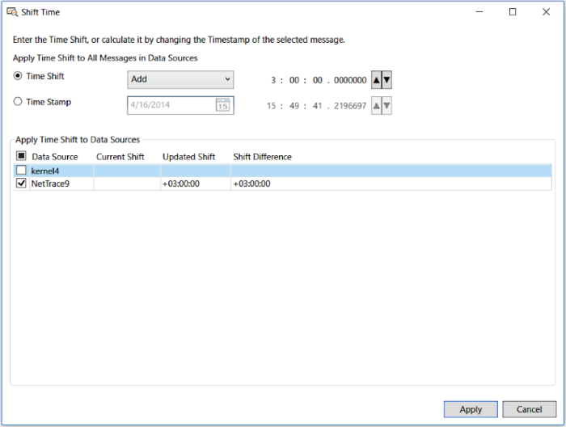

# Setting Time Shifts

Message Analyzer provides a **Shift Time** dialog that enables you to change the timestamp of captured messages displaying in an Analysis Session. The purpose of this feature is to compensate for skewed system clock values or time zone differences across different computers when comparing traces and logs from those computers, either side-by-side in separate Live Trace Sessions or when viewing interlaced message configurations in a single Data Retrieval Session. Ensuring that traces are chronologically aligned is important for troubleshooting. For example, if you have different traces that are interlaced in a Data Retrieval Session, messages that are offset by skewed system clock values will appear in an incorrect sequence that makes data comparison very difficult.  
  
 The following are two different ways that you can apply a **Time Shift** to a set of data sources in a session, along with the circumstances in which you might apply them:  
  
-   **Explicitly enter a** **Time Shift** — in this case, you might not have looked at the content of your data sources, but you know in advance that the **Timestamp** values are off, for example, because some of the data was captured in a different time zone. An explicit time shift value is applied to all messages in selected data sources for the current session.  
  
-   **Adjust the** **TimeStamp** **of a particular message** — this automatically initiates a **Time Shift** calculation for all messages in selected data sources for the current session. In this case, you are in analysis mode and you discover that message **Timestamps** are off and you need to synchronize certain data sources.  
  
## Applying a Time Shift  

 Before you can apply a time shift, you must open the **Shift Time** dialog in either of the following ways:  
  
-   By clicking the **Shift Time** button on the global Message Analyzer toolbar.  
  
-   By clicking the **Shift Time** item in the **Shift Time** submenu of the global Message Analyzer **Session** menu.  
  
-   Right-clicking any message in the **Analysis Grid** viewer and selecting the **Shift Time…** item in the context menu that appears.  
  
After you open the **Shift Time** dialog shown in the figure below, you can apply a time shift that changes the **Time Stamp** values for a set of messages by configuring a time shift with the **Shift Time** dialog controls and then clicking the **Apply** button. In the figure below, a 3-hour time shift is being added to a data source to account for a time zone difference.  
  
  
  
**Figure 62: Message Analyzer Shift Time dialog**  
  
## Dialog Entry Contexts  

 There are two different contexts in which you can open the **Shift Time** dialog, as follows:  
  
-   **Without message context** — if you open the **Shift Time** dialog with no messages selected in the **Analysis Grid** viewer, the dialog is entered *without message context*, where the **Time Stamp** option and related controls are disabled and contain no prepopulated values. This context automatically selects the **Time Shift** option when the **Shift Time** dialog opens, which provides the controls to configure an explicit time shift.  
  
     You can set an explicit time shift to compensate for **Timestamp** differences, by incrementing or decrementing all message **Timestamps** for selected data sources, to adjust for hour, minute, and second value displacements with up to 7 decimal digits resolution. You might use this context because you know that the messages from a particular data source need a time shift and you know what that value is.  
  
-   **With message context** — if you open the dialog while a message is selected in the **Analysis Grid** viewer, the dialog is entered *with message context*, where the **Time Stamp** option controls are enabled and contain prepopulated values associated with the selected message. This context provides options to configure a time shift based on the **Timestamp** value of a selected message, where you can accommodate for message **Timestamp** differences between data sources by specifying settings that calculate the following:  
  
    -   A change to the date of all message **Timestamps** in selected data sources.  
  
    -   An incremental or decremental **Timestamp** change to all messages in selected data sources, by making adjustments to hour, minute, and second value displacements with up to 7 decimal digits resolution.  
  
 You might be using this context because you discovered during analysis that messages from a particular data source need a time shift and you want to calculate the shift based on a known/selected message **Timestamp** value.  
  
## Context-Enabled Dialog Controls  

 When you open the **Shift Time** dialog *without message context* by clicking the **Shift Time** drop-down list on the global Message Analyzer **Session** menu, the following menu items are available to perform the indicated actions (these options are unavailable when you click the **Shift Time** button on the global Message Analyzer toolbar):  
  
-   **Shift Time** — displays the **Shift Time** dialog.  
  
     When you open the dialog without message context, the **Time Shift** option and associated controls are enabled, with the **Time Shift** drop-down set to **Add** and the **Time Shift** spin control values set to zero. The **Time Stamp** option is disabled in this context, but the **Apply Time Shift to Data Sources** pane may be populated with values if you previously specified a time shift in the current session. By using the **Time Shift** controls that display in the *without message context* mode, you can specify an explicit incremental time shift for all messages in selected data sources to compensate for skewed **Timestamp** values.  
  
-   **Remove All Time Shifts** — removes all time shifts for the current in-focus session.  
  
When you open the **Shift Time** dialog *with message context*, that is, while a message is selected in the **Analysis Grid** viewer, all controls in the **Shift Time** dialog are enabled so you can specify an incremental time shift value as well as a date change to accommodate **Timestamp** differences. Also, the **Apply Time Shift to Data Sources** pane may be populated with values if you previously specified a time shift and reopened the **Shift Time** dialog in the current session.  
  
## Using the Time Shift Controls  

 The controls in the **Shift Time** dialog provide time shift functionality as follows:  
  
-   **Time Shift** option — enables the following controls that allow you to set an incremental time shift value — in hours, minutes, and seconds, with up to 7 decimal digits resolution — that alters all message **Timestamps** in selected data sources:  
  
    -   **Time Shift** drop-down — sets the arithmetic operator for the time shift, by specifying either the **Add** or **Subtract** menu item.  
  
    -   **Time Shift** up-down — sets the actual incremental time shift value that you apply to selected data sources.  
  
    -   **Time Shift** spin — works interactively with the **Time Shift** up-down control by enabling you to place your mouse cursor in any of the spin control fields, consisting of hh:mm:ss.ddddddd, and click the up or down arrows to add or subtract a specified increment of time, respectively.  
  
-   **Time Stamp** option — enables the following controls to allow you to set an incremental time shift value and/or change the calendar date for all messages in selected data sources:  
  
 > [!NOTE]
 >  If you enter the **Shift Time** dialog *with message context*, the **Time Stamp** controls reflect the date-time stamp values of the message that is currently selected in the **Analysis Grid** viewer.  
  
  -   **Date** — consists of a date control that drops down when you click it. Enables you to specify a date that shifts the **Timestamp** values of all messages in selected data sources in 24-hour increments.  

  -   **Time Stamp** up-down and spin — works interactively to enable you to add or subtract a specified increment of time, as previously described.  
  
-   **Apply Time Shift to Data Sources** pane — specifies time shift statistics that include **Current Shift**, **Updated Shift**, and **Shift Difference** values. Also specifies the data sources for the current session in the **Data Source** column.  
  
## Time Shift Example  

 In practice, it is likely that you will apply a **Time Shift** to one or more selected data sources. For example, you might have loaded data from two trace files and you either already know that a time shift is required for one of the files, or you discover this during analysis.  
  
 In the first case, where you did not select any messages in the **Analysis Grid** viewer (without message context), you can open the **Shift Time** dialog in the previously stated manner and simply select the **Data Source** in the **Apply Time Shift to Data Sources** grid of the dialog for the messages that require a shift, while deselecting all others. You can then use the **Time Shift** controls to add or subtract a configured time shift value and click the **Apply** button to increment or decrement the **Timestamps** for the selected data source by the value that you specified. This action applies the time shift to all messages in a selected data source. At this point, you can sort the **Timestamp** column in the **Analysis Grid** viewer to interlace the message collection in chronological order for analysis purposes.  
  
 In the second case, where you select and right-click a particular message in the **Analysis Grid** viewer (with message context) and select the **Shift Time** menu item, the **Shift Time** dialog opens with the **Time Stamp** option/controls enabled and containing the **Timestamp** value of the selected message. You can specify whether to add or subtract a **Time Shift** value in the **Time Shift** drop-down and you can now select the **Time Stamp** option to enable the **Time Stamp** date, spin, and up-down controls. Using these controls, you can specify a date and incremental time shift value based on the value of the selected message. For example, you might want to match the **Timestamp** value of one message to another message from a different data source. Next, select the **Data Source** to which the shift will be applied and deselect the source containing messages that you do not want to shift. When you click the **Apply** button, the time shift value that you specified based on the selected message will be applied to all messages in the selected **Data Source**. Again, you should sort the **Timestamp** column in the **Analysis Grid** viewer at this point, to interlace the message collection in chronological order for analysis purposes.