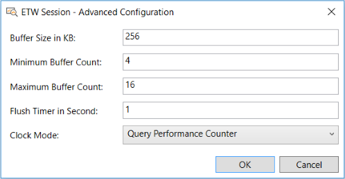

# Specifying Advanced ETW Session Configuration Settings
This section describes how to use the **ETW Session - Advanced Configuration** dialog when configuring a Live Trace Session, to enhance the performance of event tracing in the underlying ETW Sessions that all Message Analyzer providers utilize. To facilitate this enhancement, the **ETW Session - Advanced Configuration** dialog enables you to modify configuration settings for the ETW Session in which the ETW Provider components of a Message Analyzer Live Trace Session participate. Mainly, this involves adjusting settings for the ETW buffer configuration of the ETW Session that is managed by the [ETW Controller](etw-framework-conceptual-tutorial.md#BKMK_ETWController). You can open the **ETW Session - Advanced Configuration** dialog by clicking the **Configure ETW Session** button on the **Live Trace** tab of the **New Session** or **Edit Session** dialog (if you are editing an existing session). The **Configure ETW Session** dialog is shown in the figure that follows.  
  
   
  
 **Figure 28: ETW Session - Advanced Configuration**  
  
 To set the context for using the **ETW Session - Advanced Configuration** dialog, some background information about ETW buffers is included here.  
  
> [!NOTE]
>  The most common reason why you might want to specify **ETW Session - Advanced Configuration** settings is that your Live Trace Sessions are dropping packets, the evidence of which could be spurious diagnosis errors, excessive TCP retransmits or broken three-way handshakes, dropped packet log indications for a **Microsoft-PEF-WFP-MessageProvider** trace, and other occurrences where trace results seem odd.  
  
## ETW Buffer Background Concepts  
 The **ETW Session - Advanced Configuration** dialog enables you to specify values for key ETW buffer settings. By adjusting these settings for an ETW Session, you can reduce the risk of dropping event packets during a Live Trace Session with Message Analyzer. A properly configured ETW Session will prevent the loss of event data, although acquiring the right configuration can be tricky. For example, larger ETW buffers are preferred over smaller buffers to enable more efficient disk I/O as buffer data is written to disk. However, as you specify higher values for the ETW buffer settings more memory will be consumed, thus impacting performance.  
  
 Events are captured in an ETW Session by accepting them from the ETW Provider API. An ETW Session is a collection of in-memory buffers that are managed by the kernel. At all times, an *in-use* buffer is assigned to each processor. Each time the EventWrite() method is called, space is reserved in the in-use buffer that is currently allocated to the processor on which the calling thread is running. The event header and user data is then copied into that space. When the in-use buffer becomes full, it is flushed to the ETW Session's log file and/or to the ETW Consumer in real time.  At this point, a free buffer from the buffer pool is assigned to the processor. If the logging throughput exceeds the ability of the flusher to free up buffers—for example, because the incoming event throughput is greater than the disk write throughput—at some point all available buffer space in the ETW Session might be consumed, causing the EventWrite() method to fail with an ERROR_NOT_ENOUGH_MEMORY message along with a loss of event data.  
  
 To avoid this loss of event data, it is critical that the flusher interval is adequate, enough ETW buffers are available from the buffer pool, and that buffer size is set correctly to ensure good I/O write efficiency.  
  
## Configuring the ETW Session  
 When you are configuring a Live Trace Session, you have the option to specify several settings in the **ETW Session - Advanced Configuration** dialog. These settings provide information to the ETW Session Controller that enable it to control various aspects of an ETW Session to ensure that data is not lost from dropped event packets. After you create a new Live Trace Session and you have selected a **Trace Scenario** in the **New Session** dialog, click the **Configure ETW Session** button in the **New Session** dialog to display the **ETW Session – Advanced Configuration** dialog. You can then configure values for the following settings:  
  
-   **Buffer size in KB** — sets the size of all ETW buffers in the ETW buffer pool, to which an **ETW Provider** writes events during an ETW Session.  
  
     Buffer size has an impact on disk I/O write efficiency. For example, small ETW buffer sizes can reduce I/O write efficiency. However, the Message Analyzer default setting of 256 KB for this value should ensure good write performance, reduction in disk overhead, and the decreased likelihood that events will be lost. Buffer size also determines the maximum size of any event that can be traced.  It is typically unexpected that a single event will be so large that it cannot fit into an ETW buffer.  However, if buffer size is set too low and an event is unusually large, it may never be traced. In the ETW framework, event size is limited to slightly less than 64 KB, so if you set buffer size equal to or greater than 128 KB, no events will be lost.  
  
-   **Minimum Buffer Count** — specifies the minimum number of buffers to use when writing the events of a provider.  
  
-   **Maximum Buffer Count** — specifies the maximum number of buffers in the buffer pool that are available for writing the events of a provider.  
  
     Buffer count is a key factor in determining the capacity of an ETW Session. If you set the buffer count too high, memory will be wasted, whereas if you set the buffer count too low, a large number of events could be lost. The **Minimum Buffer Count** represents the smallest possible footprint of an ETW Session. Although it can be a process of trial and error, getting this number right is critical because a small buffer pool can be rapidly consumed as events are written, especially if the buffer size is also small, and this can lead to a loss of data.  
  
-   **Flush Timer in Seconds** — specifies the interval at which in-use ETW buffers allocated from the buffer pool are to be flushed. The critical issue here is to ensure that the event throughput does not exceed the ability of the flusher to free up ETW buffers. The **Flush Timer** interval should coincide with the moment that the in-use ETW buffer is full, so it can be flushed and its data can be sent to the ETW Consumer (Message Analyzer in this case) so that a new ETW buffer can be assigned to the session and event tracing can continue without the loss of data.  
  
-   **Clock Mode** — enables you to specify different time resolution values for the event timestamps of an ETW Session, based on the following clock types:  
  
    -   **Query performance counter** — the default clock type, which can have a resolution of 100 nanoseconds or better.  
  
    -   **System time** — typically around 10 milliseconds resolution.  
  
    -   **CPU tick count** — time resolution is based on CPU cycles.