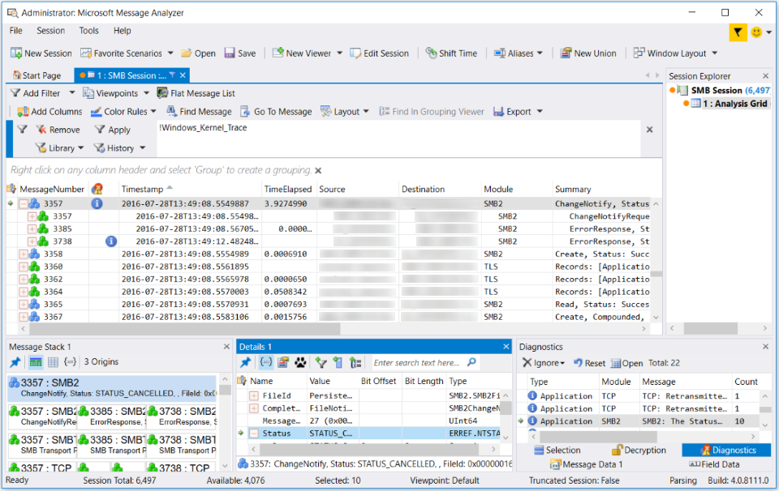

# Tool Windows
This section describes various interactive **Tool Windows** that are provided with Message Analyzer to display additional message details such as field information, message stack, hexadecimal, diagnosis, and decryption data. Some **Tool Windows** support data analysis capabilities such as the application of **Viewpoints**, view **Filters**, and selection of messages. Others enable you to configure annotations such as comments and bookmarks, or to add new data columns to the **Analysis Grid** viewer based on selected message fields.  
  
 Certain **Tool Windows** provide a multi-instance capability that enables you to display up to a maximum of four windows of the same type. This feature enhances your data analysis process because it enables you to compare different message data across multiple instances of the same window type. The **Tool Windows** that support this capability include the **Details**, **Message Data**, and **Message Stack** windows.  
  
 The **Analysis Grid** viewer and some common **Tool Windows** are shown in the figure that follows. Note that a number of **Tool Windows** are grouped in the lower right sector of the Message Analyzer user interface, where you can display any chosen **Tool Window** by selecting its  tab.  
  
   
  
 **Figure 65: Analysis Grid viewer and Common Tool Windows**  
  
 The ability to maintain the context of displayed data through multiple message selection is described in further detail in the associated **Tool Window** topics of this section.  
  
 Some **Tool Windows** are *message-specific* while others are *session-specific*, meaning that they respond to message or session selection, respectively, and display data that is associated with the in-focus message or session. An example of a message-specific **Tool Window** is the **Message Stack** window and an example of a session-specific **Tool Window** is the **Diagnostics** window, which are both described within the topics of this section along with other **Tool Window** types:  
  
 ___________________________\_  
  
 [Message-Specific Windows](message-specific-windows.md)   
 [Session-Specific Windows](session-specific-windows.md)   
 [Annotation Windows](annotation-windows.md)   
 [Other Windows](other-windows.md)   
___________________________\_