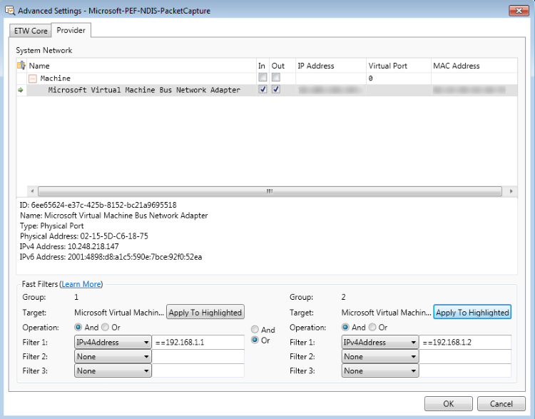

# Using the Advanced Settings - Microsoft-PEF-NDIS-PacketCapture Dialog

The **Advanced Settings - Microsoft-PEF-NDIS-PacketCapture** dialog is available in Message Analyzer installations on computers that are running the Windows 7 or Windows 8 operating system only. The dialog is accessible by clicking the **Configure** link to the right of the **Microsoft-PEF-NDIS-PacketCapture** provider **Id** in the **ETW Provider** list on the **Live Trace** tab of the **New Session** dialog; that is, after you select a **Trace Scenario** that uses the **Microsoft-PEF-NDIS-PacketCapture** provider. For example, you can select any of the following **Trace Scenarios** from the **Select Scenarios** drop-down list to display the **Microsoft-PEF-NDIS-PacketCapture** provider in the **ETW Providers** list of the **New Session** dialog during Live Trace Session configuration:  
  
-   **Local Network Interfaces (Win 8 and earlier)**  
  
-   **Wired Local Area Network (Win 8 and earlier)**  
  
-   **Wireless Local Area Network (Win 8 and earlier)**  
  
The **Advanced Settings** dialog for the **Microsoft-PEF-NDIS-PacketCapture** provider  is shown in the figure that follows.  
  
  
  
**Figure 22:  Advanced Settings - Microsoft-PEF-NDIS-PacketCapture Dialog**  
  
The **Advanced Settings** dialog provides its functionality in a flexible framework that enables you to focus on capturing very specific data while achieving the performance advantages that are inherent to **Fast Filters**. This framework enables you to logically chain up to three **Fast Filters** in each of two **Groups** that can be logically ORed or ANDed, which you can then assign to one or more *selected* adapters. For example, you can assign a single **Group** or both **Groups** of filters to one or more adapters.  
  
An adapter is considered selected only when you select at least one of the **In** or **Out** (traffic direction) check boxes in the **Advanced Settings** dialog. However, the default selection is to capture traffic in both directions. In order for a **Group** filter configuration to *apply* to packets intended for a particular adapter, the adapter must be selected in the indicated manner. Also, a filter **Group** can only be *assigned* to a selected adapter if the row in which the adapter exists is highlighted and then you click the **Apply to Highlighted** button for the **Group**. In addition, because **Fast Filters** are nested in **Groups**, which are in turn assigned to specific adapters, the total filtering effects that you realize are the result of both adapter selection and filter **Group** assignment combined. For this reason, you should carefully consider how you assign **Groups** to selected adapters, as described in [How Fast Filter Groups Are Applied](using-the-advanced-settings-microsoft-pef-ndis-packetcapture-dialog.md#BKMK_FastFiltersApplied).  
  
## Viewing the System Network Configuration  

 When you open the **Advanced Settings - Microsoft-PEF-NDIS-PacketCapture** dialog, the **System Network** tree grid configuration is prepopulated with the following information:  
  
-   **Adapters** — the adapters and adapter nodes on your machine are listed in the **Name** column of the tree grid configuration. For example, your adapters might include Ethernet and Wireless network adapters and a Hyper-V-Switch node containing virtual machines (VMs).  
  
-   **Traffic direction** — for each adapter on your system there are **In** and **Out** check boxes that enable you to specify the direction of the traffic you want to capture, for example, inbound to a particular adapter or outbound from the adapter. All the check boxes are selected by default to enable you to capture data in both directions, which is the typical configuration for the most useful context. However, there can be times when you want to isolate traffic in a particular direction. In this case, you can select the **In** and **Out** check boxes individually for any listed adapter. Otherwise, you can globally select inbound and outbound traffic for all listed adapters by selecting the **In** and **Out** check boxes in the **Machine** or **Adapters** row of the **System Network** tree grid configuration.  
  
-   **IP addresses** — the IP address of each adapter on your machine is specified in the **IP Address** column of the tree grid configuration, in both IPv4 and IPv6 formats.  
  
-   **Virtual ports** — any applicable ports for local VM adapters are listed in the **Virtual Port** column of the tree grid configuration.  
  
-   **MAC addresses** — the MAC address for each adapter on your machine is listed in the **MAC Address** column of the tree grid configuration.  
  
## Finding Column Data  

 If you have a particularly long list of adapters, including a Hyper-V-Switch and VMs, you can take advantage of the **Column Filter** feature that is also included in numerous Message Analyzer viewer and **Tool Windows**, to search for column entries that contain specified search text. This can help you to quickly isolate a row of adapter data in which you are interested. You can display the column filtering row by clicking the **Show Column Filter Row** icon in the **System Network** configuration. Also, if you select any network adapter that is listed, a description displays below the **System Network** configuration.  
  
> [!NOTE]
>  You can utilize the **Copy** commands in the context menu that displays when you right-click any tree grid configuration column that contains data.  
  
## Logically Chaining Fast Filters  

 You have the option to configure up to three **Fast Filters** per **Group** with the same or different address types, and you can also logically chain the **Fast Filters** within each **Group**, by selecting either the **And** or **Or** operator option. Note that the **Groups** are logically ANDed by default, but can be set to **OR** if necessary.  
  
## Assigning Fast Filter Groups to Tree Grid Elements  

 The **Advanced Settings - Microsoft-PEF-NDIS-PacketCapture** dialog provides a flexibility that enables you to selectively assign filter **Groups** to adapters in the **System Network** tree grid. After you create a **Fast Filter** configuration for a particular **Group**, you can assign it to any of the following elements in the tree grid by first highlighting the element and then clicking the appropriate **Apply to Highlighted** button:  
  
-   **One adapter element row** — when you assign a filter **Group** containing one or more **Fast Filters** to a single adapter that is both selected and highlighted, the filtering configuration applies to the highlighted adapter only.  
  
 > [!NOTE]
 >  You can highlight an adapter by clicking any column in the element row in which the target adapter is listed, at which time the row is highlighted in blue. After you assign a filter **Group** to a highlighted adapter by clicking the **Apply to Highlighted** button, the color of the highlighted row changes to gray.  
  
-   **Multiple adapter element rows** — when you assign a filter **Group** of one or more **Fast Filters** to multiple selected and highlighted adapters, the filtering configuration applies to the highlighted adapters.  
  
-   **All adapters** — when you assign a filter **Group** of one or more **Fast Filters** to all selected and highlighted adapters, the filtering configuration applies to all adapters in the **System Network** tree grid.  

 > [!NOTE]
 >  You can select and highlight all adapters by selecting one or both traffic direction check boxes in the **Machine** element row.  
  
Also, when you successfully assign a filter **Group** to a particular adapter, the name of the adapter to which the filter configuration is assigned displays next to the **Target** label for the assigned **Group**.  
  
   
## How Fast Filter Groups Are Applied  
 In the grouping model, filter **Group** behavior varies depending on how you assign the **Groups** and to some extent on the logical operator with which the **Groups** are chained. For a simple case, when you click the **Apply to Highlighted** button/s to assign one or both **Groups** to a single adapter or a top node containing child adapters in the **System Network** tree grid, a property is set that designates the adapter/s as the target for the **Group/s**. Thereafter, any packet that is intended for the specific adapter/s will be retrieved by the **Microsoft-PEF-NDIS-PacketCapture** provider if it passes the filtering criteria contained in the assigned **Groups**. Packets that are not intended for the specific adapter/s are not affected by the assigned filter **Groups**. Moreover, if you assign each **Group** to a *different* adapter or node, any arriving packet that applies to both nodes or adapters causes the rules of both **Groups** to fire in accordance with the defined operators. Under these circumstances, if a packet arrives that applies to only one node or adapter, then the rules fire for only the **Group** assigned to that node or adapter. In this case, the logical AND that chains the **Groups** by default has no effect.  
  
 The main scenario for which filter **Groups** were developed in the **Advanced Settings** dialog has to do with local VMs that are serviced by a Hyper-V-Switch and the difficulty of isolating messages to a particular VM. Because Message Analyzer enumerates Hyper-V networks, you can now create a **Group** filter configuration and assign it to a specific VM, rather than having to create a **Fast Filter** for a specific VM and then capture traffic locally on that VM.  
  
 In the grouping model, if a packet arrives that belongs to a particular element such as **Machine**, or a Hyper-V-Switch, VM, or physical adapter, and a filter **Group** is assigned to that element, then the filtering rules configured in the assigned **Group** are applied. However, packets can belong to more than one element. For instance, packets always belong to the **Machine** element, but might also belong to a particular Hyper-V-Switch or a VM that is serviced by the switch. When this is the case, the grouping model creates a flexibility that enables you to isolate packets to whatever element you choose, including individual VMs. For example, you could have the following scenarios and interactions:  
  
-   **Group 1** is assigned to a VM; **Group 2** is assigned to a physical switch (with no Hyper-V network) — every packet that arrives either belongs to the VM, physical switch, or some other element, but never to both. Therefore, the default logical AND that is applied to the **Groups** has no effect because both **Groups** can never apply to the same packet. In this situation, when a packet arrives that belongs to the VM **Group**, the filtering rules for **Group 1** fire; and when a packet arrives that belongs to the physical switch **Group**, the filtering rules for **Group 2** fire.  
  
-   **Group 1** and **Group 2** are assigned to the same element/node — under these conditions, the default logical AND that is assigned to the **Groups** simply defines the top-level operator and subsequently the behavior of the Boolean expression you are constructing. When a packet arrives that applies to the particular element to which the **Groups** are assigned, the filtering rules for both **Groups** fire.  
  
-   **Group1** is assigned to **Machine**; **Group2** is assigned to a VM — in this case, if a packet arrives that belongs to the VM, then in effect it belongs to both **Groups** (all packets belong to **Machine**), and therefore the filtering rules for both **Groups** kick in with the defined operators. If a packet arrives that does not belong to the VM, then only the filtering rules for **Group 1** fire.  
  
---  
  
 **More Information**   
 **To learn more** about how to create a **Fast Filter Group** and assign it to an adapter, see the procedure [Configure and Run a Local Network Interfaces Trace](procedures-using-the-network-tracing-features.md#BKMK_configStartLinkLayerTrace).  

---  
  
## See Also  
[Using the Advanced Settings - Microsoft-Windows-NDIS-PacketCapture Dialog](using-the-advanced-settings-microsoft-windows-ndis-packetcapture-dialog.md)