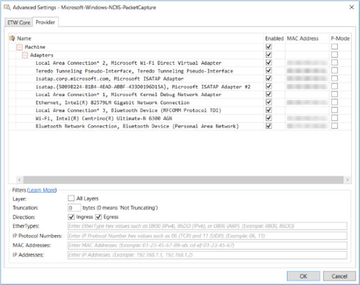

# Using the Advanced Settings - Microsoft-Windows-NDIS-PacketCapture Dialog
As described in [Configuring a Remote Capture](configuring-a-remote-capture.md), you can specify the host adapters or VM adapters on which to capture remote traffic, along with various filters and other settings, from the **Advanced Settings - Microsoft-Windows-NDIS-PacketCapture** dialog. You can open the **Advanced Settings** dialog by clicking the **Configure** link to the right of the **Microsoft-Windows-NDIS-PacketCapture** provider **Id** in the **ETW Providers** list on the **Live Trace** tab of the **New Session** dialog, after selecting any **Trace Scenario** that uses the **Microsoft-Windows-NDIS-PacketCapture** provider, for example, the **Remote Network Interfaces** **Trace Scenario**. The **Advanced Settings** dialog consists of selection and configuration settings that are organized into an upper Interface Selection section and a lower Filters section, as shown in the figure that follows.  
  
   
  
 **Figure 30: Advanced Settings for the Windows-NDIS-PacketCapture Provider**  
  
 The configuration components in each of the shown sections are described in this topic.  
  
   
## Selecting Adapter Interfaces  
 The Interface Selection section of the **Advanced Settings** dialog contains a tree grid with four columns where virtual machine (VM) adapter and/or host adapter information can be populated when you open the dialog. VM adapters are available to virtual machines and host adapters are available to the management operating system (OS). The enumeration of such adapters takes place when you connect to a remote host; thereafter, the tree grid indicates these elements under a collapsible **Machine** node. The four columns in the Interface Selection section consist of the following:  
  
-   **Name** — this column contains the names of all adapters that are discovered on the remote host; these names appear under the **Machine** node in this column.  
  
-   **Enable** — provides a check box that enables you to capture data on any individual selected adapter or group of adapters. If you select the **Machine** check box in this column, all child elements in the tree grid are automatically selected. If you unselect the **Machine** check box, all child elements in the tree grid are deselected to enable you to choose individual adapters or groups of adapters from which to collect data. For example, you could select the **Switch** node or **Adapters** node to automatically select all the child elements under either of these nodes, to collect data from these sources.  
  
-   **MAC Address** — specifies the Media Access Control (MAC) address of VM adapters and Host adapters.  
  
-   **P-Mode** — provides a check box for all adapters on either the local or remote computer where you can specify message capture in Promiscuous Mode with the **Microsoft-Windows-NDIS-PacketCapture** provider, simply by selecting a **P-Mode** check box for a corresponding adapter. Note that you will need to determine which Host adapters on the target machine support Promiscuous Mode capture.  
  
 **Finding Column Data**   
The tree grid in the Interface Selection section of the dialog also contains a **Show Column Filter Row** icon to the left of the **Name** column that enables you to search for text in the **Name** or **MAC Address** columns. This can be useful if you have a particularly long list of VM and host adapters. If you click the **Show Column Filter Row** icon, the **Column Filter Row** displays two amber-colored text boxes where you can enter search text. When you specify search text, the column is automatically filtered to display only those rows of data where a text match is found. You can remove the filtered view by clicking the **x** mark in the amber-colored text box above the column where you searched for text. This feature can help you to quickly isolate an adapter on which to capture data.  
  
   
## Configuring Host Adapter and Hyper-V-Switch Filters  
 The Filters section of the **Advanced Settings** dialog contains numerous settings in the **Filters** pane. The configuration settings that follow enable you to filter the data that you capture remotely on adapters that you select in the Interface Selection section of the dialog, although the impact of some filters can be different on host adapters versus the effects on VM adapters:  
  
-   **Layer** — this setting has a different meaning when applicable to capturing data on a Host adapter versus a Switch adapter, as follows:  
  
    -   **Host Adapter** — when you *select* the **All Layers** check box prior to running a remote trace, all packet traffic that is intended for host adapters will be intercepted on all NDIS layers, for traffic that traverses both up and down the filter stack. If you *unselect* the **All Layers** check box, then packets will be intercepted on the default/lowest NDIS layer only, in both traffic directions. See the article [NDIS Filter Drivers](http://go.microsoft.com/fwlink/?LinkId=523816) on MSDN for an overview and illustration of the NDIS layers.  
  
         In the diagram of the indicated article, the NDIS layers are shown as Filter Modules, which can also be thought of as nuances of the Link Layer. For example, some of the tasks that these Filter Modules can carry out include quality of service (QoS) processing that prioritizes packets and translation of Ethernet headers to Wi-Fi for wireless packets.  
  
         For example, you might select the **All Layers** check box when you are investigating dropped packets, so that you can monitor all NDIS layers and determine which NDIS filter layer is dropping packets. In addition, because packets can be intercepted both down and up the NDIS filter stack, it is recommended for host adapters that you select both the **Ingress** and **Egress** check boxes for the **Direction** parameter in **Advanced Settings**, which correspond to outbound packets (sent down the stack) and inbound packets (received up the stack), respectively. For more information about the **Ingress** and **Egress** options, see the "Direction" item in this list.  
  
        > [!NOTE]
        >  If you happen to select all host adapters and VM adapters in the Interface Selection section of the **Advanced Settings** dialog and then run a remote trace, the functionality that is enabled by selecting the **All Layers**, **Ingress**, and **Egress** check boxes is automatically applied in the way that is appropriate for each of host adapters and VM adapters. However, for the sake of better interpretation of results, you might consider capturing on either host adapters or VM adapters, but not both at the same time.  
  
    -   **Switch Adapter** — when you *select* the **All Layers** check box prior to collecting data on a remote VM adapter, all packet traffic passing through the Hyper-V-Switch that services the VM will be intercepted on all layers of the switch Extension stack in the Egress or/and Ingress path/s that you specify. If you *unselect* the **All Layers** check box, then by default, packets will only be intercepted on the highest filter layer of the Hyper-V-Switch extension stack in the Egress or/and Ingress path/s, as appropriate, during your remote trace. See the article [Overview of the Hyper-V Extensible Switch](http://go.microsoft.com/fwlink/?LinkId=523817) on MSDN for a conceptual overview of the Hyper-V-Switch and its filtering stack.  
  
         In the diagram provided in the indicated article, the filtering layers of the switch are shown as Capturing, Filtering, and Forwarding extensions, which can also be thought of as nuances of the Link Layer. The Hyper-V-Switch extension filter stack can inspect, monitor, drop, exclude, and duplicate packets; it also determines the packet source and destination switch ports and can enforce packet security and VM network policies. To help you better understand how to configure filtering in the **Advanced Settings** dialog when capturing traffic on a remote VM that is serviced by a remote Hyper-V-Switch, the following explanation describes the path of packets entering and leaving the Hyper-V-Switch. Note that this path is identical whether packets are being sent to or from a VM. See the indicated article to reference the components that are described here:  
  
         A packet from a Child Partition VM or network adapter is sent to a Hyper-V-Switch port and then down the Ingress data path through the switch extension stack. Packets are processed through the extension stack filtering rules, while switch *source* port information is acquired in this path. The packet then goes up the Egress data path through the switch extension stack. Packets are processed through the extension stack filtering rules again, while switch *destination* port information is acquired in this path.  
  
        > [!NOTE]
        >  Switch source port information is available on both the Ingress and Egress data paths, while switch destination port information is available on the Egress data path only.  
  
         As a usage example, when you are simply monitoring traffic for a VM that is serviced by a Hyper-V-Switch, it is recommended that you select the **Egress** option only (and leave the **All Layers** option unselected) in the **Advanced Settings** dialog, so that packets will be intercepted on the default/highest extension stack layer in the Egress data path only. These settings can result in performance and usability improvements, as follows:  
  
        -   Bandwidth consumption is moderately decreased because packets are intercepted in one path and on one extension only.  
  
        -   Filtering logic is more accurately executed because both source and destination port information is available in the Egress data path.  
  
        -   Message analysis is made simpler with lower packet count.  
  
         However, in troubleshooting scenarios where packets are being dropped and you need to investigate where this is occurring, you should select the **All Layers** option and enable both **Ingress** and **Egress** options to determine whether packets are being dropped in either of these paths in the Hyper-V-Switch extension stack. Note that the check boxes for both of these paths are enabled by default in the **Advanced Settings** dialog.  
  
-   **Truncation** — enables you to truncate packets that you capture from a remote host. You can truncate packets to limit bandwidth consumption and reduce the memory footprint of the traffic you capture, so that you receive only a certain amount of bytes for every packet. In practice, you might want to look at only the headers of a particular protocol of interest. If you know the length of the protocol header in bytes, you can set that value in the **Truncation** text box and receive only the header portion of the packets of interest in your trace. The default **Truncation** value that displays when you open the **Advanced Settings** dialog varies as indicated in the note below; however, you can set this value as required. Note that a value of zero (0) bytes means packets will not be truncated.  
  
    > [!IMPORTANT]
    >  For **Trace Scenarios** that use the **Microsoft-Windows-NDIS-PacketCapture** provider for *local* traces, the default **Truncation** value will be set to zero (**0**) bytes after you open the **Advanced Settings** dialog, while for **Trace Scenarios** that use the **Microsoft-Windows-NDIS-PacketCapture** provider for *remote* traces, the default **Truncation** value will set to **128** bytes after you open the **Advanced Settings** dialog. In either of these cases, if you *set* the **Truncation** value to a number greater than zero (**0**) bytes, Message Analyzer will only parse a limited subset of protocols, which includes the Ethernet, GRE, IPv4, IPv6, ESP, AH, IKE, AIPS, TCP, UDP, and HTTP protocols.  
  
-   **Direction** — when capturing traffic on host adapters, the **Ingress** and **Egress** options enable you to specify the direction in which to capture packets that traverse the NDIS filter stack — either outbound traffic that corresponds to the **Ingress** option and down the stack, or inbound traffic that corresponds to the **Egress** option and up the stack. When capturing traffic on a VM that is serviced by a Hyper-V-Switch, these same options specify the path that packets take when traversing the Hyper-V-Switch extension stack, for *both* inbound and outbound traffic to and from a VM. For recommendations on how to set these options, see the "Host Adapter" and "Switch Adapter" list items above.  
  
-   **EtherTypes** — enables you to specify an EtherType number that represents a protocol, such as IPv4, IPv6, or ARP, that is in the payload of an Ethernet frame. For example, if you specify an EtherType hexadecimal value in the **EtherType** text box for one or more of these protocols, comma-delimited and without the “0x” designator—for example `0800`, `86DD`, `0806`, respectively — the remote trace will filter for and return only Ethernet frames that have IPv4, IPv6, or ARP in their payloads.  
  
    > [!NOTE]
    >  It is recommended that you always specify an **EtherType** when you are configuring an **IP Protocol Number** or **IP Address** filter. By specifying an **EtherType** value in these cases, you ensure that only the targeted traffic is returned in the remote trace.  
    >   
    >  For a list of EtherTypes, see [IEEE 802 Numbers](http://go.microsoft.com/fwlink/?LinkId=523818).  
  
-   **IP Protocol Numbers** — enables you to specify an **IP Protocol Number** that filters for IP packets that have their **Protocol** header field set to the protocol number that you specify. Moreover, it filters for IP packets with a protocol in the payload that is identified by the specified protocol number, which is commonly TCP, UDP, and ICMP. For example, if you specify an IP protocol number in hexadecimal format in the **IP Protocol Numbers** text box for one or more of these protocols, comma-delimited and without the “0x” designator — for example `06`, `11`, `01`, respectively — the remote trace will filter for and return only IP packets that have TCP, UDP, or ICMP in their payloads.  
  
    > [!NOTE]
    >  It is strongly recommended to always specify an EtherType when configuring IP protocol number filters. For example, if you specify a TCP protocol number without also providing an EtherType number for IPv4 or IPv6, the filter will be applied to IP packets only. However, all other non-IP based traffic will be passed as well, which can be an unexpected result. To avoid this result in the example, you can specify the Protocol Number (`06`) for TCP and the EtherType number (`0800`) for IPv4.  
  
     For a list of Protocol Numbers, see [Protocol Numbers](http://go.microsoft.com/fwlink/?LinkId=89889).  
  
-   **Mac Addresses** — enables you to create a filter that specifies one or more MAC addresses. The format consists of dash-delimited, Link Layer addresses such as `10-60-4B-6D-8D-2D`. You can use **Mac Address** filters to control the adapter on which you capture traffic. For convenience, the MAC addresses of all adapters enumerated on the remote host are provided in the tree grid section of the **Advanced Settings** dialog. Even if you have all adapters selected in **Advanced Settings**, you can use **Mac Address** filtering to limit the remote traffic you capture to the adapter/s with the addresses you specify.  
  
    > [!IMPORTANT]
    >  If you want to capture traffic from a specific remote VM, you will need to select the VM in the tree grid section of the **Advanced Settings** dialog and then create a **MAC Address** filter based on the VM's MAC address to isolate the data. Otherwise, you will capture  Hyper-V-Switch traffic that is destined for all VMs that are serviced by the switch, given that a Hyper-V-Switch driver cannot of itself distinguish between VMs.  
  
-   **IP Addresses** — enables you to create a filter that specifies one or more IPv4 or IPv6 addresses. You enter IPv4 and IPv6 addresses in the standard format for these types of addresses and comma-delimit them, for example, `192.168.1.1`, `192.168.1.1`, and so on. You can use an **IP Address** filter to isolate and return remote traffic from a particular machine that is assigned the IP address that you specify. However, if you want to return *only* packet traffic for the specified IP address, it is recommended that you also specify an EtherType for the IP address that you provide; for example, specify an IPv4 EtherType when filtering on an IPv4 address. If you specify an IPv4 address alone without also providing an EtherType number, the filter is applied to IPv4 packets only, but all other non-IP–based traffic will be unfiltered and therefore passed, which can be an unexpected result. To avoid this result in the example, you can specify the IPv4 address in the format `192.168.1.1` and include the EtherType number `0800` for IPv4.  
  
## See Also  
 [Configuring a Remote Capture](configuring-a-remote-capture.md)