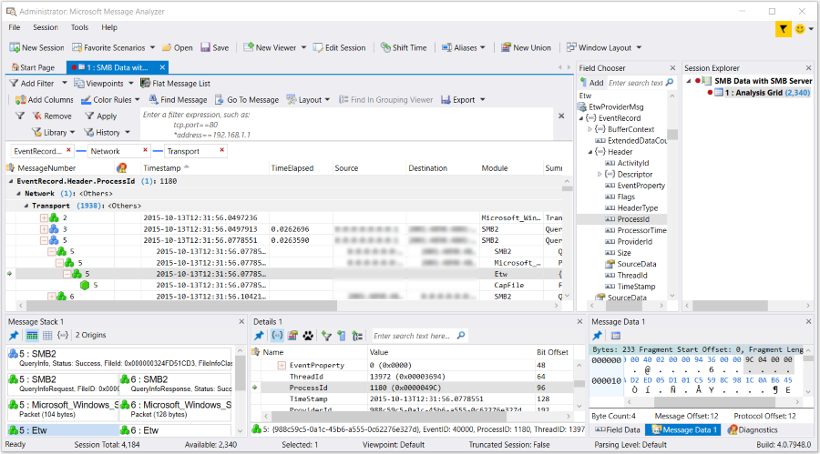

# Using the Analysis Grid Group Feature

Because there are many different message conversations that can take place at different network layers, obtaining a view of your trace data that is relevant to resolving a particular diagnostic issue can be challenging at times. Also, since protocol analyzers often handle large amounts of data where messages of interest can be scattered, it can be difficult and time-consuming to find specific data that you want to examine. To accommodate these challenges, Message Analyzer provides a data **Group** function in the **Analysis Grid** viewer that enables you to bubble up and organize relevant and important data into a grouped display. You can access and apply the data **Group** function as described in [Grouping Operations](using-the-analysis-grid-group-feature.md#BKMK_performingGroupOp) later in this section.  
  
## Reorganizing Data with the Group Function  

 The **Group** function enables you to create a high-level view of your data that is arranged by groups, to provide an efficient way of presenting specific information from high-volume traces. This can include grouping the data values of a particular entity such as a property, field, or annotation displaying as an **Analysis Grid** column or in the **Details** **Tool Window**. You can also create nested groups of multiple data values. In Message Analyzer, a group is an expandable and collapsible node that is labeled and contains the count of either child nodes or a set of child messages that are grouped by a data field or property value that is defined in OPN. Message Analyzer enables you to customize and accelerate your data analysis process by the strategic application of multiple grouping operations that display in a hierarchical manner. By carefully selecting which data is to be grouped in a set of groups, and by considering the data on which to pivot (the order in which you apply grouping operations), you can quickly isolate specific traffic and simplify the analysis process.  
  
 For example, in a particular set of trace results, you might add the **ProcessId** (ETW), **Network**, and **Transport** columns to the **Analysis Grid** viewer with the **Field Chooser** **Tool Window** and then perform **Group** commands on each column in the indicated order. The result would look like the following:  
  
-   **ProcessId Groups** — consist of separate Groups of expandable nodes that each consolidate identical ETW ProcessIds from various components whose events were captured by Message Analyzer. Each **EtwProviderMsg.EventRecord.Header.ProcessId** node indicates the **ProcessId** value and specifies the number of child/nested **Network** nodes (groups) in parentheses. You will find this field under the **ETW** node in **Field Chooser**.  
  
-   **Network Groups** — consist of separate nested Groups of expandable nodes that each consolidate identical pairs of **Source** and **Destination** addresses for IP conversations. Each **Network** node indicates the IP **Source** and **Destination** address and specifies the number of child/nested **Transport** nodes (groups) in parentheses. You will find this field under the **IPv4** node in **Field Chooser**.  
  
-   **Transport Groups** — consist of separate nested Groups of expandable nodes that each consolidate identical TCP or UDP **SourcePort** and **DestinationPort** pairs where the IP conversations took place. Each **Transport** node indicates the associated TCP or UDP port values and specifies the number of messages that are contained in the node. By expanding the **Transport** node, you can examine the messages that met the filtering criteria of the grouping hierarchy that you created. You will find this field under the **TCP** node in **Field Chooser**.  
  
After you complete the **Group** commands on these columns, you should see a display similar to the following when various Group nodes are expanded:  
  
  
  
**Figure 42: Message Analyzer Analysis Grid grouping operation**  
  
As shown in the preceding figure, each group is designated by a label that contains the name of the column to which you applied the **Group** command. Note that only the last group that you create contains messages that have been filtered down by the criteria that created each parent group. The displayed groups isolate messages based on TCP port data and IP addresses under ProcessIds, so that you can quickly scan the IP conversations that took place across source and destination node ports for the particular events that Message Analyzer captured.  
  
Another example of grouping consists of applying a **Group** command to the **DiagnosisTypes** column in the **Analysis Grid** viewer to bubble up errors that occurred in a trace. The Groups that display are each designated by a specific diagnostic type such as **Application**, **Insufficient Data**, **Parsing**, or **Validation**. Note that you can also examine a summary of diagnostic errors that occur in a trace by opening the **Diagnostics** **Tool Window** from the **Windows** submenu of the global Message Analyzer **Tools** menu. If the **Diagnostics** window does not appear in this menu, you will need to enable it on the **Features** tab of the **Options** dialog, which is accessible from the global Message Analyzer **Tools** menu. After you select the **Diagnostics** feature and click **OK** to exit the **Options** dialog, a Message Analyzer restart is required. Note that the **Diagnostics** window is currently preview feature.  
  
> [!NOTE]
>  You can also add a view **Filter** or sort columns while grouped data is displayed in the **Analysis Grid** viewer. For example, you could add a **Filter** such as the following to the  text box of a Filter panel on the Filtering toolbar  to remove all message groups except those that contain the specified IP address: `IPv4.address==192.168.1.1`. You can even apply the **Group** command while Message Analyzer is capturing messages.  
  
   
## Grouping Operations  
 You can group data from **Analysis Grid** viewer columns by selecting the **Group** or **Group By Multiple Values** menu commands that display when you right-click an **Analysis Grid** viewer column. You can also group data from the **Details** window below the **Analysis Grid** viewer by selecting the **Add 'fieldName' as Grouping** context menu command that displays when you right-click a row in the **Details** window. The *fieldname* value in this command is a placeholder for an actual field name in the **Name** column of **Details**.  
  
 **Using the Analysis Grid Group Command**   
The **Group** command creates separate groups based on varying **Column** values in the **Analysis Grid** viewer or field values in the **Details** window. When you apply the **Group** command to a particular **Column**, each differing value under that **Column** for each top-level message row is consolidated into a separate group of identical values, while the message origins tree associated with each top-level message or operation is preserved for the sake of maintaining context. For example, if you right-click the **Module** column and select the **Group** command, Message Analyzer creates a separate Group for each protocol module and populates that Group with all the top-level messages or operations that have the identical **Module** name. Message Analyzer identifies the results of the grouping operation with a label that designates the name of the column to which you applied the **Group** command.  
  
 Because Message Analyzer supports the application of **Group** commands to multiple columns, you can perform grouping operations on as many data columns as you want, to achieve different perspectives of your data. Each time you apply a new **Group** command to a different data column, the results of the previous grouping operation are modified to include the new grouping operation as a nested **Group** of filtered messages within the existing parent **Group**. When this occurs, the criteria for the new grouping operation are based on the values of the existing **Group**. For example, if you performed one grouping operation based on the **Source** column and then did another grouping operation based on the **Destination** column, the results will display all identical **Destination** addresses for each **Source** address Group in a separate Group that is nested in the parent **Source** address Group. The next grouping operation applies the same type of logic when you perform another **Group** command on a different column.  
  
 **Using the Group By Multiple Values Command**   
The **Group By Multiple Values** command creates groups based on varying values in a particular field that might be different at various stack levels. For example, you might see IP addresses at the top-level in the **Source** column of the **Analysis Grid** viewer, while in the stack there are also hidden Ethernet addresses. By using the **Group By Multiple Values** command on the **Source** column, you can organize the IP and Ethernet address values into separate groups for enhanced data analysis capabilities.  
  
 **Exposing and Hiding Grouped Data**   
To expose the data contained in any particular Group, you can click the arrow node to the left of each Group. To expose the data contained in all Groups, you can right-click the Group label and select the **Expand All Groups** menu command. To hide the data contained in all Groups, you can select the **Collapse All Groups** command from the same menu.  
  
 **Reorganizing Grouped Data**   
If you create more than one data Group in the **Analysis Grid** viewer, you have the option to reorganize the Groups and subsequently rearrange the nesting order of the nodes that contain your data. By reorganizing the Groups, you can achieve a different analysis perspective on the data. To accomplish this, you can drag and drop any Group label to the left or right of any other Group label, as appropriate, and the data grouping will be reorganized as if you had originally performed the **Group** operation in that order. For example, if you **Group** the **Source** column in the **Analysis Grid** viewer first and then **Group** the **Destination** column, the **Destination** addresses will be contained in **Destination** nodes that are nested under the **Source** nodes. However, if you drag and drop the **Source** group label to the right of the **Destination** group label, the grouping will be reversed with the **Source** addresses contained in **Source** nodes now nested under the **Destination** nodes.  
  
 **Removing Grouped Data**   
To undo a Grouped display configuration, click the **x** mark in the Group label that identifies the grouped column data you want to remove. As you remove groups in the indicated manner, data for the selected Group is removed from the display and any remaining Groups are filtered and reorganized according to the hierarchy established by the original grouping operation.  
  
## See Also  

[Grouping Viewer](grouping-viewer.md)