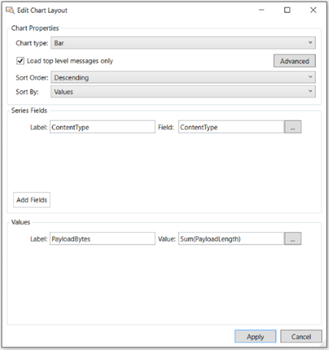

# Using the Edit Chart Layout Dialog

To obtain access to the configuration controls and features that you will need to create a custom **Chart** viewer **Layout**, you must have a **Layout** already displaying in an Analysis Session, for example, Data Retrieval Session or Live Trace Session results. When you have a **Layout** displayed, the drop-down lists and commands required to edit and save a custom **Layout** of your own design are enabled; otherwise, such lists and commands are unavailable. The required drop-downs and commands for editing and saving a **Layout** appear in the global Message Analyzer **Session** menu, for example, the **Chart** item which displays a drop-down list that contains the **Edit** command and the **Layout** item from where you can save a modified **Layout**.  
  
 The sections that immediately follow describe how to use the configuration controls of the **Edit Chart Layout** to create your own custom **Layout** configuration. You can then learn how to save the **Layout** with a new **Name**, **Description**, and **Category** when complete, as described in [Saving a Custom Chart Viewer Layout](using-the-edit-chart-layout-dialog.md#BKMK_SaveCustomChartLayout).  
  
## Editing an Existing Chart Viewer Layout  

 If you have a **Chart** viewer **Layout** already in focus and displaying data from the current set of trace results, you can edit the **Layout** and save your changes. To begin, click the **Edit** item on the toolbar that appears above the **Chart** analysis surface to display the **Edit Chart Layout** dialog, from where you can modify the currently displayed **Layout** as needed for your own custom design. Alternatively, you can click the **Edit** item in the **Chart** drop-down list on the global Message Analyzer **Session** menu to display this dialog, which is shown in the figure that follows.  
  
   
  
 **Figure 72: Message Analyzer Edit Chart Layout dialog**  
  
 The controls  of the **Edit Chart Layout** dialog that you will use to edit a **Chart** viewer **Layout** are described in the list that follows. The dialog contains the following three panes of controls and data entry selectors, as shown in the figure:  
  
-   **Chart Properties** pane  
  
    -   **Chart type** — a drop-down list that enables you to select the type of visualizer component you want to use in your **Layout**. You can select one of the four types that are available, which includes **Bar** element, **Pie** slice, **Timeline** graph, and **Table** grid components.  
  
    -   **Load top-level messages only** — a check box that enables you to specify whether the visualizer component will display top-level messages only. If this check box is *unselected*, the visualizer component will display data for all messages, including top-level and origins (stack) messages. Note that this setting can affect performance since more messages will have to be processed. If this check box is *selected*, the visualizer component will display data from the top-level messages only, which improves performance by processing fewer messages. For some context, the **Analysis Grid** viewer displays top-level message nodes by default.  
  
    -   **Advanced** button — this control is available for the **Bar**, **Pie**, and **Timeline** components only. The list immediately below describes the features of the **Generic Dialog Window** that displays when you click the **Advanced** button while the specified visualizer component is selected in the **Chart type** drop-down list:  
  
        -   **Bar** — clicking the **Advanced** button while this visualizer component is selected in the **Chart type** drop-down displays the **Generic Dialog Window**, from where you can use the following features to achieve the indicated results:  
  
            -   **Maximum number of items shown** text box — enables you to specify the maximum number of bar elements to display in your **Layout**, in which specific data values will be represented. You can manually type a number in the text box, or you can use the up-down control to the right of the text box to automate your input.  
  
            -   **Hide Others Category** check box — select this check box to enable your visualizer component to ignore the “Other” category that often displays when values for entities such as messages, fields, properties, and so on, far exceed the values of other visualizer component elements. When this occurs, **Other** category volumes can be so large as to overwhelm the display of other values of interest in your **Layout** component. However, you can unselect this check box if you want to enable the display of the **Other** category.  
  
        -   **Pie** — clicking the **Advanced** button while this visualizer component is selected in the **Chart type** drop-down displays the **Generic Dialog Window**, from where you can  use the identical features that exist for the **Bar** element visualizer component, as previously described.  
  
        -   **Timeline** — clicking the **Advanced** button while this visualizer component is selected in the **Chart type** drop-down displays the **Generic Dialog Window**, from where you can use the following features to achieve the indicated results:  
  
            -   **Maximum number of items shown** text box — enables you to specify the maximum number of legend items that will be selected by default, which in turn enables the corresponding message lines in the **Timeline** visualizer of your **Layout** to display, in which specific data values will be represented. You can manually type a number in the text box, or you can use the up-down control to the right of the text box to automate your input.  
  
            -   **Data Aggregation Mode** drop-down selector — works with the bucketization feature to define how data will display in a bucketized data point or node. The following values are provided for selection:  
  
                -   **Add values** — adds all values in a node together; the resulting value is visible when your mouse hovers over a bucketized data point.  
  
                -   **Average values** — takes the average of all values in a node; the resulting value is visible when your mouse hovers over a bucketized data point.  
  
                -   **List values** — lists all values in a node; all values are visible when your mouse hovers over a bucketized data point.  
  
            -   **DisableBucketization** check box — by default, the display of screen values are bucketized according to a time resolution algorithm that sets a default number of values buckets that can appear in a given distance on the visualizer component screen real estate. Based on the size of the screen, a calculation is made to allow the visualizer component to contain one or more values in a bucket, for example, a node on the **Timeline** graph. If you hover over such a node with the mouse, Message Analyzer will display a pop up that provides messaging information for the particular hovered-over data point. You can disable this process by unselecting this check box.  
  
            -   **Value Number Format** — enables you to specify the number format for the Y-axis in a **Timeline** visualizer component. The default value is “N”, for the Number format.  
  
                 For more information about possible settings for this property, see [Standard Numeric Format Strings](https://msdn.microsoft.com/library/dwhawy9k%28v=vs.110%29.aspx) in the MSDN Library.  
  
    -   **Sort Order** drop-down selector — enables you to specify the order in which a data field value (Series) or formula result (Value) is sorted in a visualizer component. You can select from the following three options.  
  
        -   **Ascending** — typically sorts from the lowest to highest field values.  
  
        -   **Descending** — typically sorts from the highest to lowest field values.  
  
        -   **Unspecified** — field data follows the order in which messages were captured.  
  
    -   **Sort By** drop-down selector — enables you to configure what the specified **Sort Order** will apply to. You can select from the following two options:  
  
        -   **Series** — causes the specified **Sort Order** to apply to a configured data field value, such as **PayloadLength** in bytes.  
  
        -   **Values** — causes the specified **Sort Order** to apply to a configured formula output value, such as the result of an **Average**, **Count of Occurrences**, or **Cumulative Addition** operation upon a field, or other operations upon a set of fields.  
  
-   **Series Fields** pane — provides controls that enable you to add one or more sets of field controls that each consist of a **Label** text box and a read-only **Field** text box. One set of controls displays by default, although you can add more control sets by clicking the **Add Fields** button. For each set, you can specify a **Field** name for which you want data to display in your **Layout** and a **Label** that describes the data field contents. Each field that you define becomes part of the *series* of fields that you configure. For example, multiple fields in the **Series Fields** pane will be separated by commas in a **Bar** element visualizer, or will become column names in a **Table** grid visualizer.  
  
    > [!NOTE]
    >  You will typically use the **Series Fields** pane controls to configure **Fields** that inherently display a value by default, for example, an IP conversation (**Network** field) or bytes value  (**PayloadLength** field). On the other hand, you will typically use the **Values** pane controls to configure formulas that use a **Computed Value** argument along with built-in operations that you can select to manipulate one or more data field values and  create statistics that are useful for the type of analysis you are performing. However, in the **Values** pane, you can also create formulas that use a **Message Field** argument that works with a specified operation upon one selected field in **Field Chooser** **Tool Window**.  
  
     The following describes the controls in the **Series Fields** pane of the **Edit Chart Layout** dialog:  
  
    -   **Label** — a text box in which you to specify a name for the series of fields that will display in the **Layout**. Currently, this feature is most useful with the **Table** grid visualizer component, where the **Label** value that you specify for each field added to the **Series Field** pane displays as a table column name in your **Layout**.  
  
    -   **Field** — a read-only text box that specifies the name of a selected field for which data will display in your **Layout**. You can select a field by clicking the ellipsis (**...**) button to the right of the read-only text box and then locating and double-clicking a field name in the **Field Chooser** window.  
  
    -   **Ellipsis** — a button that enables you to display the **Field Chooser** by clicking anywhere on the button.  
  
    -   **Add Fields** — a button that adds additional sets of field controls to the **Series Fields** pane when clicked.  
  
-   **Values** pane — provides controls that enable you to create formulas that manipulate values of chosen field/s, to provide statistics that enhance the functionality of a **Layout**. For example, if you selected HTTP **ContentType** as a field in the **Series Fields** pane, you might want to also see the sum of all **PayloadLength** values from all the HTTP responses that are associated with each **ContentType**,    in order to assess the loads that a web server is delivering to an HTTP client.  
  
     Therefore, in this case, you would specify the HTTP response **PayloadLength** field in the **Argument value** text box of the **Formula Editor** dialog and you would also select the **Cumulative addition** item in **Formula** drop-down list of this dialog. Note that the **Formula Editor** dialog displays when you click the ellipsis (**...**) button to the right of the **Value** text box in the **Values** pane. See [HTTP Content Type Volumes](http-content-type-volumes.md) layout for an example of this configuration.  
  
     The  **Formulas** that are provided in Message Analyzer by default for operating upon field values are described in the **Formula** list below. Immediately following are descriptions of the controls in the **Values** pane of the **Edit Chart Layout** dialog:  
  
    -   **Label** — a text box in which you to specify a name for the **Values** of fields that will display in the **Layout**. Currently, this feature is most useful with the **Table** grid visualizer component, where the **Label** value that you specify for each field or formula added to the **Values** pane displays as a table column name in your **Layout**. However, you can utilize **Label** values to display specified data names in any visualizer component.  
  
    -   **Value** — a read-only text box that displays an operation name along with a field to which a specified formula or calculation will be applied, depending on the configuration that you create in the **Formula Editor**. For example, an operation such as **Cumulative Addition** upon a **PayloadLength** field displays in the **Value** text box of the **Values** pane as **Sum(PayloadLength)**. Note that it also displays in a label in the lower sector of the **Formula Editor** dialog.  
  
    -   **Ellipsis** — a button that enables you to display the **Formula Editor** dialog, from where you can specify a formula that operates upon an **Argument type** that consists of a message field, computed value, or a constant; along with an **Argument value** that could be a field, configured formula, or constant value that you specify with **Field Chooser**, another **Formula Editor** instance, or by manual entry, respectively. When you click the ellipsis button, the **Formula Editor** dialog appears with the following controls that enable you to perform the indicated tasks:  
  
        -   **Formula** — a drop-down list that enables you to select one of seven different operations to perform on one or more fields, for example, **Count of Occurrences** for a single field and **Subtraction** or **Division** for two fields. The operations that you can specify in a **Formula** consist of the following:  
  
            -   **Average** — enables your visualizer component to display an average value for particular field, property, or annotation.  
  
            -   **Count of Occurrences** — enables your visualizer component to display one or more elements that represent the count value for a particular type of field, property, or annotation, for example, module count.  
  
            -   **Subtraction** — enables your visualizer component to calculate and display the difference between two field or property values such as a start time and end time.  
  
            -   **Division** — enables your visualizer component to perform a division operation on two field or property values, for example, to divide some value by a factor of 1000 with a constant.  
  
            -   **Maximum** — enables your visualizer component to display the maximum value of a particular field, property, or annotation.  
  
            -   **Minimum** — enables your visualizer component to display the minimum value of a particular field, property, or annotation.  
  
            -   **Cumulative Addition** — enables your visualizer component to specify the sum of values for a particular field, property, or annotation.  
  
        -   **Argument** pane — contains the following controls:  
  
            -   **Argument type** — a drop-down list that contains the following three items for selection:  
  
                -   **Message Field** — choose this item when the entity to which your formula will apply is a message field that inherently displays field values.  
  
                -   **Computed Value** — choose this item when you want to present a calculated value based upon an operation that manipulates the values of one or more fields.  
  
                -   **Constant** — choose this item when you need to create a constant value for use in other operations.  
  
            -   **Argument value** — provides an ellipsis (**...**) button that displays either the **Field Chooser** if you specified the  **Message Field** item in the **Argument type** drop-down list, or another instance of the **Formula Editor**, if you specified the  **Computed Value** item in the **Argument type** drop-down list.  
  
                 In the former case, you  will typically be able to specify a message field from the **Field Chooser** and an applied operation such as **Average**, **Count of Occurrences**, or **Cumulative addition**.  
  
                 In the latter case, you  will typically be able to specify a computed value based on two **Argument values** along with an operation such as **Division**, **Subtraction**, or possibly **Minimum** and **Maximum** values.  
  
    > [!NOTE]
    >  A label displays below the **Argument** pane of the **Formula Editor** dialog that indicates the operation that you specified and the field/s upon which the operation will act, for example, **Sum(PayloadLength)**. The text of this label also appears in the **Value** text box in the **Values** pane of the **Edit Chart Layout** dialog.  
  
    -   **Add Field** — this button displays only when you select the **Table** grid visualizer component in the **Chart type** drop-down list in the **Chart Properties** pane of the **Edit Chart Layout** dialog. Enables you to display additional sets of message field controls when clicked. Each message field that you specify becomes a new column in the **Table** grid component under a **Label** name that you specify.  
  
    -   **Add Value** — this button displays only when you select the **Table** grid visualizer component in the **Chart type** drop-down list in the **Chart Properties** pane of the **Edit Chart Layout** dialog. Enables you to display additional sets of **Value** controls when clicked. Each **Value** that you create with a formula becomes a new column in the **Table** grid component under a **Label** name that you specify.  
  
-   **Apply** button — after you complete your **Layout** configuration with the **Formula Editor** and **Edit Chart Layout** dialogs, click the **Apply** button to render the results of your configuration as a new **Chart** viewer **Layout**. If the results meet your expectations, you can save your customized **Chart** as specified in [Saving a Custom Chart Viewer Layout](using-the-edit-chart-layout-dialog.md#BKMK_SaveCustomChartLayout). Otherwise, you can return to editing by again displaying **Edit Chart Layout** dialog or you can close the **Chart** viewer **Layout** without saving your changes.  
  
> [!CAUTION]
>  If you close the **Chart** viewer tab on which your modified **Layout** exists, you will lose the **Layout** configuration and you will be unable to recover it unless you reconfigure the **Layout**.  
  
   
## Saving a Custom Chart Viewer Layout  
 To save your customized **Chart** viewer **Layout**, click the **Layout** command in the **Charts** drop-down list in the global Message Analyzer **Session** menu and then select the **Save Current Layout As...** command to display the **Edit Chart Layout** dialog that has your custom configuration along with **Name**, **Description**, and **Category** fields so that you can rename, describe, and categorize your customized **Layout** before saving it. After you provide this information, click the **Save** button to save your **Layout** and exit the **Edit Chart Layout** dialog.  
  
> [!NOTE]
>  Because Message Analyzer does not enable you to overwrite any of the built-in **Chart** viewer **Layouts**, you can save any modifications you have made to a built-in **Layout** as a new **Layout** only.  
  
 Note that if you modify and save a built-in **Chart** viewer **Layout** under a specified name, it will be saved in the **My Items** category of the **Message Analyzer Charts** asset collection that you access from the categorized **Layout** drop-down list in the global Message Analyzer **Session** menu. Your new **Layout** will also appear in the uncategorized lists that display in the following locations:  
  
-   The **New Viewer** drop-down list on the global Message Analyzer toolbar.  
  
-   The **Chart** drop-down list in the **New Viewer** drop-down of the **Session Explorer** context menu.  
  
> [!CAUTION]
>  If you elect  to not save your custom **Layout** configuration and you close the **Chart** viewer,  you will lose all the configuration settings that you specified.  
  
## See Also  

[Configuration Walkthrough of a Built-In Chart Viewer Layout](configuration-walkthrough-of-a-built-in-chart-viewer-layout.md)