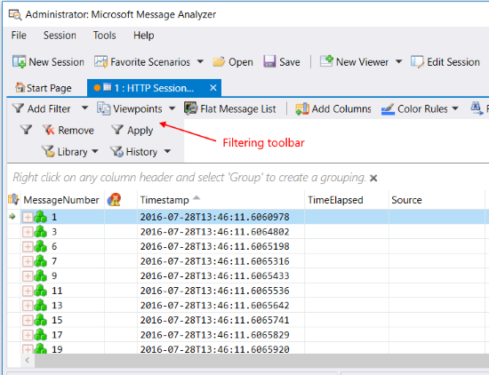

# Using the Filtering Toolbar
Message Analyzer now conveniently integrates several high-profile filtering functions into a single user interface (UI) feature known as the Filtering Toolbar, which is shown in the figure that follows. Whenever Message Analyzer displays session results in any particular data viewer, the Filtering Toolbar appears by default below the viewer tab along with any other toolbar that displays by default for the specific data viewer, for example, the toolbars that appear with the **Analysis Grid** and **Gantt** viewers.  Note that a separate instance of the Filtering Toolbar also appears in the **Grouping** viewer whenever you display it.  
  
   
  
 **Figure 50:  Message Analyzer Filtering toolbar**  
  
 From the Filtering Toolbar, you can filter the trace results that are displayed by any in-focus data viewer, without affecting data in any other viewer or session. Moreover, by applying filtering to message data that is displayed  in one viewer, there is no impact on the data displayed in any other viewer in the current session or data that is displayed in any viewer in any other session. Because you can apply filtering independently to each Message Analyzer data viewer, you gain more control over how you modify the data display for analysis.  
  
 Consider that you might want to view data in different types of viewers with a different filter applied to each, in order to create a unique analytical focus on each set of filtered data.  You might also take things to the next level by creating a *tiered* configuration of multiple filters of different types or with a different focus for a particular data viewer, and then selectively apply them to — or remove them from — the  trace results, independently of interaction with any other data viewer. This enables you to present different perspectives on filtered data all within the context of a single data viewer alone, as described in [Working with Tiered Filtering Configurations](applying-and-managing-filters.md#BKMK_WorkWithTieredFiltering).  
  
## Working with the Filtering Toolbar Features  
 To facilitate the previously described capabilities, Message Analyzer provides three main  filtering functions on the Filtering Toolbar, as follows:  
  
-   **Add Filter** — each time you click this drop-down control, a new **Filter** panel appears by default along with the controls you need to specify and apply a view **Filter** to a set of trace results displayed in the current viewer, or to remove it from those trace results, as described immediately below. You can select any of three different types of filters from this drop-down list, as follows:  
  
    -   **Add Filter** — click this list item to display the **Filter** panel that contains a text-based editing surface for Filter Expressions and other controls you need for working with view  **Filters** that you apply to the viewer that is currently in-focus. The controls include a **Library** from which to select a built-in view **Filter**, an **Apply** and **Remove** button to apply and remove the  action of a **Filter**, and  a **History** drop-down list that maintains a list of the last ten **Filters** that you applied. Note that a single **Filter** panel with associated controls appears by default whenever Message Analyzer displays session results in a data viewer. However, you can add as many more Filter panels as you need for configuration and selective application of specific filters.  
  
         When you select a **Filter** from the **Library**, the **Filter** code automatically displays in the Filter Expression text box. Note that you can also compose your own **Filters** in this text box, but you may need to learn more about the Message Analyzer filtering language to do so, as described in [Writing Filter Expressions](writing-filter-expressions.md).  
  
        > [!IMPORTANT]
        >  To observe the filtering action associated with any view **Filter** that is configured in the Filter Expression text box, you must click the **Apply** button.  
  
        > [!NOTE]
        >  The built-in view **Filters** of the centralized Filter Expression **Library** are available from the **Message Analyzer Filters** asset collection, which installs by default with Message Analyzer. You can **Manage** items in this collection from the **Library** drop-down list while other management features are available from the **Asset Manager** dialog that you can open from the global Message Analyzer **Tools** menu.  
  
         ___________________\_  
  
         **More Information**   
         **To learn more** about working with view **Filters**, see [Applying and Managing Filters](applying-and-managing-filters.md).  
        ___________________\_  
  
    -   **Add Time Filter** — click this list item to display the **Time Filter** panel that contains the time window slider controls along with an **Apply** and **Remove** button. After you configure a window of time in which you want to view data, click the **Apply** button to start the filtering action. Thereafter, you can click the **Remove** button to disable the **Time Filter** effects and return to the original set of trace results, or you can configure and apply another window of time in which to view data.  
  
        > [!TIP]
        >  You have the option to manually specify time stamp values in the **Time Filter** panel **Start Time** and **End Time** text boxes.  
  
         ___________________\_  
  
         **More Information**   
         **To learn more** about working with **Time Filters**, see [Applying a Time Filter to Session Results](applying-a-time-filter-to-session-results.md).  
        ___________________\_  
  
    -   **Add Viewpoint Filter** — this drop-down item is enabled only after you have applied a **Viewpoint**, as described below, otherwise it is disabled. After you apply a **Viewpoint**, which removes all messages above the selected **Viewpoint** for focused analysis, you might want to drill down further into the data that is displayed at the chosen **Viewpoint**. To achieve this, click the enabled **Add Viewpoint Filter** list item to display the **Viewpoint Filter** panel, from where you can configure and apply a **Viewpoint Filter**.  
  
         Note that this panel has the same controls that exist on the **Filter** panel. The only difference between applying a **Viewpoint Filter** and a view **Filter** is that the action of the former works within the context of the current message set resulting from **Viewpoint** application, while the latter applies to all messages in the current set of overall trace results.  
  
         ___________________\_  
  
         **More Information**   
         **To learn more** about **Viewpoint Filters**, see [Applying Viewpoint Filters](applying-and-managing-viewpoints.md#BKMK_ApplyingViewpointFilter).  
        ____________________  
  
-   **Viewpoints** — click this drop-down list to display the available **Viewpoints** that you can select and apply to a set of trace results. A **Viewpoint** enables you to look at your trace data temporarily from the perspective of the protocol, module, or layer represented by the selected **Viewpoint**,  with no messages above it. Moreover, a **Viewpoint** drives the messages of a particular protocol, module, or layer to top-level to create a focused view of the types of messages you want to analyze, for example, SMB, TCP,  Ethernet, and so on.  
  
     A special **Viewpoint** that you can apply is **Disable Operations**, which  changes the way top-level message nodes are organized and displayed in the **Analysis Grid**. When you apply this  **Viewpoint**,  Operations are broken apart and their constituent messages are placed in their original chronological sequence, to provide an alternate perspective for data analysis.  
  
     ___________________\_  
  
     **More Information**   
     **To learn more** about **Viewpoints**, see [Applying and Managing Viewpoints](applying-and-managing-viewpoints.md).  
    **To learn more** about **Operations**, see [Working With Operations](working-with-operations.md).   
    ___________________\_  
  
-   **Flat Message List** — click this button on the Filtering Toolbar to create a message display that is similar to the Network Monitor view, where Operations are removed and messages, including fragments, are reorganized into their original chronological sequence.  
  
     ___________________\_  
  
     **More Information**   
     **To learn more** about flattening the message display, see [Creating a Flat Message List](creating-a-flat-message-list.md).   
    ___________________\_  
  
 The following topics in this section provide further details on how to use the different components of the Filtering Toolbar:  
  
 _______________________________\_  
  
 [Applying and Managing Filters](applying-and-managing-filters.md)   
 [Applying a Time Filter to Session Results](applying-a-time-filter-to-session-results.md)   
 [Applying and Managing Viewpoints](applying-and-managing-viewpoints.md)   
 [Working With Operations](working-with-operations.md)   
 [Creating a Flat Message List](creating-a-flat-message-list.md)   
_______________________________\_  
  
## See Also  
 [Working with Tiered Filtering Configurations](applying-and-managing-filters.md#BKMK_WorkWithTieredFiltering)   
 [Writing Filter Expressions](writing-filter-expressions.md)   
 [Grouping Viewer](grouping-viewer.md)