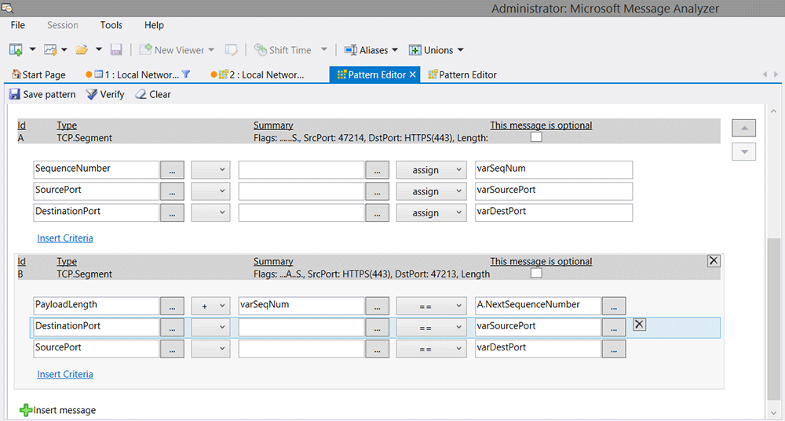

# Using the Pattern Editor

You can generate a sequential pattern matching definition as an OPN behavior scenario or a virtual operation. Note that the term “scenario” or “virtual operation” is used in the OPN code for various **Pattern** expressions to identify to the OPN Compiler the OPN entity type that is being referenced. A virtual operation enables you to abstract property values from pattern matching definition results to provide additional processing, such as writing custom output messages. A “scenario” does not provide this particular capability, but in all other respects, scenarios and virtual operations are identical.  
  
 The purpose of writing an OPN behavior scenario is to find the specific sequential message patterns that the scenario defines. Pattern matching is built upon a pattern matching engine that is called by OPN code via an API. This makes it possible for you to create your own custom **Pattern** expressions as OPN behavior scenarios that are subject to OPN compilation, which thereafter makes them accessible to the Message Analyzer Runtime parsing engine. You can create your own **Pattern** expressions by configuring one with the **Pattern Editor** dialog. Similarly, you can edit any **Pattern** expression with the features of this dialog.  
  
   
## Accessing the Pattern Editor  
 To create or edit a **Pattern** expression, you must use the **Pattern Editor**. You will first need to display data from a Live Trace Session or a saved file in the **Analysis Grid** viewer before you can work with the **Pattern Editor**. After you display a set of trace results, you can open the **Pattern Editor** by executing the **Create Pattern** command in either of the following locations, but with slightly different results:  
  
-   **Pattern Match** viewer — click the **Create Pattern** button on the toolbar above the **AVAILABLE PATTERNS** pane of the **Pattern Match** viewer. When you open the **Pattern Editor** from this location, it displays in a separate tab with a blank configuration, so that you can insert message types and other parameters to create pattern definition components.  
  
-   **Analysis Grid** viewer — the **Create Pattern** command appears as a context menu item that displays when you right-click one or more selected messages in the **Analysis Grid** viewer. When you open the **Pattern Editor** from this location, it is prepopulated with an initial configuration of message **Id**, **Type**, and **Summary**, for *each* selected input message. The initial configuration provides a starting point for **Pattern** expression building, where you can specify parameters associated with the selected messages to create your pattern definition components.  
  
  > [!TIP]
  >  This method of starting **Pattern** expression configuration is very useful because it helps you learn how to write patterns, given that the initial OPN code is automatically created for you.  
  
After you open the **Pattern Editor** dialog from either of these locations, you can start to build pattern definition components for your **Pattern** expression, as described in the section that follows.  
  
## Tools for Building a Pattern Expression  
 The **Pattern Editor** dialog enables you to build your own **Pattern** expressions based on pattern definition components that you configure for specific message types. For example, the dialog enables you to configure the patterning criteria for one or more messages, by specifying various fields, properties, methods, and flags from the **Field Chooser** **Tool Window** — and/or values to which any of these entities can be set for a particular message field, along with relational, logical, or numeric operators that qualify how such fields and properties are manipulated to create one or more criteria sets. Each criteria set will then function as a particular component of a pattern definition. After you launch the **Pattern Editor** as described in [Accessing the Pattern Editor](using-the-pattern-editor.md#BKMK_AccessSeqExEditor), you have the option to create a **Pattern** expression in two different ways, as follows:  
  
-   **Quick** configuration — a tabbed space that enables you to take advantage of UI automation to configure simple pattern definition components. You will find the *quick* configuration space on the **Quick** tab of the **Pattern Editor**. Note that this tab is prepopulated with data that is derived from one or more messages, but only if you launched the dialog from the previously described **Analysis Grid** viewer context menu command.  
  
  > [!CAUTION]
  >  If you are working with the UI automation feature on the **Quick** tab of the **Pattern Editor** and you click **Edit** on the toolbar of the **Free Form** tab, you will be unable to return to the **Quick** configuration tab.  
  
-   **Free Form** configuration — enables you to write OPN code by hand to configure pattern definition components. You will find the *free form* configuration space on the **Free Form** tab of the **Pattern Editor**. This option is mainly for users who are familiar with OPN coding and can create more complex **Pattern** expressions.  
  
**Unpopulated Configuration Mode**   
If you launched the **Pattern Editor** by clicking the **Create Pattern** button in the **Pattern Match** viewer, as indicated earlier, it opens to the **Quick** tab in unpopulated configuration mode. Thereafter, assuming that you elect to perform **Quick** configuration rather than **Free Form**, you can use the controls of the **Pattern Editor** to create pattern definition components by performing the following operations:  
  
-   **Specify the expression name** — enter a descriptive name for the **Pattern** expression by typing it into the **Name** text box at the top of the editor.  
  
-   **Specify an expression description** — enter a conceptual description of the **Pattern** expression by typing it into the **Description** text box.  
  
-   **Set the expression category** — click the **Category** combo box drop-down list to include your **Pattern** expression in an existing category, or create a new one by typing it in the combo box.  
  
-   **Remediation** — specify a website address that provides support information related to the **Pattern** expression you are creating. The site will be opened when you click the Information icon in the Matched pattern selector that displays in the **MATCHES** pane of the **Pattern Match** viewer, after Message Analyzer finds one or more matched instances for an executed **Pattern** expression.  
  
-   **Insert a message** — under the **CRITERIA** subtab, click the **Insert message** button in the lower section of the **Pattern Editor** to open the **Field Chooser** window, from where you can select a message type for a particular protocol or module. Click **Insert message** for each message type that you want to add.  
  
-   **Set backtracking** — select the **Backtrack to find each match** check box if you want the **Pattern** expression to backtrack to the next evaluation point following the previous one in a set of trace results, to continue applying the filtering criteria of your pattern definition to the remaining messages.  
  
  ---  
    
  **More Information**   
  **To learn more** about backtracking, see the predefined **TCP Three-Way   Handshake** expression walkthrough in [Understanding Message Pattern Matching]  (understanding-message-pattern-matching.md).   
  
  ---  
  
-   **Insert a message criteria clause** — click the **Insert Criteria** link to display a set of clause configuration controls that enable you to perform the following basic operations:  
  
    -   Specify message fields, properties, and so on.  
  
    -   Specify an arithmetic operator, such as “+”, “-“, “/”, or “*”.  
  
    -   Specify a relational operator such as “==” or “>=”, the logical inequality (!=) operator, and so on. You can also specify the **contains** or **assign** functions.  
  
         **Note** The **contains** function enables you to determine whether a value exists in a particular field and the **assign** function enables you to assign a field (that you specified in either the first or second input box of a particular criteria set) to a variable name that you create (in the third input box of a criteria set). You can also assign a variable to the results of an arithmetic operation upon two fields specified in the first and second input boxes of a particular criteria set.  
  
  The resulting configuration that you specify with these controls will construct an OPN clause that acts as a filter expression with left- and right-hand side components, which subsequently constitutes a pattern definition component that forms a part of your overall **Pattern** expression. As a simple example of a criteria set for an HTTP.Request message type, you could specify the **Method** field in the first criteria box, leave the second box empty, specify the “==” relational operator in the second drop-down list, and then type “GET” in the third criteria box.  
  
-   **Set a field name** — click the ellipsis (**…**) control to the right of the first criteria input box to display the **Field Chooser**, from where you can select message fields, properties, methods, flags, and so on.  
  
-   **Set an operator** — specify an arithmetic operator in the drop-down list that separates the first two criteria input boxes. For example, you might want to add or subtract the values of two fields, the second of which you can specify in the next criteria input box, as described in the next bullet point.  
  
-   **Set another field name** — click the ellipsis to the right of the second criteria input box to specify another field name, for example, one that is of the same or related type as the one you specified in the first criteria input box. For instance, you could subtract the values of two fields and check the results against some constant or other value that you specify in the third criteria input box. You can also specify another field name in the third criteria input box rather than a value, since Message Analyzer will automatically obtain its value when executing the **Pattern** expression. Thus far, the filter expression for this criteria set would look similar to the following:   
    `field1Name – field2Name`  
  
-   **Set another operator** — specify a logical or relational operator such as greater than (>) in the second operator drop-down list to establish how the results of the previous *fieldName* operands will be evaluated.  
  
-   **Specify a value or field** — enter a value in the third criteria input box, against which the *fieldName* operand results are to be evaluated. The resulting filter expression for this criteria set would look similar to the following:  
    `field1Name – field2Name > someValue`  
  
  > [!TIP]
  >  Note that Message Analyzer enables you to use **Timestamp** as a field in a Pattern Expression. **Timestamp** is a **Global Annotation** that is accessible from the **Field Chooser** window.  
  
-   **Create a Summary for matched instance display** — in the text box under the **SUMMARY** subtab, specify summary text that will appear under the **Summary** column in the **MATCHED INSTANCES** pane of the **Pattern Match** viewer. This can include the use of variable values that are specified in the **Pattern** expression.  
  
  > [!NOTE]
  >  You can include additional columns of data for variable values in the   **MATCHED INSTANCES** pane of the **Pattern Match** viewer, providing that you   used the **assign** function in the **Pattern Editor** to assign the value of a   field, or an operation on two fields, to a variable name that you create. To   add columns of data based on one or more variables, you can select them under   the **Column** heading that appears below the **SUMMARY** subtab text box. You   also have the option to override the column (variable) names by specifying a   different column name in the **Name Override** column beneath the **Summary**   text box.  
  
  > [!TIP]
  >  To review an example of how to use the **assign** function, see [Example of Building a Simple Pattern Expression](using-the-pattern-editor.md#BKMK_BuildingPatternExp).  
  
-   **Specify the message evaluation direction** — on the **ADVANCED** subtab of the **Quick** tab, optionally place a check mark in the **Evaluate sequential message patterns using the oldest to newest message** check box. This will begin the evaluation from the captured message that has the latest **Timestamp** value in a set of trace results; otherwise, the default (this check box unselected) is to start the evaluation from the message that contains the earliest **Timestamp** value in a set of trace results.  
  
-   **Specify a Viewpoint** — on the **ADVANCED** subtab of the **Quick** tab, click the **Viewpoint** drop-down list to select a **Viewpoint** that will enable your **Pattern** expression to evaluate messages from the perspective of a particular protocol or other module, while filtering out all messages above the **Viewpoint**. This can ensure that your **Pattern** expression processes all the message types on which your pattern is focused.  
  
  ---  
    
  **More Information**   
  **To learn more** about **Viewpoints**, see [Applying and Managing Viewpoints]  (applying-and-managing-viewpoints.md).   
  
  ---  
  
**Populated Configuration Mode**   
If you launched the **Pattern Editor** by right-clicking two or more messages in the **Analysis Grid** viewer and then selecting the **Create Pattern** command from the context menu that appears, the editor opens to the **Quick** tab in the populated configuration mode with message types for each selected input message already inserted. Thereafter, the configuration options that you can use to create pattern definition components consist of all those specified immediately above. An example of creating a **Pattern** expression in this mode is described in [Example of Building a Simple Pattern Expression](using-the-pattern-editor.md#BKMK_BuildingPatternExp).  
  
**Free Form Configuration Mode**   
If you choose to create a **Pattern** expression without any UI automation support, you can click the **Free Form** tab of the **Pattern Editor** and enter OPN code that creates your pattern definitions. However, you should have some familiarity with OPN before you try this option, since OPN is a unique language with many different constructs, operators, specifiers, and semantic and syntactic representations. Also, once you select the **Free Form** tab and click **Edit**, you are prompted that you will be unable to return to the **Quick** tab again with the UI automation configuration capability for the current editing session.  
  
   
## Example of Building a Simple Pattern Expression  
 The steps that follow provide an example of how to build a simple **Pattern** expression. This **Pattern** expression locates pairs of TCP messages, where the first message has a particular TCP **SequenceNumber** and the second reflects the **NextSequenceNumber** of the TCP message that carries the next payload segment, which is defined in the expression as equal to the **PayloadLength** of the second message plus the **SequenceNumber** of the first message:  
  
1.  Open the **Pattern Editor** by right-clicking two TCP messages that are selected in the **Analysis Grid** viewer and then selecting the **Create Pattern** command in the context menu that appears.  
  
     The **Pattern Editor** opens to the **Quick** tab with some preliminary data for the selected messages displayed.  
  
2.  Click **Insert Criteria** three times for each message, where each message is labeled with an **Id** that specifies **A** or **B**.  
  
     Thereafter, three rows of criteria input controls are displayed for each TCP message.  
  
3.  Click the ellipsis (**…**) to the right of the first criteria input box to display the **Field Chooser** window, then double-click the **SequenceNumber** field in the TCP message hierarchy.  
  
     The **SequenceNumber** field name appears in the first criteria input box.  
  
4.  Click the second drop-down list (to the left of the third criteria input box) and select the **assign** item; then create a variable name in the third criteria input box to hold the value of the **SequenceNumber** field, for example, “varSeqNumber”.  
  
     This variable will be used in the first criteria row that you insert for the second TCP message, where the value of “varSeqNumber” is added to the **PayloadLength** value so that the **Pattern** expression will find a message with a **NextSequenceNumber** field that is equal in value to this sum.  
  
5.  In the second row of criteria controls, click the ellipsis (**…**) to the right of the first criteria input box to display the **Field Chooser**, then double-click the **SourcePort** field to display it in the first criteria input box.  
  
6.  Using the method indicated in step 4, create a variable such as “varSourcePort” and **assign** it to the **SourcePort** field to hold its value.  
  
7.  Repeat the previous two steps to create a variable such as “varDestPort” to hold the value of the TCP **DestinationPort** field. Use the **assign** function to associate the field with the variable.  
  
     These port values will be checked against port values in subsequent TCP messages that are evaluated by the second set of message criteria, to ensure that the **Pattern** expression processes only messages that are in the same conversation.  
  
  > [!NOTE]
  >  Whenever you create a variable as the right-hand expression of a criteria set and assign the value of some field to it in the **Pattern Editor**, that variable will appear in **Field Chooser** under the **Sequence Variables** node, which displays in the context of the **Pattern Editor** only.  
  
8.  In the first row of criteria controls for the second TCP message, click the ellipsis (**…**) to display the **Field Chooser** and then double-click the **PayloadLength** field in the TCP message hierarchy to display this field name in the first criteria input box.  
  
9. In the drop-down list immediately to the right of the first criteria input box, select the **+** item to configure the *addition* arithmetic operator.  
  
10. In the criteria input box to the right of the drop-down where you selected the arithmetic operator, type the name of the first variable you created, for example, “varSeqNum”.  
  
11. Click the ellipsis to the right of the third criteria input box and then double-click the **NextSequenceNumber** field in **Field Chooser** to add its name to the third input box.  
  
12. In the second and third row of criteria controls for the second TCP message, click the ellipsis to display **Field Chooser** and then double-click the **DestinationPort** and **SourcePort** fields, respectively, to add these field names to the first criteria input boxes of the second and third row of criteria controls, respectively, for the second message.  
  
     When complete, the **Pattern Editor** dialog should reflect a configuration that is similar to the following:  
  
       
  
     **Figure 44: Example of building a Pattern expression**  
  
13. Click the **Verify** button on the **Pattern Editor** toolbar and confirm that you receive no compilation errors.  
  
14. Specify a name for this **Pattern** expression in the **Name** text box of the **Pattern Editor**, for example, “TCP SeqNum Pairs”.  
  
15. Optionally, provide a description for this **Pattern** expression in the **Description** text box.  
  
16. Click the **SUMMARY** subtab on the **Quick** tab of the **Pattern Editor** dialog and place a check mark in each check box to add the indicated values as columns of data for the **MATCHED INSTANCES** pane of the **Pattern Match** viewer.  
  
17. Click the **Save pattern** button on the toolbar of the **Pattern Editor** dialog to save this **Pattern** expression.  
  
  > [!NOTE]
  >  As soon as you save a new **Pattern** expression, Message Analyzer   automatically executes the **Pattern** expression code against the current set   of trace results.  
  
  If you want to view the **Pattern** expression code that Message Analyzer   created in the background for the criteria control fields, operators, and   values that you specified, you can hover over the **Pattern** expression in the   **AVAILABLE PATTERNS** list of the **Pattern Match** viewer with your mouse, or   you can right-click the **Pattern** expression and select the **Edit** or   **Create a Copy** command in the context menu that appears, to display the code   on the **Free Form** tab of the **Pattern Editor** dialog.  
  
  > [!TIP]
  >  After you save a **Pattern** expression, you can leave the **Pattern Editor** dialog open so you can revisit the prepopulated view, should you need to alter the configuration with the automation controls. If you close the **Pattern Editor** for a newly created **Pattern** expression, you can then only view the **Pattern** expression in the **Free Form** configuration mode, which displays the OPN code rather than the automation controls that are accessible on the **Quick** tab .  
  
## Editing Pattern Expressions  
 You can edit, delete, set as a favorite, or make a copy of any **Pattern** expression that appears in the **My Items** category of your local **Pattern** expression Library in the **AVAILABLE PATTERNS** pane of the **Pattern Match** viewer. However, for the predefined **Pattern** expressions that appear in the **Network** category, you can only make a copy of these since they cannot be modified or deleted. To edit a **Pattern** expression, you will use the same **Pattern Editor** already described herein.  
  
 **Editing a User Defined Pattern Expression**   
To start editing a **Pattern** expression in the **My Items** category, right-click it in the **AVAILABLE PATTERNS** list in the **Pattern Match** viewer. This action launches the **Pattern Editor** with the **Free Form** tab open and the **Quick** tab disabled. From here, you can change the **Name**, **Description**, and **Category**; modify the OPN code in *free form*  style; and open the **Pattern** expression Library to set the **Favorites** status of an expression. You can also **Delete** any **Pattern** expression that you previously created, or you can **Create a Copy** of it, for example, to use as a template for another **Pattern** expression that you want to create.  
  
 **Creating a Copy of a Built-In Pattern Expression**   
For any of the built-in **Pattern** expressions that exist in the **Network** category of the **AVAILABLE PATTERNS** list, you can use the right-click **Create a Copy** command to utilize the code of such an expression, or a portion thereof, as a template for another **Pattern** expression that you want to create. When you select the **Create a Copy** command from the context menu that appears when you right-click a built-in **Pattern** expression, the **Pattern Editor** displays with the **Free Form** tab open and the **Quick** tab disabled. From here, you can make a copy of the expression, modify the code, change the **Name**, **Description**, and **Category**, set its **Favorites** status, and **Save** it as a new **Pattern** expression that becomes part of **Message Analyzer Sequence Expressions** asset collection Library that displays in the **AVAILABLE PATTERNS** list.  
  
## Saving a Pattern Expression  
 When you finish configuring your **Pattern** expression, click the **Verify** button on the **Pattern Editor** toolbar to ensure that you have a valid configuration, or you will be unable to save it. After you **Save** the new **Pattern** expression, OPN code is generated based on your input parameters. At that time, your **Pattern** expression is added to the **My Items** category of the **AVAILABLE PATTERNS** list that displays in the **Pattern Match** viewer. Because a saved **Pattern** expression becomes part of your local **Pattern** expression Library, you can take advantage of the management operations associated with the Message Analyzer sharing infrastructure to share your **Pattern** expressions with others, as described in [Managing Pattern Expressions](managing-pattern-expressions.md).  
  
---  
  
 **More Information**   
 **To learn more** about language requirements, constructs, and other details you need to create OPN behavioral scenarios and virtual operations for pattern matching with **Pattern** expressions, see the [OPN Programming Guide](http://download.microsoft.com/download/3/E/8/3E845130-349C-4EFC-B634-C7DBD46140B7/OPN%20Programming%20Guide%20v4.4.docx).   
 
---