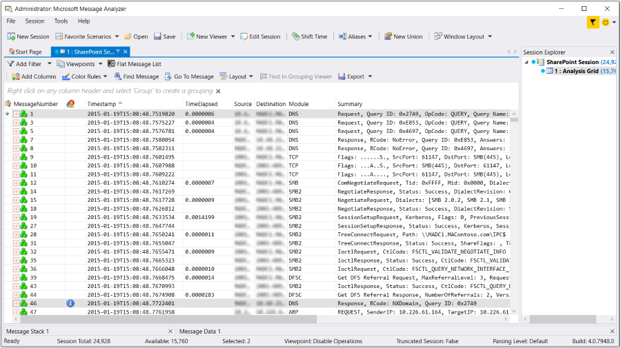
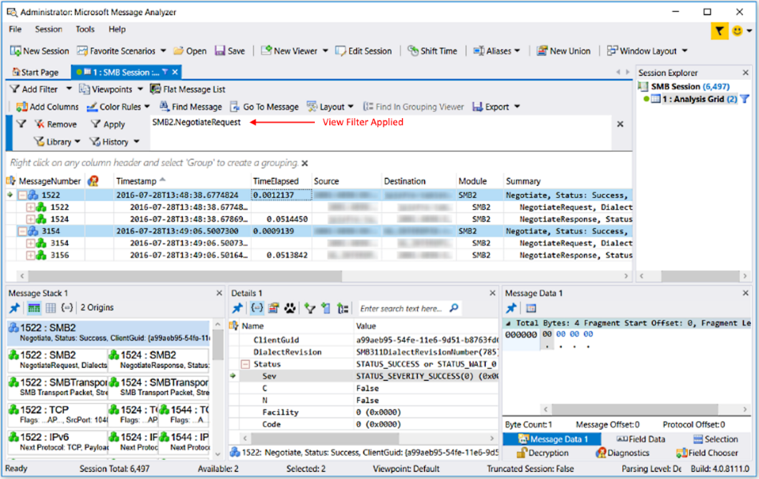
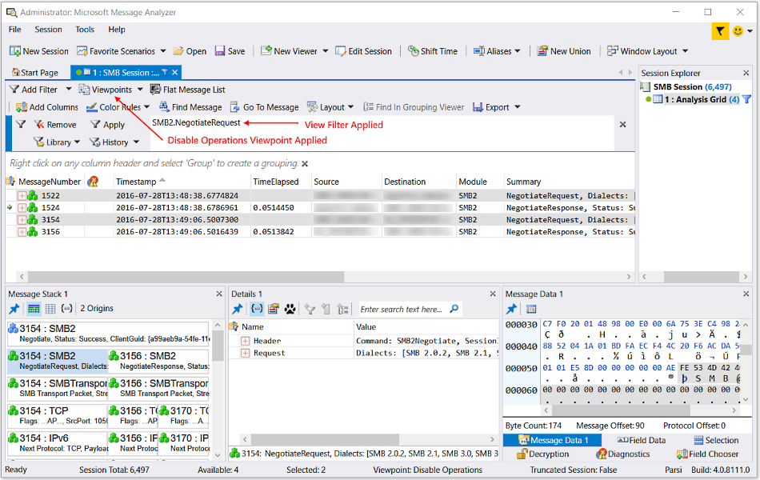
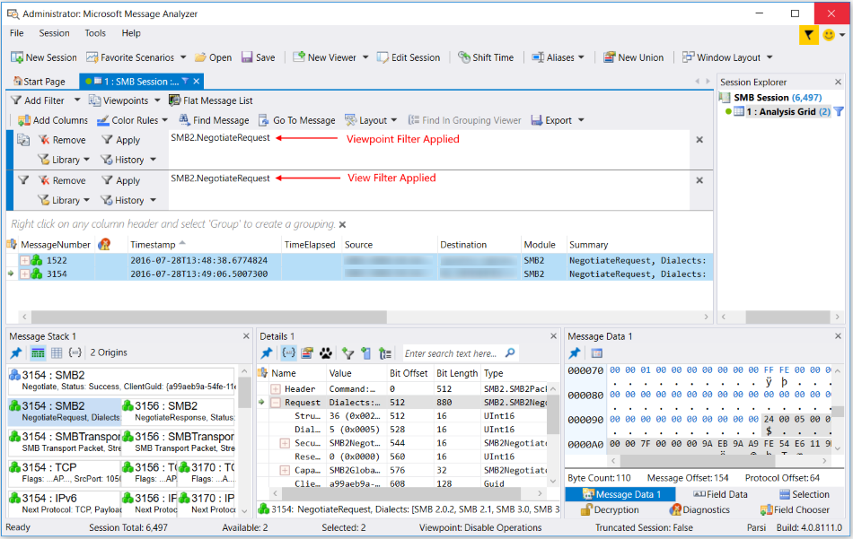

# Working With Operations

Message Analyzer provides some special features for working with protocols that employ request and response messages as the basis of their negotiation architecture.  In other protocol analysis tools, it is a common practice to display messages in the order in which the tool originally captured them. In practice, this can present some difficulties for those who are analyzing such data, because they may have to search through literally hundreds, if not thousands of messages to locate the response to an associated request message. Although other techniques such as filtering can be used by the analyst to find these messages, it  can still involve multiple steps of additional manual configuration to locate and organize the data before analysis can begin.  
  
 Message Analyzer provides a simple solution to this problem by encapsulating each request and response message pair of any   protocol that uses this architecture into a single, expandable Operation node that displays as a top-level message row in the  **Analysis Grid** viewer. By expanding such an Operation node, you can expose the original request and response messages, where each of these messages also has an expandable  node that encapsulates an associated message stack. This technique pushes  all the information of importance in this scenario to top-level for quick and efficient analysis. Moreover, because the response message is at top-level, you don't have to search any further to begin analyzing the data.  Note that the Operations feature aligns with the overall Message Analyzer design strategy to bring relevant data that is normally hidden or dispersed to the top-level of a suitable analysis surface, where you can examine it immediately without the encumbrance of having to apply elaborate techniques to get at the data you need to assess.  
  
> [!NOTE]
>  Some typical protocols that support request/response message pairs include HTTP, DNS, and SMB2. The messages for these protocols and others that support Operations will appear in the **Analysis Grid** viewer as Operation nodes, where they are signified by a blue-cubed icon.  
  
## Advantages of Operations to Analysis  

 The major advantage of  having request/response pairs encapsulated into separate Operations nodes  is that this configuration provides quick access to both the request and response messages when you expand an Operation node. You can also expose the server response time to requests that Message Analyzer automatically calculates for you, as described in the list that follows. With this information exposed at top-level in the **Analysis Grid** viewer, you can quickly make comparisons between several important values that can be critical to troubleshooting and analysis. These values consist of the following:  
  
-   **ResponseTime** — provides an indication of how long it took to receive a server's first response to a request message. Large values for **ResponseTime** can be an indication of a slow server that is having performance problems.  
  
     You can view this value by adding **ResponseTime** as a new column in the **Analysis Grid** viewer from the **Global Annotations** node of the **Field Chooser** **Tool Window**. Under this node, locate the **ResponseTime** annotation, right-click it, and then select the **Add As Column** command in the context menu that appears. Thereafter, you can see at-a-glance the server **ResponseTime** that is associated with the request and response messages that are encapsulated by any Operation node in the **Analysis Grid** viewer.  
  
-   **TimeElapsed** — provides an indication of total elapsed time for an Operation that includes  how long it took to receive a server's first response to a request message *plus* the amount of time it took to receive all fragments associated with the transaction. Large values for **TimeElapsed** can be an indication of network latency issues, particularly if the **ResponseTime** values are comparatively low.  
  
     You can view **TimeElapsed** values in the **Analysis Grid**, as it is a column in the default layout for this viewer.  
  
> [!TIP]
>  If you are working with HTTP Operations, you can open a **Chart** with the **Average Response Times for Operations** view **Layout** against a set of  trace results to review a summary of average **Response Time** values for HTTP methods. To open a **Chart** with the specified **Layout**, click the **New Viewer** drop-down list on the global Message Analyzer toolbar, highlight **Chart**, and then select the **Average Response Times for Operations** layout.  
  
---  
  
 **More Information**   
 **To learn more** about the Response Time, as used in the **Average Response Times for Operations** view **Layout**, see the [Average Response Time for Operations](average-response-time-for-operations.md) topic.  

---  
  
   
## Disabling Operations  
 When you capture messages that are part of an Operation, the Message Analyzer parsing process normally identifies and collapses this traffic to combine related request and response message pairs into a single, top-level message row as previously indicated. To indicate an Operation in the **Analysis Grid** viewer, Message Analyzer designates this row with  a blue-cubed icon in the **MessageNumber** column and provides an expansion node next to this icon that opens the request and response message pair that makes up the Operation. However, for viewing preferences and because on occasion it might be advantageous to display the original chronological context in which response messages occurred, Message Analyzer enables you to create this display configuration by selecting the **Disable Operations** item from the **Viewpoints** drop-down list on the Filtering Toolbar. To return to the default message display in the **Analysis Grid** viewer with Operation nodes intact, you can simply select the **No Viewpoint** item from this same list.  
  
 The default configuration for message lines in the **Analysis Grid** viewer is to show  all top-level message nodes in a set of trace results, which includes Operation nodes that encapsulate request/response pairs for protocols with this type of architecture, along with all other  top-level message nodes that are not Operations, both of which have nested expansion controls to expose the underlying encapsulated message stacks. This display  configuration is shown in the following figure.  
  
   
  
 **Figure 55:  Operations enabled and showing expanded node exposing DNS request/response messages**  
  
 The figure shows the default view whenever you have **Disable Operations** *unselected* in the **Viewpoints** drop-down list. For example, the **DNS** request and response messages #1 and #46, respectively, are encapsulated in an Operation node that is denoted by a blue-cubed icon, and is currently shown in the expanded state. When you *select* **Disable Operations** in this list, Operation messages are released from their default encapsulated configuration and the constituent request and response messages are broken out and reorganized into top-level messages in their original chronological capture sequence along with all other top-level, non-operation messages in your trace results, as shown in the figure that follows. Note that all top-level messages of the non-operation type are designated by a green-cubed icon.  
  
   
  
 **Figure 56:  Operations disabled and showing original message sequence**  
  
 In this figure, note that the formerly encapsulated request message #1 and the response message #46  now display in their original capture sequence.  
  
> [!NOTE]
>  When you **Disable Operations**, Message Analyzer reparses all messages in the Message Store (a repository for the original set of captured but unparsed messages) without encapsulating  the request and response message pairs under Operation nodes.  
  
   
## Operations and Filtering Interactions  
 A situation where you might need to disable Operations is when you want to  apply a view **Filter** that isolates a request message type or a response message type from a particular protocol that uses this architecture, such as SMB2. When request and response message pairs are encapsulated under an Operation node, a view **Filter** will be unable to separate them so that you can view them as standalone messages of either type. For example, if you created and applied a **Filter** such as `SMB2.NegotiateRequest`, you will return the SMB2 request messages within the context of the Operation nodes only, rather than as standalone messages as you might typically expect.  
  
 The only way that you can isolate these messages is to apply a **Viewpoint Filter** after you have broken the request and response message pairs apart with the **Disable Operations** **Viewpoint**. Thereafter, you should be able to see the isolated SMB2 request messages, as described in the steps below:  
  
1.  Through a Data Retrieval Session, import a message collection that includes SMB2 messages.  
  
     The messages should have been captured while performing some SMB2 file share access operations.  
  
2.  Ensure that **No Viewpoint** is currently selected in the **Viewpoints** drop-down list.  
  
3.  Type the filter code `SMB2.NegotiateRequest` in the text box of the **Filter** panel on the Filtering Toolbar.  
  
4.  Click the **Apply** button on the Filtering Toolbar and note that the results display SMB2 Operation nodes rather than separate request messages, as shown in the figure that follows.  
  
       
  
     **Figure 57: View Filter fails to isolate SMB2 request messages**  
  
5.  Select the **Disable Operations** item in the **Viewpoints** drop-down list to disable all Operations.  
  
     Note that both SMB2 request *and* response messages continue to display, given that the effect of the view **Filter** is still in play here, as shown in the figure that follows.  
  
       
  
     **Figure 58:  Disable Operations fails to isolate SMB2 request messages**  
  
6.  Open a **Viewpoint Filter** panel by clicking the **Add Viewpoint Filter** command in the **Add Filter** drop-down list on the Filtering Toolbar.  
  
7.  Enter the  `SMB2.NegotiateRequest` filter code in the Filter Expression text box of the **Viewpoint Filter** panel and then click the **Apply** button on the panel.  
  
     Message Analyzer now shows only the SMB2 *request* messages  in the **Analysis Grid** viewer, as shown in the following figure.  
  
       
  
     **Figure 59:  Viewpoint filter succeeds in isolating SMB2 request messages**  
  
As a rule of thumb, keep in mind that you can successfully filter under an applied **Viewpoint** only by applying a **Viewpoint Filter**, as a view **Filter** will not provide the desired results in this scenario.  
  
> [!TIP]
>  In the previous procedure, you can substitute selection of the **SMB/SMB2 Disable Operations** command in the **Viewpoints** drop-down list for step 4.  
  
## Usage Scenarios with Viewpoints  

 In a typical usage scenario, you might select the **Disable Operations** **Viewpoint** in the **Viewpoints** drop-down list to cause Operations to be  broken apart and the constituent request and response message pairs to then be displayed in chronological order, as previously described. In this display configuration, you might lose some context as the request and response messages will no longer be grouped together as a single operation, but will instead assume their original chronological position in the trace before Message Analyzer created the Operation nodes. This produces a view that is similar to Network Monitor and may provide some analytical value and familiarity to Network Monitor users, but the response messages can still be difficult to locate. However, you might find it easier to correlate the messages if you select the **No Viewpoints** item in the **Viewpoints** drop-down list to return to the display configuration that collapses all related request and response message pairs back into separate, top-level Operation nodes in the **Analysis Grid** viewer.  
  
 As an example of  another usage scenario, you may have applied a viewpoint such as the **HTTP** **Viewpoint** during an Analysis Session because you want to view only the messages at that level. However, HTTP can also have non-operational messages that display at the applied **Viewpoint**, for example payload reassembly messages, and you might not want to examine these yet. To remove these non-operational messages, you can apply the view **Filter**`HTTP && *IsOperation` from the Filtering Toolbar. If you want to examine only the non-operational HTTP messages, apply the view **Filter**`HTTP && !*IsOperation` from another **Filter** panel on the Filtering Toolbar. You can then toggle back and forth between applying and removing these filters to view and analyze the Operation messages and non-Operation messages in the **Analysis Grid** viewer, as required.  
  
> [!TIP]
>  After you select the **Disable Operations** **Viewpoint** to disassociate the request/response pairs in the Operation nodes for a set of trace results, you can continue to view the request and response message stacks side-by-side in the **Message Stack** **Tool Window**.  
  
## See Also  

[Using the Filtering Toolbar](using-the-filtering-toolbar.md)   
[Applying and Managing Viewpoints](applying-and-managing-viewpoints.md)